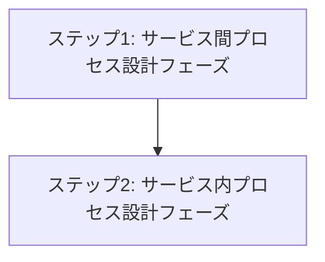

# Process View

## 目次

1. [概要](#概要)
2. [処理フロー](#処理フロー)
3. [ステップ 1: サービス間プロセス設計フェーズ](#ステップ-1-サービス間プロセス設計フェーズ)
4. [ステップ 2: サービス内プロセス設計フェーズ](#ステップ-2-サービス内プロセス設計フェーズ)

## 概要

Kruchten 4+1 アーキテクチャビューモデルの Process View は非機能要件(性能・可用性)の実現に焦点を当てる。

> The process architecture takes into account some non-functional requirements, such as performance and availability. It addresses issues of concurrency and distribution, of system's integrity, of fault-tolerance, and how the main abstractions from the logical view fit within the process architecture—on which thread of control is an operation for an object actually executed.

- **関心事**: 非機能要件の実現 - 性能、可用性、並行性、分散性
- **時間軸**: 実行時
- **視点**: システム実行環境、運用者
- **成果物**: プロセス構成図、通信設計、タスクアーキテクチャ

Process View は論理設計を実行時の協調パターンに変換するプロセスである。Logical View で確立された機能境界と責務を基盤として、非機能要件を満たす実行時アーキテクチャを段階的に構築する。各段階は前段階の成果を基盤とし、独立した設計価値を持つ。

サービス間からサービス内への順序関係により、分散システム全体から個別サービス内部まで、一貫した実行時品質を保証する。

## 処理フロー

## ステップ 1: サービス間プロセス設計フェーズ

- **[01-inter-service](01-inter-service/README.md)** - サービス間の協調・通信・耐障害性・スケーリング設計

## ステップ 2: サービス内プロセス設計フェーズ

- **[02-intra-service](02-intra-service/README.md)** - サービス内の処理・セキュリティ・パフォーマンス・監視設計
