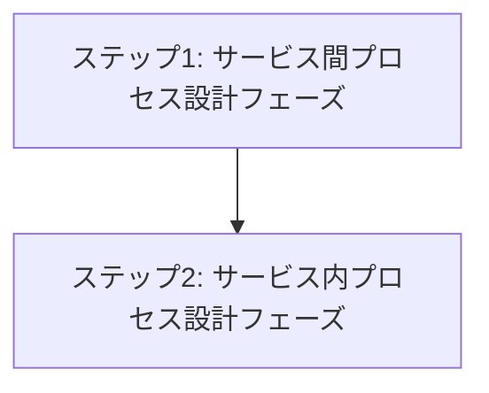

# Process View

## 目次

1. [概要](#概要)
2. [処理フロー](#処理フロー)
3. [ステップ 1: サービス間プロセス設計フェーズ](#ステップ-1-サービス間プロセス設計フェーズ)
4. [ステップ 2: サービス内プロセス設計フェーズ](#ステップ-2-サービス内プロセス設計フェーズ)

## 概要

Kruchten 4+1 アーキテクチャビューモデルの Process View は非機能要件(性能・可用性)の実現に焦点を当てる。

> The process architecture takes into account some non-functional requirements, such as performance and availability. It addresses issues of concurrency and distribution, of system's integrity, of fault-tolerance, and how the main abstractions from the logical view fit within the process architecture—on which thread of control is an operation for an object actually executed.

- **関心事**: 非機能要件の実現 - 性能、可用性、並行性、分散性
- **時間軸**: 実行時
- **視点**: システム実行環境、運用者
- **成果物**: プロセス構成図、通信設計、タスクアーキテクチャ

Process View は論理設計を実行時の協調パターンに変換するプロセスである。Logical View で確立された機能境界と責務を基盤として、非機能要件を満たす実行時アーキテクチャを段階的に構築する。各段階は前段階の成果を基盤とし、独立した設計価値を持つ。

サービス間からサービス内への順序関係により、分散システム全体から個別サービス内部まで、一貫した実行時品質を保証する。

## 処理フロー

## ステップ 1: サービス間プロセス設計フェーズ

Logical View で定義された機能境界を実行時のサービス境界に変換する段階。Bounded Context をマイクロサービス・モジュラモノリス等の具体的な協調パターンで実現し、分散システム全体の非機能要件を満たす設計を確立する。サービス境界設計から耐障害性・スケーリングまで、システム全体レベルでの実行時品質を保証する基盤を構築し、後続のサービス内設計の制約条件を明確化する。

- **[サービス境界設計](01-service-boundaries/README.md)** - 機能境界をサービス実行境界に変換する
- **[サービス間協調](02-service-coordination/README.md)** - サービス間の協調パターンを設計する
- **[データ整合性設計](03-data-consistency/README.md)** - 分散環境での整合性戦略を設計する
- **[分散通信設計](04-distributed-communication/README.md)** - サービス間通信の具体的設計を行う
- **[耐障害性設計](05-fault-tolerance/README.md)** - 障害対応と復旧戦略を設計する
- **[スケーリング設計](06-scaling/README.md)** - 負荷分散と拡張性を設計する
- **[トレーサビリティ設計](07-traceability/README.md)** - 分散トレーシングと監視を設計する
- **[システムテスト戦略](08-system-test-strategy/README.md)** - 分散システム全体のテスト戦略を策定する

## ステップ 2: サービス内プロセス設計フェーズ

前段階で確立されたサービス境界と制約条件を基盤として、各サービス内部の詳細なプロセス設計を行う段階。Logical View のドメインモデルとバッチ仕様から得られた処理要件を、具体的な実行時動作として設計する。リクエスト処理からセキュリティ・パフォーマンス・監視まで、サービス内の実行時品質を詳細化し、Development View での実装設計に必要な制約条件を提供する。

- **[リクエスト処理設計](09-request-processing/README.md)** - サービス内のリクエスト処理フローを設計する
- **[バッチ処理設計](10-batch-processing/README.md)** - バッチ処理の実行設計を行う
- **[トランザクション設計](11-transaction/README.md)** - データ整合性とトランザクション境界を設計する
- **[セキュリティ設計](12-security/README.md)** - サービス内のセキュリティ機構を設計する
- **[パフォーマンス設計](13-performance/README.md)** - 性能要件を満たす処理設計を行う
- **[監視設計](14-monitoring/README.md)** - サービス内の監視とメトリクス設計を行う
- **[サービス内テスト戦略](15-intra-service-test-strategy/README.md)** - 統合テストとユニットテストの戦略を策定する
