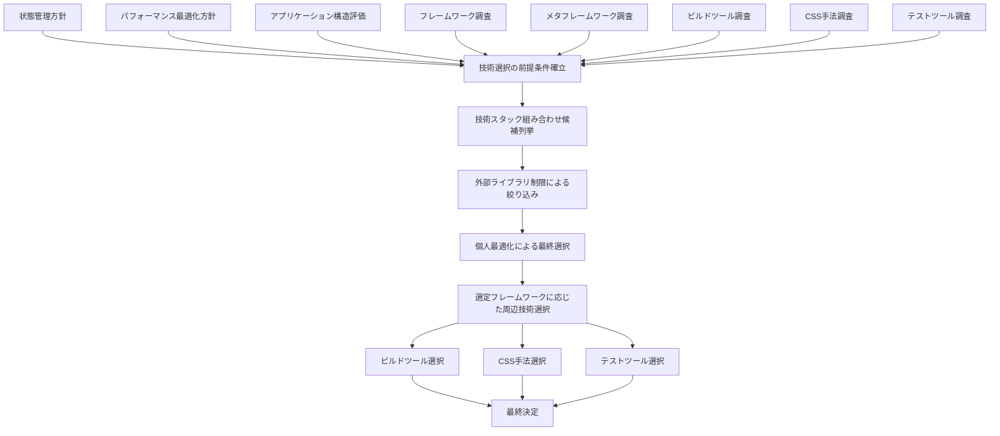

# 基盤技術選択

## 目次

1. [概要](#概要)
2. [処理フロー](#処理フロー)
3. [ステップ 1: 技術選択の前提条件を確立する](#ステップ-1-技術選択の前提条件を確立する)
4. [ステップ 2: 技術スタック組み合わせ候補を列挙する](#ステップ-2-技術スタック組み合わせ候補を列挙する)
5. [ステップ 3: パフォーマンス要件による絞り込み](#ステップ-3-パフォーマンス要件による絞り込み)
6. [ステップ 4: 外部ライブラリ制限による絞り込み](#ステップ-4-外部ライブラリ制限による絞り込み)
7. [ステップ 5: 個人最適化による最終選択](#ステップ-5-個人最適化による最終選択)
8. [ステップ 6: 選定フレームワークに応じた周辺技術選択](#ステップ-6-選定フレームワークに応じた周辺技術選択)

## 概要

CogitoWeave のフロントエンド基盤技術選択を段階的に実行する。

- **関心事**: フロントエンド技術スタックの最適化
- **時間軸**: 開発開始前の技術選択段階
- **視点**: 一人開発者の制約下における効率性重視
- **成果物**: 技術選択済みフロントエンド基盤スタック

フレームワーク、メタフレームワーク、ビルドツール、CSS 手法、テストツールの各調査結果を基に、外部ライブラリ制限と個人最適化の基準を段階的に適用して最終的な技術スタックを決定する。

## 処理フロー

### ステップ 1: 技術選択の前提条件を確立する

CogitoWeave の フロントエンド 技術選択に必要な全ての調査結果と技術方針を統合して、技術選択における前提条件を確立する。

#### 1. 状態管理方針決定

<!-- PREMISE_BEGIN: state-management-policy -->

CogitoWeave の状態管理方針として以下を採用する。

- 画面間状態共有は実装しない。
  - 各画面は独立したワークフローを持つため、状態共有の必要性がない。
- 各画面で独立した状態管理を行う。
  - 一人開発制約により、理解しやすさと保守性を優先する。
- 編集中データは一時的にローカルストレージに保存する。
  - ユーザーの誤操作によるデータ消失を防止する。

<!-- PREMISE_END: state-management-policy -->

#### 2. パフォーマンス最適化方針決定

<!-- PREMISE_BEGIN: performance-optimization-policy -->

CogitoWeave のパフォーマンス最適化方針として以下を採用する。

- 概念ページ読み込み 1.5 秒以内を最優先とする。
  - 最も頻繁な日常操作の快適性確保を最重要視する。
- 初回ロードの遅さは許容し、ページ遷移の高速性を重視する。
  - CSR 特性を活かした継続利用の効率性を優先する。
- 複雑なパフォーマンス最適化は実装しない。
  - 軽量なコンポーネント指向アーキテクチャにより設計段階で最適化を行う。
- ツリーシェイキング対応ライブラリを優先する。
  - 元々軽量で最適化しやすい技術を選択し、開発効率と軽量性を両立する。

<!-- PREMISE_END: performance-optimization-policy -->

#### 3. アプリケーション構造評価

<!-- PREMISE_BEGIN: app-structure-evaluation -->

CogitoWeave のアプリケーション構造として以下を採用する。

- 基本構造は MPA または SPA のいずれも可能とする。
  - 画面間状態共有が不要で、各画面の独立性を重視するため、どちらの技術でも要件を満たせる。
- 概念間移動の高速化を最優先とする。
  - 概念ページ読み込み最優先要件を満たすため、技術選択に応じて最適な実装を行う。
- 各画面の独立性を確保する。
  - MPA 選択時は別ページ遷移、SPA 選択時は状態管理の分離により実現する。
- 3 画面という小規模構成を活かしたシンプルな設計とする。
  - 一人開発制約下での理解しやすさと保守性を維持するため。

<!-- PREMISE_END: app-structure-evaluation -->

#### 4. コンポーネント粒度設計

<!-- PREMISE_BEGIN: component-granularity-design -->

CogitoWeave の UI コンポーネント責務として、階層的な粒度設計による軽量なコンポーネント指向アーキテクチャを採用する。

- **最小粒度**: ボタン・入力フィールド・ラベル等の基本 UI 要素レベル
  - 単一責務の原則により、一つの操作または表示に特化する。
- **統合粒度**: カード・パネル・モーダル等の機能単位レベル
  - 複数の基本要素を組み合わせた意味のある機能を提供する。
- **階層アプローチ**: 統合コンポーネント内で基本コンポーネントを組み合わせる
  - 外部からは統合コンポーネントとして使用し、内部実装では基本コンポーネントで構成する。

<!-- PREMISE_END: component-granularity-design -->

#### 5. フレームワーク調査

<!-- PREMISE_BEGIN: framework-research -->

State of JS 2024 のデータに基づくフレームワーク候補の調査結果は以下の通りである。

##### フレームワーク最優先候補

- **Preact**: 軽量な React 代替として満足度 80%、期待値ギャップ 55%（最高）を記録し、React エコシステムを活用できる。
- **Vue**: バランスの取れたフレームワークとして満足度 87%（大幅上昇）、使用率 51%（適度）を示し、学習曲線も緩やかである。
- **Svelte**: 高満足度 88% を誇り、コンパイル時最適化による軽量性を提供するが、関心度は減少傾向にある。

##### フレームワーク次点候補

- **Solid**: 最高満足度 90%、期待値ギャップ 35% を記録する革新的なフレームワークだが、使用率 9%で情報が限定的である。
- **React 18**: 使用率 82%で情報は豊富であり、React 19 の CSR における Suspense 遅延バグを回避できる安定版として選択可能である。

##### フレームワーク要注意候補

- **React 19**: React の最新版だが CSR における Suspense の[強制 300ms 遅延バグ](https://github.com/facebook/react/issues/31819)が発生し、概念ページの読み込み要件に深刻な影響を与える。

軽量なコンポーネント指向アーキテクチャ、一人開発の制約、パフォーマンスの要件を総合すると、Preact、Vue、Svelte が最有力の候補として浮上し、Solid と React 18 が次点の候補、React 19 が要注意の候補となる。

<!-- PREMISE_END: framework-research -->

#### 6. メタフレームワーク調査

<!-- PREMISE_BEGIN: metaframework-research -->

State of JS 2024 のデータに基づくメタフレームワーク候補の調査結果は以下の通りである。

##### メタフレームワーク最優先候補

- **Astro**: 最高満足度 94%、関心度 67%（最高）を記録し、軽量で柔軟なハイブリッドアプローチに対応する。
- **SvelteKit**: 高満足度 90%、期待値ギャップ 35% を示し、Svelte の軽量性を活かしたメタフレームワークである。

##### メタフレームワーク次点候補

- **Nuxt**: Vue の生態系において満足度 81%、期待値ギャップ 42%（大幅改善）を達成し、安定したハイブリッド対応を提供する。

##### メタフレームワーク除外候補

- **Next.js**: 満足度が 89%（2022 年）→ 76%（2023 年）→ 68%（2024 年）と 3 年連続で急激に下落しており、開発者からの信頼を完全に失っている。App Router の導入による既存 API の大幅破壊、Vercel エコシステムへの強制的な依存、複雑性の爆発的増大により、シンプルさを重視する一人開発には最悪の選択肢となった。フレームワーク自体の肥大化によりパフォーマンス要件も満たせず、技術的に他の選択肢が明らかに優位である。

軽量なコンポーネント指向アーキテクチャ、CSR の前提、一人開発の制約、パフォーマンスの要件を総合すると、Astro と SvelteKit が最有力の候補として浮上し、Nuxt が次点の候補として選定される。

##### State of JS 2024 調査対象外の例外候補

- **React Router 7**: Remix との統合により従来のルーティングライブラリがメタフレームワーク機能を獲得した選択肢だが、State of JS 2024 の調査対象に含まれていない理由は不明である。CSR 前提とハイブリッドアプローチには適合する可能性がある。
- **TanStack Router**: 型安全性に重点を置いた純粋なクライアントサイドルーティングライブラリとして、メタフレームワークを使わない軽量な選択肢を提供する。Vite 等との組み合わせで CSR 前提の要件に完全適合する可能性がある。

<!-- PREMISE_END: metaframework-research -->

#### 7. ビルドツール調査

<!-- PREMISE_BEGIN: build-tools-research -->

State of JS 2024 のデータに基づくビルドツール候補の調査結果は以下の通りである。

##### ビルドツール最優先候補

- **Vite**: 使用率 78%、満足度 98% でシェアと満足度を両立し、開発サーバーの高速性と設定の簡素性が一人開発に最適である。
- **esbuild**: 満足度 91% で圧倒的なビルド速度を誇り、概念ページの読み込み要件に直接的に貢献する。

##### ビルドツール次点候補

- **Parcel**: ゼロコンフィグで一人開発向きであり、満足度 68%（上昇傾向）と期待値ギャップ 40%（大幅改善）により再評価が必要である。
- **Rolldown**: Rollup の次世代版として Vite との統合を前提とし、革新的技術により要件適合性が高いが新興ツールである。

##### ビルドツール除外候補

- **webpack**: 使用率 86% で最高シェアを持つが、満足度 35% と開発者支持を失っており、複雑な設定と遅いビルド速度により除外対象である。
- **Rspack**: 満足度 89% で webpack 互換でありながら高速化を実現するが、webpack の複雑な設定をそのまま継承するため一人開発制約に不適合である。

軽量なコンポーネント指向アーキテクチャ、一人開発の制約、パフォーマンスの要件を総合すると、Vite と esbuild が最有力の候補として浮上し、Parcel と Rolldown が次点の候補、webpack と Rspack が除外すべき候補となる。

<!-- PREMISE_END: build-tools-research -->

#### 8. CSS 手法調査

<!-- PREMISE_BEGIN: css-approach-research-conclusion -->

State of CSS 2025 のデータ分析と CogitoWeave の技術制約を総合した結果、以下の優先順位で CSS 手法の候補を選定する。

##### 第一候補: Tailwind CSS 単体

- State of CSS 2025 の最高シェア（51%）による安定性と情報の豊富性を提供する。
- ユーティリティファーストなアプローチによる軽量なコンポーネント指向への完全な適合を実現する。
- ゼロランタイムによる CSR のパフォーマンス要件を満足する。
- フレームワークに非依存により、どのフレームワーク選択でも対応可能である。
- 一人での開発における習得の容易さと保守の簡潔さが許容範囲である。

##### 条件付き候補: Tailwind CSS と shadcn/ui の組み合わせ

- React フレームワーク選択時の高品質なコンポーネント補完を提供する。
- コピー&ペーストによる必要な部分のみの導入が可能である。
- Radix UI ベースの高品質なコンポーネントを活用できる。
- **前提条件**: React フレームワークの選択が必要である。
- **リスク**: Radix UI のメンテナンス停滞があるが、コピー&ペースト方式により影響は限定的である。

##### フレームワーク非依存候補: CSS Modules と Sass/SCSS の組み合わせ

- CSS Modules（28%）と Sass/SCSS（61%）による高シェアの組み合わせである。
- ゼロランタイムによる軽量性とスコープの分離を両立する。
- 従来の手法による情報の豊富性と習得の容易さを実現する。
- どのフレームワーク選択でも対応可能である。

##### 除外候補

- Bootstrap: 重量級でバンドルサイズの制約に不適合である。
- Styled Components: ランタイムコストが CSR のパフォーマンス要件に抵触する。
- Ant Design: 企業向けの複雑性が一人での開発制約に不適合である。

Tailwind CSS 単体がフレームワーク選択の自由度と技術制約への適合性を両立する最適解として選定される。React 選択時は shadcn/ui との組み合わせがさらに高品質な選択肢となる。

<!-- PREMISE_END: css-approach-research-conclusion -->

#### 9. フロントエンドテストツール調査

<!-- PREMISE_BEGIN: testing-tools-research -->

State of JS 2024 の調査結果に基づくテストツール候補の調査結果は以下の通りである。

##### テストツール最優先候補

- **単体テストフレームワーク**
  - **Vitest**: 満足度 98% で最高水準を示し、ESM 対応と高速実行により現代的な開発環境に最適化されている。
- **コンポーネントテストツール**
  - **Testing Library**: 満足度 91% でコンポーネントテストの安定した品質を提供し、シンプルなテスト記述により保守性重視の要件に適合する。
- **E2E テストツール**
  - **Playwright**: 満足度 94% で E2E テストの技術革新を牽引し、関心度 77% と将来性も高い。

##### テストツール次点候補

- **単体テストフレームワーク**
  - **Node Test Runner**: 満足度 87%、関心度 76% と高評価であり、依存関係を最小化する軽量な選択肢として注目される。
- **コンポーネントテストツール**
  - **Storybook**: 使用率 52% でコンポーネントテストツールの主流であり、関心度 63% と継続的な注目を集めている。
- **E2E テストツール**
  - **Puppeteer**: 満足度 74% で安定した品質を提供し、使用率 36% で実績がある。

##### テストツール除外候補

- **単体テストフレームワーク**
  - **Jest**: 使用率 72% で最高シェアを持つが、満足度 73% と技術革新性で劣り、ESM 対応の不完全性により現代的な開発環境での制約がある。
- **E2E テストツール**
  - **Cypress**: 使用率 45% で E2E テストツールの実績を持つが、満足度 64% と技術革新性で新世代ツールに劣る。

従来の主流ツールから新世代ツールへの世代交代が明確であり、Vitest、Testing Library、Playwright が最有力の候補として浮上し、Node Test Runner、Storybook、Puppeteer が次点の候補、Jest と Cypress が除外すべき候補となる。

<!-- PREMISE_END: testing-tools-research -->

### ステップ 2: 技術スタック組み合わせ候補を列挙する

調査結果から実際に採用可能な技術スタックの組み合わせを具体的に列挙する。

フレームワーク・メタフレームワーク・ビルドツール・CSS 手法・テストツールの全組み合わせは数百通りになるため、まずフレームワークおよびメタフレームワークのみ考慮する。その後、選択された組み合わせが他の技術選定(ビルドツール、CSS 手法、テストツール)を過度に制限していないかを評価する。

#### フレームワーク依存の組み合わせ

##### Vue 系統

- **Vue + Nuxt**: Vue 生態系の標準的なメタフレームワーク組み合わせである。
- **Vue + Vue Router**: 軽量でシンプルな構成である。

##### React 系統

- **React + React Router 7**: React エコシステムの基盤的選択肢である。
- **React + TanStack Router**: 型安全性重視の React 組み合わせである。

##### Svelte 系統

- **Svelte + SvelteKit**: Svelte の標準的なメタフレームワーク組み合わせである。

##### Solid 系統

- **Solid + TanStack Router**: 高性能な軽量構成の組み合わせである。

#### マルチフレームワーク系統

##### Astro 系統

- **Astro + React**: Astro で部分的に React を使用する組み合わせである。
- **Astro + Preact**: Astro で軽量な React 互換を使用する組み合わせである。
- **Astro + Vue**: Astro で部分的に Vue を使用する組み合わせである。
- **Astro + Svelte**: Astro で部分的に Svelte を使用する組み合わせである。
- **Astro + Solid**: Astro で革新的なフレームワークを使用する組み合わせである。

### ステップ 3: パフォーマンス要件による絞り込み

パフォーマンス最適化方針「概念ページ読み込み 1.5 秒以内を最優先とする」「軽量なコンポーネント指向アーキテクチャにより設計段階で最適化を行う」を適用して、技術スタック組み合わせを絞り込む。

#### js-framework-benchmark による客観的評価

[js-framework-benchmark results for Chrome 140.0.7339.81](https://krausest.github.io/js-framework-benchmark/2025/table_chrome_140.0.7339.81.html)に基づく評価結果：

| 指標                           | VanillaJS | Svelte v5.13.0 | Solid v1.9.3 | Vue v3.6.0-alpha.2 | Preact+signals v10.27.1 | React hooks v19.0.0 |
| ------------------------------ | --------- | -------------- | ------------ | ------------------ | ----------------------- | ------------------- |
| **速度 (weighted geom. mean)** | 1.03      | 1.10           | 1.11         | 1.25               | 1.39                    | 1.52                |
| **メモリ (geom. mean MB)**     | 1.11      | 1.50           | 1.43         | 2.14               | 2.73                    | 2.75                |
| **転送サイズ (geom. mean kB)** | 1.76      | 3.12           | 2.16         | 8.53               | 3.82                    | 20.73               |

#### パフォーマンス基準による除外

概念ページ読み込み 1.5 秒以内という最優先要件を満たすため、転送サイズと速度の組み合わせで劣位のフレームワークを除外する。

**除外される組み合わせ:**

- **React 系統** (転送サイズ 20.73kB、速度 1.52): 転送サイズが圧倒的に重く、速度も最劣位
- **Vue 系統** (転送サイズ 8.53kB、速度 1.25): 転送サイズが Solid/Svelte の約 3-4 倍で初回ロードに不利
- **Preact 系統** (転送サイズ 3.82kB、速度 1.39): 速度で Solid/Svelte に劣り、サイズでも不利

**残る組み合わせ:**

- **Svelte 系統**: 速度最優秀(1.10)、転送サイズ軽量(3.12kB)
- **Solid 系統**: 転送サイズ最軽量(2.16kB)、速度優秀(1.11)

#### メタフレームワークの評価

パフォーマンス要件で残った Svelte/Solid 系統について、メタフレームワーク選択肢を評価する。

**残る組み合わせの整理:**

- **Svelte + SvelteKit**: Svelte の標準的なメタフレームワーク組み合わせ
- **Solid + TanStack Router**: 高性能な軽量構成の組み合わせ
- **Astro + Svelte**: Astro で部分的に Svelte を使用する組み合わせ
- **Astro + Solid**: Astro で革新的なフレームワークを使用する組み合わせ

### ステップ 4: 外部ライブラリ制限による絞り込み

技術選択基準「外部ライブラリは適度に制限する」を適用して、技術スタック組み合わせを絞り込む。

<!-- PREMISE_BEGIN: technology-selection-criteria -->

- **最適な技術を選ぶ**: ただし大差ないときは慣れた技術やメジャーなものを選ぶ
- **外部ライブラリは適度に制限**: 依存を少なくして、自分でコントロールできる範囲を広げる
- **監視は最小限**: システムが生きているかどうかを確認する程度の基本的な監視のみ
- **ログは少なめ**: テストでしっかり品質を保つので、ログに頼りすぎない

<!-- PREMISE_END: technology-selection-criteria -->

#### メタフレームワークの除外

外部依存を最小化する基準により、メタフレームワーク系の組み合わせを除外する。

**除外される組み合わせ:**

- **Svelte + SvelteKit**: Svelte の標準メタフレームワークだが外部依存が大きい

**残る組み合わせ:**

- **Solid + TanStack Router**: 高性能な軽量構成の組み合わせ
- **Astro + Svelte**: Astro で部分的に Svelte を使用する組み合わせ
- **Astro + Solid**: Astro で革新的なフレームワークを使用する組み合わせ

### ステップ 5: 個人最適化による最終選択

個人最適化の柔軟性基準を適用して、最終的な技術スタックを決定する。

<!-- PREMISE_BEGIN: personal-optimization-flexibility -->

- **決め打ち設計**: 作成者の操作パターンに最初から最適化した固定インターフェース
- **標準的ガイダンス排除**: 一般的なヘルプ・チュートリアル等は実装しない
- **シンプルな操作体系**: 複雑な設定や履歴機能なしの直接的操作

<!-- PREMISE_END: personal-optimization-flexibility -->

#### アーキテクチャ安定性の確認

技術選択基準「変更が必要になる原因を事前に排除」により、将来的なリアーキテクチャリスクを評価する。

<!-- PREMISE_BEGIN: architecture-stability-requirements -->

- **変更が必要になる原因を事前に排除**: 疎結合な設計と安定した技術を選んで、アーキテクチャを変更する必要がないようにする
- **技術的な負債を予防**: 機能を追加するときに既存コードを大幅に変更する必要がある場合は設計の問題として、継続的な改善で対応する
- **局所的な変更で機能拡張**: 新機能は既存のアーキテクチャの枠組みの中で、部分的な変更で実現する

<!-- PREMISE_END: architecture-stability-requirements -->

残る技術選択肢はいずれも他技術への乗り換えが容易で、リアーキテクチャリスクが低い。

- **Solid + TanStack Router**: ルーティングライブラリの変更は比較的容易
- **Astro + Svelte**: ファイルベースルーティング、フレームワーク非依存で移行性良好
- **Astro + Solid**: ファイルベースルーティング、フレームワーク非依存で移行性良好

#### 個人的体験による最終選択

「大差ないときは慣れた技術やメジャーなものを選ぶ」基準と作成者の技術体験を考慮する。

**除外される組み合わせ:**

- **Astro + Svelte**: 最近 Astro を多用しており、新しい技術体験を求める
- **Astro + Solid**: 最近 Astro を多用しており、新しい技術体験を求める

**残る組み合わせ:**

- **Solid + TanStack Router**: 高性能な軽量構成で新しい技術体験を提供

### ステップ 6: 選定フレームワークに応じた周辺技術選択

Solid + TanStack Router の組み合わせ決定を受けて、残りの技術要素を選定する。

#### 1. ビルドツール選択

Solid の公式サポートにより Vite が必然的に選択される。Vite は調査結果において使用率 78%、満足度 98% で最高評価を得ており、この制約は技術的に最適な選択となる。

#### 2. CSS 手法と UI コンポーネント選択

作成者の操作パターンに最初から最適化した固定インターフェースとして、依存関係を最小化する方針によりハイブリッド CSS 構成を採用する。

**ハイブリッド構成:**

- **CSS Modules + Sass/SCSS**: レイアウト専用(複雑なグリッド、アニメーション、レスポンシブ分岐)
- **Tailwind CSS**: コンポーネント専用(ボタン、フォーム、マージン、パディング、色)

**選択理由:**

- 軽量なコンポーネント指向アーキテクチャへの適合を優先したハイブリッド構成
- Tailwind CSS のユーティリティファーストによる最小粒度コンポーネントの効率的実装
- CSS Modules による統合粒度コンポーネントのスコープ分離と複雑レイアウト対応
- ゼロランタイムによる CSR パフォーマンス要件への適合
- 既存の習熟度により新たな習得が不要

**UI コンポーネント方針:**

- Tailwind CSS によるカスタムコンポーネント実装を基本とする
- 外部 UI ライブラリは採用せず、必要な部分のみ自作する

#### 3. テストツール選択

調査結果の最優先候補をそのまま採用する。

- **単体テストフレームワーク**: Vitest (満足度 98%)
- **コンポーネントテストツール**: Testing Library (満足度 91%)
- **E2E テストツール**: Playwright (満足度 94%)

#### 最終決定

<!-- GLOBAL_CONCLUSION_BEGIN: foundation-tech-selection -->

選定技術スタック:

- フレームワーク: Solid + TanStack Router
- ビルドツール: Vite
- CSS 手法: Tailwind CSS + CSS Modules ハイブリッド構成
- テスト: Vitest + Testing Library + Playwright
- UI コンポーネント: Tailwind CSS ベースのカスタム実装

パフォーマンス要件による客観的評価、外部ライブラリ制限、個人最適化による柔軟性を段階的に適用した結果、新しい技術体験とシンプルで直接的な操作体系を提供する技術スタックを採用する。

<!-- GLOBAL_CONCLUSION_END: foundation-tech-selection -->
