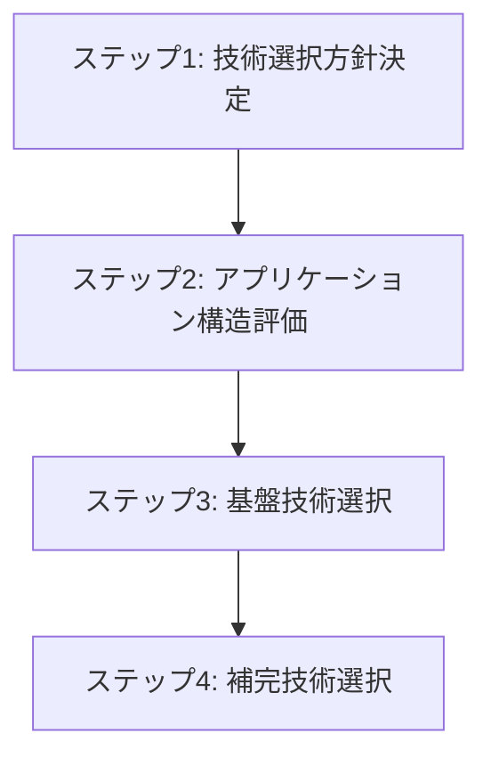

# フロントエンド 技術選択

## 目次

1. [概要](#概要)
2. [処理フロー](#処理フロー)
3. [ステップ 1: 技術選択方針決定](#ステップ-1-技術選択方針決定)
4. [ステップ 2: アプリケーション構造評価](#ステップ-2-アプリケーション構造評価)
5. [ステップ 3: 基盤技術選択](#ステップ-3-基盤技術選択)
6. [ステップ 4: 補完技術選択](#ステップ-4-補完技術選択)

## 概要

UI 技術方針を具体的な製品選択に変換する段階。Process View で確立されたサービス境界を基盤として、フロントエンドの開発構造を設計する。

- **関心事**: UI 技術の具体的な製品選択
- **時間軸**: 開発時
- **視点**: 開発者
- **成果物**: 選択技術の仕様書、技術決定の根拠

UI 技術方針から具体的な製品選択への変換により、開発チームが効率的に作業できるフロントエンド技術スタックを確立する。

解空間制限アプローチにより、技術選択肢を段階的に絞り込み、最終的な製品決定を行う。

## 処理フロー

## ステップ 1: 技術選択方針決定

CSR レンダリング方式を前提として、技術選択の基本方針を決定する段階。状態管理、パフォーマンス最適化、開発効率性の優先度を明確化する。

- **[状態管理方針決定](01-state-management-policy.md)** - グローバル状態とローカル状態の管理方針決定
- **[パフォーマンス最適化方針決定](02-performance-optimization-policy.md)** - バンドルサイズと実行速度の最適化方針決定

## ステップ 2: アプリケーション構造評価

CSR レンダリング方式と状態管理方針を前提として、アプリケーション構造を評価する段階。画面間独立性とパフォーマンス要件を両立するアーキテクチャを選定する。

- **[アプリケーション構造評価](03-app-structure-evaluation.md)** - CSR と状態管理方針に適したアプリケーション構造の評価

## ステップ 3: 基盤技術選択

決定したレンダリング方式とアプリケーション構造を基盤として、相互依存性の高い主要技術群を選択する段階。個別選択では局所最適に陥り、技術スタック全体として微妙な組み合わせになってしまう。そのため State of JS と State of CSS の全技術領域を調査してから、シナジーのある最適な組み合わせを一括決定する。

- **[フレームワーク調査](04-framework-research.md)** - フレームワークの調査
- **[メタフレームワーク調査](05-metaframework-research.md)** - メタフレームワークの調査
- **[ビルドツール調査](06-build-tools-research.md)** - ビルドツールの調査
- **[CSS 手法調査](07-css-approach-research.md)** - CSS 手法の調査
- **[フロントエンドテストツール調査](08-testing-tools-research.md)** - テストツールの調査
- **[基盤技術選択](09-foundation-tech-selection.md)** - 全調査結果を基に技術スタックを一括決定

## ステップ 4: 補完技術選択

基盤技術の選択結果を前提として、依存する技術群を順次決定する段階。基盤技術では不足する機能を補完し、完全な技術スタックを確立する。

上記の基盤技術選択により、補完技術選択の大部分が完了した。TanStack Router の選択により状態管理とルーティングが内蔵機能として提供され、Tailwind CSS の選択により UI コンポーネントもカスタム実装方針が確定したためである。

残る補完技術選択は、基盤技術に含まれない専門機能のみとなる。

- [グラフ可視化選択](10-graph-visualization-selection.md) - 概念間関係の空間配置・可視化ライブラリの調査と選択
  - 空間配置画面での概念関係性可視化に特化した技術が必要なため
- [HTTP 通信・API 連携選択](11-http-api-selection.md) - フロントエンドでの HTTP 通信技術の調査と選択
  - 基盤技術に HTTP 通信ライブラリが含まれていないため
