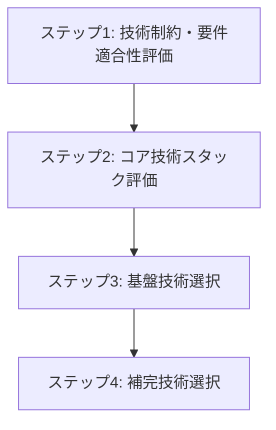

# バックエンド 技術選択

## 目次

1. [概要](#概要)
2. [処理フロー](#処理フロー)
3. [ステップ 1: 技術制約・要件適合性評価](#ステップ-1-技術制約要件適合性評価)
4. [ステップ 2: コア技術スタック評価](#ステップ-2-コア技術スタック評価)
5. [ステップ 3: 基盤技術選択](#ステップ-3-基盤技術選択)
6. [ステップ 4: 補完技術選択](#ステップ-4-補完技術選択)

## 概要

バックエンド技術方針を具体的な製品選択に変換する段階。レイヤードアーキテクチャと REST API の技術方針を基盤として、バックエンドの開発構造を設計する。

- **関心事**: バックエンド技術の具体的な製品選択
- **時間軸**: 開発時
- **視点**: 開発者
- **成果物**: 選択技術の仕様書、技術決定の根拠

バックエンド技術方針から具体的な製品選択への変換により、開発チームが効率的に作業できるバックエンド技術スタックを確立する。

言語 × フレームワークのセット選択アプローチにより、技術選択肢を段階的に絞り込み、最終的な製品決定を行う。

## 処理フロー

## ステップ 1: 技術制約・要件適合性評価

API 技術方針を前提として、言語 × フレームワーク選択の制約条件を明確化する段階。技術的制約、非機能要件、プラットフォーム制約への適合性を評価する。

- **[技術制約評価](01-technical-constraints.md)** - API 技術方針・アーキテクチャスタイルへの適合性評価
- **[非機能要件評価](02-non-functional-requirements.md)** - パフォーマンス・セキュリティ・可用性要件への適合性評価

## ステップ 2: コア技術スタック評価

制約条件を満たす言語 × フレームワークの組み合わせを決定する段階。各言語エコシステムの特性と CogitoWeave 要件との適合性を評価し、最適な組み合わせを選択する。

- **[言語 × フレームワーク選択](03-language-framework-selection.md)** - 主要な言語 × フレームワーク組み合わせの決定
- **[アプリケーションサーバー選択](04-app-server-selection.md)** - アプリケーション実行サーバーの選択

## ステップ 3: 基盤技術選択

決定した言語 × フレームワークを基盤として、主要技術群を順次選択する段階。各技術領域で最適な選択肢を決定する。

- **[ORM/ODM・マイグレーション選択](05-orm-selection.md)** - データアクセス技術とマイグレーション機能の選択
- **[API ドキュメント生成選択](06-api-doc-selection.md)** - API 仕様書自動生成技術の選択
- **[バリデーション技術選択](07-validation-selection.md)** - 入力検証技術の選択
- **[HTTP クライアント選択](08-http-client-selection.md)** - 外部 API 通信ライブラリの調査と選択
- **[バックエンド設定管理技術選択](09-config-management-selection.md)** - 環境変数・設定ファイル管理技術の選択

## ステップ 4: 補完技術選択

選択した技術群を前提として、残りの技術群を順次決定する段階。システム全体で必要な機能を補完し、完全な技術スタックを確立する。

- **[バックエンドテストツール選択](10-backend-testing-selection.md)** - テストフレームワーク・モックツールの選択
- **[ログ選択](11-logging-selection.md)** - ログライブラリの選択
