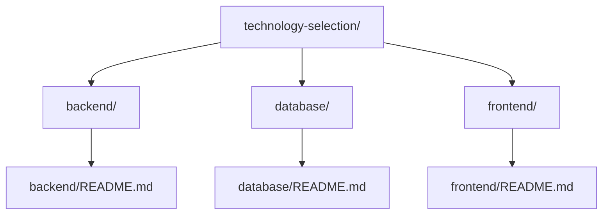

# 技術選択判断

## 前提条件とスコープ

この設計判断は CogitoWeave システムの技術的実現方式の選択を扱う。これまでの段階的制約により決定された要件を満たす技術スタックを選択する。

### 既存決定事項

<!-- PREMISE_BEGIN: platform-constraints -->

1. **Mac 環境制約**: Chrome 上で情報整理機能が完全動作すること
2. **iPhone 環境制約**: Safari 上で情報参照機能が基本動作すること
3. **Web 標準採用基準**: Baseline Newly available を技術選択の判断基準とすること
4. **マルチデバイス前提**: Web 技術による複数デバイス間データ共有を前提とすること

これ以外の基本セキュリティ対策（HTTPS、SQLi/XSS 対策等）、現代 Web 標準性能要件、個人情報保護法等の法規制遵守、個人環境限定によるセキュリティリスク軽減は現代 Web 開発標準に準拠する。

<!-- PREMISE_END: platform-constraints -->

<!-- PREMISE_BEGIN: architecture-style -->

**レイヤードアーキテクチャ**を採用する。

<!-- PREMISE_END: architecture-style -->

<!-- PREMISE_BEGIN: system-decomposition -->

**単一システム構成**を採用する。

外部依存の重い処理(LLM 協働・記事取得)については、将来的にマイクロサービス化する可能性を残すが、初期実装は統合構成とする。

<!-- PREMISE_END: system-decomposition -->

<!-- PREMISE_BEGIN: data-access -->

**ORM 経由・同期処理・シンプル整合性管理**を採用する。

- データアクセス: ORM 経由
- 処理方式: バックエンド内は同期処理
- トランザクション: 考慮不要
- データ整合性: 参照制約による関連データ削除制限
- アクセス制御: 不要（Cloudflare 保護のみ）

<!-- PREMISE_END: data-access -->

<!-- PREMISE_BEGIN: api-communication-auth -->

**静的 HTML + CSR・MPA + ページ内 SPA・REST API・認証認可なし**を採用する。

- レンダリング: 静的 HTML + CSR（手書き HTML + クライアントサイドインタラクティブ）
- 構成: MPA + ページ内 SPA（概念管理ページのみリッチ UI）
- API 通信: REST API
- 認証認可: なし（Cloudflare 保護のみ）

<!-- PREMISE_END: api-communication-auth -->

<!-- PREMISE_BEGIN: security -->

**現代標準開発環境によるセキュリティ対策**を採用する。

- 脅威モデル: 外部攻撃のみ（個人使用）
- 対策レベル: 基本的 Web 脆弱性対策
- 実装方針: 現代的言語・フレームワーク・ツールチェーン標準機能に依存
- SAST: 静的アプリケーションセキュリティテスト組み込み
- 特別要件: なし（金融・医療レベル不要）

<!-- PREMISE_END: security -->

## 構成要素

## 技術選択における設計判断

CogitoWeave の技術選択は、個人用途での最適性と長期的な保守性を最優先とする必要がある。

個人用途での現実的なデータ量（概念数千〜数万、文献メモ数万〜10 万件）を前提とし、運用の簡素化・開発効率・長期的安定性を重視した技術選択を行う。エンタープライズ向けの高機能・高性能な技術は、個人用途では過剰であり、学習コスト・運用負荷・保守コストの観点から不適切である。

**判断基準**:

- **個人用途適合性**: 運用の簡素化・バックアップの容易さ
- **開発効率**: 学習コスト・実装速度・デバッグの容易さ
- **長期安定性**: 依存関係管理・フレームワーク更新の負荷
- **機能充足性**: CogitoWeave 要求機能の実現可能性

CogitoWeave の技術実装において、3 つの層での段階的な技術選択による全体最適化を図っている。

第一のデータベース層選択として、[database/README.md](database/README.md) における判断により CogitoWeave のデータ特性に最適な永続化技術を選択している。典型的な関係データモデルに適合する RDBMS 採用、さらに個人用途の運用要求を重視した SQLite 選択により、データ構造適合性と運用簡素化を両立している。

第二のバックエンド層選択として、[backend/README.md](backend/README.md) における判断により LLM 統合要求と API 開発効率を最重視した技術選択を行っている。Python による LLM エコシステム直接活用、FastAPI による API 開発特化により、CogitoWeave の中核機能である LLM 統合を最適化している。

第三のフロントエンド層選択として、[frontend/README.md](frontend/README.md) における判断により個人用途におけるプロトタイプ開発効率を最重視している。Vanilla JavaScript による学習コスト最小化・依存関係管理負荷回避により、持続可能な個人開発環境を実現している。

## 結論

これらの段階的技術選択により、CogitoWeave の最終的な技術スタックは以下の通り確定している：

- **データベース層**: SQLite（RDBMS、ファイルベース）
- **バックエンド**: Python + FastAPI（LLM 統合、API 特化）
- **フロントエンド**: Vanilla HTML/CSS/JavaScript（軽量、依存関係なし）
- **LLM 統合**: Google Gemini API（コスト効率、日本語対応）

この技術選択により、個人用途における運用簡素化、プロトタイプ開発効率、LLM エコシステム直接活用を実現し、CogitoWeave の要求に最適化された実装基盤を提供する。
