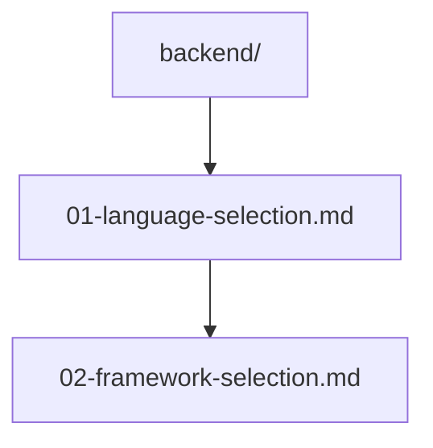

# バックエンド技術選択

## 前提条件とスコープ

この設計判断は CogitoWeave APIサーバーの実装技術選択を扱う。LLM統合による概念説明生成・関係発見機能の実装、RESTful API中心のアーキテクチャを前提とする。

## 構成要素

## 段階的論理展開

CogitoWeave のAPIサーバー実装において、LLM統合要求と開発効率を両立する技術選択を段階的に行っている。

第一段階として、基盤言語の選択判断を [01-language-selection.md](01-language-selection.md) で実施した。LLM 統合要求を最重視し、Google Gemini API 等の公式サポートと豊富な NLP エコシステムを持つ Python を採用している。JavaScript の言語統一利点よりも、LLM API 直接統合による開発効率が決定的に重要である。

第二段階として、フレームワークの選択判断を [02-framework-selection.md](02-framework-selection.md) で実施した。Python 採用後の具体的実装方式を選択し、API開発特化・型安全性・自動ドキュメント生成を重視した FastAPI を採用している。Django の包括機能や Flask の軽量性よりも、RESTful API 中心アーキテクチャにおける生産性を優先した結果である。

## 結論

これらの段階的判断により、バックエンド技術として **Python + FastAPI** を採用している。

LLM API との直接統合、型ヒント統合による開発時安全性、自動 OpenAPI ドキュメント生成による仕様共有効率により、CogitoWeave の API 中心アーキテクチャに最適化された実装基盤を提供する。
