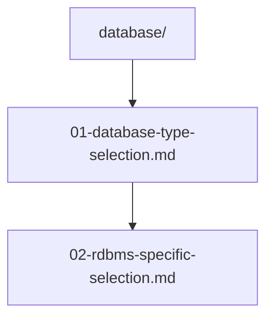

# データ層技術選択

## 前提条件とスコープ

この設計判断は CogitoWeave システムのデータ永続化技術選択を扱う。個人用デジタルツェッテルカステンとして、運用簡素化・開発効率・データ構造適合性を重視する。

## 構成要素

## 段階的論理展開による設計判断

CogitoWeave のデータ永続化において、2段階の技術選択によりデータ構造適合性と運用効率を両立している。

第一段階として、[01-database-type-selection.md](01-database-type-selection.md) により CogitoWeave のデータ特性を詳細分析し、典型的な関係データモデルに最適な RDBMS を採用している。概念・文献メモ・関係という構造化エンティティは、Graph DB や NoSQL よりも正規化された関係データベース設計で最も自然に表現される。

第二段階として、[02-rdbms-specific-selection.md](02-rdbms-specific-selection.md) では個人用途における運用要求を最重視し、サーバー運用不要・ゼロ設定による開発効率を実現する SQLite を選択している。PostgreSQL・MySQL の高機能性は個人用途に対して過剰仕様であり、プロトタイプ開発における複雑性の障害となる。

## 結論

この2段階の判断により、データ層技術として **SQLite（RDBMS・ファイルベース）** を採用している。

個人用途における十分な機能性、関係データモデルとの自然な適合性、運用複雑性の最小化により、CogitoWeave の要求に最適化されたデータ永続化基盤を提供する。FTS5 による全文検索機能で検索要求にも対応する。
