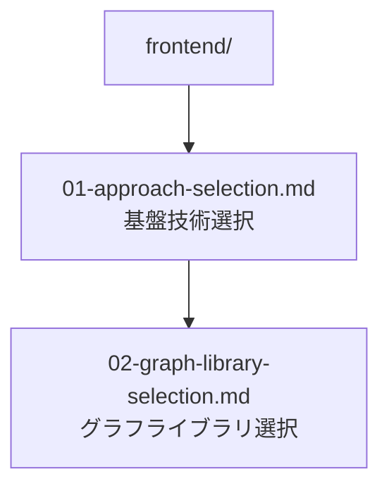

# フロントエンド技術選択

## 前提条件とスコープ

この設計判断は CogitoWeave クライアントサイドの実装技術選択を扱う。個人用デジタルツェッテルカステンとして、プロトタイプ開発効率・学習コスト最小化・保守性を重視する。

## 構成要素

## 段階的論理展開

CogitoWeave のクライアントサイド実装において、基盤技術とコア機能ライブラリの段階的な技術選択を行っている。

第一段階として、[01-approach-selection.md](01-approach-selection.md) により JavaScript フレームワークと Vanilla JavaScript の比較検討を行い、個人用途における学習コスト・依存関係管理負荷・保守性を総合評価した結果、Vanilla JavaScript + HTML/CSS を採用している。

第二段階として、[02-graph-library-selection.md](02-graph-library-selection.md) により CogitoWeave のコア機能である概念間関係グラフ可視化において、LLM コード生成能力・柔軟性・コミュニティサポートを重視した D3.js を採用している。

## 結論

これらの段階的技術選択により、CogitoWeave のフロントエンド技術スタックは以下の通り確定している：

- **基盤技術**: Vanilla JavaScript + HTML/CSS（軽量、依存関係なし）
- **グラフライブラリ**: D3.js（LLM生成対応、最高柔軟性）

プロトタイプ開発における学習コスト最小化、ビルド環境不要による開発効率、コア機能の迅速な実装により、CogitoWeave の個人用途に最適化されたクライアントサイド実装基盤を提供する。
