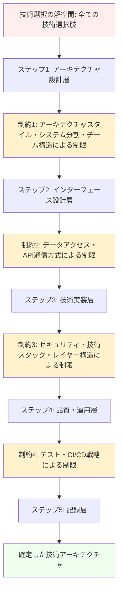

# Development View

## 目次

- [概要](#概要)
- [処理フロー](#処理フロー)
- [基底文書からの課題継承](#基底文書からの課題継承)
- [ステップ 1: アーキテクチャ設計層](#ステップ-1-アーキテクチャ設計層)
- [ステップ 2: インターフェース設計層](#ステップ-2-インターフェース設計層)
- [ステップ 3: 技術実装層](#ステップ-3-技術実装層)
- [ステップ 4: 品質・運用層](#ステップ-4-品質運用層)
- [ステップ 5: 記録層](#ステップ-5-記録層)
- [基底文書への結論継承](#基底文書への結論継承)

## 概要

Development View は、開発者が実装時に参照するビューとして、技術選択肢を段階的に制約することで最適な技術スタックを決定する。アーキテクチャスタイルから始まり、各段階で制約を追加して解空間を絞り込む。

## 処理フロー

## 基底文書からの課題継承

Development View では、基底文書の System Blueprint から継承される要件に基づいて、実装可能な技術アーキテクチャを段階的に決定する。

最終的に次のような形になる。

<!-- FOUNDATION_BEGIN: development-view -->

- アーキテクチャ設計層
  - アーキテクチャスタイル
  - システム分割
  - 開発チーム構造
- インターフェース設計層
  - データアクセス
  - API 通信方式、認証認可
- 技術実装層
  - セキュリティ（認証実装、脆弱性対策、セキュアコーディング）
  - 言語、フレームワーク、ライブラリ、データベース
  - レイヤー構造
- 品質・運用層
  - テスト、品質
  - CI、CD、リポジトリ管理
- 記録層（並列）
  - ドキュメント、ADR

<!-- FOUNDATION_END: development-view -->

## 解空間制限の基準: Kruchten 4+1 との対応関係

Kruchten 4+1 アーキテクチャビューモデルのオリジナル論文（1995 年）では、Development View は「actual software module organization on the software development environment（開発環境での実際のソフトウェアモジュール構成）」として定義されている。原文で Development View が実際に定義/決定する核心要素と現在の 12 項目の対応関係を示す。

| Kruchten 原文の核心要素                            | 現在の 12 項目との対応         |
| -------------------------------------------------- | ------------------------------ |
| **program libraries, subsystems**                  | システム分割                   |
| **hierarchy of layers**                            | レイヤ構造                     |
| **toolset, programming language constraints**      | 言語/フレームワーク/パッケージ |
| **team organization, allocation of work to teams** | 開発チーム構造                 |
| **partitioning, grouping, visibility rules**       | システム分割                   |
| **software management**                            | CI/CD（部分対応）              |

**原文にない拡張項目**：アーキテクチャスタイル、API 通信方式、データアクセス、テスト/品質、セキュリティ（実装寄り）、ドキュメント/ADR

## ステップ 1: アーキテクチャ設計層

まずアーキテクチャスタイルを選ぶ必要がある。これは例えばスペースベースアーキテクチャなど、要求を満たすためには他の方法では難しいものを最初に振り分けるため。多くの Web サービスの場合はレイヤードアーキテクチャ、サービスベースアーキテクチャ、イベント駆動アーキテクチャ、マイクロサービスアーキテクチャのいずれかが選ばれる。

次にシステム分割。選択したアーキテクチャスタイルによって、どのように分割すべきかがある程度決まる。その分割単位を決める。基本的には 1 システムを 1 チームで担当するのが望ましい。複数チームで担当するのはコミュニケーションロスが大きく、複数のシステムを 1 チームで担当するのはチームの負担が大きい。

次に開発チーム構造を決める。1 システム 1 チームなら問題ないが、1 システムを複数チーム、あるいは複数のシステムを 1 チームで担当する場合もあり得る。コンウェイの法則を逆向きに適用する、逆コンウェイ作戦のためにも開発チーム構造の検討は重要。

- [アーキテクチャスタイル](01-architecture-style/README.md)
- [システム分割](02-system-decomposition/README.md)
- [開発チーム構造](03-team-structure/README.md)

## ステップ 2: インターフェース設計層

次はデータアクセス。これはデータの整合性を保つための手法が必要か、例えばイベントソーシングなどの手法を使うかなどを含む。また、暗号化や RLS などアクセス制御の仕組みについても考慮する。

次に API 通信方式および認証認可。これをセットにしているのは、API を使わないサーバサイドレンダリングの場合認証認可の仕組みが変わるのが理由。これは REST や GraphQL などフロントエンドとバックエンド、あるいはマイクロサービス間、認証認可(OAuth, OpenID Connect)などのプロトコルの決定を含む。

- [データアクセス](04-data-access/README.md)
- [API 通信方式、認証認可](05-api-communication-and-auth/README.md)

## ステップ 3: 技術実装層

次はセキュリティ。これはどのような脆弱性対策が求められるかによって使用する技術が変わるため、技術スタック選定の前に決定する必要がある。例えば金融系なら暗号化要件で HSM サポートが必要な言語・ライブラリ、医療系なら監査ログ要件でログ管理機能の充実した技術スタック、リアルタイム性が重要なシステムならサイドチャネル攻撃対策で特定の言語やランタイム制限など、業界固有のセキュリティ要件が技術選択を大きく左右する。

そしてプログラミング言語などの技術選定。技術選定はここまでの要素を全て加味した上で選ぶ必要がある。アーキテクチャスタイル（マイクロサービスなら Docker ネイティブな言語）、システム分割（チーム構成に合わせたスキルセット）、データアクセス（ORM サポートや非同期処理能力）、API 通信方式（GraphQL サポートや REST API ライブラリの充実度）、セキュリティ要件（暗号化ライブラリやセキュアコーディング支援）など、前段階で決定した全ての制約条件を満たす技術スタックを選択する。

レイヤー構造。レイヤー構造はフレームワークによって決まるものもあれば、そうでないものもある。例えば Spring Boot なら MVC 構造、Django なら独自のレイヤー構造、React+Node.js ならフロントエンド・バックエンド分離構造など、選択した技術スタックに応じて最適なレイヤー構造を決定する。また、選択したアーキテクチャスタイル（レイヤードアーキテクチャ、ヘキサゴナルアーキテクチャなど）との整合性も考慮する。

- [セキュリティ](06-security/README.md)
- [技術スタック](07-technology-stack/README.md)
- [レイヤー構造](08-layer-structure/README.md)

## ステップ 4: 品質・運用層

次がテスト、品質。これは技術スタックが決まってから決定する必要がある。例えば JavaScript なら Jest、Python なら pytest など、言語とフレームワークに依存するテストツールを選択し、テスト戦略(単体テスト、統合テスト、E2E テスト)を決定する。品質基準についても、選択した技術スタックで実現可能な範囲で設定する。

次に CI、CD、リポジトリ管理。これはテスト戦略が決まってから構築する。どのようなテストを自動化するか、どのような品質ゲートを設けるかが決まっていないと CI/CD パイプラインを設計できない。また、選択したプログラミング言語やフレームワークによって使用するツール(GitHub Actions、GitLab CI、Jenkins 等)や設定内容が変わる。

- [テスト、品質](09-testing-and-quality/README.md)
- [CI、CD、リポジトリ管理](10-ci-cd-and-repository/README.md)

## ステップ 5: 記録層

最後にドキュメント、ADR(Architecture Decision Record)。これは全ての技術的判断が完了してから記録する。なぜなら、ここまでの全ての判断が ADR の対象となるため。また、選択した技術スタックに応じてドキュメント生成ツール(Swagger/OpenAPI、JSDoc、Sphinx 等)を決定する必要がある。

- [ドキュメント、ADR](11-documentation-and-adr/README.md)

## 基底文書への結論継承

Development View では、開発チームが効率的で品質の高いソフトウェアを構築するための具体的な手法と基準を段階的制約により決定する。解空間制限により以下を実現する：

- 開発生産性の向上：最適化された技術スタックとアーキテクチャスタイルの選択
- コード品質の一貫性確保：統一されたテスト戦略と品質基準の適用
- 技術的負債の抑制：段階的制約による技術選択の論理的根拠の明確化
- 実装可能性の保証：各段階の制約を満たした現実的な技術アーキテクチャの提供
