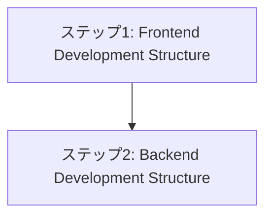

# Development View

## 目次

1. [概要](#概要)
2. [処理フロー](#処理フロー)
3. [ステップ 1: Frontend Development Structure](#ステップ-1-frontend-development-structure)
4. [ステップ 2: Backend Development Structure](#ステップ-2-backend-development-structure)

## 概要

Kruchten 4+1 アーキテクチャビューモデルの Development View はソフトウェアモジュール構成に焦点を当てる。

> The development architecture focuses on the actual software module organization on the software development environment. The software is packaged in small chunks —program libraries, or subsystems- that can be developed by one or a small number of developers. The subsystems are organized in a hierarchy of layers, each layer providing a narrow and well-defined interface to the layers above it.

- **関心事**: ソフトウェアモジュールの実装構成
- **時間軸**: 開発時
- **視点**: 開発者、プロジェクトマネージャー
- **成果物**: モジュール図、サブシステム図、開発環境構成

Development View は論理設計を開発可能な実装構造に変換するプロセスである。技術方針を具体的な製品選択に変換し、開発チームが効率的に作業できるモジュール構造を構築する。

Frontend、Backend の 2 つの開発構造により、技術選択から実装組織化への体系的な変換を行う。

## 処理フロー

## ステップ 1: Frontend Development Structure

Process View で確立されたサービス境界を基盤として、Frontend の開発構造を設計する段階。UI 技術方針を具体的な製品選択に変換する。

- **[フロントエンド 技術選択](01-frontend-tech-selection/README.md)** - UI 技術方針を具体的な製品選択に変換する

## ステップ 2: Backend Development Structure

Frontend の技術選択と連携して、Backend の開発構造を設計する段階。データベースとバックエンド技術、バージョン管理システムの具体的な製品選択を行う。

- **[DB 技術選択](02-db-tech-selection/README.md)** - データベース方針を具体的な製品選択に変換する
- **[バックエンド 技術選択](03-backend-tech-selection/README.md)** - バックエンド技術の具体的な製品選択を行う
- **[Git サービス選定](04-git-service-selection/README.md)** - バージョン管理システムを選定する
