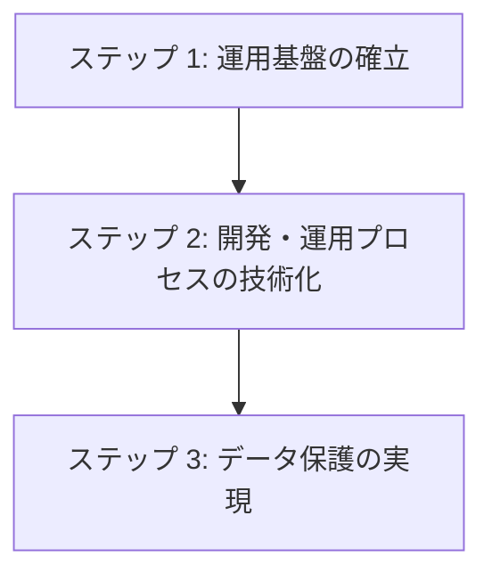

# ステップ 1: 基盤インフラ技術選択

## 目次

1. [概要](#概要)
2. [処理フロー](#処理フロー)
3. [ステップ 1: 運用基盤の確立](#ステップ-1-運用基盤の確立)
4. [ステップ 2: 開発・運用プロセスの技術化](#ステップ-2-開発運用プロセスの技術化)
5. [ステップ 3: データ保護の実現](#ステップ-3-データ保護の実現)

## 概要

基盤インフラ技術選択では、システムの基本的な運用基盤となる技術スタックを選定する。Physical View の第一段階として、ホスティングから CI/CD、バックアップまでの基盤技術を体系的に決定し、後続の監視・セキュリティ技術選択の土台を構築する。

## 処理フロー

## ステップ 1: 運用基盤の確立

- **[ホスティング方式選択](01-hosting-method-selection.md)** - セルフホスト/マネージドサービス/分散構成等の運用方式を選択する
- **[バックエンド・データベース配置決定](02-backend-deployment-decision.md)** - バックエンドサービスとデータベースの物理的配置方法を決定する
- **[フロントエンド配置決定](03-frontend-deployment-decision.md)** - フロントエンドアプリケーションの物理的配置方法を決定する

## ステップ 2: 開発・運用プロセスの技術化

- **[フロントエンド・バックエンド統合技術選択](04-frontend-backend-integration.md)** - フロントエンド・バックエンドの統合技術を選択する
- **[CI/CD 技術選択](05-cicd-tech-selection.md)** - 継続的インテグレーション・デプロイメント技術を選択する
- **[インフラ管理技術選択](06-infra-management-selection.md)** - インフラストラクチャ管理・自動化技術を選択する

## ステップ 3: データ保護の実現

- **[バックアップ方法技術選択](07-backup-method-selection.md)** - データ保護のためのバックアップ実行技術を選択する
