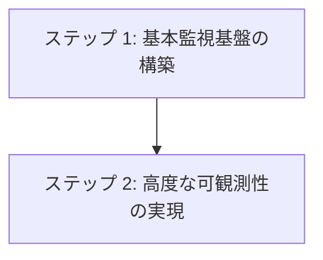

# ステップ 2: 監視・オブザーバビリティ技術選択

## 目次

1. [概要](#概要)
2. [処理フロー](#処理フロー)
3. [ステップ 1: 基本監視基盤の構築](#ステップ-1-基本監視基盤の構築)
4. [ステップ 2: 高度な可観測性の実現](#ステップ-2-高度な可観測性の実現)

## 概要

監視・オブザーバビリティ技術選択では、システムの健全性と性能を継続的に把握するための技術スタックを選定する。ステップ 1 で確立された基盤インフラ上で、包括的な監視・ログ・APM・トレーシング機能を実現する具体的技術を決定する。

## 処理フロー

## ステップ 1: 基本監視基盤の構築

- **[監視・ログ技術選択](01-monitoring-tech-selection.md)** - システム監視・ログ管理技術を選択する
- **[ログ収集・転送技術選択](02-log-collection-selection.md)** - アプリケーションログを監視基盤に送信する技術を選択する

## ステップ 2: 高度な可観測性の実現

- **[APM 技術選択](03-apm-selection.md)** - アプリケーション性能監視機能の提供技術を選択する
- **[トレーシング技術選択](04-tracing-selection.md)** - 分散トレーシング機能の提供技術を選択する
