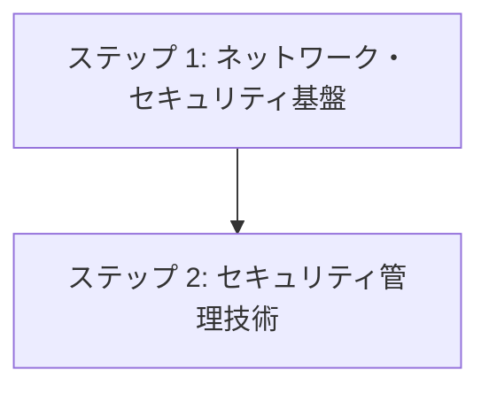

# ステップ 3: セキュリティ・ネットワーク技術選択

## 目次

1. [概要](#概要)
2. [処理フロー](#処理フロー)
3. [ステップ 1: ネットワーク・セキュリティ基盤](#ステップ-1-ネットワークセキュリティ基盤)
4. [ステップ 2: セキュリティ管理技術](#ステップ-2-セキュリティ管理技術)

## 概要

セキュリティ・ネットワーク技術選択では、システムの安全性と可用性を確保するための技術スタックを選定する。ステップ 1・2 で構築された基盤インフラと監視環境を前提として、ネットワーク層でのセキュリティとパフォーマンス最適化を実現する具体的技術を決定する。

## 処理フロー

## ステップ 1: ネットワーク・セキュリティ基盤

- **[ネットワーク技術選択](01-network-tech-selection.md)** - 負荷分散・CDN・セキュリティ技術を選択する

## ステップ 2: セキュリティ管理技術

- **シークレット管理技術選択** - 認証情報・API キー等の安全な管理技術を選択する
- **SSL 証明書管理技術選択** - HTTPS 通信のための証明書管理技術を選択する

本プロジェクトでは詳細検討を省略しているが、企業システムや大規模システムでは重要な選択項目となる：
