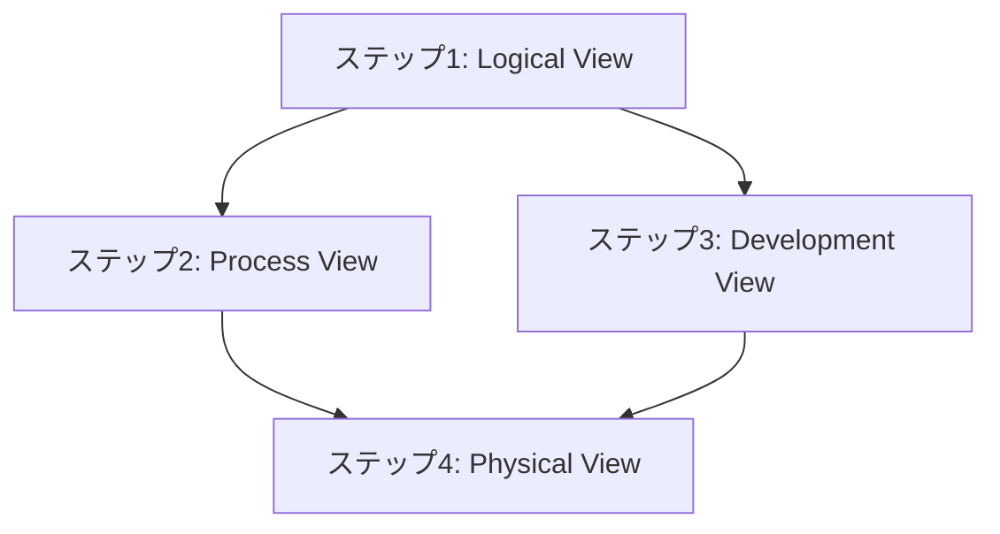

# システム青写真 (How 系・理想)

## 目次

1. [概要](#概要)
2. [処理フロー](#処理フロー)
3. [ステップ 1: Logical View](#ステップ-1-logical-view)
4. [ステップ 2: Process View](#ステップ-2-process-view)
5. [ステップ 3: Development View](#ステップ-3-development-view)
6. [ステップ 4: Physical View](#ステップ-4-physical-view)

## 概要

システム青写真は Kruchten 4+1 アーキテクチャビューモデルに基づく段階的システム設計プロセスである。各ビューは異なる関心事と視点を持ち、段階的に詳細化することで整合性の高いアーキテクチャを構築する。

4 つのビューは順序関係を持ち、前段階の成果を基盤として次段階の設計を行う。機能要件から論理設計、実行時設計、実装構造、物理配置へと段階的に変換し、最終的に実装可能なシステムアーキテクチャを確立する。

各ビューは独立した設計価値を持ちながらも、相互に制約と影響を与え合うことで、全体的に整合性のとれたアーキテクチャを実現する。

## 処理フロー

## ステップ 1: Logical View

機能要件を論理設計に変換する段階。システムがユーザーに提供するサービスを、主要抽象化とドメインモデルとして設計する。合意済みシナリオを起点として、機能境界・UI 設計・データ設計・アーキテクチャスタイル決定まで、論理レベルでの設計判断を段階的に行う。具体的な製品選択ではなく技術方針レベルの判断を確立し、後続のビューでの制約条件を提供する。

- **[Logical View](01-logical-view/README.md)** - 機能要件から論理設計への変換

## ステップ 2: Process View

論理設計を実行時の協調パターンに変換する段階。Logical View で確立された機能境界を基盤として、非機能要件(性能・可用性・並行性・分散性)を満たす実行時アーキテクチャを設計する。サービス間とサービス内の 2 段階で段階的に設計し、分散システム全体から個別サービス内部まで、一貫した実行時品質を保証する協調パターンを構築する。

- **[Process View](02-process-view/README.md)** - 論理設計から実行時協調パターンへの変換

## ステップ 3: Development View

論理設計と実行時制約を実装構造に変換する段階。Logical View の技術方針と Process View の制約条件を受けて、具体的な製品選択と実装組織化を行う。フロントエンド・バックエンド・DevOps 構造の設計により、開発チームが実装可能なモジュール構造とパッケージ設計を確立し、Physical View での物理配置に必要な実装成果物を提供する。

- **[Development View](03-development-view/README.md)** - 論理・実行時設計から実装構造への変換

## ステップ 4: Physical View

実装構造を物理環境に配置する段階。Development View で確立された実装構造と Process View の実行時制約を受けて、クラウドインフラ上での物理配置を設計する。コンテナ化からデプロイメント構成、ネットワークセキュリティ、オブザーバビリティまで、実装されたソフトウェアを実際の物理環境で運用するための設計を確立する。

- **[Physical View](04-physical-view/README.md)** - 実装構造から物理配置への変換
