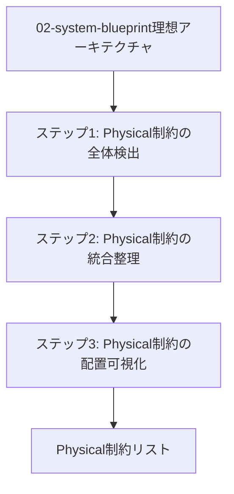
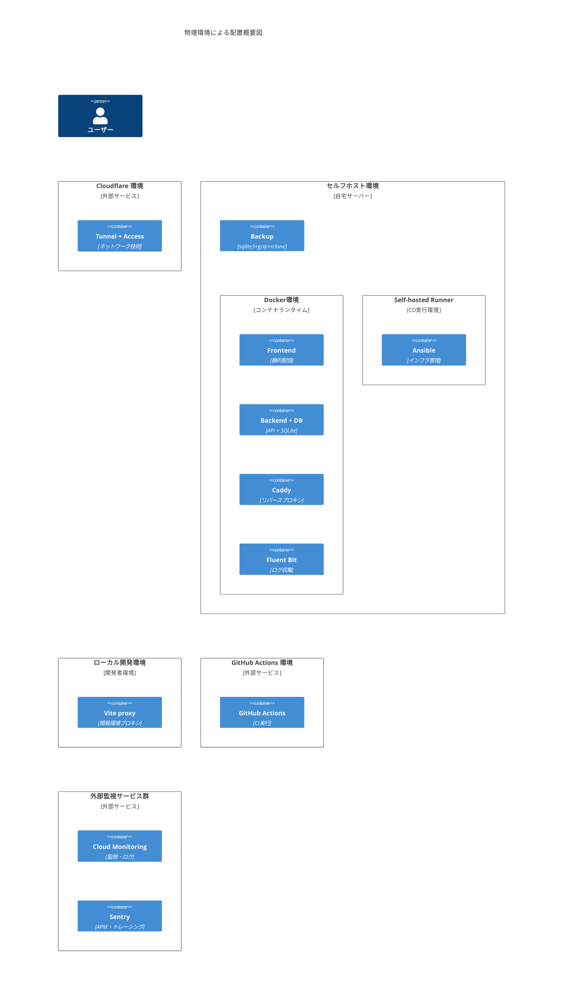
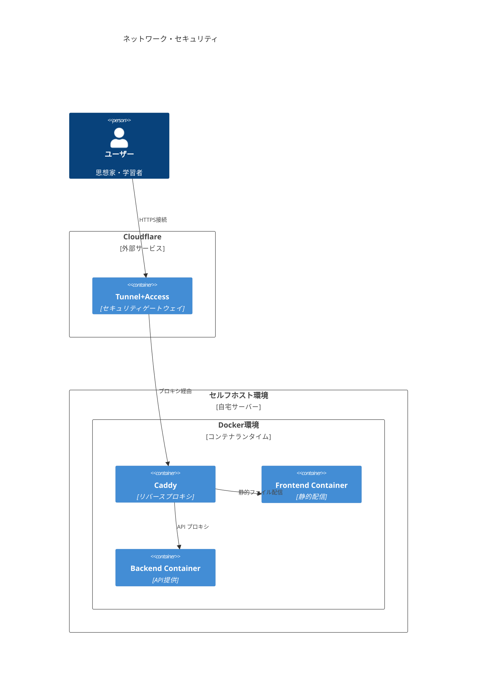
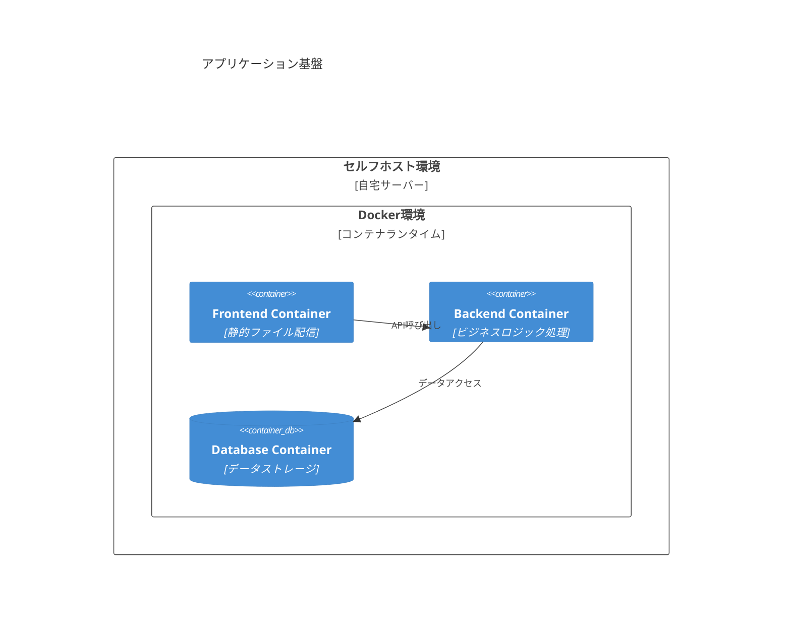
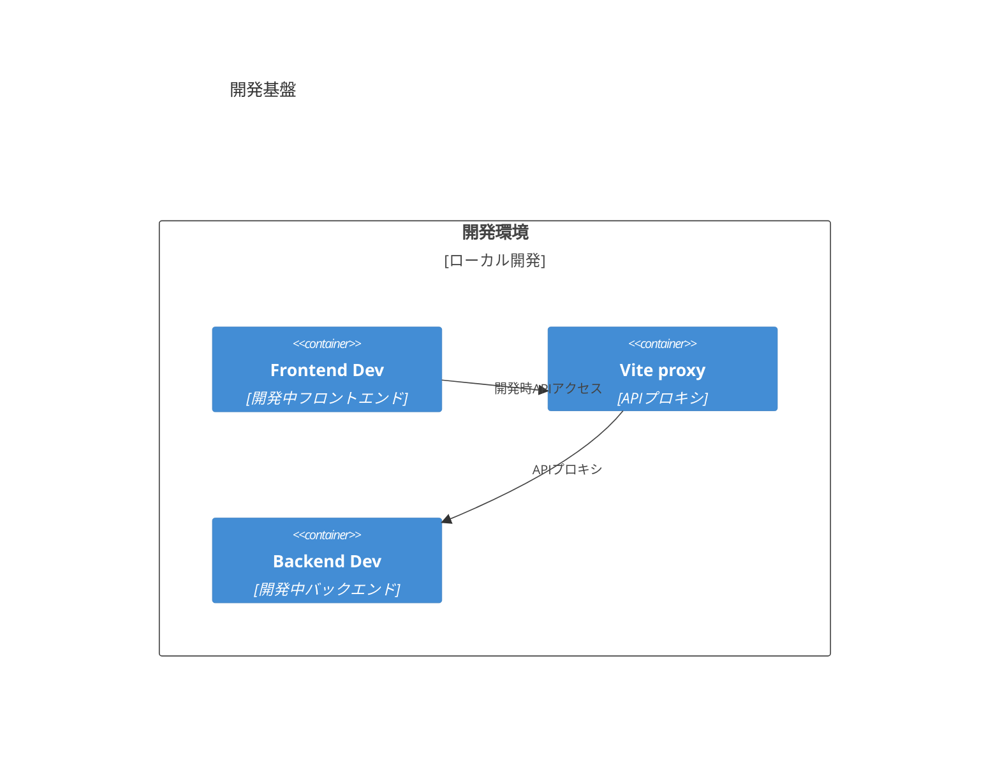
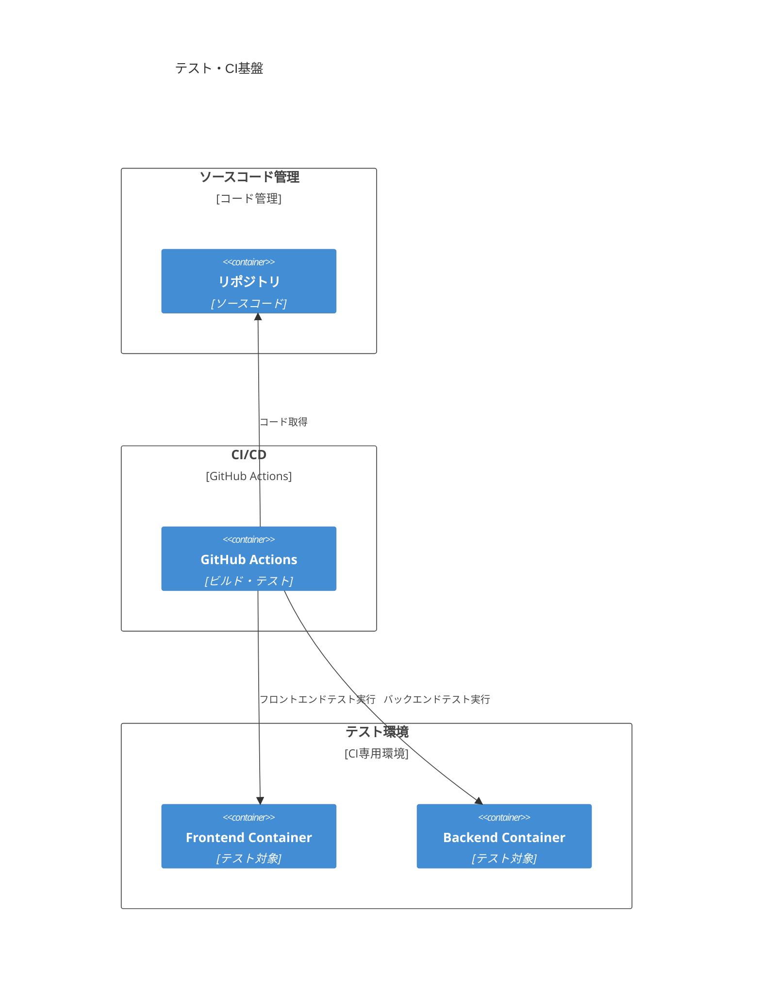
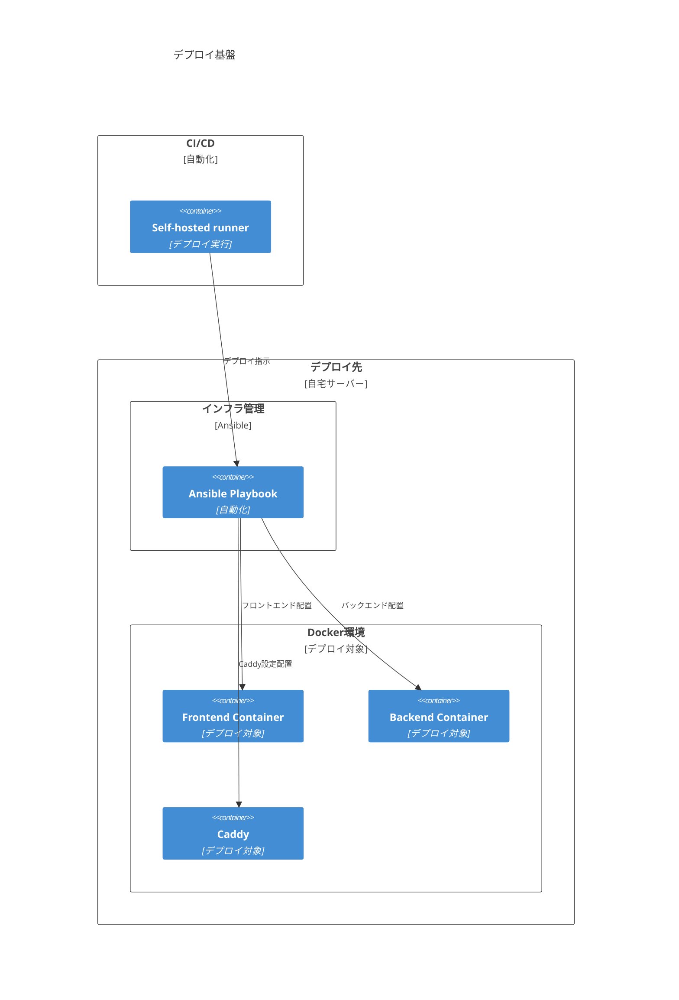
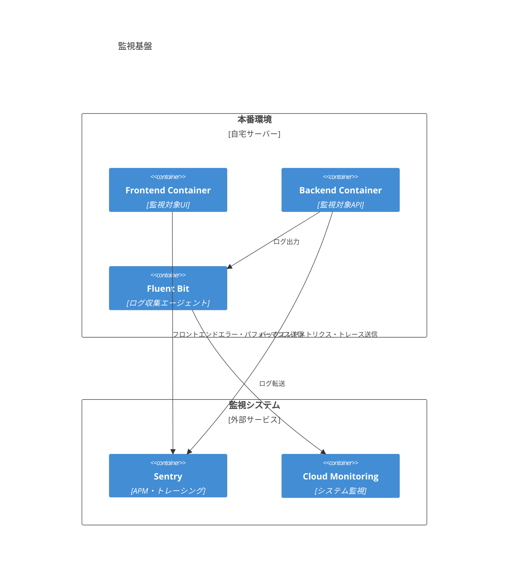
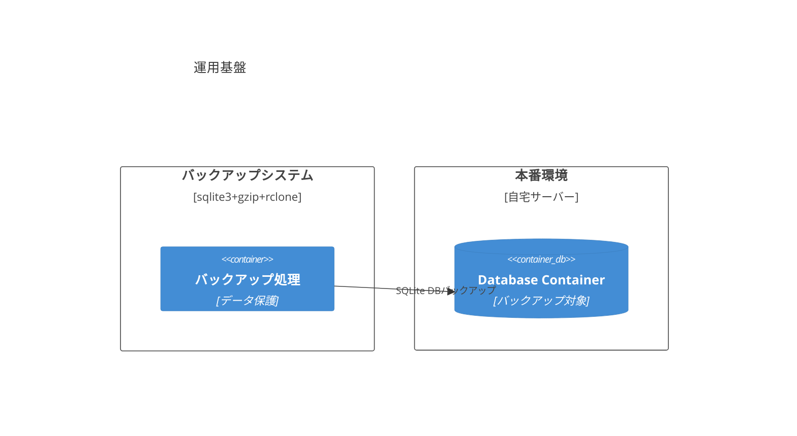

# 01-physical-constraint-detection - Physical 制約の検出

## 目次

- [概要](#概要)
- [処理フロー](#処理フロー)
- [ステップ 1: Physical 制約の全体検出](#ステップ-1-physical-制約の全体検出)
- [ステップ 2: Physical 制約の統合整理](#ステップ-2-physical-制約の統合整理)
- [ステップ 3: 物理環境による制約の再編成](#ステップ-3-物理環境による制約の再編成)
- [ステップ 4: 制約分類の詳細化](#ステップ-4-制約分類の詳細化)
- [ステップ 5: Physical 制約の配置可視化](#ステップ-5-physical-制約の配置可視化)

## 概要

02-system-blueprint の理想アーキテクチャに対して、現実のサーバー構成・運用・コストモデルの物理的制約を適用する段階的プロセスを実行する。

- **関心事**: 物理リソースと運用環境による実装制約
- **時間軸**: インフラ設計・構築を決定する時点
- **視点**: システム運用者・インフラ担当者
- **成果物**: 物理制約を明確化した制約リスト

理想アーキテクチャを現実の物理環境に適用する際の制約を段階的に検出し、実装可能性を評価する。

## 処理フロー

## ステップ 1: Physical 制約の全体検出

Physical View で設計したシステム構成・技術選択・運用方針の全てを制約リストとして抽出する。

### 1. 基盤インフラ技術選択

#### 1. ホスティング方式選択

<!-- PREMISE_BEGIN: hosting-options-analysis -->

CogitoWeave システムのホスティング方式として、フロントエンド 3 選択肢(F1-F3)、バックエンド 2 選択肢(B1-B2)、データベース 2 選択肢(D1-D2)の組み合わせによる配置パターンが利用可能である。

- フロントエンド
  - 選択肢 F1: 自宅サーバーで静的配信
  - 選択肢 F2: 自宅サーバー + Cloudflare CDN
  - 選択肢 F3: Cloudflare Pages
- バックエンド
  - 選択肢 B1: 自宅サーバーで API を提供
  - 選択肢 B2: Cloudflare Workers で API を提供
- データベース
  - 選択肢 D1: 自宅サーバーで SQLite
  - 選択肢 D2: Cloudflare D1

<!-- PREMISE_END: hosting-options-analysis -->

#### 2. バックエンド・データベース配置決定

<!-- PREMISE_BEGIN: backend-deployment-decision -->

CogitoWeave システムのバックエンド・データベース配置方式として、B1「自宅サーバーで API を提供」+ D1「自宅サーバーで SQLite」を採用し、Docker + Docker Compose によるコンテナ化配置を行う。

<!-- PREMISE_END: backend-deployment-decision -->

#### 3. フロントエンド配置決定

<!-- PREMISE_BEGIN: frontend-deployment-decision -->

CogitoWeave システムのフロントエンド配置方式として、選択肢 F1「自宅サーバーで静的配信」を採用し、Docker + Docker Compose によるコンテナ化配置を行う。

<!-- PREMISE_END: frontend-deployment-decision -->

#### 4. フロントエンド・バックエンド統合技術選択

<!-- PREMISE_BEGIN: development-production-environment -->

CogitoWeave システムのフロントエンド・バックエンド統合技術として、開発時は Vite proxy、本番時は Caddy(Web サーバー兼リバースプロキシ)を採用する。

<!-- PREMISE_END: development-production-environment -->

#### 5. CI/CD 技術選択

<!-- PREMISE_BEGIN: cicd-tech-selection -->

CogitoWeave システムの CI/CD 技術として、GitHub Actions を採用する。CI は通常ランナー、CD は self-hosted runners を使用する。

<!-- PREMISE_END: cicd-tech-selection -->

#### 6. インフラ管理技術選択

<!-- PREMISE_BEGIN: infra-management-selection -->

CogitoWeave システムのインフラ管理技術として、Ansible を採用する。

<!-- PREMISE_END: infra-management-selection -->

#### 7. バックアップ方法技術選択

<!-- PREMISE_BEGIN: backup-method-tech-selection -->

バックアップ方法技術として **sqlite3 .backup + gzip + rclone** を採用する。

<!-- PREMISE_END: backup-method-tech-selection -->

### 2. 監視・オブザーバビリティ技術選択

#### 1. 監視・ログ技術選択

<!-- PREMISE_BEGIN: monitoring-tech-selection -->

CogitoWeave システムの監視・ログ技術として、Google Cloud Monitoring を採用する。

<!-- PREMISE_END: monitoring-tech-selection -->

#### 2. ログ収集・転送技術選択

<!-- PREMISE_BEGIN: log-collection-selection -->

CogitoWeave システムのログ収集・転送技術として、Docker Compose 環境でサイドカーパターンにより配置される Fluent Bit を採用する。

<!-- PREMISE_END: log-collection-selection -->

#### 3. APM 技術選択

<!-- PREMISE_BEGIN: apm-selection -->

CogitoWeave システムの APM 技術として、Sentry を採用する。

<!-- PREMISE_END: apm-selection -->

#### 4. トレーシング技術選択

<!-- PREMISE_BEGIN: tracing-selection -->

CogitoWeave システムのトレーシング技術として、Sentry Performance を採用する。

<!-- PREMISE_END: tracing-selection -->

### 3. セキュリティ・ネットワーク技術選択

#### 1. ネットワーク技術選択

<!-- PREMISE_BEGIN: network-tech-selection -->

CogitoWeave システムのネットワーク技術として、Cloudflare Tunnel + Cloudflare Access を採用する。

<!-- PREMISE_END: network-tech-selection -->

## ステップ 2: Physical 制約の統合整理

ステップ 1 で抽出した物理制約を配置環境別に分類し、ネストしたリスト形式で統合整理する。

- 基盤インフラ技術選択
  1. ホスティング方式選択: F1-F3(自宅静的配信/自宅+CDN/Pages)、B1-B2(自宅 API/Workers)、D1-D2(自宅 SQLite/D1)の組み合わせ
  2. バックエンド・データベース配置決定: B1(自宅サーバー API) + D1(自宅サーバー SQLite) + Docker Compose
  3. フロントエンド配置決定: F1(自宅サーバーで静的配信)
  4. フロントエンド・バックエンド統合技術選択: 開発時 Vite proxy、本番時 Caddy(Web サーバー兼リバースプロキシ)
  5. CI/CD 技術選択: GitHub Actions (CI は通常ランナー、CD は self-hosted runners)
  6. インフラ管理技術選択: Ansible
  7. バックアップ方法技術選択: sqlite3 .backup + gzip + rclone
- 監視・オブザーバビリティ技術選択
  1. 監視・ログ技術選択: Google Cloud Monitoring
  2. ログ収集・転送技術選択: Fluent Bit
  3. APM 技術選択: Sentry
  4. トレーシング技術選択: Sentry Performance
- セキュリティ・ネットワーク技術選択
  1. ネットワーク技術選択: Cloudflare Tunnel + Cloudflare Access

## ステップ 3: 物理環境による制約の再編成

ステップ 2 で抽出した技術選択を、実際の物理配置環境ごとに再編成する。同じ物理環境で動作する技術をグループ化することで、インフラ構築・運用時の作業単位を明確化する。

**目的**: 技術選択を物理的な配置場所でグループ化し、実装・運用時の責任範囲を明確にする。

**注記**: 基盤 1(ホスティング方式選択)は「どこにホストするか」の設計決定であり、実際の配置技術ではないため除外している。配置技術として含まれるのは、その選択結果として実際に動作する実装技術のみである。

### マッピング表

- Cloudflare 環境
  - ネットワーク技術: Cloudflare Tunnel + Cloudflare Access (セキュリティ 1.)
- セルフホスト環境
  - バックエンド・データベース配置: 自宅サーバー API + SQLite + Docker Compose (基盤 2.)
  - フロントエンド配置: 自宅サーバーで静的配信 (基盤 3.)
  - フロントエンド・バックエンド統合技術: Caddy (基盤 4.)
  - CD 技術: GitHub Actions (self-hosted runners) (基盤 5.)
  - インフラ管理技術: Ansible (基盤 6.)
  - バックアップ方法: sqlite3 .backup + gzip + rclone (基盤 7.)
  - ログ収集・転送技術: Fluent Bit (監視 2.)
- ローカル開発環境
  - 開発環境プロキシ: Vite proxy (基盤 4.)
- GitHub Actions 環境
  - CI 技術: GitHub Actions (通常ランナー) (基盤 5.)
- 外部監視サービス群
  - 監視・ログ技術: Google Cloud Monitoring (監視 1.)
  - APM 技術: Sentry (監視 3.)
  - トレーシング技術: Sentry Performance (監視 4.)

### 物理配置の全体像

マッピング表で整理した 5 つの物理環境とその配置技術を、視覚的に表現した配置図。各環境の責任範囲と技術配置を一覧できる。

### 全体概要図

<!-- GLOBAL_CONCLUSION_BEGIN: physical-environment-overview-diagram -->

<!-- GLOBAL_CONCLUSION_END: physical-environment-overview-diagram -->

## ステップ 4: 制約分類の詳細化

ステップ 2 で抽出した技術選択を、関心事の観点から分類する。まず技術選択を 4 つの大分類に整理し、その後で具体的な作業内容に応じて 7 つに細分化する。

4 つの大分類は、システムの構築・運用における主要な作業フェーズに対応している。

- 開発基盤: 開発者の作業環境
- CI/CD 基盤: 自動化された品質保証と配置
- 実行基盤: アプリケーションの提供
- 運用基盤: 稼働後の保守管理

各大分類内では、ステップ 2 で抽出された技術選択の性質により細分化が必要となる。ステップ 2 では基盤インフラ技術選択 7 項目、監視・オブザーバビリティ技術選択 4 項目、セキュリティ・ネットワーク技術選択 1 項目を抽出した。これらの技術選択を 4 つの大分類に配置すると、一部の大分類内で異なる性質の技術が混在するため、さらに細分化する必要がある。

- 開発基盤は開発環境のみとして分割しない
  - 開発者の作業環境という単一関心事のため
- CI/CD 基盤はテスト・CI とデプロイに分割する
  - テスト・CI は品質保証、デプロイは本番配置で責任者と実行タイミングが異なるため
- 実行基盤はネットワーク・セキュリティとアプリケーション基盤に分割する
  - ネットワーク・セキュリティは外部接続制御、アプリケーション基盤は実行環境で専門知識が全く異なるため
- 運用基盤は監視基盤とバックアップ・運用に分割する
  - 監視はリアルタイム状態把握、バックアップ・運用は定期的データ保護で作業性質が異なるため

この細分化により以下の 7 分類となる。

- ネットワーク・セキュリティ: 外部からのアクセス制御と通信経路
- アプリケーション基盤: コンテナによるアプリケーション実行環境
- 開発: 開発者の作業環境とツール
- テスト・CI 基盤: 自動テストとビルドの実行環境
- デプロイ基盤: 本番環境への配置と自動化
- 監視基盤: システム状態の監視と分析
- 運用基盤: データ保護とバックアップ処理

### 関心事による制約の 7 分類

上記の細分化により、ステップ 2 で抽出された全 12 の技術選択が以下の 7 つの関心事に分類される。

- ネットワーク・セキュリティ
  - ネットワーク技術: Cloudflare Tunnel + Cloudflare Access (セキュリティ 1.)
  - リバースプロキシ: Caddy (基盤 4.)
- アプリケーション基盤
  - バックエンド・データベース配置: 自宅サーバー API + SQLite + Docker Compose (基盤 2.)
  - フロントエンド配置: 自宅サーバーで静的配信 (基盤 3.)
- 開発
  - 開発環境プロキシ: Vite proxy (基盤 4.)
- テスト・CI 基盤
  - CI 技術: GitHub Actions (通常ランナー) (基盤 5.)
- デプロイ基盤
  - インフラ管理技術: Ansible (基盤 6.)
  - CD 技術: GitHub Actions (self-hosted runners) (基盤 5.)
- 監視基盤
  - 監視・ログ技術: Google Cloud Monitoring (監視 1.)
  - ログ収集・転送技術: Fluent Bit (監視 2.)
  - APM 技術: Sentry (監視 3.)
  - トレーシング技術: Sentry Performance (監視 4.)
- 運用基盤
  - バックアップ方法: sqlite3 .backup + gzip + rclone (基盤 7.)

## ステップ 5: Physical 制約の配置可視化

ステップ 4 の 7 分類をそれぞれ C4 配置図で可視化する。各関心事ごとに技術の配置場所と接続関係を図示することで、実装時の参照資料とする。

### 分割された専門特化図

#### 1. ネットワーク・セキュリティ

<!-- GLOBAL_CONCLUSION_BEGIN: physical-network-infrastructure-diagram -->

<!-- GLOBAL_CONCLUSION_END: physical-network-infrastructure-diagram -->

#### 2. アプリケーション基盤

<!-- GLOBAL_CONCLUSION_BEGIN: physical-application-infrastructure-diagram -->

<!-- GLOBAL_CONCLUSION_END: physical-application-infrastructure-diagram -->

#### 3. 開発基盤

<!-- GLOBAL_CONCLUSION_BEGIN: physical-development-infrastructure-diagram -->

<!-- GLOBAL_CONCLUSION_END: physical-development-infrastructure-diagram -->

#### 4. テスト・CI 基盤

<!-- GLOBAL_CONCLUSION_BEGIN: physical-testing-ci-infrastructure-diagram -->

<!-- GLOBAL_CONCLUSION_END: physical-testing-ci-infrastructure-diagram -->

#### 5. デプロイ基盤

<!-- GLOBAL_CONCLUSION_BEGIN: physical-deployment-infrastructure-diagram -->

<!-- GLOBAL_CONCLUSION_END: physical-deployment-infrastructure-diagram -->

#### 6. 監視基盤

<!-- GLOBAL_CONCLUSION_BEGIN: physical-monitoring-infrastructure-diagram -->

<!-- GLOBAL_CONCLUSION_END: physical-monitoring-infrastructure-diagram -->

#### 7. 運用基盤

<!-- GLOBAL_CONCLUSION_BEGIN: physical-operations-infrastructure-diagram -->

<!-- GLOBAL_CONCLUSION_END: physical-operations-infrastructure-diagram -->
