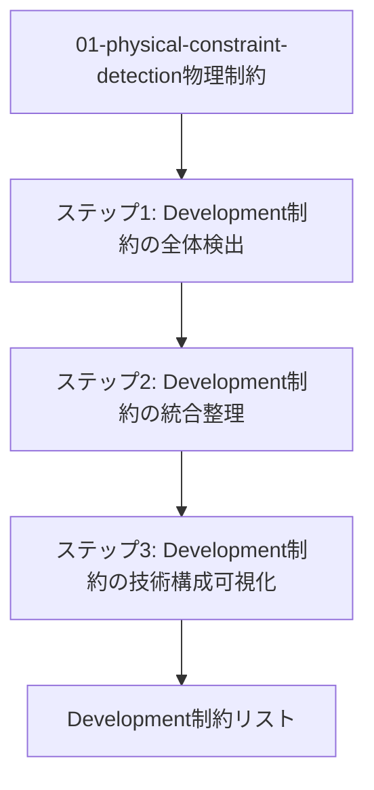
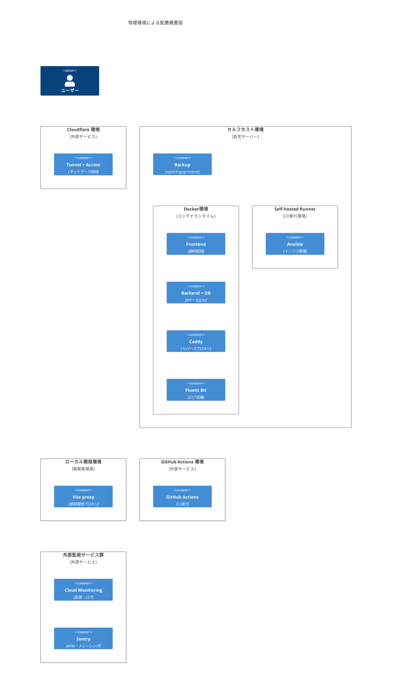
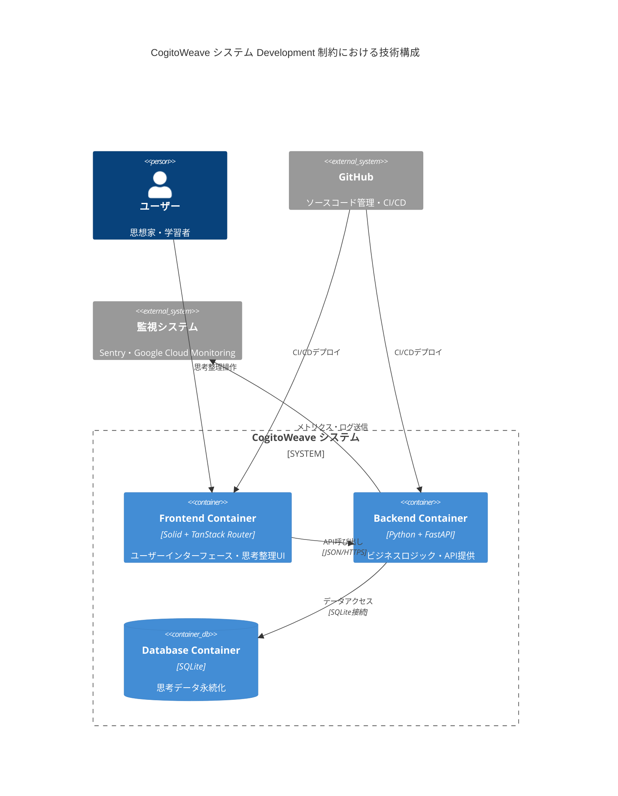

# 02-process-development-adjustment - Development 制約の調整

## 目次

1. [概要](#概要)
2. [処理フロー](#処理フロー)
3. [ステップ 1: Development 制約の全体検出](#ステップ-1-development-制約の全体検出)
4. [ステップ 2: Development 制約の統合整理](#ステップ-2-development-制約の統合整理)
5. [ステップ 3: Development 制約の技術構成可視化](#ステップ-3-development-制約の技術構成可視化)

## 概要

01-physical-constraint-detection で検出された物理制約に基づいて、Development View の技術選択と設計判断を調整する段階的プロセスを実行する。

- **関心事**: 開発環境・技術スタック・開発プロセスによる実装制約
- **時間軸**: 開発技術選択を確定する時点
- **視点**: システム開発者・技術選択者
- **成果物**: Physical 制約に整合した Development 制約リスト

Physical 制約を前提として、開発技術選択の整合性を確保し、実装可能性を評価する。

## 処理フロー

## ステップ 1: Development 制約の全体検出

Physical 制約を前提として、Development View で設計した技術選択の全てを制約リストとして抽出する。

### 1. フロントエンド技術選択

#### 1.1. 基盤技術選択

<!-- PREMISE_BEGIN: foundation-tech-selection -->

選定技術スタック:

- フレームワーク: Solid + TanStack Router
- ビルドツール: Vite
- CSS 手法: Tailwind CSS + CSS Modules ハイブリッド構成
- テスト: Vitest + Testing Library + Playwright
- UI コンポーネント: Tailwind CSS ベースのカスタム実装

パフォーマンス要件による客観的評価、外部ライブラリ制限、個人最適化による柔軟性を段階的に適用した結果、新しい技術体験とシンプルで直接的な操作体系を提供する技術スタックを採用する。

<!-- PREMISE_END: foundation-tech-selection -->

#### 1.2. グラフ可視化選択

<!-- PREMISE_BEGIN: graph-visualization-selection -->

グラフ可視化ライブラリとして D3 を採用する。

<!-- PREMISE_END: graph-visualization-selection -->

### 2. データベース技術選択

<!-- PREMISE_BEGIN: sqlite-selection -->

CogitoWeave システムでは **SQLite** を選択する。

<!-- PREMISE_END: sqlite-selection -->

### 3. バックエンド技術選択

#### 3.1. 言語・フレームワーク選択

<!-- PREMISE_BEGIN: language-framework-selection -->

Python + FastAPI を採用する。既存スキル活用、技術選択基準「大差ないときは慣れた技術を選ぶ」への適合、疎結合設計による密結合リスク回避により、最適な選択である。

<!-- PREMISE_END: language-framework-selection -->

#### 3.2. アプリケーションサーバー選択

<!-- PREMISE_BEGIN: app-server-selection -->

アプリケーションサーバーとして uvicorn を採用する。

<!-- PREMISE_END: app-server-selection -->

#### 3.3. ORM・マイグレーション選択

<!-- PREMISE_BEGIN: orm-selection -->

ORM/ODM ツールとして SQLAlchemy + Alembic を採用する。

<!-- PREMISE_END: orm-selection -->

#### 3.4. API ドキュメント生成選択

<!-- PREMISE_BEGIN: api-doc-selection -->

FastAPI 内蔵の Swagger UI・ReDoc 機能を使用し、外部 API 仕様書生成ツールは導入しない。

<!-- PREMISE_END: api-doc-selection -->

#### 3.5. バリデーション技術選択

<!-- PREMISE_BEGIN: validation-tech-selection -->

バリデーション技術として FastAPI 標準 Pydantic を採用する。

<!-- PREMISE_END: validation-tech-selection -->

#### 3.6. HTTP クライアント選択

<!-- PREMISE_BEGIN: http-client-tech-selection -->

HTTP クライアントライブラリとして httpx を採用する。

<!-- PREMISE_END: http-client-tech-selection -->

#### 3.7. 設定管理技術選択

<!-- PREMISE_BEGIN: config-management-tech-selection -->

バックエンドの設定管理技術として環境変数方式を採用し、os.getenv による実装を行う。

<!-- PREMISE_END: config-management-tech-selection -->

#### 3.8. バックエンドテストツール選択

<!-- PREMISE_BEGIN: backend-testing-tech-selection -->

バックエンドテストツールとして以下を採用する：

- pytest
- FastAPI TestClient
- pytest-asyncio
- pytest-mock
- httpx-mock
- time-machine
- pytest-cov
- pytest-xdist

<!-- PREMISE_END: backend-testing-tech-selection -->

#### 3.9. ログ・モニタリング選択

<!-- PREMISE_BEGIN: logging-tech-selection -->

ログライブラリとして loguru を採用する。

<!-- PREMISE_END: logging-tech-selection -->

### 4. Git サービス選定

<!-- PREMISE_BEGIN: git-service-selection -->

Git サービスとして GitHub を採用する。

<!-- PREMISE_END: git-service-selection -->

## ステップ 2: Development 制約の統合整理

ステップ 1 で抽出した Development 制約を Physical View で決定された物理環境単位別に分類し、ネストしたリスト形式で統合整理する。

### 前提: 物理環境による配置概要

<!-- PREMISE_BEGIN: physical-environment-overview-diagram -->

<!-- PREMISE_END: physical-environment-overview-diagram -->

### Development 制約ごとの物理環境の割り当て

ステップ 1 で抽出した Development 制約ごとに、どの物理環境が該当するかを記載する。

1. フロントエンド技術選択
   - 1.1. 基盤技術選択
     - フレームワーク: Solid + TanStack Router → セルフホスト環境/Frontend Container
     - ビルドツール: Vite → ローカル開発環境/Vite proxy Container
     - CSS 手法: Tailwind CSS + CSS Modules ハイブリッド構成 → セルフホスト環境/Frontend Container
     - テスト: Vitest + Testing Library + Playwright → GitHub Actions 環境/GitHub Actions Container
     - UI コンポーネント: Tailwind CSS ベースのカスタム実装 → セルフホスト環境/Frontend Container
   - 1.2. グラフ可視化選択 → セルフホスト環境/Frontend Container
     - グラフ可視化ライブラリ: D3
2. データベース技術選択 → セルフホスト環境/Backend + DB Container
   - データベース: SQLite
3. バックエンド技術選択
   - 3.1. 言語・フレームワーク選択 → セルフホスト環境/Backend + DB Container
     - 言語・フレームワーク: Python + FastAPI
   - 3.2. アプリケーションサーバー選択 → セルフホスト環境/Backend + DB Container
     - アプリケーションサーバー: uvicorn
   - 3.3. ORM・マイグレーション選択 → セルフホスト環境/Backend + DB Container
     - ORM・マイグレーション: SQLAlchemy + Alembic
   - 3.4. API ドキュメント生成選択 → セルフホスト環境/Backend + DB Container
     - API ドキュメント生成: FastAPI 内蔵の Swagger UI・ReDoc
   - 3.5. バリデーション技術選択 → セルフホスト環境/Backend + DB Container
     - バリデーション: FastAPI 標準 Pydantic
   - 3.6. HTTP クライアント選択 → セルフホスト環境/Backend + DB Container
     - HTTP クライアント: httpx
   - 3.7. 設定管理技術選択 → セルフホスト環境/Backend + DB Container
     - 設定管理: 環境変数方式
   - 3.8. バックエンドテストツール選択 → GitHub Actions 環境/GitHub Actions Container
     - テストフレームワーク: pytest
     - API テスト: FastAPI TestClient
     - 非同期テスト: pytest-asyncio
     - モック機能: pytest-mock
     - HTTP モック: httpx-mock
     - 時間モック: time-machine
     - カバレッジ: pytest-cov
     - 並列実行: pytest-xdist
   - 3.9. ログ・モニタリング選択 → セルフホスト環境/Backend + DB Container
     - ログライブラリ: loguru
4. Git サービス選定 → GitHub Actions 環境/GitHub Actions Container
   - Git サービス: GitHub

### Development 制約の物理環境別整理

上記の物理環境の割り当て(Development 制約ごとの物理環境の割り当てより)に基づいて、ステップ 1 で抽出した Development 制約を物理環境別に整理する。

- セルフホスト環境(Node)
  - Frontend(Container)
    - Solid + TanStack Router によるフレームワーク技術 (1.1 基盤技術選択より)
    - Tailwind CSS + CSS Modules ハイブリッド構成による CSS 手法 (1.1 基盤技術選択より)
    - Tailwind CSS ベースカスタム実装による UI コンポーネント技術 (1.1 基盤技術選択より)
    - D3 によるグラフ可視化技術 (1.2 グラフ可視化選択より)
  - Backend + DB(Container)
    - Python + FastAPI による言語・フレームワーク技術 (3.1 言語・フレームワーク選択より)
    - uvicorn によるアプリケーションサーバー技術 (3.2 アプリケーションサーバー選択より)
    - SQLAlchemy + Alembic による ORM・マイグレーション技術 (3.3 ORM・マイグレーション選択より)
    - FastAPI 内蔵 Swagger UI・ReDoc による API ドキュメント生成技術 (3.4 API ドキュメント生成選択より)
    - FastAPI 標準 Pydantic によるバリデーション技術 (3.5 バリデーション技術選択より)
    - httpx による HTTP クライアント技術 (3.6 HTTP クライアント選択より)
    - 環境変数方式による設定管理技術 (3.7 設定管理技術選択より)
    - loguru によるログ・モニタリング技術 (3.9 ログ・モニタリング選択より)
    - SQLite によるデータベース技術 (2 データベース技術選択より)
- ローカル開発環境(Node)
  - Vite proxy(Container)
    - Vite によるビルドツール技術 (1.1 基盤技術選択より)
- GitHub Actions 環境(Node)
  - GitHub Actions(Container)
    - GitHub による Git サービス技術 (4 Git サービス選定より)
    - フロントエンドテスト技術 (1.1 基盤技術選択より)
      - Vitest + Testing Library + Playwright によるテスト技術
    - バックエンドテスト技術 (3.8 バックエンドテストツール選択より)
      - テストフレームワーク：pytest
      - API テスト：FastAPI TestClient
      - 非同期テスト：pytest-asyncio
      - モック機能：pytest-mock
      - HTTP モック：httpx-mock
      - 時間モック：time-machine
      - カバレッジ：pytest-cov
      - 並列実行：pytest-xdist

### 簡略化リスト

後続での使用のため、以下の変更を行った簡略化リストを以下に示す：

- 括弧内の詳細識別子を削除
- 物理環境(Node)レベルを削除して Container 単位に整理
- 技術選択の中間グループ化を削除してフラット化(ただし機能的に必要な分類は維持)
- 技術表記を「技術名：具体的選択」形式に統一
- Physical 制約で決定済みの監視・運用技術を追加

---

<!-- GLOBAL_CONCLUSION_BEGIN: development-constraint-simplified-list -->

- Frontend(Container)
  - フレームワーク：Solid + TanStack Router
  - CSS 手法：Tailwind CSS + CSS Modules ハイブリッド構成
  - UI コンポーネント：Tailwind CSS ベースカスタム実装
  - グラフ可視化：D3
- Backend(Container)
  - 言語・フレームワーク：Python + FastAPI
  - アプリケーションサーバー：uvicorn
  - ORM・マイグレーション：SQLAlchemy + Alembic
  - API ドキュメント生成：FastAPI 内蔵 Swagger UI・ReDoc
  - バリデーション：FastAPI 標準 Pydantic
  - HTTP クライアント：httpx
  - 設定管理：環境変数方式
  - ログ・モニタリング：loguru
- DB(Container)
  - データベース：SQLite
- Vite proxy(Container)
  - ビルドツール：Vite
- GitHub Actions(Container)
  - Git サービス：GitHub
  - フロントエンドテスト：Vitest + Testing Library + Playwright
  - バックエンドテスト
    - テストフレームワーク：pytest
    - API テスト：FastAPI TestClient
    - 非同期テスト：pytest-asyncio
    - モック機能：pytest-mock
    - HTTP モック：httpx-mock
    - 時間モック：time-machine
    - カバレッジ：pytest-cov
    - 並列実行：pytest-xdist
- Fluent Bit(Container)
  - ログ収集：Fluent Bit
- Cloud Monitoring(Container)
  - 監視・ログ：Google Cloud Monitoring
- Sentry(Container)
  - APM・トレーシング：Sentry

<!-- GLOBAL_CONCLUSION_END: development-constraint-simplified-list -->

## ステップ 3: Development 制約の技術構成可視化

ステップ 2 で物理環境別に整理した Development 制約を、CogitoWeave システム境界内の技術構成として C4 Container 図で可視化する。

### CogitoWeave システム Container 図

ステップ 2 で整理した技術選択に基づいて、システム境界内の 3 つのコンテナの技術構成と相互関係を表現する。

<!-- GLOBAL_CONCLUSION_BEGIN: development-container-diagram -->

<!-- GLOBAL_CONCLUSION_END: development-container-diagram -->
