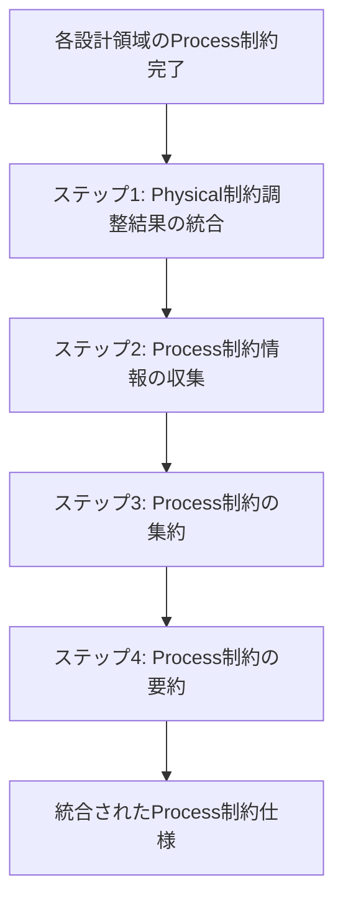

# サービス内 Process 制約統合

## 目次

1. [概要](#概要)
2. [処理フロー](#処理フロー)
3. [ステップ 1: Physical 制約調整結果の統合](#ステップ-1-physical-制約調整結果の統合)
4. [ステップ 2: Process 制約情報の収集](#ステップ-2-process-制約情報の収集)
5. [ステップ 3: Process 制約の集約](#ステップ-3-process-制約の集約)
6. [ステップ 4: Process 制約の要約](#ステップ-4-process-制約の要約)

## 概要

サービス内 Process 制約の見直し完了後、各設計領域で整理された技術スタック情報を統合し、統一的な Process 制約として集約する。

- **関心事**: Process 制約における技術スタックの統合
- **時間軸**: サービス内 Process 制約見直し完了時点
- **視点**: システム全体の Process 制約管理者
- **成果物**: 統合された Process 制約仕様

8 つの設計領域(サービス内テスト戦略、監視設計、フロントエンドパフォーマンス設計、バックエンドパフォーマンス設計、セキュリティ設計、トランザクション設計、バッチ処理設計、リクエスト処理設計)で個別に整理された技術スタック情報を段階的に統合し、Process 制約として一元化する。

## 処理フロー

## ステップ 1: Physical 制約調整結果の統合

Physical 制約に適合させるため調整された Process 制約の結果を統合する。

### ステップ 1-1: Physical 制約調整結果の引用

Physical 制約に適合させるため調整された各 Process 制約の結果を以下に引用する。

#### サービス内テスト戦略

<!-- PREMISE_BEGIN: intra-process-test-constraint-adjustment -->

- **単一バックエンド内での機能別テスト**: コア知識管理機能はデータベース操作とトランザクション境界を検証し、LLM 統合機能は外部 API の契約テストと異常ケース対応を実装し、コンテンツ取得機能は構造変更への適応性を検証する。

<!-- PREMISE_END: intra-process-test-constraint-adjustment -->

#### 監視設計

<!-- PREMISE_BEGIN: intra-process-monitoring-constraint-adjustment -->

- **単一バックエンド内での機能別監視**: コア知識管理機能はデータ整合性と応答時間を重視し、LLM 統合機能は外部 API 依存性を監視し、コンテンツ取得機能は取得成功率と構造変更を追跡する。

<!-- PREMISE_END: intra-process-monitoring-constraint-adjustment -->

#### バッチ処理設計

<!-- PREMISE_BEGIN: intra-process-batch-processing-constraint-adjustment -->

- **loguru によるログ出力**: バックアップ処理の成功・失敗をログとして出力し、迅速な障害対応を支援する。

<!-- PREMISE_END: intra-process-batch-processing-constraint-adjustment -->

### ステップ 1-2: 調整結果の集約

上記の 3 つの調整結果を集約する。

- サービス内テスト戦略:
  - 単一バックエンド内での機能別テスト: コア知識管理機能はデータベース操作とトランザクション境界を検証し、LLM 統合機能は外部 API の契約テストと異常ケース対応を実装し、コンテンツ取得機能は構造変更への適応性を検証する
- 監視設計:
  - 単一バックエンド内での機能別監視: コア知識管理機能はデータ整合性と応答時間を重視し、LLM 統合機能は外部 API 依存性を監視し、コンテンツ取得機能は取得成功率と構造変更を追跡する
- バッチ処理設計:
  - loguru によるログ出力: バックアップ処理の成功・失敗をログとして出力し、迅速な障害対応を支援する

### ステップ 1-3: 統合結果の要約

Physical View と Development View の制約に合わせて調整されたサービス内 Process 制約の最終結果を以下に示す。

<!-- GLOBAL_CONCLUSION_BEGIN: intra-process-constraint-changes -->

- サービス内テスト戦略:
  - 単一バックエンド内での機能別テスト: コア知識管理機能はデータベース操作とトランザクション境界を重点的に検証し、LLM 統合機能は外部 API の契約テストと異常ケース対応を強化し、コンテンツ取得機能は構造変更への適応性を継続的に検証する
- 監視設計:
  - 単一バックエンド内での機能別監視: コア知識管理機能はデータ整合性と応答時間を重視し、LLM 統合機能は外部 API 依存性を監視し、コンテンツ取得機能は取得成功率と構造変更を追跡する
- バッチ処理設計:
  - loguru によるログ出力: バックアップ処理の成功・失敗をログとして出力し、迅速な障害対応を支援する

<!-- GLOBAL_CONCLUSION_END: intra-process-constraint-changes -->

## ステップ 2: Process 制約情報の収集

各設計領域で整理された技術スタック情報を PREMISE マーカーを使用して収集する。

### サービス内テスト戦略の技術スタック

<!-- PREMISE_BEGIN: intra-service-test-technology-mapping -->

技術単位での Process 制約対応を以下に示す。

- pytest
  - ユニットテスト・統合テスト実行フレームワーク
  - fixture によるテスト環境分離
  - API テスト実行
- FastAPI TestClient
  - FastAPI アプリケーションのテスト環境
  - 独立したテスト環境
- SQLAlchemy
  - ORM によるデータベース操作
  - ORM とセッション管理
- SQLite
  - インメモリデータベース
- pytest-asyncio
  - 非同期処理のテスト実行
- pytest-mock
  - モック機能提供
- httpx-mock
  - HTTP 通信のモック化とタイムアウト・エラーレスポンステスト
  - 外部 API モック化
- time-machine
  - 時間関連処理のモック化（必要に応じて使用）
- Vitest
  - 軽量な JavaScript/TypeScript テスト実行フレームワーク
  - テスト実行フレームワーク
  - 軽量テスト実行環境
- Testing Library
  - Solid コンポーネントのレンダリング・イベント・状態テスト
  - 複数コンポーネント統合テスト
- FastAPI
  - 内蔵 Swagger UI・ReDoc による API 仕様生成
- Pydantic
  - バリデーションによる仕様準拠検証

<!-- PREMISE_END: intra-service-test-technology-mapping -->

### サービス内テスト戦略の不足技術

<!-- PREMISE_BEGIN: intra-service-test-missing-technologies -->

現在の技術スタックでは以下の技術要素が不足している。

- トランザクション境界検証専用ライブラリ: pytest-sqlalchemy 等
- DOM 環境シミュレーション: jsdom または happy-dom
- TanStack Router のテスト環境構築手法: 具体的な構築方法が不明
- API モック化の具体的手法: フロントエンド側での具体的なモック手法が不明
- TypeScript 型生成ツール: openapi-typescript 等
- API 仕様変更の自動検知手法: 具体的な検知方法が不明

<!-- PREMISE_END: intra-service-test-missing-technologies -->

### 監視設計の技術スタック

<!-- PREMISE_BEGIN: intra-process-monitoring-technology-mapping -->

技術単位での Process 制約対応を以下に示す。

- loguru
  - 機能別ログ出力とログレベル設定
  - 階層的ログレベル設定（ERROR、WARN、INFO、DEBUG）
  - 緊急度分類（ERROR=即座対応、WARN=計画的改善）
- httpx
  - 外部 API 通信ログ
- SQLAlchemy
  - データベース操作ログ
- FastAPI
  - 応答時間測定用ミドルウェア
- Fluent Bit
  - 構造化ログ分析ツール
  - ログ集約・検索システム
- Google Cloud Monitoring
  - 外部監視システム
- Sentry
  - APM・トレーシング

<!-- PREMISE_END: intra-process-monitoring-technology-mapping -->

### 監視設計の不足技術

<!-- PREMISE_BEGIN: intra-process-monitoring-missing-technologies -->

現在の技術スタックでは以下の技術要素が不足している。

- 外部アラートシステム: PagerDuty 等の専用アラートサービス

<!-- PREMISE_END: intra-process-monitoring-missing-technologies -->

### フロントエンドパフォーマンス設計の技術スタック

<!-- PREMISE_BEGIN: intra-process-frontend-performance-technology-mapping -->

技術単位での Process 制約対応を以下に示す。

- Vite
  - HTML 配信とビルド最適化
  - コード分割とバンドル最適化
- Solid
  - JavaScript 実行管理と DOM 操作最適化
  - Signal による最小限状態管理
  - 軽量再レンダリング機構
  - エラー境界コンポーネント
  - 基本的な軽量実装
  - 軽量メモリ管理
- TanStack Router
  - ページ初期化管理
  - SPA ルーティングと遷移管理
  - ルーティングエラーハンドリング
- Tailwind CSS
  - シンプルなエラー画面スタイリング
- D3
  - 必要時のグラフ描画最適化
- JavaScript
  - location.reload() による強制リロード

<!-- PREMISE_END: intra-process-frontend-performance-technology-mapping -->

### フロントエンドパフォーマンス設計の不足技術

<!-- PREMISE_BEGIN: intra-process-frontend-performance-missing-technologies -->

現在の技術スタックでは以下の技術要素が不足している。

- メモリ使用量監視ツール: Chrome DevTools Memory タブ等の開発時専用ツール

<!-- PREMISE_END: intra-process-frontend-performance-missing-technologies -->

### バックエンドパフォーマンス設計の技術スタック

<!-- PREMISE_BEGIN: intra-process-backend-performance-technology-mapping -->

技術単位での Process 制約対応を以下に示す。

- SQLAlchemy
  - eager loading による N+1 問題対策
  - クエリ最適化機能
  - 効率的データアクセス
  - 標準的な ORM 機能
- SQLite
  - クエリプラン最適化とインデックス活用
  - インデックス作成と最適化
  - 軽量データベースによる数万件対応
  - ストレージ性能向上対応
  - シンプルなファイルベース DB
- FastAPI
  - 応答時間測定ミドルウェア
  - 直感的な API 設計
- uvicorn
  - 単一プロセス・単一サーバー実行
  - worker プロセス数調整
- Alembic
  - インデックスマイグレーション管理
- loguru
  - パフォーマンスログ出力
- Python
  - 理解しやすいプログラミング言語

<!-- PREMISE_END: intra-process-backend-performance-technology-mapping -->

### バックエンドパフォーマンス設計の不足技術

<!-- PREMISE_BEGIN: intra-process-backend-performance-missing-technologies -->

現在の技術スタックでは以下の技術要素が不足している。

- リソース監視ツール: psutil、htop 等の CPU・メモリ使用量監視ツール

<!-- PREMISE_END: intra-process-backend-performance-missing-technologies -->

### セキュリティ設計の技術スタック

<!-- PREMISE_BEGIN: intra-process-security-technology-mapping -->

技術単位での Process 制約対応を以下に示す。

- FastAPI
  - 認証機構なしのシンプル API 設計
  - セキュリティヘッダー設定ミドルウェア
  - HSTS ヘッダー設定除外
  - HTML エスケープと XSS 対策
- Pydantic
  - 入力バリデーション（型・範囲・形式チェック）
- SQLAlchemy
  - パラメータ化クエリによる SQL インジェクション対策
- 環境変数方式
  - API キー管理と利用規約遵守
- httpx
  - 利用規約準拠の外部 API 通信
- SQLite
  - ローカルデータ保存による個人情報保護
- loguru
  - 通常のアプリケーションログに専念
- 開発環境
  - HTTP/HTTPS 両対応

<!-- PREMISE_END: intra-process-security-technology-mapping -->

### セキュリティ設計の不足技術

<!-- PREMISE_BEGIN: intra-process-security-missing-technologies -->

現在の技術スタックでは以下の技術要素が不足している。

- リバースプロキシレベルでのセキュリティヘッダー設定: Caddy、nginx 等

<!-- PREMISE_END: intra-process-security-missing-technologies -->

### トランザクション設計の技術スタック

<!-- PREMISE_BEGIN: intra-process-transaction-technology-mapping -->

技術単位での Process 制約対応を以下に示す。

- SQLAlchemy
  - セッション管理とトランザクション制御
  - データベース操作のみのトランザクション境界
  - 分離レベル設定
  - テーブルアクセス順序制御と例外処理
  - ORM モデルと制約の連携
- SQLite
  - ACID 特性によるトランザクション保証
  - READ_COMMITTED 分離レベルサポート
  - 単一ライターモデルによるデッドロック回避
  - データベース制約（PRIMARY KEY、FOREIGN KEY、CHECK）
- FastAPI
  - 依存性注入によるセッションライフサイクル管理
  - API 呼び出しフローの制御
  - 例外ハンドラーによるエラーレスポンス
- httpx
  - トランザクション外での外部 API 通信
- Alembic
  - 制約定義のマイグレーション管理

<!-- PREMISE_END: intra-process-transaction-technology-mapping -->

### トランザクション設計の不足技術

<!-- PREMISE_BEGIN: intra-process-transaction-missing-technologies -->

現在の技術スタックでは以下の技術要素が不足している。

- 高度なロック制御機構: MySQL/PostgreSQL レベルの行レベルロック等（SQLite の制限）

<!-- PREMISE_END: intra-process-transaction-missing-technologies -->

### バッチ処理設計の技術スタック

<!-- PREMISE_BEGIN: intra-process-batch-processing-technology-mapping -->

技術単位での Process 制約対応を以下に示す。

- Python
  - バックアップスクリプト実行
  - 単一プロセススクリプト実行
  - shutil.copy2 による原子的ファイルコピー
- SQLite
  - 単一ファイルデータベースのバックアップ
  - WAL モードによる並行アクセス対応
- SQLAlchemy
  - 読み取り専用トランザクション
- loguru
  - バックアップ処理ログ出力
  - ログレベル管理（INFO=成功、ERROR=失敗）
  - ファイル出力とローテーション

<!-- PREMISE_END: intra-process-batch-processing-technology-mapping -->

### バッチ処理設計の不足技術

<!-- PREMISE_BEGIN: intra-process-batch-processing-missing-technologies -->

現在の技術スタックでは以下の技術要素が不足している。

- スケジューラー: cron、systemd timer、Task Scheduler 等の定期実行機構

<!-- PREMISE_END: intra-process-batch-processing-missing-technologies -->

### リクエスト処理設計の技術スタック

<!-- PREMISE_BEGIN: intra-process-request-processing-technology-mapping -->

技術単位での Process 制約対応を以下に示す。

- FastAPI
  - 同期エンドポイント定義
  - 例外ハンドラーによる適切なエラーメッセージ生成
  - エンドポイント内フロー制御
  - 自動バリデーション機能
  - サービス層分離によるビジネスロジック検証
  - ミドルウェアによる統一タイムアウト設定
  - 高速 API 処理
- SQLAlchemy
  - トランザクション管理
  - データベース操作のみのトランザクション境界
  - eager loading による N+1 問題対策
  - クエリ最適化機能
- Python
  - 逐次実行による同期処理
- loguru
  - 階層的ログレベル管理（ERROR、WARN、INFO、DEBUG）
- httpx
  - トランザクション外での外部 API 呼び出し
  - 外部 API タイムアウト・リトライ設定
- Pydantic
  - 型チェック・範囲チェック・形式チェック
- uvicorn
  - タイムアウト設定（10 秒）
- SQLite
  - インデックス活用

<!-- PREMISE_END: intra-process-request-processing-technology-mapping -->

### リクエスト処理設計の不足技術

<!-- PREMISE_BEGIN: intra-process-request-processing-missing-technologies -->

現在の技術スタックでは以下の技術要素が不足している。

- フロントエンド側リトライ機構: 具体的なリトライライブラリや実装パターン

<!-- PREMISE_END: intra-process-request-processing-missing-technologies -->

## ステップ 3: Process 制約の集約

前ステップで収集した技術スタック情報を技術単位で集約し、統一的な Process 制約として整理する。意図的に除外された技術は不足技術から除外する。

### 技術スタック集約結果

- pytest
  - ユニットテスト・統合テスト実行フレームワーク
  - fixture によるテスト環境分離
  - API テスト実行
- FastAPI
  - FastAPI アプリケーションのテスト環境
  - 内蔵 Swagger UI・ReDoc による API 仕様生成
  - 応答時間測定用ミドルウェア
  - 認証機構なしのシンプル API 設計
  - セキュリティヘッダー設定ミドルウェア
  - HSTS ヘッダー設定除外
  - HTML エスケープと XSS 対策
  - 依存性注入によるセッションライフサイクル管理
  - API 呼び出しフローの制御
  - 例外ハンドラーによるエラーレスポンス
  - 同期エンドポイント定義
  - 例外ハンドラーによる適切なエラーメッセージ生成
  - エンドポイント内フロー制御
  - 自動バリデーション機能
  - サービス層分離によるビジネスロジック検証
  - ミドルウェアによる統一タイムアウト設定
  - 高速 API 処理
  - 直感的な API 設計
- SQLAlchemy
  - ORM によるデータベース操作
  - ORM とセッション管理
  - データベース操作ログ
  - eager loading による N+1 問題対策
  - クエリ最適化機能
  - 効率的データアクセス
  - 標準的な ORM 機能
  - パラメータ化クエリによる SQL インジェクション対策
  - セッション管理とトランザクション制御
  - データベース操作のみのトランザクション境界
  - 分離レベル設定
  - テーブルアクセス順序制御と例外処理
  - ORM モデルと制約の連携
  - 読み取り専用トランザクション
  - トランザクション管理
- SQLite
  - インメモリデータベース
  - クエリプラン最適化とインデックス活用
  - インデックス作成と最適化
  - 軽量データベースによる数万件対応
  - ストレージ性能向上対応
  - シンプルなファイルベース DB
  - ローカルデータ保存による個人情報保護
  - ACID 特性によるトランザクション保証
  - READ_COMMITTED 分離レベルサポート
  - 単一ライターモデルによるデッドロック回避
  - データベース制約（PRIMARY KEY、FOREIGN KEY、CHECK）
  - 単一ファイルデータベースのバックアップ
  - WAL モードによる並行アクセス対応
  - インデックス活用
- pytest-asyncio
  - 非同期処理のテスト実行
- pytest-mock
  - モック機能提供
- httpx-mock
  - HTTP 通信のモック化とタイムアウト・エラーレスポンステスト
  - 外部 API モック化
- time-machine
  - 時間関連処理のモック化（必要に応じて使用）
- Vitest
  - 軽量な JavaScript/TypeScript テスト実行フレームワーク
  - テスト実行フレームワーク
  - 軽量テスト実行環境
- Testing Library
  - Solid コンポーネントのレンダリング・イベント・状態テスト
  - 複数コンポーネント統合テスト
- Pydantic
  - バリデーションによる仕様準拠検証
  - 入力バリデーション（型・範囲・形式チェック）
  - 型チェック・範囲チェック・形式チェック
- loguru
  - 機能別ログ出力とログレベル設定
  - 階層的ログレベル設定（ERROR、WARN、INFO、DEBUG）
  - 緊急度分類（ERROR=即座対応、WARN=計画的改善）
  - パフォーマンスログ出力
  - 通常のアプリケーションログに専念
  - バックアップ処理ログ出力
  - ログレベル管理（INFO=成功、ERROR=失敗）
  - ファイル出力とローテーション
- httpx
  - 外部 API 通信ログ
  - 利用規約準拠の外部 API 通信
  - トランザクション外での外部 API 通信
  - トランザクション外での外部 API 呼び出し
  - 外部 API タイムアウト・リトライ設定
- Fluent Bit
  - 構造化ログ分析ツール
  - ログ集約・検索システム
- Google Cloud Monitoring
  - 外部監視システム
- Sentry
  - APM・トレーシング
- Vite
  - HTML 配信とビルド最適化
  - コード分割とバンドル最適化
- Solid
  - JavaScript 実行管理と DOM 操作最適化
  - Signal による最小限状態管理
  - 軽量再レンダリング機構
  - エラー境界コンポーネント
  - 基本的な軽量実装
  - 軽量メモリ管理
- TanStack Router
  - ページ初期化管理
  - SPA ルーティングと遷移管理
  - ルーティングエラーハンドリング
- Tailwind CSS
  - シンプルなエラー画面スタイリング
- D3
  - 必要時のグラフ描画最適化
- JavaScript
  - location.reload() による強制リロード
- uvicorn
  - 単一プロセス・単一サーバー実行
  - worker プロセス数調整
  - タイムアウト設定（10 秒）
- Alembic
  - インデックスマイグレーション管理
  - 制約定義のマイグレーション管理
- Python
  - 理解しやすいプログラミング言語
  - バックアップスクリプト実行
  - 単一プロセススクリプト実行
  - shutil.copy2 による原子的ファイルコピー
  - 逐次実行による同期処理
- 環境変数方式
  - API キー管理と利用規約遵守
- 開発環境
  - HTTP/HTTPS 両対応

### 不足技術スタック集約結果

- トランザクション境界検証専用ライブラリ: pytest-sqlalchemy 等
- DOM 環境シミュレーション: jsdom または happy-dom
- TanStack Router のテスト環境構築手法: 具体的な構築方法が不明
- API モック化の具体的手法: フロントエンド側での具体的なモック手法が不明
- TypeScript 型生成ツール: openapi-typescript 等
- API 仕様変更の自動検知手法: 具体的な検知方法が不明
- 外部アラートシステム: PagerDuty 等の専用アラートサービス
- メモリ使用量監視ツール: Chrome DevTools Memory タブ等の開発時専用ツール
- リソース監視ツール: psutil、htop 等の CPU・メモリ使用量監視ツール
- リバースプロキシレベルでのセキュリティヘッダー設定: Caddy、nginx 等
- 高度なロック制御機構: MySQL/PostgreSQL レベルの行レベルロック等（SQLite の制限）
- スケジューラー: cron、systemd timer、Task Scheduler 等の定期実行機構
- フロントエンド側リトライ機構: 具体的なリトライライブラリや実装パターン

## ステップ 4: Process 制約の要約

前ステップで集約した技術スタック情報の冗長性を排除し、重複する機能説明を除去して各項目を独立した読みやすい形で表現する。意図的に除外された技術は不足技術から除外する。

### 技術スタック要約結果

<!-- GLOBAL_CONCLUSION_BEGIN: intra-process-technology-stack-summary -->

- pytest
  - ユニットテスト・統合テスト・API テスト実行フレームワーク
  - fixture によるテスト環境分離
- FastAPI TestClient
  - FastAPI アプリケーションの独立したテスト環境
- SQLAlchemy
  - ORM によるデータベース操作とセッション管理
  - eager loading による N+1 問題対策
  - トランザクション制御と分離レベル設定
  - パラメータ化クエリによる SQL インジェクション対策
  - テーブルアクセス順序制御と例外処理
  - ORM モデルと制約の連携
- SQLite
  - インメモリデータベース対応
  - インデックス作成と最適化
  - 軽量データベースによる数万件対応
  - ストレージ性能向上対応
  - ローカルデータ保存による個人情報保護
  - ACID 特性によるトランザクション保証
  - READ_COMMITTED 分離レベルサポート
  - 単一ライターモデルによるデッドロック回避
  - データベース制約による整合性保証
  - 単一ファイル構成によるバックアップ
  - WAL モードによる並行アクセス対応
- pytest-asyncio
  - 非同期処理のテスト実行
- pytest-mock
  - モック機能提供
- httpx-mock
  - HTTP 通信のモック化
  - 外部 API モック化
  - タイムアウト・エラーレスポンステスト
- time-machine
  - 時間関連処理のモック化
- Vitest
  - 軽量な JavaScript/TypeScript テスト実行フレームワーク
- Testing Library
  - Solid コンポーネントのレンダリングテスト
  - イベント・状態テスト
  - 複数コンポーネント統合テスト
- Pydantic
  - 入力バリデーション
  - 型・範囲・形式チェック
  - 仕様準拠検証
- loguru
  - 階層的ログレベル管理
  - 機能別ログ出力
  - 緊急度分類
  - パフォーマンスログ出力
  - バックアップ処理ログ出力
  - ファイル出力とローテーション
- httpx
  - 外部 API 通信ログ
  - 利用規約準拠の外部 API 通信
  - 外部 API タイムアウト・リトライ設定
- Fluent Bit
  - 構造化ログ分析ツール
  - ログ集約・検索システム
- Google Cloud Monitoring
  - 外部監視システム
- Sentry
  - APM・トレーシング
- Vite
  - HTML 配信とビルド最適化
  - コード分割とバンドル最適化
- Solid
  - JavaScript 実行管理と DOM 操作最適化
  - Signal による最小限状態管理
  - 軽量再レンダリング機構
  - エラー境界コンポーネント
  - 軽量メモリ管理
- TanStack Router
  - ページ初期化管理
  - SPA ルーティングと遷移管理
  - ルーティングエラーハンドリング
- Tailwind CSS
  - シンプルなエラー画面スタイリング
- D3
  - 必要時のグラフ描画最適化
- JavaScript
  - location.reload による強制リロード
- uvicorn
  - 単一プロセス・単一サーバー実行
  - worker プロセス数調整
  - タイムアウト設定
- Alembic
  - インデックスマイグレーション管理
  - 制約定義のマイグレーション管理
- Python
  - 理解しやすいプログラミング言語
  - バックアップスクリプト実行
  - 単一プロセススクリプト実行
  - 原子的ファイルコピー
  - 逐次実行による同期処理
- 環境変数方式
  - API キー管理と利用規約遵守
- 開発環境
  - HTTP/HTTPS 両対応

<!-- GLOBAL_CONCLUSION_END: intra-process-technology-stack-summary -->

### 不足技術スタック要約結果

<!-- GLOBAL_CONCLUSION_BEGIN: intra-process-missing-technology-stack-summary -->

- pytest-sqlalchemy によるトランザクション境界検証
- jsdom または happy-dom による DOM 環境シミュレーション
- TanStack Router のテスト環境構築手法
- フロントエンド側での API モック化手法
- openapi-typescript による TypeScript 型生成
- API 仕様変更の自動検知手法
- PagerDuty による外部アラートシステム
- Chrome DevTools Memory による開発時メモリ使用量監視
- psutil・htop による CPU・メモリ使用量監視
- Caddy・nginx によるリバースプロキシレベルセキュリティヘッダー設定
- MySQL/PostgreSQL レベルの高度なロック制御機構
- cron・systemd timer・Task Scheduler による定期実行スケジューラー
- フロントエンド側リトライ機構の実装パターン

<!-- GLOBAL_CONCLUSION_END: intra-process-missing-technology-stack-summary -->
