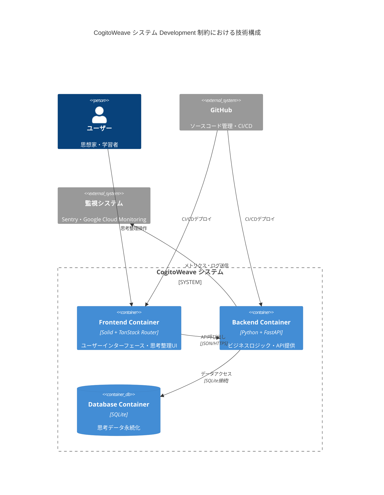
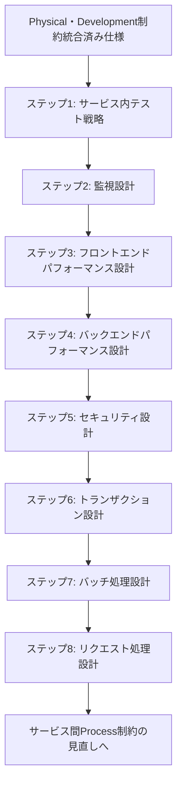

# サービス内 Process 制約の見直し

## 目次

1. [概要](#概要)
2. [処理フロー](#処理フロー)
3. [ステップ 1: サービス内テスト戦略](#ステップ-1-サービス内テスト戦略)
4. [ステップ 2: 監視設計](#ステップ-2-監視設計)
5. [ステップ 3: フロントエンドパフォーマンス設計](#ステップ-3-フロントエンドパフォーマンス設計)
6. [ステップ 4: バックエンドパフォーマンス設計](#ステップ-4-バックエンドパフォーマンス設計)
7. [ステップ 5: セキュリティ設計](#ステップ-5-セキュリティ設計)
8. [ステップ 6: トランザクション設計](#ステップ-6-トランザクション設計)
9. [ステップ 7: バッチ処理設計](#ステップ-7-バッチ処理設計)
10. [ステップ 8: リクエスト処理設計](#ステップ-8-リクエスト処理設計)
11. [ステップ 9: サービス内 Process 制約統合](#ステップ-9-サービス内-process-制約統合)

## 概要

Physical View と Development View の制約が決まったので、Process View の制約をこれらの制約に合わせて調整する。

下記の図のとおり、Backend Container は 1 つしかない。そのため Process View の制約を調整するときは、単一のバックエンド内での機能分離と品質管理に焦点を当てる。

### Development 制約の技術構成

各コンテナの技術スタックは以下のとおりである。この技術構成に Process 制約を適合させる必要がある。

<!-- PREMISE_BEGIN: development-constraint-simplified-list -->

- Frontend(Container)
  - フレームワーク：Solid + TanStack Router
  - CSS 手法：Tailwind CSS + CSS Modules ハイブリッド構成
  - UI コンポーネント：Tailwind CSS ベースカスタム実装
  - グラフ可視化：D3
- Backend(Container)
  - 言語・フレームワーク：Python + FastAPI
  - アプリケーションサーバー：uvicorn
  - ORM・マイグレーション：SQLAlchemy + Alembic
  - API ドキュメント生成：FastAPI 内蔵 Swagger UI・ReDoc
  - バリデーション：FastAPI 標準 Pydantic
  - HTTP クライアント：httpx
  - 設定管理：環境変数方式
  - ログ・モニタリング：loguru
- DB(Container)
  - データベース：SQLite
- Vite proxy(Container)
  - ビルドツール：Vite
- GitHub Actions(Container)
  - Git サービス：GitHub
  - フロントエンドテスト：Vitest + Testing Library + Playwright
  - バックエンドテスト
    - テストフレームワーク：pytest
    - API テスト：FastAPI TestClient
    - 非同期テスト：pytest-asyncio
    - モック機能：pytest-mock
    - HTTP モック：httpx-mock
    - 時間モック：time-machine
    - カバレッジ：pytest-cov
    - 並列実行：pytest-xdist
- Fluent Bit(Container)
  - ログ収集：Fluent Bit
- Cloud Monitoring(Container)
  - 監視・ログ：Google Cloud Monitoring
- Sentry(Container)
  - APM・トレーシング：Sentry

<!-- PREMISE_END: development-constraint-simplified-list -->

### システム構成図

上記の技術スタックによるコンテナ構成とその関係性を以下の図で示す。この構成において Backend Container が単一である点が、Process 制約調整の重要な前提条件となる。

<!-- PREMISE_BEGIN: development-container-diagram -->

<!-- PREMISE_END: development-container-diagram -->

## 処理フロー

## ステップ 1: サービス内テスト戦略

詳細は [01-intra-service-test-strategy.md](./01-intra-service-test-strategy.md) を参照。

## ステップ 2: 監視設計

詳細は [02-monitoring-design](./02-monitoring-design.md) を参照。

## ステップ 3: フロントエンドパフォーマンス設計

詳細は [03-frontend-performance-design.md](./03-frontend-performance-design.md) を参照。

## ステップ 4: バックエンドパフォーマンス設計

詳細は [04-backend-performance-design.md](./04-backend-performance-design.md) を参照。

## ステップ 5: セキュリティ設計

詳細は [05-security-design.md](./05-security-design.md) を参照。

## ステップ 6: トランザクション設計

詳細は [06-transaction-design.md](./06-transaction-design.md) を参照。

## ステップ 7: バッチ処理設計

詳細は [07-batch-processing-design.md](./07-batch-processing-design.md) を参照。

## ステップ 8: リクエスト処理設計

詳細は [08-request-processing-design.md](./08-request-processing-design.md) を参照。

## ステップ 9: サービス内 Process 制約統合

詳細は [09-process-constraint-integration.md](./09-process-constraint-integration.md) を参照。
