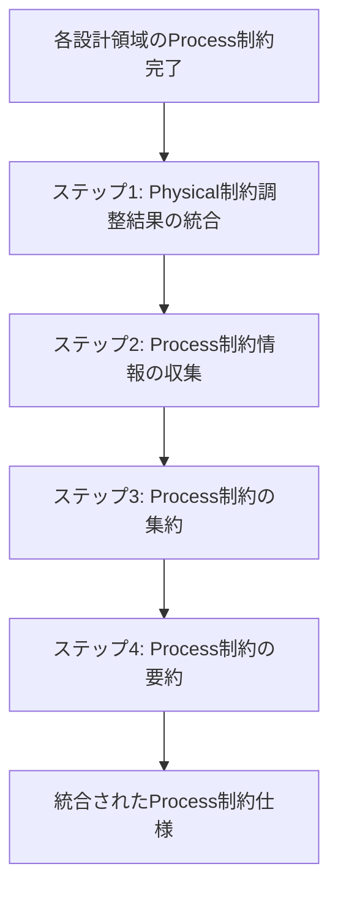

# サービス間 Process 制約統合

## 目次

1. [概要](#概要)
2. [処理フロー](#処理フロー)
3. [ステップ 1: Physical 制約調整結果の統合](#ステップ-1-physical-制約調整結果の統合)
4. [ステップ 2: Process 制約情報の収集](#ステップ-2-process-制約情報の収集)
5. [ステップ 3: Process 制約の集約](#ステップ-3-process-制約の集約)
6. [ステップ 4: Process 制約の要約](#ステップ-4-process-制約の要約)

## 概要

サービス間 Process 制約の見直し完了後、各設計領域で整理された技術スタック情報を統合し、統一的な Process 制約として集約する。

- **関心事**: Process 制約における技術スタックの統合
- **時間軸**: サービス間 Process 制約見直し完了時点
- **視点**: システム全体の Process 制約管理者
- **成果物**: 統合された Process 制約仕様

8 つの設計領域(システムテスト戦略、トレーサビリティ設計、スケーリング設計、耐障害性設計、分散通信設計、データ整合性設計、サービス間協調、サービス境界設計)で個別に整理された技術スタック情報を段階的に統合し、Process 制約として一元化する。

## 処理フロー

## ステップ 1: Physical 制約調整結果の統合

Physical 制約に適合させるため調整された Process 制約の結果を統合する。

### ステップ 1-1: Physical 制約調整結果の引用

Physical 制約に適合させるため調整された各 Process 制約の結果を各設計領域のドキュメントから引用する。

#### トレーサビリティ設計

<!-- PREMISE_BEGIN: inter-process-traceability-constraint-adjustment -->

- **フロントエンド起点の一括トレーシング**: CSR アーキテクチャを活用したクライアントサイド監視と単一バックエンドとの統合により、システム全体の動作を把握する

<!-- PREMISE_END: inter-process-traceability-constraint-adjustment -->

#### 分散通信設計

<!-- PREMISE_BEGIN: inter-process-distributed-communication-constraint-adjustment -->

- **HTTP API 直接通信**: フロントエンドから単一バックエンドへの直接 HTTP/HTTPS 通信を行う

<!-- PREMISE_END: inter-process-distributed-communication-constraint-adjustment -->

#### サービス間協調

<!-- PREMISE_BEGIN: inter-process-service-coordination-constraint-adjustment -->

- **フロントエンド直接呼び出し**: フロントエンドから単一バックエンドを直接呼び出し、内部でコア知識管理・LLM 統合・コンテンツ取得のモジュール間協調を実現する
- **一方向依存**: フロントエンドから単一バックエンドへの依存のみ存在する
- **タイムアウトつき同期通信**: フロントエンドから単一バックエンドへの通信はタイムアウトつき同期通信で行う

<!-- PREMISE_END: inter-process-service-coordination-constraint-adjustment -->

#### サービス境界設計

<!-- PREMISE_BEGIN: service-boundaries-adjustment -->

- **単一バックエンド内でのモジュール分離**: コア知識管理機能、LLM 統合機能、コンテンツ取得機能を単一バックエンド内でモジュール分離で実現する。

<!-- PREMISE_END: service-boundaries-adjustment -->

### ステップ 1-2: Physical 制約調整結果の集約

前ステップで引用した各設計領域の Physical 制約調整結果を集約する。

- トレーサビリティ設計:
  - フロントエンド起点の一括トレーシング: CSR アーキテクチャを活用したクライアントサイド監視と単一バックエンドとの統合により、システム全体の動作を把握する
- 分散通信設計:
  - HTTP API 直接通信: フロントエンドから単一バックエンドへの直接 HTTP/HTTPS 通信を行う
- サービス間協調:
  - フロントエンド直接呼び出し: フロントエンドから単一バックエンドを直接呼び出し、内部でコア知識管理・LLM 統合・コンテンツ取得のモジュール間協調を実現する
  - 一方向依存: フロントエンドから単一バックエンドへの依存のみ存在する
  - タイムアウトつき同期通信: フロントエンドから単一バックエンドへの通信はタイムアウトつき同期通信で行う
- サービス境界設計:
  - 単一バックエンド内でのモジュール分離: コア知識管理機能、LLM 統合機能、コンテンツ取得機能を単一バックエンド内でモジュール分離で実現する

### ステップ 1-3: 統合結果の生成

前ステップで集約した Physical 制約調整結果を統合し、サービス間 Process 制約の変更点として出力する。

<!-- GLOBAL_CONCLUSION_BEGIN: inter-process-constraint-changes -->

- サービス間協調:
  - フロントエンド直接呼び出し: フロントエンドから単一バックエンドを直接呼び出し、内部でコア知識管理・LLM 統合・コンテンツ取得のモジュール間協調を実現する
  - 一方向依存: フロントエンドから単一バックエンドへの依存のみ存在する
  - タイムアウトつき同期通信: フロントエンドから単一バックエンドへの通信はタイムアウトつき同期通信で行う
- 分散通信設計:
  - HTTP API 直接通信: フロントエンドから単一バックエンドへの直接 HTTP/HTTPS 通信を行う
- トレーサビリティ設計:
  - フロントエンド起点の一括トレーシング: CSR アーキテクチャを活用したクライアントサイド監視と単一バックエンドとの統合により、システム全体の動作を把握する
- サービス境界設計:
  - 単一バックエンド内でのモジュール分離: コア知識管理機能、LLM 統合機能、コンテンツ取得機能を単一バックエンド内でモジュール分離で実現する

<!-- GLOBAL_CONCLUSION_END: inter-process-constraint-changes -->

## ステップ 2: Process 制約情報の収集

各設計領域で整理された技術スタック情報を PREMISE マーカーを使用して収集する。

### システムテスト戦略の技術スタック

<!-- PREMISE_BEGIN: inter-process-system-test-technology-mapping -->

技術単位での Process 制約対応を以下に示す。

- GitHub Actions
  - CI 環境での自動テスト実行
- GitHub
  - PR マージ停止機能
- Git サービス
  - 修正・revert 機能
- Playwright
  - E2E テストによる疎通確認
- FastAPI TestClient
  - API テスト実行
- pytest-mock
  - モック機能
- httpx-mock
  - HTTP 通信モック
- time-machine
  - 時間モック
- FastAPI + uvicorn
  - バックエンド実起動
- HTTP クライアント通信
  - 実際の HTTP 通信テスト
- Vitest + Testing Library + Playwright
  - フロントエンド正常系テスト
- pytest + FastAPI TestClient
  - バックエンド正常系・セキュリティテスト

<!-- PREMISE_END: inter-process-system-test-technology-mapping -->

### システムテスト戦略の不足技術

<!-- PREMISE_BEGIN: inter-process-system-test-missing-technologies -->

現在の技術スタックでは全てのシステムテスト戦略要素が実現可能である。不足している技術要素はない。

<!-- PREMISE_END: inter-process-system-test-missing-technologies -->

### トレーサビリティ設計の技術スタック

<!-- PREMISE_BEGIN: inter-process-traceability-technology-mapping -->

技術単位での Process 制約対応を以下に示す。

- loguru
  - エラー情報の詳細追跡
- Sentry
  - APM・エラートラッキング
  - クライアントサイド監視・トレーシング
  - 障害検知・エラー把握
- Google Cloud Monitoring
  - システム稼働監視
  - パフォーマンス監視
- Solid + TanStack Router
  - CSR アーキテクチャ
- Backend Container
  - 単一バックエンドとの統合
- Fluent Bit
  - ログ収集

<!-- PREMISE_END: inter-process-traceability-technology-mapping -->

### トレーサビリティ設計の不足技術

<!-- PREMISE_BEGIN: inter-process-traceability-missing-technologies -->

現在の技術スタックでは全てのトレーサビリティ設計要素が実現可能である。不足している技術要素はない。

<!-- PREMISE_END: inter-process-traceability-missing-technologies -->

### スケーリング設計の技術スタック

<!-- PREMISE_BEGIN: inter-process-scaling-technology-mapping -->

技術単位での Process 制約対応を以下に示す。

- セルフホスト環境
  - 単一物理サーバーでの運用
- Docker 環境
  - コンテナレベルでの統合管理
  - 単純なコンテナ構成での管理
- SQLAlchemy + Alembic
  - データベースアクセス・マイグレーション管理
- SQLite
  - 軽量データベースエンジン

<!-- PREMISE_END: inter-process-scaling-technology-mapping -->

### スケーリング設計の不足技術

<!-- PREMISE_BEGIN: inter-process-scaling-missing-technologies -->

現在の技術スタックでは全てのスケーリング設計要素が実現可能である。不足している技術要素はない。

<!-- PREMISE_END: inter-process-scaling-missing-technologies -->

### 耐障害性設計の技術スタック

<!-- PREMISE_BEGIN: inter-process-fault-tolerance-technology-mapping -->

技術単位での Process 制約対応を以下に示す。

- SQLite
  - ファイルベースデータベースでの定期バックアップ
- ファイルシステム
  - バックアップファイルの検証
- Backend Container
  - モジュール分離による機能独立
  - 手動復旧手順の実装
- Python + FastAPI
  - 機能別モジュール実装
- loguru
  - エラー情報出力・ログ記録
  - 構造化エラー情報出力
- Fluent Bit
  - ログ収集・転送

<!-- PREMISE_END: inter-process-fault-tolerance-technology-mapping -->

### 耐障害性設計の不足技術

<!-- PREMISE_BEGIN: inter-process-fault-tolerance-missing-technologies -->

現在の技術スタックでは全ての耐障害性設計要素が実現可能である。不足している技術要素はない。

<!-- PREMISE_END: inter-process-fault-tolerance-missing-technologies -->

### 分散通信設計の技術スタック

<!-- PREMISE_BEGIN: inter-process-distributed-communication-technology-mapping -->

技術単位での Process 制約対応を以下に示す。

- Solid + TanStack Router
  - フロントエンド HTTP クライアント
- FastAPI
  - バックエンド HTTP API サーバー
  - JSON 形式 API・CQS 設計対応
  - HTTP ステータスコード・エラーハンドリング
- httpx
  - リクエストタイムアウト設定
- Caddy
  - HTTPS 通信・CORS 設定

<!-- PREMISE_END: inter-process-distributed-communication-technology-mapping -->

### 分散通信設計の不足技術

<!-- PREMISE_BEGIN: inter-process-distributed-communication-missing-technologies -->

現在の技術スタックでは全ての分散通信設計要素が実現可能である。不足している技術要素はない。

<!-- PREMISE_END: inter-process-distributed-communication-missing-technologies -->

### データ整合性設計の技術スタック

<!-- PREMISE_BEGIN: inter-process-data-consistency-technology-mapping -->

技術単位での Process 制約対応を以下に示す。

- SQLAlchemy + Alembic
  - ORM・マイグレーション管理
- SQLite
  - 単一データストア
- Backend Container
  - モジュール分離によるステートレス実装
  - データ保存制御
- Frontend Container
  - データ統合
- Database Container
  - データ永続化

<!-- PREMISE_END: inter-process-data-consistency-technology-mapping -->

### データ整合性設計の不足技術

<!-- PREMISE_BEGIN: inter-process-data-consistency-missing-technologies -->

現在の技術スタックでは全てのデータ整合性設計要素が実現可能である。不足している技術要素はない。

<!-- PREMISE_END: inter-process-data-consistency-missing-technologies -->

### サービス間協調の技術スタック

<!-- PREMISE_BEGIN: inter-process-service-coordination-technology-mapping -->

技術単位での Process 制約対応を以下に示す。

- Solid + TanStack Router
  - フロントエンドからの直接呼び出し
- Python + FastAPI
  - モジュール間協調
- Frontend Container
  - バックエンドへの依存
- Backend Container
  - フロントエンドからの独立
- httpx
  - タイムアウト設定つき同期通信

<!-- PREMISE_END: inter-process-service-coordination-technology-mapping -->

### サービス間協調の不足技術

<!-- PREMISE_BEGIN: inter-process-service-coordination-missing-technologies -->

現在の技術スタックでは全てのサービス間協調設計要素が実現可能である。不足している技術要素はない。

<!-- PREMISE_END: inter-process-service-coordination-missing-technologies -->

### サービス境界設計の技術スタック

<!-- PREMISE_BEGIN: inter-process-service-boundaries-technology-mapping -->

技術単位での Process 制約対応を以下に示す。

- Python + FastAPI
  - モジュール分離・ルーター機能

<!-- PREMISE_END: inter-process-service-boundaries-technology-mapping -->

### サービス境界設計の不足技術

<!-- PREMISE_BEGIN: inter-process-service-boundaries-missing-technologies -->

現在の技術スタックでは全てのサービス境界設計要素が実現可能である。不足している技術要素はない。

<!-- PREMISE_END: inter-process-service-boundaries-missing-technologies -->

## ステップ 3: Process 制約の集約

前ステップで収集した技術スタック情報を技術単位で集約し、統一的な Process 制約として整理する。意図的に除外された技術は不足技術から除外する。

### 技術スタック集約結果

- GitHub Actions
  - CI 環境での自動テスト実行
- GitHub
  - PR マージ停止機能
- Git サービス
  - 修正・revert 機能
- Playwright
  - E2E テストによる疎通確認
  - フロントエンド正常系テスト
- FastAPI TestClient
  - API テスト実行
  - バックエンド正常系・セキュリティテスト
- pytest-mock
  - モック機能
- httpx-mock
  - HTTP 通信モック
- time-machine
  - 時間モック
- FastAPI + uvicorn
  - バックエンド実起動
- HTTP クライアント通信
  - 実際の HTTP 通信テスト
- Vitest + Testing Library
  - フロントエンド正常系テスト
- pytest
  - バックエンド正常系・セキュリティテスト
- loguru
  - エラー情報の詳細追跡
  - エラー情報出力・ログ記録
  - 構造化エラー情報出力
- Sentry
  - APM・エラートラッキング
  - クライアントサイド監視・トレーシング
  - 障害検知・エラー把握
- Google Cloud Monitoring
  - システム稼働監視
  - パフォーマンス監視
- Solid + TanStack Router
  - CSR アーキテクチャ
  - フロントエンド HTTP クライアント
  - フロントエンドからの直接呼び出し
- Backend Container
  - 単一バックエンドとの統合
  - モジュール分離による機能独立
  - 手動復旧手順の実装
  - モジュール分離によるステートレス実装
  - データ保存制御
  - フロントエンドからの独立
- Frontend Container
  - データ統合
  - バックエンドへの依存
- Database Container
  - データ永続化
- Fluent Bit
  - ログ収集
  - ログ収集・転送
- セルフホスト環境
  - 単一物理サーバーでの運用
- Docker 環境
  - コンテナレベルでの統合管理
  - 単純なコンテナ構成での管理
- SQLAlchemy + Alembic
  - データベースアクセス・マイグレーション管理
  - ORM・マイグレーション管理
- SQLite
  - 軽量データベースエンジン
  - ファイルベースデータベースでの定期バックアップ
  - 単一データストア
- ファイルシステム
  - バックアップファイルの検証
- Python + FastAPI
  - 機能別モジュール実装
  - モジュール間協調
  - モジュール分離・ルーター機能
- FastAPI
  - バックエンド HTTP API サーバー
  - JSON 形式 API・CQS 設計対応
  - HTTP ステータスコード・エラーハンドリング
- httpx
  - リクエストタイムアウト設定
  - タイムアウト設定つき同期通信
- Caddy
  - HTTPS 通信・CORS 設定

### 不足技術スタック集約結果

現在の技術スタックでは全てのサービス間 Process 制約要素が実現可能である。不足している技術要素はない。

## ステップ 4: Process 制約の要約

前ステップで集約した技術スタック情報の冗長性を排除し、重複する機能説明を除去して各項目を独立した読みやすい形で表現する。

### 技術スタック要約結果

<!-- GLOBAL_CONCLUSION_BEGIN: inter-process-technology-stack-summary -->

- GitHub Actions
  - CI 環境での自動テスト実行
- GitHub
  - PR マージ停止機能
  - 修正・revert 機能
- Playwright
  - E2E テストによる疎通確認
  - フロントエンド正常系テスト
- FastAPI TestClient
  - API テスト実行
  - バックエンド正常系・セキュリティテスト
- pytest-mock + httpx-mock + time-machine
  - モック機能提供
- FastAPI + uvicorn
  - バックエンド実起動
- HTTP クライアント通信
  - 実際の HTTP 通信テスト
- Vitest + Testing Library
  - フロントエンド正常系テスト実行
- pytest
  - バックエンド正常系・セキュリティテスト実行
- loguru
  - エラー情報の詳細追跡
  - 構造化エラー情報出力
- Sentry
  - APM・エラートラッキング
  - クライアントサイド監視・トレーシング
  - 障害検知
- Google Cloud Monitoring
  - システム稼働監視
  - パフォーマンス監視
- Solid + TanStack Router
  - CSR アーキテクチャ
  - フロントエンド HTTP クライアント
  - フロントエンドからバックエンドへの直接呼び出し
- Backend Container
  - 単一バックエンドとの統合
  - モジュール分離による機能独立
  - 手動復旧手順の実装
  - ステートレス実装
  - データ保存制御
- Frontend Container
  - データ統合
  - バックエンドへの依存
- Database Container
  - データ永続化
- Fluent Bit
  - ログ収集・転送
- セルフホスト環境
  - 単一物理サーバーでの運用
- Docker 環境
  - コンテナレベルでの統合管理
  - 単純なコンテナ構成での管理
- SQLAlchemy + Alembic
  - ORM・マイグレーション管理
  - データベースアクセス管理
- SQLite
  - 軽量データベースエンジン
  - ファイルベース定期バックアップ
  - 単一データストア
- ファイルシステム
  - バックアップファイルの検証
- Python + FastAPI
  - 機能別モジュール実装
  - モジュール間協調
  - モジュール分離・ルーター機能
- FastAPI
  - HTTP API サーバー
  - JSON 形式 API・CQS 設計対応
  - HTTP ステータスコードエラーハンドリング
- httpx
  - リクエストタイムアウト設定
  - タイムアウトつき同期通信
- Caddy
  - HTTPS 通信・CORS 設定

<!-- GLOBAL_CONCLUSION_END: inter-process-technology-stack-summary -->

### 不足技術スタック要約結果

<!-- GLOBAL_CONCLUSION_BEGIN: inter-process-missing-technology-stack-summary -->

現在の技術スタックでは全てのサービス間 Process 制約要素が実現可能である。不足している技術要素はない。

<!-- GLOBAL_CONCLUSION_END: inter-process-missing-technology-stack-summary -->
