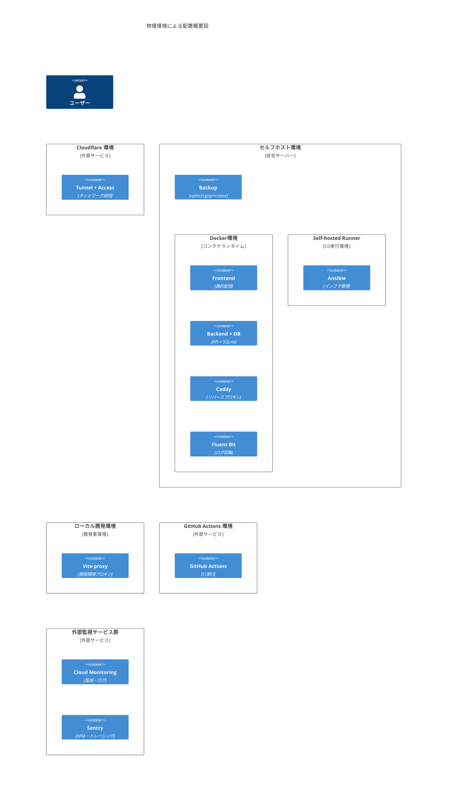
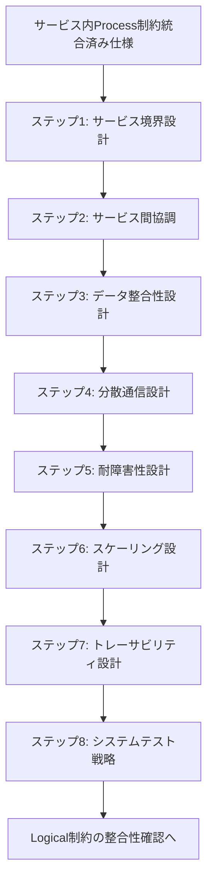

# サービス間 Process 制約の見直し

## 目次

1. [概要](#概要)
2. [処理フロー](#処理フロー)
3. [ステップ 1: システムテスト戦略](#ステップ-1-システムテスト戦略)
4. [ステップ 2: トレーサビリティ設計](#ステップ-2-トレーサビリティ設計)
5. [ステップ 3: スケーリング設計](#ステップ-3-スケーリング設計)
6. [ステップ 4: 耐障害性設計](#ステップ-4-耐障害性設計)
7. [ステップ 5: 分散通信設計](#ステップ-5-分散通信設計)
8. [ステップ 6: データ整合性設計](#ステップ-6-データ整合性設計)
9. [ステップ 7: サービス間協調](#ステップ-7-サービス間協調)
10. [ステップ 8: サービス境界設計](#ステップ-8-サービス境界設計)
11. [ステップ 9: サービス間 Process 制約統合](#ステップ-9-サービス間-process-制約統合)

## 概要

サービス内の Process View 制約の調整が完了したので、サービス間の Process View 制約もこれに合わせて調整する。

前のステップでサービス内の Process View 制約を調整した結果、以下の制約要素が Physical View と Development View の制約に合わせて変更された。

<!-- PREMISE_BEGIN: intra-process-constraint-changes -->

- サービス内テスト戦略:
  - 単一バックエンド内での機能別テスト: コア知識管理機能はデータベース操作とトランザクション境界を重点的に検証し、LLM 統合機能は外部 API の契約テストと異常ケース対応を強化し、コンテンツ取得機能は構造変更への適応性を継続的に検証する
- 監視設計:
  - 単一バックエンド内での機能別監視: コア知識管理機能はデータ整合性と応答時間を重視し、LLM 統合機能は外部 API 依存性を監視し、コンテンツ取得機能は取得成功率と構造変更を追跡する
- バッチ処理設計:
  - loguru によるログ出力: バックアップ処理の成功・失敗をログとして出力し、迅速な障害対応を支援する

<!-- PREMISE_END: intra-process-constraint-changes -->

Physical View と Development View の制約をコンテナごとに対応付けて、制約間の整合性を確認した最終的な技術マッピング結果を下記の図に示す。

Process View の制約の大部分は Physical View と Development View の制約と整合している。そのため、矛盾箇所のみを段階的に特定して調整する。主な矛盾は「3 つのサービスの完全分離」から「単一の Backend Container」への変更によって発生している。

<!-- PREMISE_BEGIN: physical-environment-overview-diagram -->

<!-- PREMISE_END: physical-environment-overview-diagram -->

## 処理フロー

## ステップ 1: システムテスト戦略

詳細は [01-system-test-strategy.md](./01-system-test-strategy.md) を参照。

## ステップ 2: トレーサビリティ設計

詳細は [02-traceability-design.md](./02-traceability-design.md) を参照。

## ステップ 3: スケーリング設計

詳細は [03-scaling-design.md](./03-scaling-design.md) を参照。

## ステップ 4: 耐障害性設計

詳細は [04-fault-tolerance-design.md](./04-fault-tolerance-design.md) を参照。

## ステップ 5: 分散通信設計

詳細は [05-distributed-communication-design.md](./05-distributed-communication-design.md) を参照。

## ステップ 6: データ整合性設計

詳細は [06-data-consistency-design.md](./06-data-consistency-design.md) を参照。

## ステップ 7: サービス間協調

詳細は [07-service-coordination.md](./07-service-coordination.md) を参照。

## ステップ 8: サービス境界設計

詳細は [08-service-boundaries-design.md](./08-service-boundaries-design.md) を参照。

## ステップ 9: サービス間 Process 制約統合

詳細は [09-process-constraint-integration.md](./09-process-constraint-integration.md) を参照。
