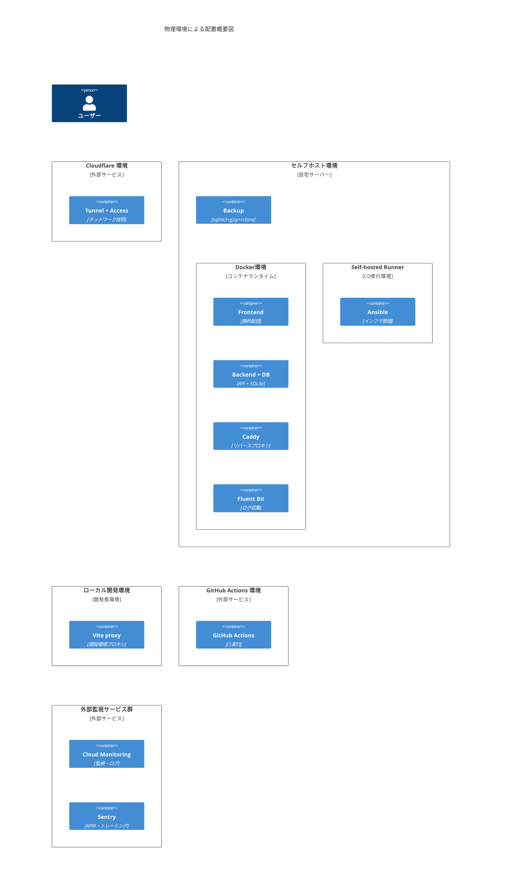
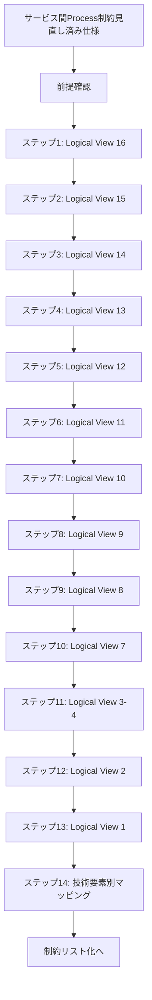

# Logical 制約の整合性確認

## 目次

1. [概要](#概要)
2. [処理フロー](#処理フロー)
3. [ステップ 1: Logical View 16 API 契約の整合性確認](#ステップ-1-logical-view-16-api-契約の整合性確認)
4. [ステップ 2: Logical View 15 API 技術方針の整合性確認](#ステップ-2-logical-view-15-api-技術方針の整合性確認)
5. [ステップ 3: Logical View 14 フロントエンドレンダリングスタイルの整合性確認](#ステップ-3-logical-view-14-フロントエンドレンダリングスタイルの整合性確認)
6. [ステップ 4: Logical View 13 バックエンドアーキテクチャスタイルの整合性確認](#ステップ-4-logical-view-13-バックエンドアーキテクチャスタイルの整合性確認)
7. [ステップ 5: Logical View 12 バッチ仕様の整合性確認](#ステップ-5-logical-view-12-バッチ仕様の整合性確認)
8. [ステップ 6: Logical View 11 ドメインモデルの整合性確認](#ステップ-6-logical-view-11-ドメインモデルの整合性確認)
9. [ステップ 7: Logical View 10 データベース方針の整合性確認](#ステップ-7-logical-view-10-データベース方針の整合性確認)
10. [ステップ 8: Logical View 9 データモデルの整合性確認](#ステップ-8-logical-view-9-データモデルの整合性確認)
11. [ステップ 9: Logical View 8 UI コンポーネント責務の整合性確認](#ステップ-9-logical-view-8-ui-コンポーネント責務の整合性確認)
12. [ステップ 10: Logical View 7 UI 技術方針の整合性確認](#ステップ-10-logical-view-7-ui-技術方針の整合性確認)
13. [ステップ 11: Logical View 3-4 画面構成設計の整合性確認](#ステップ-11-logical-view-3-4-画面構成設計の整合性確認)
14. [ステップ 12: Logical View 2 機能境界と責務の整合性確認](#ステップ-12-logical-view-2-機能境界と責務の整合性確認)
15. [ステップ 13: Logical View 1 主要抽象化設計の整合性確認](#ステップ-13-logical-view-1-主要抽象化設計の整合性確認)
16. [ステップ 14: 技術要素別制約マッピング](#ステップ-14-技術要素別制約マッピング)

## 概要

サービス間の Process View 制約の見直しが完了したので、Logical View 設計の整合性を確認する。

Process View の制約が単一の Backend Container での実装を前提としているため、Logical View 設計の各要素を逆順(16→1)で整合性を確認し、必要に応じて調整する。

<!-- PREMISE_BEGIN: physical-environment-overview-diagram -->

<!-- PREMISE_END: physical-environment-overview-diagram -->

前のステップでサービス間およびサービス内の Process View 制約を調整した結果、以下の制約要素が変更された。

### サービス間 Process 制約の変更

<!-- PREMISE_BEGIN: inter-process-constraint-changes -->

- サービス間協調:
  - フロントエンド直接呼び出し: フロントエンドから単一バックエンドを直接呼び出し、内部でコア知識管理・LLM 統合・コンテンツ取得のモジュール間協調を実現する
  - 一方向依存: フロントエンドから単一バックエンドへの依存のみ存在する
  - タイムアウトつき同期通信: フロントエンドから単一バックエンドへの通信はタイムアウトつき同期通信で行う
- 分散通信設計:
  - HTTP API 直接通信: フロントエンドから単一バックエンドへの直接 HTTP/HTTPS 通信を行う
- トレーサビリティ設計:
  - フロントエンド起点の一括トレーシング: CSR アーキテクチャを活用したクライアントサイド監視と単一バックエンドとの統合により、システム全体の動作を把握する
- サービス境界設計:
  - 単一バックエンド内でのモジュール分離: コア知識管理機能、LLM 統合機能、コンテンツ取得機能を単一バックエンド内でモジュール分離で実現する

<!-- PREMISE_END: inter-process-constraint-changes -->

### サービス内 Process 制約の変更

<!-- PREMISE_BEGIN: intra-process-constraint-changes -->

- サービス内テスト戦略:
  - 単一バックエンド内での機能別テスト: コア知識管理機能はデータベース操作とトランザクション境界を重点的に検証し、LLM 統合機能は外部 API の契約テストと異常ケース対応を強化し、コンテンツ取得機能は構造変更への適応性を継続的に検証する
- 監視設計:
  - 単一バックエンド内での機能別監視: コア知識管理機能はデータ整合性と応答時間を重視し、LLM 統合機能は外部 API 依存性を監視し、コンテンツ取得機能は取得成功率と構造変更を追跡する
- バッチ処理設計:
  - loguru によるログ出力: バックアップ処理の成功・失敗をログとして出力し、迅速な障害対応を支援する

<!-- PREMISE_END: intra-process-constraint-changes -->

## 処理フロー

## ステップ 1: Logical View 16 API 契約の整合性確認

### ステップ 1-1: Logical 制約の前提確認

<!-- PREMISE_BEGIN: api-contract -->

CogitoWeave の API 契約は以下の 9 つの論理的 API 群で構成される:

### エンティティ操作 API

1. **概念 API**: 作成・読み取り・更新 (削除は優先度低)
2. **文献メモ API**: 作成・読み取り・更新・概念別一覧取得
3. **関係性 API**: 作成・読み取り・更新 (概念間の重複関係許可)
4. **文献 API**: 作成・読み取り (URL・タイトル・引用が必須)

### 検索・発見 API

1. **概念検索 API**: 名前・説明での部分一致検索
2. **質問から概念候補提示 API**: 既存個人概念体系からの検索・発見支援

### 協働・処理 API

1. **LLM 要約生成 API**: 記事内容と概念 ID から観点別要約を生成
2. **記事取得 API**: URL からタイトル・内容を取得
3. **バックアップ API**: Webhook 化による自動実行支援

これらの API により、概念中心の知識体系構築と効率的な知識活用が実現される。

<!-- PREMISE_END: api-contract -->

### ステップ 1-2: Process 制約との整合性確認

API 契約の 9 つの論理的 API 群は、Process 制約の変更により影響を受けるかを確認する。

サービス間 Process 制約の調整により「フロントエンドから 3 サービスへの通信」が「フロントエンドから単一バックエンドへの通信」に変更されている。しかし、API 契約の 9 つの API 群（概念 API、文献メモ API、関係性 API、文献 API、概念検索 API、質問から概念候補提示 API、LLM 要約生成 API、記事取得 API、バックアップ API）は、単一バックエンドでも論理的に同じ機能を提供可能である。

Physical・Development 制約の Backend Container(Python + FastAPI)により、9 つの API 群すべてが実装可能である。API 契約の内容に変更は不要。

### ステップ 1-3: 調整結果の整理

**調整結果**: Logical 制約「API 契約」は変更不要。Process・Physical・Development 制約と整合している。

**該当箇所**:

- エンティティ操作 API: 概念 API、文献メモ API、関係性 API、文献 API
  - Backend Container の Python + FastAPI
  - Backend Container の FastAPI 標準 Pydantic
  - Backend Container の SQLAlchemy + Alembic
- 検索・発見 API: 概念検索 API、質問から概念候補提示 API
  - Backend Container の Python + FastAPI
- 協働・処理 API: LLM 要約生成 API、記事取得 API、バックアップ API
  - Backend Container の httpx
  - Backend Container の Python + FastAPI

## ステップ 2: Logical View 15 API 技術方針の整合性確認

### ステップ 2-1: Logical 制約の前提確認

<!-- PREMISE_BEGIN: api-tech-approach -->

API 技術方針として REST API を採用する。

<!-- PREMISE_END: api-tech-approach -->

<!-- PREMISE_BEGIN: performance-budget-allocation -->

**システム初回起動パフォーマンスバジェット**を以下のように配分する。

- HTML ロード: 300ms 以内
- JavaScript バンドルロード: 800ms 以内
- DOM 構築: 200ms 以内
- 初回 API 呼び出し: 600ms 以内
- レンダリング完了: 300ms 以内
- 合計バジェット: 2200ms（要件 3000ms に対して 800ms の余裕）

**概念ページ読み込みパフォーマンスバジェット**を以下のように配分する。

- JavaScript バンドル: 0ms（ブラウザキャッシュ活用）
- API 呼び出し: 600ms 以内
- レンダリング: 300ms 以内
- 合計バジェット: 900ms（要件 1500ms に対して 600ms の余裕）

<!-- PREMISE_END: performance-budget-allocation -->

### ステップ 2-2: Process 制約との整合性確認

API 技術方針の REST API 採用とパフォーマンスバジェット配分は、Process 制約の変更後も維持可能である。

サービス間 Process 制約の調整により単一バックエンド構成に変更されているが、REST API とパフォーマンスバジェット設定は単一バックエンドでも適用可能である。Physical・Development 制約の Backend Container(FastAPI + uvicorn)により、パフォーマンス要件を満たす REST API 実装が可能である。

### ステップ 2-3: 調整結果の整理

**調整結果**: Logical 制約「API 技術方針」は変更不要。Process・Physical・Development 制約と整合している。

**該当箇所**:

- REST API 採用
  - Backend Container の Python + FastAPI
- システム初回起動パフォーマンスバジェット
  - Frontend Container の Solid + TanStack Router
  - Backend Container の uvicorn
- 概念ページ読み込みパフォーマンスバジェット
  - Frontend Container の Solid + TanStack Router
  - Backend Container の Python + FastAPI

## ステップ 3: Logical View 14 フロントエンドレンダリングスタイルの整合性確認

### ステップ 3-1: Logical 制約の前提確認

<!-- PREMISE_BEGIN: frontend-rendering-style -->

CogitoWeave のフロントエンドレンダリングスタイルとして**CSR(Client-Side Rendering)**を採用する。3 画面間の状態共有効率と軽量なコンポーネント指向の特性を活かし、一人での開発における保守性と理解しやすさを確保する。

<!-- PREMISE_END: frontend-rendering-style -->

### ステップ 3-2: Process 制約との整合性確認

フロントエンドレンダリングスタイルの CSR(Client-Side Rendering)採用は、Process 制約の変更後も整合している。

サービス間 Process 制約の調整により単一バックエンド構成に変更されたが、フロントエンドから単一バックエンドへの HTTP 通信となっても CSR アーキテクチャは変更不要である。Physical・Development 制約の Frontend Container(Solid + TanStack Router)により、CSR の 3 画面間状態共有効率と軽量コンポーネント指向が実現可能である。

### ステップ 3-3: 調整結果の整理

**調整結果**: Logical 制約「フロントエンドレンダリングスタイル」は変更不要。Process・Physical・Development 制約と整合している。

**該当箇所**:

- CSR(Client-Side Rendering)採用
  - Frontend Container の Solid + TanStack Router
- 3 画面間の状態共有効率
  - Frontend Container の Solid + TanStack Router
- 軽量なコンポーネント指向の特性
  - Frontend Container の Solid + TanStack Router
- 一人での開発における保守性と理解しやすさ
  - Frontend Container の Solid + TanStack Router

## ステップ 4: Logical View 13 バックエンドアーキテクチャスタイルの整合性確認

### ステップ 4-1: Logical 制約の前提確認

<!-- PREMISE_BEGIN: backend-architecture-style -->

CogitoWeave のバックエンドアーキテクチャスタイルとして**レイヤードアーキテクチャ**を採用する。階層的な責務分離と機能境界に基づく水平分割により、一人開発における保守性と理解しやすさを確保する。

<!-- PREMISE_END: backend-architecture-style -->

### ステップ 4-2: Process 制約との整合性確認

バックエンドアーキテクチャスタイルのレイヤードアーキテクチャ採用は、Process 制約の変更後も実装可能である。

サービス間 Process 制約の調整により単一バックエンド内でのモジュール分離となったが、レイヤードアーキテクチャによる階層的責務分離は単一 FastAPI 内でも実現可能である。Physical・Development 制約の Backend Container(Python + FastAPI)により、機能境界に基づく水平分割とレイヤー分離を同時に実現できる。

### ステップ 4-3: 調整結果の整理

**調整結果**: Logical 制約「バックエンドアーキテクチャスタイル」は変更不要。Process・Physical・Development 制約と整合している。

**該当箇所**:

- レイヤードアーキテクチャ採用
  - Backend Container の Python + FastAPI
- 階層的な責務分離
  - Backend Container の SQLAlchemy + Alembic
  - Backend Container の FastAPI 標準 Pydantic
- 機能境界に基づく水平分割
  - Backend Container の Python + FastAPI
- 一人開発における保守性と理解しやすさ
  - Backend Container の Python + FastAPI

## ステップ 5: Logical View 12 バッチ仕様の整合性確認

### ステップ 5-1: Logical 制約の前提確認

<!-- PREMISE_BEGIN: batch-specification -->

CogitoWeave のバッチ仕様は日次データバックアップのみを実装する。全データの完全バックアップを日次実行し、システム障害時の迅速復旧を支援する。自動分析・推奨機能、データクリーンアップ、統計処理等は設計方針により除外する。

<!-- PREMISE_END: batch-specification -->

### ステップ 5-2: Process 制約との整合性確認

バッチ仕様の日次データバックアップ仕様は、Process 制約の変更後も実装可能である。

#### サービス間 Process 制約（バッチ仕様）

サービス間 Process 制約の調整により単一バックエンド構成に変更されているため、バッチ処理も単一 Backend Container で実行することになる。しかし、日次データバックアップの全データ完全バックアップ機能は単一バックエンドでも問題なく実現できる。Physical・Development 制約の Backend Container(Python)と Database Container(SQLite)により、バッチ仕様が実装可能である。

#### サービス内 Process 制約（バッチ仕様）

サービス内 Process 制約の「バッチ処理設計: loguru によるログ出力」により、バックアップ処理の成功・失敗をログとして出力し、迅速な障害対応を支援することが確認された。これは Logical 制約の「システム障害時の迅速復旧を支援」と整合しており、具体的な実装手段として loguru によるログ出力が採用される。

### ステップ 5-3: 調整結果の整理

**調整結果**: Logical 制約「バッチ仕様」は変更不要。Process・Physical・Development 制約と整合している。

**該当箇所**:

- 日次データバックアップのみを実装
  - Backend Container の Python + FastAPI
  - Database Container の SQLite
- 全データの完全バックアップを日次実行
  - Backend Container の Python + FastAPI
  - Database Container の SQLite
- システム障害時の迅速復旧を支援
  - Backend Container の loguru
  - バックアップ処理の成功・失敗をログとして出力し、迅速な障害対応を支援する
- 自動分析・推奨機能、データクリーンアップ、統計処理等は設計方針により除外
  - Backend Container の Python + FastAPI

## ステップ 6: Logical View 11 ドメインモデルの整合性確認

### ステップ 6-1: Logical 制約の前提確認

<!-- PREMISE_BEGIN: domain-model -->

CogitoWeave のドメインモデルは薄いドメイン層アプローチを採用する。4 つのエンティティ（概念、文献メモ、関係性、文献）に対して基本的な CRUD 操作と最小限のビジネス制約のみを実装し、複雑なドメインロジックはアプリケーション層に委ねる。データベース制約による整合性管理を活用し、外部 API 処理は分離する。

<!-- PREMISE_END: domain-model -->

### ステップ 6-2: Process 制約との整合性確認

ドメインモデルの薄いドメイン層アプローチは、Process 制約の変更後も実装可能である。

サービス間 Process 制約の調整により単一バックエンド内でのモジュール分離となったが、4 つのエンティティに対する基本的な CRUD 操作と最小限のビジネス制約の実装は単一 FastAPI 内でも問題なく実現できる。Physical・Development 制約の Backend Container(Python + FastAPI + SQLAlchemy)により、薄いドメイン層とアプリケーション層の分離が実装可能である。

### ステップ 6-3: 調整結果の整理

**調整結果**: Logical 制約「ドメインモデル」は変更不要。Process・Physical・Development 制約と整合している。

**該当箇所**:

- 薄いドメイン層アプローチを採用
  - Backend Container の Python + FastAPI
- 4 つのエンティティに対して基本的な CRUD 操作と最小限のビジネス制約のみを実装
  - Backend Container の Python + FastAPI
  - Backend Container の SQLAlchemy + Alembic
- 複雑なドメインロジックはアプリケーション層に委ねる
  - Backend Container の Python + FastAPI
- データベース制約による整合性管理を活用
  - Backend Container の SQLAlchemy + Alembic
  - Database Container の SQLite
- 外部 API 処理は分離
  - Backend Container の httpx

## ステップ 7: Logical View 10 データベース方針の整合性確認

### ステップ 7-1: Logical 制約の前提確認

<!-- PREMISE_BEGIN: database-approach -->

CogitoWeave では RDBMS を採用する。リレーショナル構造によるデータ整合性管理、成熟技術による保守性確保、データ規模への十分な対応能力が主な選択理由である。具体的な製品選択は Development View で決定する。

<!-- PREMISE_END: database-approach -->

### ステップ 7-2: Process 制約との整合性確認

データベース方針の RDBMS 採用は、Process 制約の変更後も整合している。

サービス間 Process 制約の調整により単一バックエンド構成に変更されているが、RDBMS による リレーショナル構造でのデータ整合性管理と成熟技術による保守性確保は単一バックエンドでも実現可能である。Physical・Development 制約の Database Container(SQLite)により、データ規模への十分な対応能力を提供できる。

### ステップ 7-3: 調整結果の整理

**調整結果**: Logical 制約「データベース方針」は変更不要。Process・Physical・Development 制約と整合している。

**該当箇所**:

- RDBMS を採用
  - Database Container の SQLite
- リレーショナル構造によるデータ整合性管理
  - Database Container の SQLite
  - Backend Container の SQLAlchemy + Alembic
- 成熟技術による保守性確保
  - Database Container の SQLite
- データ規模への十分な対応能力
  - Database Container の SQLite

## ステップ 8: Logical View 9 データモデルの整合性確認

### ステップ 8-1: Logical 制約の前提確認

<!-- PREMISE_BEGIN: concept-entity -->

概念エンティティ(Concept):

- 思考の最小単位として知識体系の中心に位置する
- 基本属性: ID、名前、説明、作成日時、更新日時
- 他の概念との関係性によって意味を形成する
- 外部情報を個人の理解に変換する観点として機能する

<!-- PREMISE_END: concept-entity -->

<!-- PREMISE_BEGIN: literature-memo-entity -->

文献メモエンティティ(LiteratureMemo):

- ツェッテルカステン方式による概念ベースの知識蓄積
- 基本属性: ID、タイトル、内容、作成日時、更新日時
- 特定の概念の観点で外部文献を要約・解釈したもの
- LLM 協働により効率的に作成され、個人の理解で修正される

<!-- PREMISE_END: literature-memo-entity -->

<!-- PREMISE_BEGIN: relationship-entity -->

関係性エンティティ(Relationship):

- 概念間の無向グラフ構造による知識ネットワーク形成
- 基本属性: ID、関係名、説明、作成日時
- 個人的な関係語彙による柔軟な関係定義
- 空間配置による直感的な関係性発見を支援

<!-- PREMISE_END: relationship-entity -->

<!-- PREMISE_BEGIN: literature-entity -->

文献エンティティ(Literature):

- 外部文献の書誌情報管理
- 基本属性: ID、URL、タイトル、取得日時
- 複数の概念観点から文献メモが生成される元情報

<!-- PREMISE_END: literature-entity -->

### ステップ 8-2: Process 制約との整合性確認

データモデルの 4 つのエンティティ設計は、Process 制約の変更後も整合している。

サービス間 Process 制約の調整により単一バックエンド構成に変更されているが、概念エンティティ、文献メモエンティティ、関係性エンティティ、文献エンティティの設計は単一バックエンドでも問題なく実装可能である。Physical・Development 制約の Backend Container(SQLAlchemy)と Database Container(SQLite)により、4 つのエンティティによる知識ネットワーク形成が実現できる。

### ステップ 8-3: 調整結果の整理

**調整結果**: Logical 制約「データモデル」は変更不要。Process・Physical・Development 制約と整合している。

**該当箇所**:

- 概念エンティティ: 思考の最小単位として知識体系の中心に位置し、他の概念との関係性によって意味を形成し、外部情報を個人の理解に変換する観点として機能
  - Backend Container の SQLAlchemy + Alembic
  - Database Container の SQLite
- 文献メモエンティティ: ツェッテルカステン方式による概念ベースの知識蓄積として、特定の概念の観点で外部文献を要約・解釈し、LLM 協働により効率的に作成され個人の理解で修正される
  - Backend Container の SQLAlchemy + Alembic
  - Database Container の SQLite
- 関係性エンティティ: 概念間の無向グラフ構造による知識ネットワーク形成として、個人的な関係語彙による柔軟な関係定義と空間配置による直感的な関係性発見を支援
  - Backend Container の SQLAlchemy + Alembic
  - Database Container の SQLite
- 文献エンティティ: 外部文献の書誌情報管理として複数の概念観点から文献メモが生成される元情報
  - Backend Container の SQLAlchemy + Alembic
  - Database Container の SQLite

## ステップ 9: Logical View 8 UI コンポーネント責務の整合性確認

### ステップ 9-1: Logical 制約の前提確認

<!-- PREMISE_BEGIN: component-granularity-design -->

CogitoWeave の UI コンポーネント責務として、階層的な粒度設計による軽量なコンポーネント指向アーキテクチャを採用する。

- **最小粒度**: ボタン・入力フィールド・ラベル等の基本 UI 要素レベル
  - 単一責務の原則により、一つの操作または表示に特化する。
- **統合粒度**: カード・パネル・モーダル等の機能単位レベル
  - 複数の基本要素を組み合わせた意味のある機能を提供する。
- **階層アプローチ**: 統合コンポーネント内で基本コンポーネントを組み合わせる
  - 外部からは統合コンポーネントとして使用し、内部実装では基本コンポーネントで構成する。

<!-- PREMISE_END: component-granularity-design -->

<!-- PREMISE_BEGIN: state-management-responsibilities -->

状態管理は 3 層に分離して責務を明確化する。

- **コンポーネント内部状態**: 表示状態・入力値・開閉状態等の局所的な制御
  - コンポーネント固有の UI 状態管理に限定する
- **ページレベル状態**: 選択中概念・検索フィルタ・編集中データ等の複数コンポーネント間共有
  - 状態管理ライブラリを使用してページ内グローバル状態を管理する
- **アプリケーション全体状態**: ユーザー設定・表示設定・大きなコンポーネント間同期データ
  - 永続化データはブラウザの localStorage を使用する
  - ページ境界を越えた大きなコンポーネント間の同期はクライアント側状態管理で対応する

<!-- PREMISE_END: state-management-responsibilities -->

<!-- PREMISE_BEGIN: data-flow-design -->

コンテナコンポーネントパターンと単方向データフローによるデータ設計を採用する。

- **コンテナコンポーネントパターン**: データ取得・API 呼び出し責務を上位コンポーネントに集約
  - プレゼンテーショナルコンポーネントは props によるデータ受け取りに特化する
- **単方向データフロー**: props による下方向データ流れと callback による上方向イベント伝播
  - データの流れを予測可能にし、デバッグとテストを容易にする
- **イベント駆動通信**: 子コンポーネントから親コンポーネントへは callback props によるイベント通知
  - 疎結合を保ちながら必要な情報のみを伝達する

<!-- PREMISE_END: data-flow-design -->

<!-- PREMISE_BEGIN: device-adaptation-approach -->

デバイス別対応はコンポーネント共通化とレスポンシブ設計による適応的 UI で実現する。

- **コンポーネント共通化**: 同一コンポーネントをデバイス別に CSS で最適化
  - Mac 環境と iPhone 環境で共通のコンポーネントロジックを使用する
- **レスポンシブ設計**: デバイス別の表示密度と操作方法に応じた適応的 UI
  - 情報整理機能と情報参照機能の違いを CSS レベルで調整する

<!-- PREMISE_END: device-adaptation-approach -->

### ステップ 9-2: Process 制約との整合性確認

UI コンポーネント責務の階層的な粒度設計と状態管理分離は、Process 制約の変更後も整合している。

サービス間 Process 制約の調整により単一バックエンド構成に変更されているが、コンポーネント粒度設計、状態管理責務、データフロー設計、デバイス別対応アプローチはフロントエンド側の設計であり影響を受けない。Physical・Development 制約の Frontend Container(Solid + TanStack Router)により、軽量なコンポーネント指向アーキテクチャが実現可能である。

### ステップ 9-3: 調整結果の整理

**調整結果**: Logical 制約「UI コンポーネント責務」は変更不要。Process・Physical・Development 制約と整合している。

**該当箇所**:

- 階層的な粒度設計による軽量なコンポーネント指向アーキテクチャ
  - Frontend Container の Solid + TanStack Router
- コンポーネント内部状態とページレベル状態とアプリケーション全体状態の 3 層分離
  - Frontend Container の Solid + TanStack Router
- コンテナコンポーネントパターンと単方向データフロー
  - Frontend Container の Solid + TanStack Router
- コンポーネント共通化とレスポンシブ設計による適応的 UI
  - Frontend Container の Tailwind CSS + CSS Modules

## ステップ 10: Logical View 7 UI 技術方針の整合性確認

### ステップ 10-1: Logical 制約の前提確認

<!-- PREMISE_BEGIN: ui-tech-approach -->

CogitoWeave の UI 技術方針として、Web 技術による柔軟な実装アプローチを採用する。プラットフォーム制約によりネイティブアプリ開発は除外され、マルチデバイス対応とユーザーインタラクション特性を考慮した選択肢から最適解を選択する。

### 除外される技術選択肢

- **ネイティブアプリ**: プラットフォーム制約により除外済み
- **SSG(Static Site Generation)**: 編集機能中心に矛盾し、マルチデバイス共有に適さない
- **ローカルオンリー**: マルチデバイス前提制約に違反

### 許容される技術選択肢

- **レンダリング方式**: CSR、SSR、またはハイブリッドアプローチのいずれも可能である
  - プライベート用途により SEO 要件がないため、CSR の制約がない
  - 初回ロード速度重視により SSR の利点もある
- **アプリケーション構造**: SPA、MPA、または SPA ベース+ページ分割のハイブリッドアプローチのいずれも可能である
  - 作業完結型の操作パターンにより MPA に適合する
  - 効率性重視の継続利用により SPA の利点もある
- **コンポーネント方針**: 軽量コンポーネント指向を基本とし、必要に応じてページ指向も選択可能である
  - UI 要素の再利用性と一貫性確保が必要
  - デザインシステムレベルまでは不要

### 技術方針決定の基準

具体的な技術選択は、Development View において以下の基準で決定する:

- 保守性と理解しやすさの優先
- 一人での管理可能な複雑度
- Mac 環境での情報整理機能と iPhone 環境での情報参照機能の最適化

<!-- PREMISE_END: ui-tech-approach -->

### ステップ 10-2: Process 制約との整合性確認

UI 技術方針の Web 技術による柔軟な実装アプローチは、Process 制約の変更後も整合している。

サービス間 Process 制約の調整により単一バックエンド構成に変更されているが、レンダリング方式、アプリケーション構造、コンポーネント方針の選択肢はフロントエンド側の技術方針であり影響を受けない。Physical・Development 制約の Frontend Container(Solid + TanStack Router + Tailwind CSS)により、保守性と理解しやすさを優先した技術選択が実現されている。

### ステップ 10-3: 調整結果の整理

**調整結果**: Logical 制約「UI 技術方針」は変更不要。Process・Physical・Development 制約と整合している。

**該当箇所**:

- Web 技術による柔軟な実装アプローチを採用
  - Frontend Container の Solid + TanStack Router
- レンダリング方式として CSR を選択
  - Frontend Container の Solid + TanStack Router
- アプリケーション構造として SPA を選択
  - Frontend Container の TanStack Router
- 軽量コンポーネント指向を基本とする
  - Frontend Container の Solid + TanStack Router
- 保守性と理解しやすさの優先
  - Frontend Container の Solid + TanStack Router
- 一人での管理可能な複雑度
  - Frontend Container の Solid + TanStack Router
- Mac 環境での情報整理機能と iPhone 環境での情報参照機能の最適化
  - Frontend Container の Tailwind CSS + CSS Modules

## ステップ 11: Logical View 3-4 画面構成設計の整合性確認

### ステップ 11-1: Logical 制約の前提確認

<!-- PREMISE_BEGIN: main-screen-integration -->

メイン画面は概念管理、文献メモ管理、関係性管理を 1 画面に統合して提供する。概念・文献メモ・関係性は統合的に利用されるため一体化した画面構成が効率的である。

<!-- PREMISE_END: main-screen-integration -->

<!-- PREMISE_BEGIN: question-search-screen-integration -->

質問探索画面は質問から概念発見とメモ参照を独立画面で提供する。質問探索は他の機能と利用パターンが異なるため独立画面が適切である。

<!-- PREMISE_END: question-search-screen-integration -->

<!-- PREMISE_BEGIN: spatial-arrangement-screen-integration -->

空間配置画面は概念の空間配置と関係性構築を専用画面で提供する。複雑な直接操作が必要なためフルスクリーン専用画面が適切である。

<!-- PREMISE_END: spatial-arrangement-screen-integration -->

<!-- PREMISE_BEGIN: screen-transition-design -->

シンプルなタブ切り替えによる 3 画面間の移動を提供する。操作の複雑度を抑制し直感的なナビゲーションを実現する。

<!-- PREMISE_END: screen-transition-design -->

### ステップ 11-2: Process 制約との整合性確認

画面構成設計の 3 画面統合アプローチは、Process 制約の変更後も整合している。

サービス間 Process 制約の調整により単一バックエンド構成に変更されているが、メイン画面、質問探索画面、空間配置画面の画面構成とタブ切り替えによる画面遷移はフロントエンド側の設計であり影響を受けない。Physical・Development 制約の Frontend Container(Solid + TanStack Router)により、3 画面間のシンプルなナビゲーションが実現可能である。

### ステップ 11-3: 調整結果の整理

**調整結果**: Logical 制約「画面構成設計」は変更不要。Process・Physical・Development 制約と整合している。

**該当箇所**:

- メイン画面は概念管理、文献メモ管理、関係性管理を 1 画面に統合
  - Frontend Container の Solid + TanStack Router
- 質問探索画面は質問から概念発見とメモ参照を独立画面で提供
  - Frontend Container の Solid + TanStack Router
- 空間配置画面は概念の空間配置と関係性構築を専用画面で提供
  - Frontend Container の D3
- シンプルなタブ切り替えによる 3 画面間の移動
  - Frontend Container の TanStack Router

## ステップ 12: Logical View 2 機能境界と責務の整合性確認

### ステップ 12-1: Logical 制約の前提確認

<!-- PREMISE_BEGIN: core-knowledge-boundary -->

- コア知識管理境界は概念管理、文献メモ管理、関係性管理、質問探索を統合して担当する。
  - 各機能の役割を明確に分け、統合的に管理することで保守負荷を軽減するため。

<!-- PREMISE_END: core-knowledge-boundary -->

<!-- PREMISE_BEGIN: llm-integration-boundary -->

- LLM 統合境界は LLM API による要約生成、概念候補提示、協働プロセス制御を担当する。
  - 変わりやすい技術を分離してシンプルな設計を維持するため。

<!-- PREMISE_END: llm-integration-boundary -->

<!-- PREMISE_BEGIN: content-acquisition-boundary -->

- コンテンツ取得境界は外部記事取得、内容解析、品質チェックを担当する。
  - 独立した処理として分離し機能変更時の影響範囲を限定するため。

<!-- PREMISE_END: content-acquisition-boundary -->

### ステップ 12-2: Process 制約との整合性確認

機能境界と責務の 3 境界分離は、Process 制約の変更後も整合している。

#### サービス間 Process 制約（機能境界と責務）

サービス間 Process 制約の調整により単一バックエンド内でのモジュール分離となったが、コア知識管理境界、LLM 統合境界、コンテンツ取得境界の責務分離は単一 FastAPI 内でもモジュール設計により実現可能である。Physical・Development 制約の Backend Container(Python + FastAPI)により、機能別の境界分離が実装できる。

#### サービス内 Process 制約（機能境界と責務）

サービス内 Process 制約の「単一バックエンド内での機能別テスト」と「単一バックエンド内での機能別監視」は、Logical 制約で定義された 3 つの機能境界と完全に整合している:

- **コア知識管理境界**: データベース操作とトランザクション境界を重点的に検証し、データ整合性と応答時間を監視
- **LLM 統合境界**: 外部 API の契約テストと異常ケース対応を強化し、外部 API 依存性を監視
- **コンテンツ取得境界**: 構造変更への適応性を継続的に検証し、取得成功率と構造変更を追跡

これらのテスト戦略と監視設計は、Logical 制約で定義された機能境界の責務と分離方針を具体化したものである。

### ステップ 12-3: 調整結果の整理

**調整結果**: Logical 制約「機能境界と責務」は変更不要。Process・Physical・Development 制約と整合している。

**該当箇所**:

- コア知識管理境界: 概念管理、文献メモ管理、関係性管理、質問探索を統合して担当
  - Backend Container の Python + FastAPI
  - Backend Container の SQLAlchemy + Alembic
  - データベース操作とトランザクション境界を重点的に検証
  - データ整合性と応答時間を監視
- LLM 統合境界: LLM API による要約生成、概念候補提示、協働プロセス制御を担当
  - Backend Container の Python + FastAPI
  - Backend Container の httpx
  - 外部 API の契約テストと異常ケース対応を強化
  - 外部 API 依存性を監視
- コンテンツ取得境界: 外部記事取得、内容解析、品質チェックを担当
  - Backend Container の Python + FastAPI
  - Backend Container の httpx
  - 構造変更への適応性を継続的に検証
  - 取得成功率と構造変更を追跡

## ステップ 13: Logical View 1 主要抽象化設計の整合性確認

### ステップ 13-1: Logical 制約の前提確認

<!-- PREMISE_BEGIN: key-abstractions -->

CogitoWeave システムは**概念ベース知識体系構築システム**として抽象化される。

中核的価値は、個人の思考を「概念」という抽象化を通じて構造化し、外部情報を自分の理解に統合する仕組みの提供にある。

### 主要抽象化

#### 1. 概念 (Concept)

思考の最小単位として知識体系の中心に位置する抽象化

- 外部情報を個人の理解に変換するフィルター
- 知識統合の基点として機能する
- 他の概念との関係によって意味を形成する

#### 2. 文献メモ (Literature Memo)

概念に紐づく具体的知識内容を表現する抽象化

- 外部文献を個人の観点で解釈した結果
- LLM 協働により効率的に作成され個人の理解で修正される
- 概念の理解を深化させる具体例や体験を蓄積する

#### 3. 関係性 (Relationship)

概念間の関連性を表現し知識ネットワークを形成する抽象化

- 個人的な関係語彙による柔軟な関係定義
- 空間配置による直感的な関係性発見を支援
- 断片的知識を構造化された思考地図に変換する

### 抽象化の相互作用

- **外部文献** → **概念フィルター** → **文献メモ** (情報の個人化プロセス)
- **概念** ↔ **関係性** ↔ **概念** (知識ネットワーク形成プロセス)
- **空間配置** → **関係性発見** → **思考地図構築** (直感的構造化プロセス)

これらの抽象化により、外部情報の受動的消費から、個人の理解体系への能動的統合への転換が実現される。

<!-- PREMISE_END: key-abstractions -->

### ステップ 13-2: Process 制約との整合性確認

主要抽象化設計の概念ベース知識体系構築システムは、Process 制約の変更後も整合している。

サービス間 Process 制約の調整により単一バックエンド構成に変更されているが、概念・文献メモ・関係性の 3 つの主要抽象化とそれらの相互作用は論理的な設計であり実装構成に依存しない。Physical・Development 制約の Backend Container(SQLAlchemy)と Frontend Container(Solid)により、概念ベース知識体系構築システムの抽象化が実現可能である。

### ステップ 13-3: 調整結果の整理

**調整結果**: Logical 制約「主要抽象化設計」は変更不要。Process・Physical・Development 制約と整合している。

**該当箇所**:

- 概念: 思考の最小単位として知識体系の中心に位置し、外部情報を個人の理解に変換するフィルターとして機能
  - Backend Container の SQLAlchemy + Alembic
  - Database Container の SQLite
- 文献メモ: 概念に紐づく具体的知識内容を表現し、外部文献を個人の観点で解釈した結果として LLM 協働により効率的に作成
  - Backend Container の SQLAlchemy + Alembic
  - Backend Container の httpx
  - Database Container の SQLite
- 関係性: 概念間の関連性を表現し知識ネットワークを形成し、個人的な関係語彙による柔軟な関係定義と空間配置による直感的な関係性発見を支援
  - Backend Container の SQLAlchemy + Alembic
  - Frontend Container の D3
  - Database Container の SQLite
- 抽象化の相互作用: 外部文献 → 概念フィルター → 文献メモの情報個人化プロセス、概念 ↔ 関係性 ↔ 概念の知識ネットワーク形成プロセス、空間配置 → 関係性発見 → 思考地図構築の直感的構造化プロセス
  - Frontend Container の Solid + TanStack Router
  - Backend Container の Python + FastAPI

## ステップ 14: 技術要素別制約マッピング

ステップ 1〜13 で Logical 制約の整合性を確認した。この確認結果を技術要素別に整理し、各技術要素がどの Logical 制約を担当するかを明確化する。

### 前提: Development 制約の簡略化リスト

<!-- PREMISE_BEGIN: development-constraint-simplified-list -->

- Frontend(Container)
  - フレームワーク：Solid + TanStack Router
  - CSS 手法：Tailwind CSS + CSS Modules ハイブリッド構成
  - UI コンポーネント：Tailwind CSS ベースカスタム実装
  - グラフ可視化：D3
- Backend(Container)
  - 言語・フレームワーク：Python + FastAPI
  - アプリケーションサーバー：uvicorn
  - ORM・マイグレーション：SQLAlchemy + Alembic
  - API ドキュメント生成：FastAPI 内蔵 Swagger UI・ReDoc
  - バリデーション：FastAPI 標準 Pydantic
  - HTTP クライアント：httpx
  - 設定管理：環境変数方式
  - ログ・モニタリング：loguru
- DB(Container)
  - データベース：SQLite
- Vite proxy(Container)
  - ビルドツール：Vite
- GitHub Actions(Container)
  - Git サービス：GitHub
  - フロントエンドテスト：Vitest + Testing Library + Playwright
  - バックエンドテスト
    - テストフレームワーク：pytest
    - API テスト：FastAPI TestClient
    - 非同期テスト：pytest-asyncio
    - モック機能：pytest-mock
    - HTTP モック：httpx-mock
    - 時間モック：time-machine
    - カバレッジ：pytest-cov
    - 並列実行：pytest-xdist
- Fluent Bit(Container)
  - ログ収集：Fluent Bit
- Cloud Monitoring(Container)
  - 監視・ログ：Google Cloud Monitoring
- Sentry(Container)
  - APM・トレーシング：Sentry

<!-- PREMISE_END: development-constraint-simplified-list -->

### 技術要素別制約マッピング

上記の Development 制約の各技術要素に対して、ステップ 1〜13 で確認した Logical 制約をマッピングして整理する。

<!-- GLOBAL_CONCLUSION_BEGIN: logical-constraint-verification-mapping -->

#### Backend Container

##### Python + FastAPI

- API 契約:
  - エンティティ操作 API: 概念 API、文献メモ API、関係性 API、文献 API
  - 検索・発見 API: 概念検索 API、質問から概念候補提示 API
  - 協働・処理 API: LLM 要約生成 API、記事取得 API、バックアップ API
- API 技術方針:
  - REST API 採用
- バックエンドアーキテクチャスタイル:
  - レイヤードアーキテクチャ採用
  - 階層的な責務分離
  - 機能境界に基づく水平分割
  - 一人開発における保守性と理解しやすさ
- バッチ仕様:
  - 日次データバックアップのみを実装
  - 全データの完全バックアップを日次実行
  - 自動分析・推奨機能、データクリーンアップ、統計処理等は設計方針により除外
- ドメインモデル:
  - 薄いドメイン層アプローチを採用
  - 4 つのエンティティに対して基本的な CRUD 操作と最小限のビジネス制約のみを実装
  - 複雑なドメインロジックはアプリケーション層に委ねる
- 機能境界と責務:
  - コア知識管理境界: 概念管理、文献メモ管理、関係性管理、質問探索を統合して担当
    - データベース操作とトランザクション境界を重点的に検証
  - LLM 統合境界: LLM API による要約生成、概念候補提示、協働プロセス制御を担当
    - 外部 API の契約テストと異常ケース対応を強化
  - コンテンツ取得境界: 外部記事取得、内容解析、品質チェックを担当
    - 構造変更への適応性を継続的に検証
- 主要抽象化設計:
  - 抽象化の相互作用: 外部文献 → 概念フィルター → 文献メモの情報個人化プロセス

##### FastAPI 標準 Pydantic

- API 契約:
  - エンティティ操作 API: 概念 API、文献メモ API、関係性 API、文献 API

##### SQLAlchemy + Alembic

- API 契約:
  - エンティティ操作 API: 概念 API、文献メモ API、関係性 API、文献 API
- ドメインモデル:
  - 4 つのエンティティに対して基本的な CRUD 操作と最小限のビジネス制約のみを実装
  - データベース制約による整合性管理を活用
- データベース方針:
  - リレーショナル構造によるデータ整合性管理
- データモデル:
  - 概念エンティティ: 思考の最小単位として知識体系の中心に位置し、他の概念との関係性によって意味を形成し、外部情報を個人の理解に変換する観点として機能
  - 文献メモエンティティ: ツェッテルカステン方式による概念ベースの知識蓄積として、特定の概念の観点で外部文献を要約・解釈し、LLM 協働により効率的に作成され個人の理解で修正される
  - 関係性エンティティ: 概念間の無向グラフ構造による知識ネットワーク形成として、個人的な関係語彙による柔軟な関係定義と空間配置による直感的な関係性発見を支援
  - 文献エンティティ: 外部文献の書誌情報管理として複数の概念観点から文献メモが生成される元情報
- 機能境界と責務:
  - コア知識管理境界: 概念管理、文献メモ管理、関係性管理、質問探索を統合して担当
- 主要抽象化設計:
  - 概念: 思考の最小単位として知識体系の中心に位置し、外部情報を個人の理解に変換するフィルターとして機能
  - 文献メモ: 概念に綐づく具体的知識内容を表現し、外部文献を個人の観点で解釈した結果として、LLM 協働により効率的に作成され個人の理解で修正される
  - 関係性: 概念間の関連性を表現し知識ネットワークを形成し、個人的な関係語彙による柔軟な関係定義と空間配置による直感的な関係性発見を支援

##### httpx

- API 契約:
  - 協働・処理 API: LLM 要約生成 API、記事取得 API、バックアップ API
- ドメインモデル:
  - 外部 API 処理は分離
- 機能境界と責務:
  - LLM 統合境界: LLM API による要約生成、概念候補提示、協働プロセス制御を担当
  - コンテンツ取得境界: 外部記事取得、内容解析、品質チェックを担当
- 主要抽象化設計:
  - 文献メモ: LLM 協働により効率的に作成され個人の理解で修正される

##### uvicorn

- API 技術方針:
  - システム初回起動パフォーマンスバジェット

##### loguru

- バッチ仕様:
  - システム障害時の迅速復旧を支援
  - バックアップ処理の成功・失敗をログとして出力し、迅速な障害対応を支援する
- 機能境界と責務:
  - コア知識管理境界: データ整合性と応答時間を監視
  - LLM 統合境界: 外部 API 依存性を監視
  - コンテンツ取得境界: 取得成功率と構造変更を追跡

#### Frontend Container

##### Solid + TanStack Router

- API 技術方針:
  - システム初回起動パフォーマンスバジェット
  - 概念ページ読み込みパフォーマンスバジェット
- フロントエンドレンダリングスタイル:
  - CSR(Client-Side Rendering)採用
  - 3 画面間の状態共有効率
  - 軽量なコンポーネント指向の特性
  - 一人での開発における保守性と理解しやすさ
- UI コンポーネント責務:
  - 階層的な粒度設計による軽量なコンポーネント指向アーキテクチャ
  - コンポーネント内部状態とページレベル状態とアプリケーション全体状態の 3 層分離
  - コンテナコンポーネントパターンと単方向データフロー
- UI 技術方針:
  - Web 技術による柔軟な実装アプローチを採用
  - レンダリング方式として CSR を選択
  - 軽量コンポーネント指向を基本とする
  - 保守性と理解しやすさの優先
  - 一人での管理可能な複雑度
- 画面構成設計:
  - メイン画面は概念管理、文献メモ管理、関係性管理を 1 画面に統合
  - 質問探索画面は質問から概念発見とメモ参照を独立画面で提供
- 主要抽象化設計:
  - 抽象化の相互作用: 外部文献 → 概念フィルター → 文献メモの情報個人化プロセス

##### TanStack Router

- UI 技術方針:
  - アプリケーション構造として SPA を選択
- 画面構成設計:
  - シンプルなタブ切り替えによる 3 画面間の移動

##### Tailwind CSS + CSS Modules

- UI コンポーネント責務:
  - コンポーネント共通化とレスポンシブ設計による適応的 UI
- UI 技術方針:
  - Mac 環境での情報整理機能と iPhone 環境での情報参照機能の最適化

##### D3

- 画面構成設計:
  - 空間配置画面は概念の空間配置と関係性構築を専用画面で提供
- 主要抽象化設計:
  - 関係性: 概念間の関連性を表現し知識ネットワークを形成し、個人的な関係語彙による柔軟な関係定義と空間配置による直感的な関係性発見を支援

#### Database Container

##### SQLite

- データベース方針:
  - RDBMS を採用
  - リレーショナル構造によるデータ整合性管理
  - 成熟技術による保守性確保
  - データ規模への十分な対応能力
- ドメインモデル:
  - データベース制約による整合性管理を活用
- データモデル:
  - 概念エンティティ: 思考の最小単位として知識体系の中心に位置し、他の概念との関係性によって意味を形成し、外部情報を個人の理解に変換する観点として機能
  - 文献メモエンティティ: ツェッテルカステン方式による概念ベースの知識蓄積として、特定の概念の観点で外部文献を要約・解釈し、LLM 協働により効率的に作成され個人の理解で修正される
  - 関係性エンティティ: 概念間の無向グラフ構造による知識ネットワーク形成として、個人的な関係語彙による柔軟な関係定義と空間配置による直感的な関係性発見を支援
  - 文献エンティティ: 外部文献の書誌情報管理として複数の概念観点から文献メモが生成される元情報
- バッチ仕様:
  - 日次データバックアップのみを実装
  - 全データの完全バックアップを日次実行
- 主要抽象化設計:
  - 概念: 思考の最小単位として知識体系の中心に位置し、外部情報を個人の理解に変換するフィルターとして機能
  - 文献メモ: 概念に綐づく具体的知識内容を表現し、外部文献を個人の観点で解釈した結果として、LLM 協働により効率的に作成され個人の理解で修正される
  - 関係性: 概念間の関連性を表現し知識ネットワークを形成し、個人的な関係語彙による柔軟な関係定義と空間配置による直感的な関係性発見を支援

<!-- GLOBAL_CONCLUSION_END: logical-constraint-verification-mapping -->
