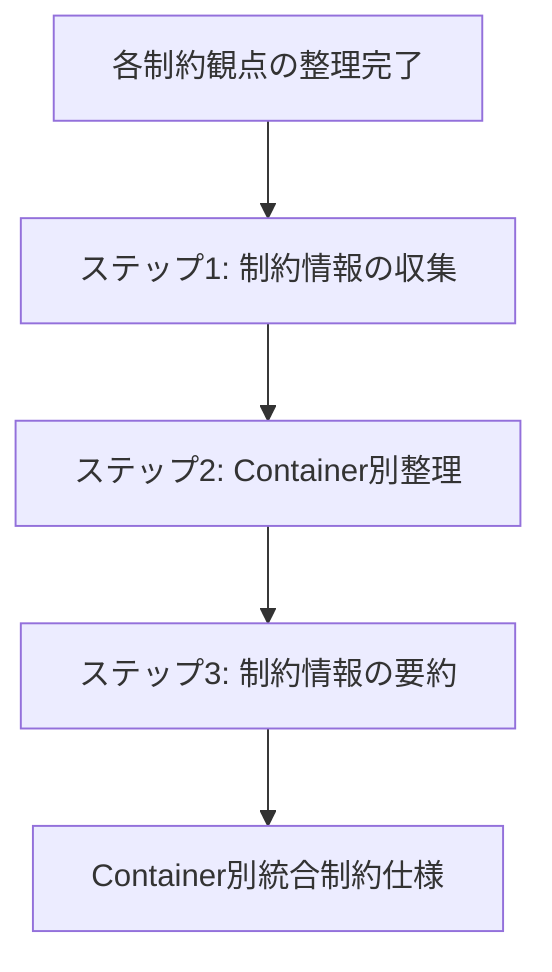
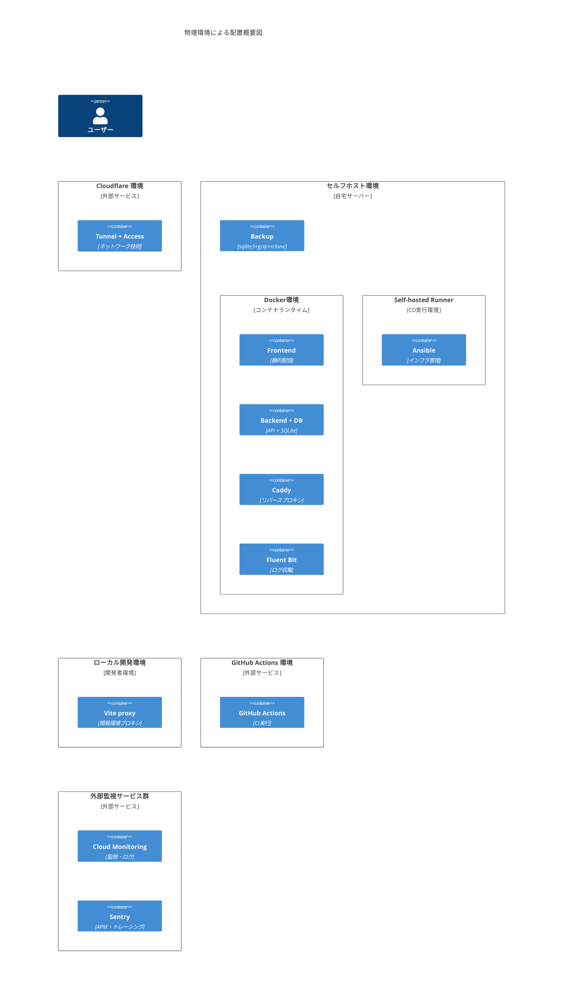
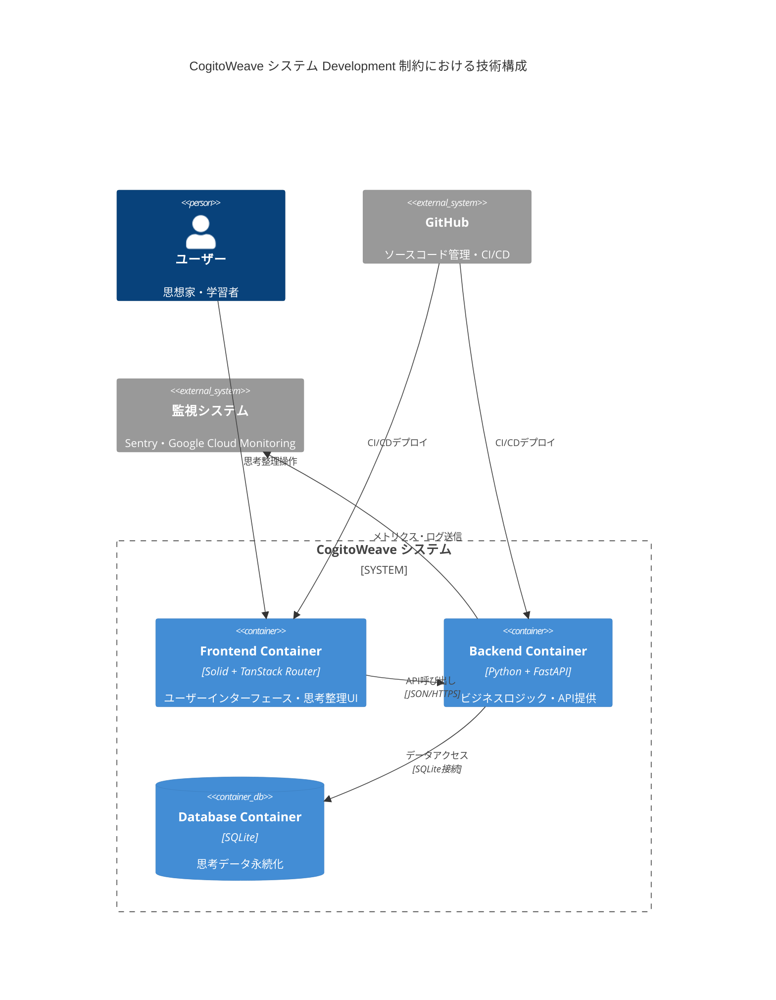

<!-- markdownlint-disable MD024 -->

# 06-constraint-integration - アーキテクチャ制約の統合

## 目次

1. [概要](#概要)
2. [処理フロー](#処理フロー)
3. [ステップ 1: 制約情報の収集](#ステップ-1-制約情報の収集)
4. [ステップ 2: Container 別整理](#ステップ-2-container-別整理)
5. [ステップ 3: 制約情報の要約](#ステップ-3-制約情報の要約)

## 概要

前段階で各制約観点から整理された技術スタック情報と制約調整結果を統合し、Container 別に整理された統一的なアーキテクチャ制約仕様を作成する。

- **関心事**: アーキテクチャ制約の統合と Container 別整理
- **時間軸**: Physical・Development・Process・Logical 制約見直し完了時点
- **視点**: システム全体のアーキテクチャ設計者
- **成果物**: Container 別に統合された制約仕様

Physical 制約(21-06)、Development 制約(21-07)、サービス内 Process 制約(21-08)、サービス間 Process 制約(21-09)、Logical 制約(21-10)で個別に整理された情報を段階的に統合し、Container 単位で参照可能な形式に整理する。

## 処理フロー

## ステップ 1: 制約情報の収集

前段階で整理された 8 つの制約情報を一字一句そのまま収集する。

### Physical 制約: 物理環境配置図

この図は Frontend Container、Backend Container、Database Container、Infrastructure の物理配置を示している。

<!-- PREMISE_BEGIN: physical-environment-overview-diagram -->

<!-- PREMISE_END: physical-environment-overview-diagram -->

### Development 制約: 簡略化リスト

この簡略化リストは Frontend Container、Backend Container、Database Container、Infrastructure の開発技術スタックを列挙している。

<!-- PREMISE_BEGIN: development-constraint-simplified-list -->

- Frontend(Container)
  - フレームワーク：Solid + TanStack Router
  - CSS 手法：Tailwind CSS + CSS Modules ハイブリッド構成
  - UI コンポーネント：Tailwind CSS ベースカスタム実装
  - グラフ可視化：D3
- Backend(Container)
  - 言語・フレームワーク：Python + FastAPI
  - アプリケーションサーバー：uvicorn
  - ORM・マイグレーション：SQLAlchemy + Alembic
  - API ドキュメント生成：FastAPI 内蔵 Swagger UI・ReDoc
  - バリデーション：FastAPI 標準 Pydantic
  - HTTP クライアント：httpx
  - 設定管理：環境変数方式
  - ログ・モニタリング：loguru
- DB(Container)
  - データベース：SQLite
- Vite proxy(Container)
  - ビルドツール：Vite
- GitHub Actions(Container)
  - Git サービス：GitHub
  - フロントエンドテスト：Vitest + Testing Library + Playwright
  - バックエンドテスト
    - テストフレームワーク：pytest
    - API テスト：FastAPI TestClient
    - 非同期テスト：pytest-asyncio
    - モック機能：pytest-mock
    - HTTP モック：httpx-mock
    - 時間モック：time-machine
    - カバレッジ：pytest-cov
    - 並列実行：pytest-xdist
- Fluent Bit(Container)
  - ログ収集：Fluent Bit
- Cloud Monitoring(Container)
  - 監視・ログ：Google Cloud Monitoring
- Sentry(Container)
  - APM・トレーシング：Sentry

<!-- PREMISE_END: development-constraint-simplified-list -->

### Development 制約: Container 図

この Container 図は Frontend Container、Backend Container、Database Container の関係性と責務を示している。

<!-- PREMISE_BEGIN: development-container-diagram -->

<!-- PREMISE_END: development-container-diagram -->

### Process 制約(サービス内): 技術スタック

このサービス内技術スタックは Frontend Container、Backend Container、Database Container、Infrastructure におけるサービス内プロセス制約の技術対応を列挙している。

<!-- PREMISE_BEGIN: intra-process-technology-stack-summary -->

- pytest
  - ユニットテスト・統合テスト・API テスト実行フレームワーク
  - fixture によるテスト環境分離
- FastAPI TestClient
  - FastAPI アプリケーションの独立したテスト環境
- SQLAlchemy
  - ORM によるデータベース操作とセッション管理
  - eager loading による N+1 問題対策
  - トランザクション制御と分離レベル設定
  - パラメータ化クエリによる SQL インジェクション対策
  - テーブルアクセス順序制御と例外処理
  - ORM モデルと制約の連携
- SQLite
  - インメモリデータベース対応
  - インデックス作成と最適化
  - 軽量データベースによる数万件対応
  - ストレージ性能向上対応
  - ローカルデータ保存による個人情報保護
  - ACID 特性によるトランザクション保証
  - READ_COMMITTED 分離レベルサポート
  - 単一ライターモデルによるデッドロック回避
  - データベース制約による整合性保証
  - 単一ファイル構成によるバックアップ
  - WAL モードによる並行アクセス対応
- pytest-asyncio
  - 非同期処理のテスト実行
- pytest-mock
  - モック機能提供
- httpx-mock
  - HTTP 通信のモック化
  - 外部 API モック化
  - タイムアウト・エラーレスポンステスト
- time-machine
  - 時間関連処理のモック化
- Vitest
  - 軽量な JavaScript/TypeScript テスト実行フレームワーク
- Testing Library
  - Solid コンポーネントのレンダリングテスト
  - イベント・状態テスト
  - 複数コンポーネント統合テスト
- Pydantic
  - 入力バリデーション
  - 型・範囲・形式チェック
  - 仕様準拠検証
- loguru
  - 階層的ログレベル管理
  - 機能別ログ出力
  - 緊急度分類
  - パフォーマンスログ出力
  - バックアップ処理ログ出力
  - ファイル出力とローテーション
- httpx
  - 外部 API 通信ログ
  - 利用規約準拠の外部 API 通信
  - 外部 API タイムアウト・リトライ設定
- Fluent Bit
  - 構造化ログ分析ツール
  - ログ集約・検索システム
- Google Cloud Monitoring
  - 外部監視システム
- Sentry
  - APM・トレーシング
- Vite
  - HTML 配信とビルド最適化
  - コード分割とバンドル最適化
- Solid
  - JavaScript 実行管理と DOM 操作最適化
  - Signal による最小限状態管理
  - 軽量再レンダリング機構
  - エラー境界コンポーネント
  - 軽量メモリ管理
- TanStack Router
  - ページ初期化管理
  - SPA ルーティングと遷移管理
  - ルーティングエラーハンドリング
- Tailwind CSS
  - シンプルなエラー画面スタイリング
- D3
  - 必要時のグラフ描画最適化
- JavaScript
  - location.reload による強制リロード
- uvicorn
  - 単一プロセス・単一サーバー実行
  - worker プロセス数調整
  - タイムアウト設定
- Alembic
  - インデックスマイグレーション管理
  - 制約定義のマイグレーション管理
- Python
  - 理解しやすいプログラミング言語
  - バックアップスクリプト実行
  - 単一プロセススクリプト実行
  - 原子的ファイルコピー
  - 逐次実行による同期処理
- 環境変数方式
  - API キー管理と利用規約遵守
- 開発環境
  - HTTP/HTTPS 両対応

<!-- PREMISE_END: intra-process-technology-stack-summary -->

### Process 制約(サービス内): 不足技術スタック

このサービス内不足技術スタックは Frontend Container、Backend Container、Infrastructure において不足している技術要素を列挙している。

<!-- PREMISE_BEGIN: intra-process-missing-technology-stack-summary -->

- pytest-sqlalchemy によるトランザクション境界検証
- jsdom または happy-dom による DOM 環境シミュレーション
- TanStack Router のテスト環境構築手法
- フロントエンド側での API モック化手法
- openapi-typescript による TypeScript 型生成
- API 仕様変更の自動検知手法
- PagerDuty による外部アラートシステム
- Chrome DevTools Memory による開発時メモリ使用量監視
- psutil・htop による CPU・メモリ使用量監視
- Caddy・nginx によるリバースプロキシレベルセキュリティヘッダー設定
- MySQL/PostgreSQL レベルの高度なロック制御機構
- cron・systemd timer・Task Scheduler による定期実行スケジューラー
- フロントエンド側リトライ機構の実装パターン

<!-- PREMISE_END: intra-process-missing-technology-stack-summary -->

### Process 制約(サービス間): 技術スタック

このサービス間技術スタックは Frontend Container、Backend Container、Database Container、Infrastructure におけるサービス間プロセス制約の技術対応を列挙している。

<!-- PREMISE_BEGIN: inter-process-technology-stack-summary -->

- GitHub Actions
  - CI 環境での自動テスト実行
- GitHub
  - PR マージ停止機能
  - 修正・revert 機能
- Playwright
  - E2E テストによる疎通確認
  - フロントエンド正常系テスト
- FastAPI TestClient
  - API テスト実行
  - バックエンド正常系・セキュリティテスト
- pytest-mock + httpx-mock + time-machine
  - モック機能提供
- FastAPI + uvicorn
  - バックエンド実起動
- HTTP クライアント通信
  - 実際の HTTP 通信テスト
- Vitest + Testing Library
  - フロントエンド正常系テスト実行
- pytest
  - バックエンド正常系・セキュリティテスト実行
- loguru
  - エラー情報の詳細追跡
  - 構造化エラー情報出力
- Sentry
  - APM・エラートラッキング
  - クライアントサイド監視・トレーシング
  - 障害検知
- Google Cloud Monitoring
  - システム稼働監視
  - パフォーマンス監視
- Solid + TanStack Router
  - CSR アーキテクチャ
  - フロントエンド HTTP クライアント
  - フロントエンドからバックエンドへの直接呼び出し
- Backend Container
  - 単一バックエンドとの統合
  - モジュール分離による機能独立
  - 手動復旧手順の実装
  - ステートレス実装
  - データ保存制御
- Frontend Container
  - データ統合
  - バックエンドへの依存
- Database Container
  - データ永続化
- Fluent Bit
  - ログ収集・転送
- セルフホスト環境
  - 単一物理サーバーでの運用
- Docker 環境
  - コンテナレベルでの統合管理
  - 単純なコンテナ構成での管理
- SQLAlchemy + Alembic
  - ORM・マイグレーション管理
  - データベースアクセス管理
- SQLite
  - 軽量データベースエンジン
  - ファイルベース定期バックアップ
  - 単一データストア
- ファイルシステム
  - バックアップファイルの検証
- Python + FastAPI
  - 機能別モジュール実装
  - モジュール間協調
  - モジュール分離・ルーター機能
- FastAPI
  - HTTP API サーバー
  - JSON 形式 API・CQS 設計対応
  - HTTP ステータスコードエラーハンドリング
- httpx
  - リクエストタイムアウト設定
  - タイムアウトつき同期通信
- Caddy
  - HTTPS 通信・CORS 設定

<!-- PREMISE_END: inter-process-technology-stack-summary -->

### Process 制約(サービス間): 不足技術スタック

このサービス間不足技術スタックは全ての Container において不足している技術要素がないことを示している。

<!-- PREMISE_BEGIN: inter-process-missing-technology-stack-summary -->

現在の技術スタックでは全てのサービス間 Process 制約要素が実現可能である。不足している技術要素はない。

<!-- PREMISE_END: inter-process-missing-technology-stack-summary -->

### Logical 制約: 技術配置マッピング

この技術配置マッピングは Backend Container、Frontend Container、Database Container における Logical 制約の技術対応を詳細に示している。

<!-- PREMISE_BEGIN: logical-constraint-verification-mapping -->

#### Backend Container

##### Python + FastAPI

- API 契約:
  - エンティティ操作 API: 概念 API、文献メモ API、関係性 API、文献 API
  - 検索・発見 API: 概念検索 API、質問から概念候補提示 API
  - 協働・処理 API: LLM 要約生成 API、記事取得 API、バックアップ API
- API 技術方針:
  - REST API 採用
- バックエンドアーキテクチャスタイル:
  - レイヤードアーキテクチャ採用
  - 階層的な責務分離
  - 機能境界に基づく水平分割
  - 一人開発における保守性と理解しやすさ
- バッチ仕様:
  - 日次データバックアップのみを実装
  - 全データの完全バックアップを日次実行
  - 自動分析・推奨機能、データクリーンアップ、統計処理等は設計方針により除外
- ドメインモデル:
  - 薄いドメイン層アプローチを採用
  - 4 つのエンティティに対して基本的な CRUD 操作と最小限のビジネス制約のみを実装
  - 複雑なドメインロジックはアプリケーション層に委ねる
- 機能境界と責務:
  - コア知識管理境界: 概念管理、文献メモ管理、関係性管理、質問探索を統合して担当
    - データベース操作とトランザクション境界を重点的に検証
  - LLM 統合境界: LLM API による要約生成、概念候補提示、協働プロセス制御を担当
    - 外部 API の契約テストと異常ケース対応を強化
  - コンテンツ取得境界: 外部記事取得、内容解析、品質チェックを担当
    - 構造変更への適応性を継続的に検証
- 主要抽象化設計:
  - 抽象化の相互作用: 外部文献 → 概念フィルター → 文献メモの情報個人化プロセス

##### FastAPI 標準 Pydantic

- API 契約:
  - エンティティ操作 API: 概念 API、文献メモ API、関係性 API、文献 API

##### SQLAlchemy + Alembic

- API 契約:
  - エンティティ操作 API: 概念 API、文献メモ API、関係性 API、文献 API
- ドメインモデル:
  - 4 つのエンティティに対して基本的な CRUD 操作と最小限のビジネス制約のみを実装
  - データベース制約による整合性管理を活用
- データベース方針:
  - リレーショナル構造によるデータ整合性管理
- データモデル:
  - 概念エンティティ: 思考の最小単位として知識体系の中心に位置し、他の概念との関係性によって意味を形成し、外部情報を個人の理解に変換する観点として機能
  - 文献メモエンティティ: ツェッテルカステン方式による概念ベースの知識蓄積として、特定の概念の観点で外部文献を要約・解釈し、LLM 協働により効率的に作成され個人の理解で修正される
  - 関係性エンティティ: 概念間の無向グラフ構造による知識ネットワーク形成として、個人的な関係語彙による柔軟な関係定義と空間配置による直感的な関係性発見を支援
  - 文献エンティティ: 外部文献の書誌情報管理として複数の概念観点から文献メモが生成される元情報
- 機能境界と責務:
  - コア知識管理境界: 概念管理、文献メモ管理、関係性管理、質問探索を統合して担当
- 主要抽象化設計:
  - 概念: 思考の最小単位として知識体系の中心に位置し、外部情報を個人の理解に変換するフィルターとして機能
  - 文献メモ: 概念に綐づく具体的知識内容を表現し、外部文献を個人の観点で解釈した結果として、LLM 協働により効率的に作成され個人の理解で修正される
  - 関係性: 概念間の関連性を表現し知識ネットワークを形成し、個人的な関係語彙による柔軟な関係定義と空間配置による直感的な関係性発見を支援

##### httpx

- API 契約:
  - 協働・処理 API: LLM 要約生成 API、記事取得 API、バックアップ API
- ドメインモデル:
  - 外部 API 処理は分離
- 機能境界と責務:
  - LLM 統合境界: LLM API による要約生成、概念候補提示、協働プロセス制御を担当
  - コンテンツ取得境界: 外部記事取得、内容解析、品質チェックを担当
- 主要抽象化設計:
  - 文献メモ: LLM 協働により効率的に作成され個人の理解で修正される

##### uvicorn

- API 技術方針:
  - システム初回起動パフォーマンスバジェット

##### loguru

- バッチ仕様:
  - システム障害時の迅速復旧を支援
  - バックアップ処理の成功・失敗をログとして出力し、迅速な障害対応を支援する
- 機能境界と責務:
  - コア知識管理境界: データ整合性と応答時間を監視
  - LLM 統合境界: 外部 API 依存性を監視
  - コンテンツ取得境界: 取得成功率と構造変更を追跡

#### Frontend Container

##### Solid + TanStack Router

- API 技術方針:
  - システム初回起動パフォーマンスバジェット
  - 概念ページ読み込みパフォーマンスバジェット
- フロントエンドレンダリングスタイル:
  - CSR(Client-Side Rendering)採用
  - 3 画面間の状態共有効率
  - 軽量なコンポーネント指向の特性
  - 一人での開発における保守性と理解しやすさ
- UI コンポーネント責務:
  - 階層的な粒度設計による軽量なコンポーネント指向アーキテクチャ
  - コンポーネント内部状態とページレベル状態とアプリケーション全体状態の 3 層分離
  - コンテナコンポーネントパターンと単方向データフロー
- UI 技術方針:
  - Web 技術による柔軟な実装アプローチを採用
  - レンダリング方式として CSR を選択
  - 軽量コンポーネント指向を基本とする
  - 保守性と理解しやすさの優先
  - 一人での管理可能な複雑度
- 画面構成設計:
  - メイン画面は概念管理、文献メモ管理、関係性管理を 1 画面に統合
  - 質問探索画面は質問から概念発見とメモ参照を独立画面で提供
- 主要抽象化設計:
  - 抽象化の相互作用: 外部文献 → 概念フィルター → 文献メモの情報個人化プロセス

##### TanStack Router

- UI 技術方針:
  - アプリケーション構造として SPA を選択
- 画面構成設計:
  - シンプルなタブ切り替えによる 3 画面間の移動

##### Tailwind CSS + CSS Modules

- UI コンポーネント責務:
  - コンポーネント共通化とレスポンシブ設計による適応的 UI
- UI 技術方針:
  - Mac 環境での情報整理機能と iPhone 環境での情報参照機能の最適化

##### D3

- 画面構成設計:
  - 空間配置画面は概念の空間配置と関係性構築を専用画面で提供
- 主要抽象化設計:
  - 関係性: 概念間の関連性を表現し知識ネットワークを形成し、個人的な関係語彙による柔軟な関係定義と空間配置による直感的な関係性発見を支援

#### Database Container

##### SQLite

- データベース方針:
  - RDBMS を採用
  - リレーショナル構造によるデータ整合性管理
  - 成熟技術による保守性確保
  - データ規模への十分な対応能力
- ドメインモデル:
  - データベース制約による整合性管理を活用
- データモデル:
  - 概念エンティティ: 思考の最小単位として知識体系の中心に位置し、他の概念との関係性によって意味を形成し、外部情報を個人の理解に変換する観点として機能
  - 文献メモエンティティ: ツェッテルカステン方式による概念ベースの知識蓄積として、特定の概念の観点で外部文献を要約・解釈し、LLM 協働により効率的に作成され個人の理解で修正される
  - 関係性エンティティ: 概念間の無向グラフ構造による知識ネットワーク形成として、個人的な関係語彙による柔軟な関係定義と空間配置による直感的な関係性発見を支援
  - 文献エンティティ: 外部文献の書誌情報管理として複数の概念観点から文献メモが生成される元情報
- バッチ仕様:
  - 日次データバックアップのみを実装
  - 全データの完全バックアップを日次実行
- 主要抽象化設計:
  - 概念: 思考の最小単位として知識体系の中心に位置し、外部情報を個人の理解に変換するフィルターとして機能
  - 文献メモ: 概念に綐づく具体的知識内容を表現し、外部文献を個人の観点で解釈した結果として、LLM 協働により効率的に作成され個人の理解で修正される
  - 関係性: 概念間の関連性を表現し知識ネットワークを形成し、個人的な関係語彙による柔軟な関係定義と空間配置による直感的な関係性発見を支援

<!-- PREMISE_END: logical-constraint-verification-mapping -->

## ステップ 2: Container 別整理

収集した制約情報を Container 別に整理する。内容は一字一句変更せず、配置と構造のみを変更する。

### Frontend Container

#### Physical 制約

physical-environment-overview-diagram より:

- Deployment_Node(selfhost, "セルフホスト環境", "自宅サーバー")
  - Deployment_Node(docker, "Docker 環境", "コンテナランタイム")
    - Container(frontend, "Frontend", "静的配信")

#### Development 制約

development-constraint-simplified-list より:

- フレームワーク：Solid + TanStack Router
- CSS 手法：Tailwind CSS + CSS Modules ハイブリッド構成
- UI コンポーネント：Tailwind CSS ベースカスタム実装
- グラフ可視化：D3

development-container-diagram より:

- Container(frontend, "Frontend Container", "Solid + TanStack Router", "ユーザーインターフェース・思考整理 UI")

#### Process 制約(サービス内)

intra-process-technology-stack-summary より:

- Vitest
  - 軽量な JavaScript/TypeScript テスト実行フレームワーク
- Testing Library
  - Solid コンポーネントのレンダリングテスト
  - イベント・状態テスト
  - 複数コンポーネント統合テスト
- Vite
  - HTML 配信とビルド最適化
  - コード分割とバンドル最適化
- Solid
  - JavaScript 実行管理と DOM 操作最適化
  - Signal による最小限状態管理
  - 軽量再レンダリング機構
  - エラー境界コンポーネント
  - 軽量メモリ管理
- TanStack Router
  - ページ初期化管理
  - SPA ルーティングと遷移管理
  - ルーティングエラーハンドリング
- Tailwind CSS
  - シンプルなエラー画面スタイリング
- D3
  - 必要時のグラフ描画最適化
- JavaScript
  - location.reload による強制リロード

intra-process-missing-technology-stack-summary より(不足している技術要素):

- jsdom または happy-dom による DOM 環境シミュレーション
- TanStack Router のテスト環境構築手法
- フロントエンド側での API モック化手法
- openapi-typescript による TypeScript 型生成
- API 仕様変更の自動検知手法
- Chrome DevTools Memory による開発時メモリ使用量監視
- フロントエンド側リトライ機構の実装パターン

#### Process 制約(サービス間)

inter-process-technology-stack-summary より:

- Playwright
  - E2E テストによる疎通確認
  - フロントエンド正常系テスト
- Vitest + Testing Library
  - フロントエンド正常系テスト実行
- Sentry
  - APM・エラートラッキング
  - クライアントサイド監視・トレーシング
  - 障害検知
- Solid + TanStack Router
  - CSR アーキテクチャ
  - フロントエンド HTTP クライアント
  - フロントエンドからバックエンドへの直接呼び出し
- Frontend Container
  - データ統合
  - バックエンドへの依存

inter-process-missing-technology-stack-summary より:

- 不足している技術要素はない

#### Logical 制約

logical-constraint-verification-mapping より:

##### Solid + TanStack Router

- API 技術方針:
  - システム初回起動パフォーマンスバジェット
  - 概念ページ読み込みパフォーマンスバジェット
- フロントエンドレンダリングスタイル:
  - CSR(Client-Side Rendering)採用
  - 3 画面間の状態共有効率
  - 軽量なコンポーネント指向の特性
  - 一人での開発における保守性と理解しやすさ
- UI コンポーネント責務:
  - 階層的な粒度設計による軽量なコンポーネント指向アーキテクチャ
  - コンポーネント内部状態とページレベル状態とアプリケーション全体状態の 3 層分離
  - コンテナコンポーネントパターンと単方向データフロー
- UI 技術方針:
  - Web 技術による柔軟な実装アプローチを採用
  - レンダリング方式として CSR を選択
  - 軽量コンポーネント指向を基本とする
  - 保守性と理解しやすさの優先
  - 一人での管理可能な複雑度
- 画面構成設計:
  - メイン画面は概念管理、文献メモ管理、関係性管理を 1 画面に統合
  - 質問探索画面は質問から概念発見とメモ参照を独立画面で提供
- 主要抽象化設計:
  - 抽象化の相互作用: 外部文献 → 概念フィルター → 文献メモの情報個人化プロセス

##### TanStack Router

- UI 技術方針:
  - アプリケーション構造として SPA を選択
- 画面構成設計:
  - シンプルなタブ切り替えによる 3 画面間の移動

##### Tailwind CSS + CSS Modules

- UI コンポーネント責務:
  - コンポーネント共通化とレスポンシブ設計による適応的 UI
- UI 技術方針:
  - Mac 環境での情報整理機能と iPhone 環境での情報参照機能の最適化

##### D3

- 画面構成設計:
  - 空間配置画面は概念の空間配置と関係性構築を専用画面で提供
- 主要抽象化設計:
  - 関係性: 概念間の関連性を表現し知識ネットワークを形成し、個人的な関係語彙による柔軟な関係定義と空間配置による直感的な関係性発見を支援

### Backend Container

#### Physical 制約

physical-environment-overview-diagram より:

- Deployment_Node(selfhost, "セルフホスト環境", "自宅サーバー")
  - Deployment_Node(docker, "Docker 環境", "コンテナランタイム")
    - Container(backend, "Backend + DB", "API + SQLite")

#### Development 制約

development-constraint-simplified-list より:

- 言語・フレームワーク：Python + FastAPI
- アプリケーションサーバー：uvicorn
- ORM・マイグレーション：SQLAlchemy + Alembic
- API ドキュメント生成：FastAPI 内蔵 Swagger UI・ReDoc
- バリデーション：FastAPI 標準 Pydantic
- HTTP クライアント：httpx
- 設定管理：環境変数方式
- ログ・モニタリング：loguru
- バックエンドテスト
  - テストフレームワーク：pytest
  - API テスト：FastAPI TestClient
  - 非同期テスト：pytest-asyncio
  - モック機能：pytest-mock
  - HTTP モック：httpx-mock
  - 時間モック：time-machine
  - カバレッジ：pytest-cov
  - 並列実行：pytest-xdist

development-container-diagram より:

- Container(backend, "Backend Container", "Python + FastAPI", "ビジネスロジック・API 提供")

#### Process 制約(サービス内)

intra-process-technology-stack-summary より:

- pytest
  - ユニットテスト・統合テスト・API テスト実行フレームワーク
  - fixture によるテスト環境分離
- FastAPI TestClient
  - FastAPI アプリケーションの独立したテスト環境
- SQLAlchemy
  - ORM によるデータベース操作とセッション管理
  - eager loading による N+1 問題対策
  - トランザクション制御と分離レベル設定
  - パラメータ化クエリによる SQL インジェクション対策
  - テーブルアクセス順序制御と例外処理
  - ORM モデルと制約の連携
- pytest-asyncio
  - 非同期処理のテスト実行
- pytest-mock
  - モック機能提供
- httpx-mock
  - HTTP 通信のモック化
  - 外部 API モック化
  - タイムアウト・エラーレスポンステスト
- time-machine
  - 時間関連処理のモック化
- Pydantic
  - 入力バリデーション
  - 型・範囲・形式チェック
  - 仕様準拠検証
- loguru
  - 階層的ログレベル管理
  - 機能別ログ出力
  - 緊急度分類
  - パフォーマンスログ出力
  - バックアップ処理ログ出力
  - ファイル出力とローテーション
- httpx
  - 外部 API 通信ログ
  - 利用規約準拠の外部 API 通信
  - 外部 API タイムアウト・リトライ設定
- uvicorn
  - 単一プロセス・単一サーバー実行
  - worker プロセス数調整
  - タイムアウト設定
- Alembic
  - インデックスマイグレーション管理
  - 制約定義のマイグレーション管理
- Python
  - 理解しやすいプログラミング言語
  - バックアップスクリプト実行
  - 単一プロセススクリプト実行
  - 原子的ファイルコピー
  - 逐次実行による同期処理
- 環境変数方式
  - API キー管理と利用規約遵守
- 開発環境
  - HTTP/HTTPS 両対応

intra-process-missing-technology-stack-summary より(不足している技術要素):

- pytest-sqlalchemy によるトランザクション境界検証
- psutil・htop による CPU・メモリ使用量監視
- Caddy・nginx によるリバースプロキシレベルセキュリティヘッダー設定
- MySQL/PostgreSQL レベルの高度なロック制御機構

#### Process 制約(サービス間)

inter-process-technology-stack-summary より:

- FastAPI TestClient
  - API テスト実行
  - バックエンド正常系・セキュリティテスト
- pytest-mock + httpx-mock + time-machine
  - モック機能提供
- FastAPI + uvicorn
  - バックエンド実起動
- HTTP クライアント通信
  - 実際の HTTP 通信テスト
- pytest
  - バックエンド正常系・セキュリティテスト実行
- loguru
  - エラー情報の詳細追跡
  - 構造化エラー情報出力
- Backend Container
  - 単一バックエンドとの統合
  - モジュール分離による機能独立
  - 手動復旧手順の実装
  - ステートレス実装
  - データ保存制御
- SQLAlchemy + Alembic
  - ORM・マイグレーション管理
  - データベースアクセス管理
- Python + FastAPI
  - 機能別モジュール実装
  - モジュール間協調
  - モジュール分離・ルーター機能
- FastAPI
  - HTTP API サーバー
  - JSON 形式 API・CQS 設計対応
  - HTTP ステータスコードエラーハンドリング
- httpx
  - リクエストタイムアウト設定
  - タイムアウトつき同期通信

inter-process-missing-technology-stack-summary より:

- 不足している技術要素はない

#### Logical 制約

logical-constraint-verification-mapping より:

##### Python + FastAPI

- API 契約:
  - エンティティ操作 API: 概念 API、文献メモ API、関係性 API、文献 API
  - 検索・発見 API: 概念検索 API、質問から概念候補提示 API
  - 協働・処理 API: LLM 要約生成 API、記事取得 API、バックアップ API
- API 技術方針:
  - REST API 採用
- バックエンドアーキテクチャスタイル:
  - レイヤードアーキテクチャ採用
  - 階層的な責務分離
  - 機能境界に基づく水平分割
  - 一人開発における保守性と理解しやすさ
- バッチ仕様:
  - 日次データバックアップのみを実装
  - 全データの完全バックアップを日次実行
  - 自動分析・推奨機能、データクリーンアップ、統計処理等は設計方針により除外
- ドメインモデル:
  - 薄いドメイン層アプローチを採用
  - 4 つのエンティティに対して基本的な CRUD 操作と最小限のビジネス制約のみを実装
  - 複雑なドメインロジックはアプリケーション層に委ねる
- 機能境界と責務:
  - コア知識管理境界: 概念管理、文献メモ管理、関係性管理、質問探索を統合して担当
    - データベース操作とトランザクション境界を重点的に検証
  - LLM 統合境界: LLM API による要約生成、概念候補提示、協働プロセス制御を担当
    - 外部 API の契約テストと異常ケース対応を強化
  - コンテンツ取得境界: 外部記事取得、内容解析、品質チェックを担当
    - 構造変更への適応性を継続的に検証
- 主要抽象化設計:
  - 抽象化の相互作用: 外部文献 → 概念フィルター → 文献メモの情報個人化プロセス

##### FastAPI 標準 Pydantic

- API 契約:
  - エンティティ操作 API: 概念 API、文献メモ API、関係性 API、文献 API

##### SQLAlchemy + Alembic

- API 契約:
  - エンティティ操作 API: 概念 API、文献メモ API、関係性 API、文献 API
- ドメインモデル:
  - 4 つのエンティティに対して基本的な CRUD 操作と最小限のビジネス制約のみを実装
  - データベース制約による整合性管理を活用
- データベース方針:
  - リレーショナル構造によるデータ整合性管理
- データモデル:
  - 概念エンティティ: 思考の最小単位として知識体系の中心に位置し、他の概念との関係性によって意味を形成し、外部情報を個人の理解に変換する観点として機能
  - 文献メモエンティティ: ツェッテルカステン方式による概念ベースの知識蓄積として、特定の概念の観点で外部文献を要約・解釈し、LLM 協働により効率的に作成され個人の理解で修正される
  - 関係性エンティティ: 概念間の無向グラフ構造による知識ネットワーク形成として、個人的な関係語彙による柔軟な関係定義と空間配置による直感的な関係性発見を支援
  - 文献エンティティ: 外部文献の書誌情報管理として複数の概念観点から文献メモが生成される元情報
- 機能境界と責務:
  - コア知識管理境界: 概念管理、文献メモ管理、関係性管理、質問探索を統合して担当
- 主要抽象化設計:
  - 概念: 思考の最小単位として知識体系の中心に位置し、外部情報を個人の理解に変換するフィルターとして機能
  - 文献メモ: 概念に綐づく具体的知識内容を表現し、外部文献を個人の観点で解釈した結果として、LLM 協働により効率的に作成され個人の理解で修正される
  - 関係性: 概念間の関連性を表現し知識ネットワークを形成し、個人的な関係語彙による柔軟な関係定義と空間配置による直感的な関係性発見を支援

##### httpx

- API 契約:
  - 協働・処理 API: LLM 要約生成 API、記事取得 API、バックアップ API
- ドメインモデル:
  - 外部 API 処理は分離
- 機能境界と責務:
  - LLM 統合境界: LLM API による要約生成、概念候補提示、協働プロセス制御を担当
  - コンテンツ取得境界: 外部記事取得、内容解析、品質チェックを担当
- 主要抽象化設計:
  - 文献メモ: LLM 協働により効率的に作成され個人の理解で修正される

##### uvicorn

- API 技術方針:
  - システム初回起動パフォーマンスバジェット

##### loguru

- バッチ仕様:
  - システム障害時の迅速復旧を支援
  - バックアップ処理の成功・失敗をログとして出力し、迅速な障害対応を支援する
- 機能境界と責務:
  - コア知識管理境界: データ整合性と応答時間を監視
  - LLM 統合境界: 外部 API 依存性を監視
  - コンテンツ取得境界: 取得成功率と構造変更を追跡

### Database Container

#### Physical 制約

physical-environment-overview-diagram より:

- Deployment_Node(selfhost, "セルフホスト環境", "自宅サーバー")
  - Deployment_Node(docker, "Docker 環境", "コンテナランタイム")
    - Container(backend, "Backend + DB", "API + SQLite")

#### Development 制約

development-constraint-simplified-list より:

- データベース：SQLite

development-container-diagram より:

- ContainerDb(database, "Database Container", "SQLite", "思考データ永続化")

#### Process 制約(サービス内)

intra-process-technology-stack-summary より:

- SQLite
  - インメモリデータベース対応
  - インデックス作成と最適化
  - 軽量データベースによる数万件対応
  - ストレージ性能向上対応
  - ローカルデータ保存による個人情報保護
  - ACID 特性によるトランザクション保証
  - READ_COMMITTED 分離レベルサポート
  - 単一ライターモデルによるデッドロック回避
  - データベース制約による整合性保証
  - 単一ファイル構成によるバックアップ
  - WAL モードによる並行アクセス対応

intra-process-missing-technology-stack-summary より(不足している技術要素):

- (該当なし)

#### Process 制約(サービス間)

inter-process-technology-stack-summary より:

- Database Container
  - データ永続化
- SQLite
  - 軽量データベースエンジン
  - ファイルベース定期バックアップ
  - 単一データストア
- ファイルシステム
  - バックアップファイルの検証

inter-process-missing-technology-stack-summary より:

- 不足している技術要素はない

#### Logical 制約

logical-constraint-verification-mapping より:

##### SQLite

- データベース方針:
  - RDBMS を採用
  - リレーショナル構造によるデータ整合性管理
  - 成熟技術による保守性確保
  - データ規模への十分な対応能力
- ドメインモデル:
  - データベース制約による整合性管理を活用
- データモデル:
  - 概念エンティティ: 思考の最小単位として知識体系の中心に位置し、他の概念との関係性によって意味を形成し、外部情報を個人の理解に変換する観点として機能
  - 文献メモエンティティ: ツェッテルカステン方式による概念ベースの知識蓄積として、特定の概念の観点で外部文献を要約・解釈し、LLM 協働により効率的に作成され個人の理解で修正される
  - 関係性エンティティ: 概念間の無向グラフ構造による知識ネットワーク形成として、個人的な関係語彙による柔軟な関係定義と空間配置による直感的な関係性発見を支援
  - 文献エンティティ: 外部文献の書誌情報管理として複数の概念観点から文献メモが生成される元情報
- バッチ仕様:
  - 日次データバックアップのみを実装
  - 全データの完全バックアップを日次実行
- 主要抽象化設計:
  - 概念: 思考の最小単位として知識体系の中心に位置し、外部情報を個人の理解に変換するフィルターとして機能
  - 文献メモ: 概念に綐づく具体的知識内容を表現し、外部文献を個人の観点で解釈した結果として、LLM 協働により効率的に作成され個人の理解で修正される
  - 関係性: 概念間の関連性を表現し知識ネットワークを形成し、個人的な関係語彙による柔軟な関係定義と空間配置による直感的な関係性発見を支援

### Infrastructure

#### Physical 制約

physical-environment-overview-diagram より:

- Deployment_Node(cloudflare, "Cloudflare 環境", "外部サービス")
  - Container(tunnel, "Tunnel + Access", "ネットワーク技術")
- Deployment_Node(selfhost, "セルフホスト環境", "自宅サーバー")
  - Deployment_Node(docker, "Docker 環境", "コンテナランタイム")
    - Container(caddy, "Caddy", "リバースプロキシ")
    - Container(fluent, "Fluent Bit", "ログ収集")
  - Deployment_Node(runner_env, "Self-hosted Runner", "CD 実行環境")
    - Container(ansible, "Ansible", "インフラ管理")
  - Container(backup, "Backup", "sqlite3+gzip+rclone")
- Deployment_Node(local_dev, "ローカル開発環境", "開発者環境")
  - Container(vite_proxy, "Vite proxy", "開発環境プロキシ")
- Deployment_Node(github, "GitHub Actions 環境", "外部サービス")
  - Container(actions, "GitHub Actions", "CI 実行")
- Deployment_Node(monitoring, "外部監視サービス群", "外部サービス")
  - Container(gcp_mon, "Cloud Monitoring", "監視・ログ")
  - Container(sentry, "Sentry", "APM・トレーシング")

#### Development 制約

development-constraint-simplified-list より:

- Vite proxy(Container)
  - ビルドツール：Vite
- GitHub Actions(Container)
  - Git サービス：GitHub
  - フロントエンドテスト：Vitest + Testing Library + Playwright
  - バックエンドテスト
    - テストフレームワーク：pytest
    - API テスト：FastAPI TestClient
    - 非同期テスト：pytest-asyncio
    - モック機能：pytest-mock
    - HTTP モック：httpx-mock
    - 時間モック：time-machine
    - カバレッジ：pytest-cov
    - 並列実行：pytest-xdist
- Fluent Bit(Container)
  - ログ収集：Fluent Bit
- Cloud Monitoring(Container)
  - 監視・ログ：Google Cloud Monitoring
- Sentry(Container)
  - APM・トレーシング：Sentry

development-container-diagram より:

- System_Ext(github, "GitHub", "ソースコード管理・CI/CD")
- System_Ext(monitoring, "監視システム", "Sentry・Google Cloud Monitoring")

#### Process 制約(サービス内)

intra-process-technology-stack-summary より:

- Fluent Bit
  - 構造化ログ分析ツール
  - ログ集約・検索システム
- Google Cloud Monitoring
  - 外部監視システム
- Sentry
  - APM・トレーシング

intra-process-missing-technology-stack-summary より(不足している技術要素):

- PagerDuty による外部アラートシステム
- cron・systemd timer・Task Scheduler による定期実行スケジューラー

#### Process 制約(サービス間)

inter-process-technology-stack-summary より:

- GitHub Actions
  - CI 環境での自動テスト実行
- GitHub
  - PR マージ停止機能
  - 修正・revert 機能
- Playwright
  - E2E テストによる疎通確認
  - フロントエンド正常系テスト
- Sentry
  - APM・エラートラッキング
  - クライアントサイド監視・トレーシング
  - 障害検知
- Google Cloud Monitoring
  - システム稼働監視
  - パフォーマンス監視
- Fluent Bit
  - ログ収集・転送
- セルフホスト環境
  - 単一物理サーバーでの運用
- Docker 環境
  - コンテナレベルでの統合管理
  - 単純なコンテナ構成での管理
- Caddy
  - HTTPS 通信・CORS 設定

inter-process-missing-technology-stack-summary より:

- 不足している技術要素はない

#### Logical 制約

logical-constraint-verification-mapping より:

- (Infrastructure 直接関連の Logical 制約はなし)

## ステップ 3: 制約情報の要約

Container 別に整理した制約情報の重複を除去し、統合された制約仕様として要約する。

### Frontend Container 統合制約

<!-- GLOBAL_CONCLUSION_BEGIN: frontend-container-integrated-constraints -->

#### 物理配置

- セルフホスト環境の Docker コンテナとして静的配信

#### 技術スタック

- フレームワーク: Solid + TanStack Router
- スタイリング: Tailwind CSS + CSS Modules
- グラフ可視化: D3
- ビルドツール: Vite
- テストフレームワーク: Vitest + Testing Library + Playwright

#### アーキテクチャ方針

- CSR(Client-Side Rendering)採用
- SPA(Single Page Application)構造
- 軽量コンポーネント指向アーキテクチャ
- 3 層状態管理(コンポーネント/ページ/アプリケーション)
- コンテナコンポーネントパターンと単方向データフロー

#### 画面構成

- メイン画面: 概念管理、文献メモ管理、関係性管理を統合
- 質問探索画面: 質問から概念発見とメモ参照を独立提供
- 空間配置画面: 概念の空間配置と関係性構築を専用提供
- タブ切り替えによる画面間移動

#### パフォーマンス

- システム初回起動パフォーマンスバジェット対応
- 概念ページ読み込みパフォーマンスバジェット対応
- コード分割とバンドル最適化
- 軽量再レンダリング機構
- 必要時のグラフ描画最適化

#### レスポンシブ対応

- Mac 環境: 情報整理機能最適化
- iPhone 環境: 情報参照機能最適化

#### エラーハンドリング

- エラー境界コンポーネント
- ルーティングエラーハンドリング
- location.reload による強制リロード

#### 監視・トレーシング

- Sentry による APM・エラートラッキング
- クライアントサイド監視・トレーシング
- 障害検知

#### サービス間通信

- バックエンドへの依存(一方向)
- HTTP クライアントによる直接呼び出し
- データ統合責務

#### 不足技術要素

- DOM 環境シミュレーション(jsdom/happy-dom)
- TanStack Router のテスト環境構築手法
- API モック化手法
- TypeScript 型生成(openapi-typescript)
- API 仕様変更の自動検知
- メモリ使用量監視(Chrome DevTools Memory)
- リトライ機構の実装パターン

<!-- GLOBAL_CONCLUSION_END: frontend-container-integrated-constraints -->

### Backend Container 統合制約

<!-- GLOBAL_CONCLUSION_BEGIN: backend-container-integrated-constraints -->

#### 物理配置

- セルフホスト環境の Docker コンテナとして API + SQLite 提供

#### 技術スタック

- 言語・フレームワーク: Python + FastAPI
- アプリケーションサーバー: uvicorn
- ORM・マイグレーション: SQLAlchemy + Alembic
- バリデーション: Pydantic
- HTTP クライアント: httpx
- ログ・モニタリング: loguru
- 設定管理: 環境変数方式
- テストフレームワーク: pytest + FastAPI TestClient + pytest-asyncio + pytest-mock + httpx-mock + time-machine

#### アーキテクチャ方針

- レイヤードアーキテクチャ採用
- 階層的な責務分離
- 機能境界に基づく水平分割
- 薄いドメイン層アプローチ
- モジュール分離による機能独立
- ステートレス実装

#### API 契約

- エンティティ操作 API: 概念 API、文献メモ API、関係性 API、文献 API
- 検索・発見 API: 概念検索 API、質問から概念候補提示 API
- 協働・処理 API: LLM 要約生成 API、記事取得 API、バックアップ API
- REST API 採用
- JSON 形式 API・CQS 設計対応
- HTTP ステータスコードエラーハンドリング
- API ドキュメント生成(FastAPI 内蔵 Swagger UI・ReDoc)

#### 機能境界と責務

- コア知識管理境界: 概念管理、文献メモ管理、関係性管理、質問探索を統合
  - データベース操作とトランザクション境界を重点検証
  - データ整合性と応答時間を監視
- LLM 統合境界: LLM API による要約生成、概念候補提示、協働プロセス制御
  - 外部 API の契約テストと異常ケース対応を強化
  - 外部 API 依存性を監視
- コンテンツ取得境界: 外部記事取得、内容解析、品質チェック
  - 構造変更への適応性を継続検証
  - 取得成功率と構造変更を追跡

#### ドメインモデル

- 4 つのエンティティに対して基本的な CRUD 操作と最小限のビジネス制約
- 複雑なドメインロジックはアプリケーション層に委ねる
- ORM モデルと制約の連携
- データベース制約による整合性管理

#### データモデル

- 概念エンティティ: 思考の最小単位として知識体系の中心に位置し、外部情報を個人の理解に変換するフィルターとして機能
- 文献メモエンティティ: ツェッテルカステン方式による概念ベースの知識蓄積として、LLM 協働により効率的に作成され個人の理解で修正される
- 関係性エンティティ: 概念間の無向グラフ構造による知識ネットワーク形成として、個人的な関係語彙による柔軟な関係定義と空間配置による直感的な関係性発見を支援
- 文献エンティティ: 外部文献の書誌情報管理として複数の概念観点から文献メモが生成される元情報

#### トランザクション制御

- セッション管理とトランザクション制御
- 分離レベル設定
- テーブルアクセス順序制御と例外処理
- パラメータ化クエリによる SQL インジェクション対策

#### パフォーマンス

- システム初回起動パフォーマンスバジェット対応
- eager loading による N+1 問題対策
- 単一プロセス・単一サーバー実行
- worker プロセス数調整
- タイムアウト設定

#### 外部 API 通信

- 利用規約準拠の外部 API 通信
- タイムアウト・リトライ設定
- 外部 API 処理の分離

#### ログ・監視

- 階層的ログレベル管理(ERROR、WARN、INFO、DEBUG)
- 機能別ログ出力
- 緊急度分類
- パフォーマンスログ出力
- ファイル出力とローテーション

#### バッチ仕様

- 日次データバックアップのみを実装
- 全データの完全バックアップを日次実行
- バックアップ処理ログ出力
- システム障害時の迅速復旧を支援

#### セキュリティ

- 入力バリデーション(型・範囲・形式チェック)
- API キー管理と利用規約遵守
- HTTP/HTTPS 両対応(開発環境)

#### サービス間通信

- 単一バックエンドとの統合
- モジュール間協調
- フロントエンドからの独立
- データ保存制御
- 手動復旧手順の実装

#### 不足技術要素

- トランザクション境界検証(pytest-sqlalchemy)
- CPU・メモリ使用量監視(psutil・htop)
- リバースプロキシレベルセキュリティヘッダー設定(Caddy・nginx)
- 高度なロック制御機構(MySQL/PostgreSQL レベル)

<!-- GLOBAL_CONCLUSION_END: backend-container-integrated-constraints -->

### Database Container 統合制約

<!-- GLOBAL_CONCLUSION_BEGIN: database-container-integrated-constraints -->

#### 物理配置

- セルフホスト環境の Docker コンテナ内で Backend と統合配置

#### 技術スタック

- データベース: SQLite

#### データベース方針

- RDBMS 採用
- リレーショナル構造によるデータ整合性管理
- 成熟技術による保守性確保
- データ規模への十分な対応能力

#### データモデル

- 概念エンティティ: 思考の最小単位として知識体系の中心に位置し、外部情報を個人の理解に変換する観点として機能
- 文献メモエンティティ: ツェッテルカステン方式による概念ベースの知識蓄積として、LLM 協働により効率的に作成され個人の理解で修正される
- 関係性エンティティ: 概念間の無向グラフ構造による知識ネットワーク形成として、個人的な関係語彙による柔軟な関係定義と空間配置による直感的な関係性発見を支援
- 文献エンティティ: 外部文献の書誌情報管理として複数の概念観点から文献メモが生成される元情報

#### データ整合性

- データベース制約による整合性保証
- ACID 特性によるトランザクション保証
- READ_COMMITTED 分離レベルサポート
- 単一ライターモデルによるデッドロック回避

#### パフォーマンス

- インデックス作成と最適化
- 軽量データベースによる数万件対応
- ストレージ性能向上対応
- WAL モードによる並行アクセス対応
- インメモリデータベース対応(テスト用)

#### セキュリティ

- ローカルデータ保存による個人情報保護

#### バックアップ

- 単一ファイル構成によるバックアップ
- ファイルベース定期バックアップ
- 日次データバックアップのみを実装
- 全データの完全バックアップを日次実行
- バックアップファイルの検証

#### サービス間通信

- 単一データストア
- データ永続化責務

#### 不足技術要素

- (なし)

<!-- GLOBAL_CONCLUSION_END: database-container-integrated-constraints -->

### Infrastructure 統合制約

<!-- GLOBAL_CONCLUSION_BEGIN: infrastructure-integrated-constraints -->

#### 物理配置

- Cloudflare 環境: Tunnel + Access によるネットワーク技術
- セルフホスト環境
  - Docker 環境: Caddy(リバースプロキシ)、Fluent Bit(ログ収集)
  - Self-hosted Runner: Ansible(インフラ管理)
  - Backup: sqlite3+gzip+rclone
- ローカル開発環境: Vite proxy(開発環境プロキシ)
- GitHub Actions 環境: CI 実行
- 外部監視サービス群: Cloud Monitoring(監視・ログ)、Sentry(APM・トレーシング)

#### CI/CD

- Git サービス: GitHub
- CI 環境での自動テスト実行
- PR マージ停止機能
- 修正・revert 機能
- E2E テストによる疎通確認(Playwright)

#### ビルド・開発環境

- ビルドツール: Vite
- 開発環境プロキシ: Vite proxy

#### ログ・監視

- ログ収集: Fluent Bit
- 構造化ログ分析ツール
- ログ集約・検索システム
- 監視・ログ: Google Cloud Monitoring
- システム稼働監視
- パフォーマンス監視
- APM・トレーシング: Sentry
- エラートラッキング
- 障害検知

#### ネットワーク・セキュリティ

- HTTPS 通信・CORS 設定: Caddy
- リバースプロキシ: Caddy
- ネットワークゲートウェイ: Cloudflare Tunnel + Access

#### コンテナ管理

- セルフホスト環境: 単一物理サーバーでの運用
- Docker 環境: コンテナレベルでの統合管理、単純なコンテナ構成での管理

#### インフラ管理

- Ansible によるインフラ管理
- Self-hosted Runner による CD 実行環境

#### バックアップ

- sqlite3+gzip+rclone による定期バックアップ
- ファイルシステムによるバックアップファイルの検証

#### 不足技術要素

- 外部アラートシステム(PagerDuty)
- 定期実行スケジューラー(cron・systemd timer・Task Scheduler)

<!-- GLOBAL_CONCLUSION_END: infrastructure-integrated-constraints -->
