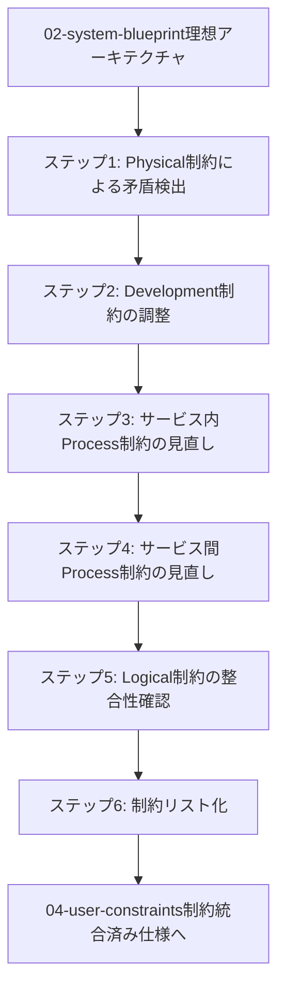

# 03-system-constraints - アーキテクチャ制約の統合

## 目次

1. [概要](#概要)
2. [処理フロー](#処理フロー)
3. [ステップ 1: Physical 制約による矛盾検出](#ステップ-1-physical-制約による矛盾検出)
4. [ステップ 2: Development 制約の調整](#ステップ-2-development-制約の調整)
5. [ステップ 3: サービス内 Process 制約の見直し](#ステップ-3-サービス内-process-制約の見直し)
6. [ステップ 4: サービス間 Process 制約の見直し](#ステップ-4-サービス間-process-制約の見直し)
7. [ステップ 5: Logical 制約の整合性確認](#ステップ-5-logical-制約の整合性確認)
8. [ステップ 6: 制約リスト化](#ステップ-6-制約リスト化)

## 概要

02 の理想に対して、技術的・運用的な制約を適用する段階的プロセスを実行する。

- **関心事**: アーキテクチャ実現可能性を制約する条件
- **時間軸**: 設計判断を確定する時点
- **視点**: システム実装者・運用者
- **成果物**: 制約を統合済みのアーキテクチャ仕様

確認の流れとして Physical（現実のサーバー・運用）で矛盾を検出し、Development を調整し、Process を見直し、必要なら軽く Logical に戻って整合性確認を行う。発見した矛盾や制約をリスト化して残す。

## 処理フロー

## ステップ 1: Physical 制約による矛盾検出

現実のサーバー・運用環境から制約を適用し、理想アーキテクチャとの矛盾を検出する段階である。

- **[Physical 制約の検出](01-physical-constraint-detection/README.md)** - サーバー構成・運用・コストモデルの現実的制約を検出する

Physical 制約には、サーバー構成・運用・コストモデルの現実的制約を含める。この段階により「実装可能性に影響する制約」が明確になる。

## ステップ 2: Development 制約の調整

Physical 制約を踏まえて、開発環境と技術選択を調整する段階である。

- **[Development 制約の調整](02-development-constraint-adjustment/README.md)** - Physical 制約に基づき技術スタック・開発プロセス・テスト戦略を調整する

Physical 制約に基づき、技術選択・開発方針・テスト・トレーサビリティを調整する。

## ステップ 3: サービス内 Process 制約の見直し

Development 制約調整を踏まえて、サービス内プロセス設計を見直す段階である。

- **[サービス内 Process 制約の見直し](03-intra-process-constraint-review/README.md)** - サービス内の処理・セキュリティ・パフォーマンス・監視設計を見直す

Development 制約に基づき、リクエスト処理・バッチ処理・トランザクション・セキュリティ・パフォーマンス・監視・テスト戦略を見直し調整する。

## ステップ 4: サービス間 Process 制約の見直し

サービス内制約調整を踏まえて、サービス間プロセス設計を見直す段階である。

- **[サービス間 Process 制約の見直し](04-inter-process-constraint-review/README.md)** - サービス間の協調・通信・耐障害性・スケーリング設計を見直す

サービス内制約に基づき、サービス境界・協調・データ整合性・分散通信・耐障害性・スケーリング・トレーサビリティ・テスト戦略を見直し調整する。

## ステップ 5: Logical 制約の整合性確認

Process 制約見直しを踏まえて、Logical 設計の整合性を確認する段階である。

- **[Logical 制約の整合性確認](05-logical-constraint-verification/README.md)** - サービス境界やデータ責務の論理設計を調整する

必要に応じてサービス境界やデータ責務の論理設計を調整し、制約適用後の整合性を確保する。

## ステップ 6: 制約リスト化

前段階で整合性を確保した制約を抜き出し、横断的に参照できる形で統合整理する最終段階である。

- **[制約の統合リスト化](06-constraint-integration/README.md)** - 発見した矛盾や制約をリスト化し統合整理する

発見した矛盾や制約をリスト化して残し、04-user-constraints への入力として機能させる。
