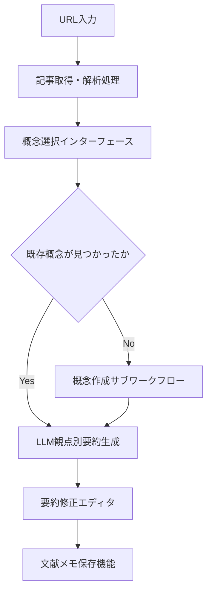

# シナリオ 1 の実現可能性確認

## 要素定義

### UI 要素

<!-- PREMISE_BEGIN: scenario-01-ui-elements-list -->

1. **URL 入力フィールド** - 外部記事の URL 入力
2. **記事取得・解析処理** - URL 指定による外部記事の取得と内容解析
3. **概念検索・選択インターフェース** - 読む観点となる概念の検索・選択
4. **概念新規作成インターフェース** - 新しい概念の作成
5. **LLM による観点別要約生成機能** - 選択した概念の観点で記事内容を要約
6. **要約修正エディタ** - LLM が作成した要約を個人の理解に合わせて修正
7. **文献メモ保存機能** - 修正した内容を個人の知識体系に保存
8. **複数概念適用機能** - 同一記事を別の概念の観点でも読み直し

<!-- PREMISE_END: scenario-01-ui-elements-list -->

### システム処理フロー

<!-- PREMISE_BEGIN: literature-reading-workflow -->

- **目的**: 外部文献を概念に紐付けて知識を蓄積する
- **トリガ**: ユーザーが URL 入力フィールドに URL を入力
- **終了条件**: 文献メモが概念に関連付けられて保存される
- **境界越え**: 外部記事取得 API、LLM 要約生成 API

<!-- PREMISE_END: literature-reading-workflow -->

## 各要素の実現性確認

### URL 入力フィールド

URL 入力フィールドは文献読み込みワークフローの起点となる UI 要素である。この要素を実現するために必要な設計結論を、Logical View、Process View、Development View、Physical View のそれぞれから抜き出して整理する。

- Logical View
  - URL 入力フィールド - 外部記事の URL 入力 (`url-input-field`)
  - メイン画面構成要素 - 新規文献追加用にヘッダー部に配置 (`main-screen-structure`)
- Process View
  - なし
- Development View
  - 基盤技術選択 (`foundation-tech-selection`)
    - フレームワーク: Solid + TanStack Router
    - CSS 手法: Tailwind CSS + CSS Modules ハイブリッド構成
- Physical View
  - フロントエンド配置: 自宅サーバーで静的配信 (`frontend-deployment-decision`)

### 記事取得・解析処理

記事取得・解析処理は、URL から外部記事を取得してタイトルと内容を抽出する処理である。この要素を実現するために必要な設計結論を、Logical View、Process View、Development View、Physical View のそれぞれから抜き出して整理する。

- Logical View
  - 記事取得・解析処理 - URL 指定による外部記事の取得と内容解析 (`functional-specifications`)
  - コンテンツ取得境界 (`content-acquisition-boundary`)
    - 外部記事取得
    - 内容解析
    - 品質チェック
  - 記事取得 API - URL からタイトル・内容を取得 (`api-contract`)
- Process View
  - サービス境界設計 - コンテンツ取得サービス: Web スクレイピングを独立プロセスで分離 (`service-boundaries-decision`)
  - サービス間協調 - フロントエンド直接呼び出し (`service-coordination-pattern`)
  - 分散通信設計 (`distributed-communication-design`)
    - HTTP API 直接通信
    - JSON データフォーマット
    - サービス特性ごとのタイムアウト設定
  - リクエスト処理設計 - 統一タイムアウト: 全 API に 10 秒の統一タイムアウト (`request-processing-design`)
  - セキュリティ設計 - 多層防御実装: リクエストレイヤーでの入力バリデーション (`security-design`)
- Development View
  - バックエンド言語・フレームワーク: Python + FastAPI (`language-framework-selection`)
  - HTTP クライアント: httpx (`http-client-tech-selection`)
  - バリデーション技術: FastAPI 標準 Pydantic (`validation-tech-selection`)
  - **[技術不足]**: HTML パース・コンテンツ抽出ライブラリ(BeautifulSoup4, readability-lxml 等)
- Physical View
  - バックエンド配置 (`backend-deployment-decision`)
    - 自宅サーバーで API を提供
    - Docker コンテナ化
  - 開発・本番環境 (`development-production-environment`)
    - 開発時: Vite proxy
    - 本番時: Caddy

### 概念検索・選択インターフェース

概念検索・選択インターフェースは、既存概念から読む観点を検索・選択する UI 要素である。この要素を実現するために必要な設計結論を、Logical View、Process View、Development View、Physical View のそれぞれから抜き出して整理する。

- Logical View
  - 概念選択インターフェース - 用途に応じた概念の検索・選択機能 (`concept-selection-interface`)
  - メイン画面構成要素 - 左サイドバーに配置し概念一覧と検索機能を提供 (`main-screen-structure`)
  - 概念検索 API - 名前・説明での部分一致検索 (`api-contract`)
  - 概念エンティティ - ID、名前、説明、作成日時、更新日時 (`concept-entity`)
- Process View
  - リクエスト処理設計 - 同期処理ベース、リクエスト検証 (`request-processing-design`)
  - バックエンドパフォーマンス設計 - API 呼び出し 600ms 以内 (`backend-performance-design`)
- Development View
  - 基盤技術選択 (`foundation-tech-selection`)
    - フレームワーク: Solid + TanStack Router
    - CSS 手法: Tailwind CSS + CSS Modules ハイブリッド構成
  - バックエンド言語・フレームワーク: Python + FastAPI (`language-framework-selection`)
  - ORM/ODM: SQLAlchemy + Alembic (`orm-selection`)
  - HTTP 通信・API 連携: fetch API (`http-api-selection`)
- Physical View
  - フロントエンド配置: 自宅サーバーで静的配信 (`frontend-deployment-decision`)
  - バックエンド配置 (`backend-deployment-decision`)
    - 自宅サーバーで API を提供
    - Docker コンテナ化
  - データベース: SQLite (`sqlite-selection`)

### 概念新規作成インターフェース

概念新規作成インターフェースは、新しい概念を作成する UI 要素である。この要素を実現するために必要な設計結論を、Logical View、Process View、Development View、Physical View のそれぞれから抜き出して整理する。

- Logical View
  - 概念作成インターフェース - 新規概念作成と関連概念入力の統合機能 (`concept-creation-interface`)
  - メイン画面構成要素 - 概念追加ボタンからモーダル表示 (`main-screen-structure`)
  - 概念 API - 作成・読み取り・更新 (`api-contract`)
  - 概念エンティティ - ID、名前、説明、作成日時、更新日時 (`concept-entity`)
- Process View
  - リクエスト処理設計 - 同期処理ベース、リクエスト検証 (`request-processing-design`)
  - トランザクション設計 - 1 つの API リクエスト内で関連するデータ更新を 1 つのトランザクションで完結 (`transaction-design`)
  - セキュリティ設計 - 多層防御実装: リクエストレイヤーでの入力バリデーション (`security-design`)
- Development View
  - 基盤技術選択 (`foundation-tech-selection`)
    - フレームワーク: Solid + TanStack Router
    - CSS 手法: Tailwind CSS + CSS Modules ハイブリッド構成
  - バックエンド言語・フレームワーク: Python + FastAPI (`language-framework-selection`)
  - ORM/ODM: SQLAlchemy + Alembic (`orm-selection`)
  - バリデーション技術: FastAPI 標準 Pydantic (`validation-tech-selection`)
  - HTTP 通信・API 連携: fetch API (`http-api-selection`)
- Physical View
  - フロントエンド配置: 自宅サーバーで静的配信 (`frontend-deployment-decision`)
  - バックエンド配置 (`backend-deployment-decision`)
    - 自宅サーバーで API を提供
    - Docker コンテナ化
  - データベース: SQLite (`sqlite-selection`)

### LLM による観点別要約生成機能

LLM による観点別要約生成機能は、選択した概念の観点で記事内容を要約する機能である。この要素を実現するために必要な設計結論を、Logical View、Process View、Development View、Physical View のそれぞれから抜き出して整理する。

- Logical View
  - LLM による観点別要約生成機能 - 選択した概念の観点で記事内容を要約 (`functional-specifications`)
  - LLM 統合境界 - LLM API による要約生成、概念候補提示、協働プロセス制御を担当 (`llm-integration-boundary`)
  - LLM 要約生成 API - 記事内容と概念 ID から観点別要約を生成 (`api-contract`)
- Process View
  - サービス境界設計 - LLM 統合サービス: 外部 API 依存を独立プロセスで分離 (`service-boundaries-decision`)
  - サービス間協調 - フロントエンド直接呼び出し (`service-coordination-pattern`)
  - 分散通信設計 (`distributed-communication-design`)
    - HTTP API 直接通信
    - JSON データフォーマット
    - サービス特性ごとのタイムアウト設定
  - リクエスト処理設計 - 統一タイムアウト: 全 API に 10 秒の統一タイムアウト (`request-processing-design`)
  - 耐障害性設計 - 外部 API 障害時のエラー伝達 (`fault-tolerance-strategy`)
- Development View
  - バックエンド言語・フレームワーク: Python + FastAPI (`language-framework-selection`)
  - HTTP クライアント: httpx (`http-client-tech-selection`)
  - バリデーション技術: FastAPI 標準 Pydantic (`validation-tech-selection`)
  - **[技術不足]**: LLM API クライアントライブラリ(OpenAI Python SDK 等)
- Physical View
  - バックエンド配置 (`backend-deployment-decision`)
    - 自宅サーバーで API を提供
    - Docker コンテナ化
  - 開発・本番環境 (`development-production-environment`)
    - 開発時: Vite proxy
    - 本番時: Caddy

### 要約修正エディタ

要約修正エディタは、LLM が作成した要約を個人の理解に合わせて修正する UI 要素である。この要素を実現するために必要な設計結論を、Logical View、Process View、Development View、Physical View のそれぞれから抜き出して整理する。

- Logical View
  - 要約修正エディタ - LLM が作成した要約を個人の理解に合わせて修正 (`summary-editor`)
  - メイン画面構成要素 - 文献メモ編集時に専用エディタを表示 (`main-screen-structure`)
  - 状態管理責務 - コンポーネント内部状態: 入力値・編集中データ等の局所的な制御 (`state-management-responsibilities`)
- Process View
  - なし
- Development View
  - 基盤技術選択 (`foundation-tech-selection`)
    - フレームワーク: Solid + TanStack Router
    - CSS 手法: Tailwind CSS + CSS Modules ハイブリッド構成
  - 状態管理方針 - 編集中データは一時的にローカルストレージに保存 (`state-management-policy`)
- Physical View
  - フロントエンド配置: 自宅サーバーで静的配信 (`frontend-deployment-decision`)

### 文献メモ保存機能

文献メモ保存機能は、修正した内容を個人の知識体系に保存する機能である。この要素を実現するために必要な設計結論を、Logical View、Process View、Development View、Physical View のそれぞれから抜き出して整理する。

- Logical View
  - 文献メモ保存機能 - 修正した内容を個人の知識体系に保存 (`literature-memo-save`)
  - 文献メモ API - 作成・読み取り・更新・概念別一覧取得 (`api-contract`)
  - 文献メモエンティティ - ID、タイトル、内容、元 URL、作成日時、更新日時 (`literature-memo-entity`)
  - 文献エンティティ - ID、URL、タイトル、取得日時 (`literature-entity`)
- Process View
  - リクエスト処理設計 - 同期処理ベース、リクエスト検証 (`request-processing-design`)
  - トランザクション設計 - 1 つの API リクエスト内で関連するデータ更新を 1 つのトランザクションで完結 (`transaction-design`)
  - データ整合性設計 - 単一データストア責務: コア知識管理サービスのみがデータ永続化を担当 (`data-consistency-strategy`)
  - セキュリティ設計 - 多層防御実装: リクエストレイヤーでの入力バリデーション (`security-design`)
- Development View
  - バックエンド言語・フレームワーク: Python + FastAPI (`language-framework-selection`)
  - ORM/ODM: SQLAlchemy + Alembic (`orm-selection`)
  - バリデーション技術: FastAPI 標準 Pydantic (`validation-tech-selection`)
  - HTTP 通信・API 連携: fetch API (`http-api-selection`)
- Physical View
  - フロントエンド配置: 自宅サーバーで静的配信 (`frontend-deployment-decision`)
  - バックエンド配置 (`backend-deployment-decision`)
    - 自宅サーバーで API を提供
    - Docker コンテナ化
  - データベース: SQLite (`sqlite-selection`)

### 複数概念適用機能

複数概念適用機能は、同一記事を別の概念の観点でも読み直す機能である。この要素を実現するために必要な設計結論を、Logical View、Process View、Development View、Physical View のそれぞれから抜き出して整理する。

- Logical View
  - 複数概念適用機能 - 同一記事を別の概念の観点でも読み直し (`functional-specifications`)
  - 概念選択インターフェース - 用途に応じた概念の検索・選択機能 (`concept-selection-interface`)
  - LLM 要約生成 API - 記事内容と概念 ID から観点別要約を生成 (`api-contract`)
  - 文献メモ API - 作成・読み取り・更新・概念別一覧取得 (`api-contract`)
- Process View
  - サービス間協調 - フロントエンド直接呼び出し (`service-coordination-pattern`)
  - リクエスト処理設計 - 同期処理ベース (`request-processing-design`)
  - 一方向データフロー - 「外部取得 → フロントエンド統合 → コア保存」の流れに限定 (`data-consistency-strategy`)
- Development View
  - 基盤技術選択 (`foundation-tech-selection`)
    - フレームワーク: Solid + TanStack Router
    - CSS 手法: Tailwind CSS + CSS Modules ハイブリッド構成
  - HTTP 通信・API 連携: fetch API (`http-api-selection`)
- Physical View
  - フロントエンド配置: 自宅サーバーで静的配信 (`frontend-deployment-decision`)

### 文献読み込み・要約作成ワークフロー

文献読み込み・要約作成ワークフローは、URL 入力から文献メモ保存までの一連の処理フローである。このワークフロー全体を実現するために必要な設計結論を、Logical View、Process View、Development View、Physical View のそれぞれから抜き出して整理する。

- Logical View
  - メイン画面統合 - 概念管理、文献メモ管理、関係性管理を 1 画面に統合 (`main-screen-integration`)
  - データフロー設計 (`data-flow-design`)
    - コンテナコンポーネントパターン: データ取得・API 呼び出し責務を上位コンポーネントに集約
    - 単方向データフロー: props による下方向データ流れと callback による上方向イベント伝播
  - 状態管理責務 (`state-management-responsibilities`)
    - ページレベル状態: 選択中概念・検索フィルタ・編集中データ等の複数コンポーネント間共有
  - API 契約 - 9 つの論理的 API 群による統合 (`api-contract`)
- Process View
  - サービス間協調 (`service-coordination-pattern`)
    - フロントエンド直接呼び出し
    - タイムアウトつき同期通信
  - データ整合性設計 (`data-consistency-strategy`)
    - 一方向データフロー: 「外部取得 → フロントエンド統合 → コア保存」
  - 分散通信設計 (`distributed-communication-design`)
    - HTTP API 直接通信
    - JSON データフォーマット
    - HTTP ステータスコードエラーハンドリング
  - 耐障害性設計 (`fault-tolerance-strategy`)
    - 部分機能の継続: 外部 API 障害時でも基本機能維持
    - 明確なエラー伝達: 障害種別・影響範囲・対応手順の表示
  - リクエスト処理設計 (`request-processing-design`)
    - 同期処理ベース
    - 統一タイムアウト: 全 API に 10 秒
  - フロントエンドパフォーマンス設計 (`frontend-performance-design`)
    - 初回起動時: HTML → JavaScript → DOM → レンダリング
    - 概念ページ遷移時: 最小限の状態のみ保持
- Development View
  - 基盤技術選択 (`foundation-tech-selection`)
    - フレームワーク: Solid + TanStack Router
    - ビルドツール: Vite
    - CSS 手法: Tailwind CSS + CSS Modules ハイブリッド構成
  - 状態管理方針 - 各画面で独立した状態管理、編集中データはローカルストレージ (`state-management-policy`)
  - パフォーマンス最適化方針 - 概念ページ読み込み 1.5 秒以内を最優先 (`performance-optimization-policy`)
  - HTTP 通信・API 連携: fetch API (`http-api-selection`)
- Physical View
  - フロントエンド配置: 自宅サーバーで静的配信 (`frontend-deployment-decision`)
  - バックエンド配置 (`backend-deployment-decision`)
    - 自宅サーバーで API を提供
    - Docker コンテナ化
  - 開発・本番環境 (`development-production-environment`)
    - 開発時: Vite proxy
    - 本番時: Caddy
  - データベース: SQLite (`sqlite-selection`)

## 実現可能性の結論

シナリオ 1「文献読み込み・要約作成ワークフロー」の実現可能性を、Logical View、Process View、Development View、Physical View の観点から総合的に評価する。

### Logical View の結論

シナリオ 1 の実現に必要な論理設計は完全に定義されている。

- UI 要素の配置と責務が明確に定義されている
- API 契約が 9 つの論理的 API 群として整理されている
- データモデル(概念、文献メモ、関係性、文献)が確立されている
- 画面構成とコンポーネント責務が明確化されている

**結論**: 論理設計の観点から実現可能である。

### Process View の結論

シナリオ 1 の実現に必要なプロセス設計は完全に定義されている。

- 3 サービス(コア知識管理、LLM 統合、コンテンツ取得)の境界と協調が明確である
- フロントエンド直接呼び出しによるシンプルな通信設計が確立されている
- データ整合性、耐障害性、セキュリティの方針が定義されている
- パフォーマンス制約(API 呼び出し 600ms 以内)への対応方針が明確である

**結論**: プロセス設計の観点から実現可能である。

### Development View の結論

シナリオ 1 の実現に必要な開発技術は概ね選択済みだが、一部技術不足が存在する。

- フロントエンド技術スタック(Solid, TanStack Router, Vite, Tailwind CSS)が確定している
- バックエンド技術スタック(Python, FastAPI, SQLAlchemy, httpx)が確定している
- テストツール(Vitest, Testing Library, Playwright, pytest)が選定されている

**技術不足**:

- HTML パース・コンテンツ抽出ライブラリ(BeautifulSoup4, readability-lxml 等)の選択が未決定
- LLM API クライアントライブラリ(OpenAI Python SDK 等)の選択が未決定

**結論**: 技術不足を解消すれば実現可能である。

### Physical View の結論

シナリオ 1 の実現に必要な物理配置は完全に定義されている。

- 自宅サーバーでの統合配置(フロントエンド、バックエンド、データベース)が確定している
- Docker コンテナ化による環境分離が決定している
- 開発環境(Vite proxy)と本番環境(Caddy)の構成が明確である
- 監視・ログ基盤(Google Cloud Monitoring, Fluent Bit, Sentry)が選定されている

**結論**: 物理配置の観点から実現可能である。

### 総合結論

<!-- GLOBAL_CONCLUSION_BEGIN: scenario-01-validate-conclusion -->

シナリオ 1「文献読み込み・要約作成ワークフロー」は、以下の技術不足を解消すれば実現可能である。

**必要な追加技術選択**:

1. HTML パース・コンテンツ抽出ライブラリの選択(BeautifulSoup4, readability-lxml 等)
2. LLM API クライアントライブラリの選択(OpenAI Python SDK 等)

**その他の問題**: なし

<!-- GLOBAL_CONCLUSION_END: scenario-01-validate-conclusion -->

全ての設計観点から必要な結論が揃っており、技術的な阻害要因は存在しない。上記 2 つのライブラリ選択を完了すれば、シナリオ 1 の実装を開始できる状態である。
