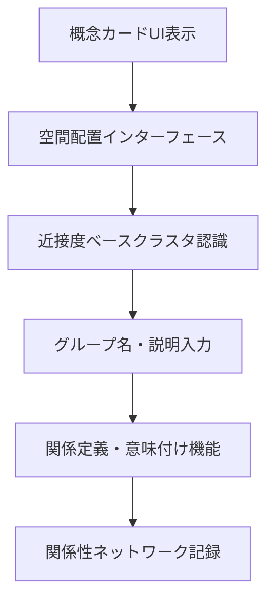

# シナリオ 2 の実現可能性確認

## 要素定義

### UI 要素

<!-- PREMISE_BEGIN: scenario-02-ui-elements-list -->

1. **概念カード UI** - 概念を視覚的に操作可能なカード形式で表示
2. **ドラッグ&ドロップ空間配置機能** - 直感的な位置決めインターフェース
3. **近接度ベースクラスタ認識・境界表示機能** - 近くに置かれた概念のクラスタ認識と視覚的境界表示
4. **グループ名・説明入力機能** - 形成されたグループへの名前や説明の後付け入力

<!-- PREMISE_END: scenario-02-ui-elements-list -->

### システム処理フロー

<!-- PREMISE_BEGIN: concept-relationship-building-workflow -->

- **目的**: 概念間の関係を発見・定義して知識ネットワークを構築する
- **トリガ**: ユーザーが空間配置インターフェースで概念を操作
- **終了条件**: 概念関連が定義されてネットワークに記録される
- **境界越え**: クラスタ認識アルゴリズム

<!-- PREMISE_END: concept-relationship-building-workflow -->

## 各要素の実現性確認

### 概念カード UI

概念カード UI は概念を視覚的に操作可能なカード形式で表示する UI 要素である。この要素を実現するために必要な設計結論を、Logical View、Process View、Development View、Physical View のそれぞれから抜き出して整理する。

- Logical View
  - 概念カード UI - 概念を視覚的に操作可能なカード形式で表示 (`concept-cards-ui`)
  - 空間配置画面構成要素 - 全画面を使用した概念配置キャンバス (`spatial-arrangement-screen-structure`)
  - 概念エンティティ - ID、名前、説明、作成日時、更新日時 (`concept-entity`)
- Process View
  - なし
- Development View
  - 基盤技術選択 (`foundation-tech-selection`)
    - フレームワーク: Solid + TanStack Router
    - CSS 手法: Tailwind CSS + CSS Modules ハイブリッド構成
- Physical View
  - フロントエンド配置: 自宅サーバーで静的配信 (`frontend-deployment-decision`)

### ドラッグ&ドロップ空間配置機能

ドラッグ&ドロップ空間配置機能は概念の直感的な位置決めを実現する UI 要素である。この要素を実現するために必要な設計結論を、Logical View、Process View、Development View、Physical View のそれぞれから抜き出して整理する。

- Logical View
  - 空間配置インターフェース - 概念の直感的な配置機能 (`spatial-arrangement-interface`)
  - 空間配置画面構成要素 - 全画面を使用した概念配置キャンバス (`spatial-arrangement-screen-structure`)
  - 状態管理責務 - コンポーネント内部状態: 表示状態等の局所的な制御 (`state-management-responsibilities`)
- Process View
  - なし
- Development View
  - 基盤技術選択 (`foundation-tech-selection`)
    - フレームワーク: Solid + TanStack Router
    - CSS 手法: Tailwind CSS + CSS Modules ハイブリッド構成
  - **[技術不足]**: ドラッグ&ドロップライブラリ(dnd-kit, @dnd-kit/sortable 等)
- Physical View
  - フロントエンド配置: 自宅サーバーで静的配信 (`frontend-deployment-decision`)

### 近接度ベースクラスタ認識・境界表示機能

近接度ベースクラスタ認識・境界表示機能は、近くに置かれた概念のクラスタを自動認識して視覚的境界を表示する機能である。この要素を実現するために必要な設計結論を、Logical View、Process View、Development View、Physical View のそれぞれから抜き出して整理する。

- Logical View
  - 近接度ベースクラスタ認識・境界表示機能 - 近くに置かれた概念のクラスタ認識と視覚的境界表示 (`cluster-recognition-display`)
  - 空間配置画面構成要素 - 自動クラスタ認識と視覚的境界表示 (`spatial-arrangement-screen-structure`)
- Process View
  - なし
- Development View
  - 基盤技術選択 (`foundation-tech-selection`)
    - フレームワーク: Solid + TanStack Router
    - CSS 手法: Tailwind CSS + CSS Modules ハイブリッド構成
  - **[技術不足]**: クラスタリングアルゴリズムライブラリ(DBSCAN、K-means 等の実装)
- Physical View
  - フロントエンド配置: 自宅サーバーで静的配信 (`frontend-deployment-decision`)

### グループ名・説明入力機能

グループ名・説明入力機能は、形成されたグループへの名前や説明を後付けで入力する UI 要素である。この要素を実現するために必要な設計結論を、Logical View、Process View、Development View、Physical View のそれぞれから抜き出して整理する。

- Logical View
  - グループ名・説明入力機能 - 形成されたグループへの名前や説明の後付け入力 (`group-naming-function`)
  - 空間配置画面構成要素 - クラスタ形成時の命名インターフェース (`spatial-arrangement-screen-structure`)
  - 関係性エンティティ - ID、関係名、説明、作成日時 (`relationship-entity`)
- Process View
  - リクエスト処理設計 - 同期処理ベース、リクエスト検証 (`request-processing-design`)
  - トランザクション設計 - 1 つの API リクエスト内で関連するデータ更新を 1 つのトランザクションで完結 (`transaction-design`)
- Development View
  - 基盤技術選択 (`foundation-tech-selection`)
    - フレームワーク: Solid + TanStack Router
    - CSS 手法: Tailwind CSS + CSS Modules ハイブリッド構成
  - バックエンド言語・フレームワーク: Python + FastAPI (`language-framework-selection`)
  - ORM/ODM: SQLAlchemy + Alembic (`orm-selection`)
  - HTTP 通信・API 連携: fetch API (`http-api-selection`)
- Physical View
  - フロントエンド配置: 自宅サーバーで静的配信 (`frontend-deployment-decision`)
  - バックエンド配置 (`backend-deployment-decision`)
    - 自宅サーバーで API を提供
    - Docker コンテナ化
  - データベース: SQLite (`sqlite-selection`)

### 概念関係性構築ワークフロー

概念関係性構築ワークフローは、概念カード UI から関係性ネットワーク記録までの一連の処理フローである。このワークフロー全体を実現するために必要な設計結論を、Logical View、Process View、Development View、Physical View のそれぞれから抜き出して整理する。

- Logical View
  - 空間配置画面統合 - 概念の空間配置と関係性構築を専用画面で提供 (`spatial-arrangement-screen-integration`)
  - 空間配置画面構成要素 - 全画面を使用した概念配置キャンバス、概念カード UI、自動クラスタ認識 (`spatial-arrangement-screen-structure`)
  - 関係性 API - 作成・読み取り・更新 (`api-contract`)
  - データフロー設計 (`data-flow-design`)
    - コンテナコンポーネントパターン: データ取得・API 呼び出し責務を上位コンポーネントに集約
    - 単方向データフロー: props による下方向データ流れと callback による上方向イベント伝播
- Process View
  - リクエスト処理設計 - 同期処理ベース (`request-processing-design`)
  - トランザクション設計 - 1 つの API リクエスト内で関連するデータ更新を 1 つのトランザクションで完結 (`transaction-design`)
  - バックエンドパフォーマンス設計 - API 呼び出し 600ms 以内 (`backend-performance-design`)
- Development View
  - 基盤技術選択 (`foundation-tech-selection`)
    - フレームワーク: Solid + TanStack Router
    - CSS 手法: Tailwind CSS + CSS Modules ハイブリッド構成
  - 状態管理方針 - 各画面で独立した状態管理 (`state-management-policy`)
  - HTTP 通信・API 連携: fetch API (`http-api-selection`)
- Physical View
  - フロントエンド配置: 自宅サーバーで静的配信 (`frontend-deployment-decision`)
  - バックエンド配置 (`backend-deployment-decision`)
    - 自宅サーバーで API を提供
    - Docker コンテナ化
  - データベース: SQLite (`sqlite-selection`)

## 実現可能性の結論

シナリオ 2「概念関係性構築ワークフロー」の実現可能性を、Logical View、Process View、Development View、Physical View の観点から総合的に評価する。

### Logical View の結論

シナリオ 2 の実現に必要な論理設計は完全に定義されている。

- 空間配置画面の構成とコンポーネント責務が明確に定義されている
- 関係性 API 契約が確立されている
- データモデル(概念、関係性)が確立されている
- データフロー設計が明確化されている

**結論**: 論理設計の観点から実現可能である。

### Process View の結論

シナリオ 2 の実現に必要なプロセス設計は完全に定義されている。

- リクエスト処理設計が確立されている
- トランザクション設計が明確である
- パフォーマンス制約(API 呼び出し 600ms 以内)への対応方針が明確である

**結論**: プロセス設計の観点から実現可能である。

### Development View の結論

シナリオ 2 の実現に必要な開発技術は概ね選択済みだが、一部技術不足が存在する。

- フロントエンド技術スタック(Solid, TanStack Router, Tailwind CSS)が確定している
- バックエンド技術スタック(Python, FastAPI, SQLAlchemy)が確定している

**技術不足**:

- ドラッグ&ドロップライブラリ(dnd-kit, @dnd-kit/sortable 等)の選択が未決定
- クラスタリングアルゴリズムライブラリ(DBSCAN、K-means 等の実装)の選択が未決定

**結論**: 技術不足を解消すれば実現可能である。

### Physical View の結論

シナリオ 2 の実現に必要な物理配置は完全に定義されている。

- 自宅サーバーでの統合配置(フロントエンド、バックエンド、データベース)が確定している
- Docker コンテナ化による環境分離が決定している

**結論**: 物理配置の観点から実現可能である。

### 総合結論

<!-- GLOBAL_CONCLUSION_BEGIN: scenario-02-validate-conclusion -->

シナリオ 2「概念関係性構築ワークフロー」は、以下の技術不足を解消すれば実現可能である。

**必要な追加技術選択**:

1. ドラッグ&ドロップライブラリの選択(dnd-kit, @dnd-kit/sortable 等)
2. クラスタリングアルゴリズムライブラリの選択(DBSCAN、K-means 等の実装)

**その他の問題**: なし

<!-- GLOBAL_CONCLUSION_END: scenario-02-validate-conclusion -->

全ての設計観点から必要な結論が揃っており、技術的な阻害要因は存在しない。上記 2 つのライブラリ選択を完了すれば、シナリオ 2 の実装を開始できる状態である。
