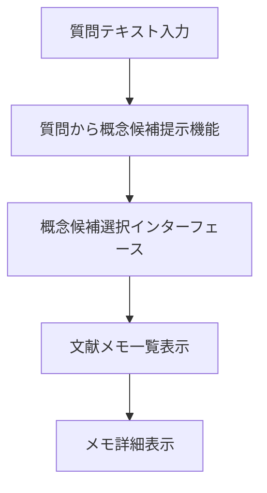

# シナリオ 4 の実現可能性確認

## 要素定義

### UI 要素

<!-- PREMISE_BEGIN: scenario-04-ui-elements-list -->

1. **質問テキスト入力フィールド** - 質問内容を受け取るインターフェース
2. **質問から概念候補提示機能** - 質問内容から関連しそうな概念候補を提示
3. **概念候補選択インターフェース** - 提示された概念候補から関連する概念を選択
4. **文献メモ一覧表示機能** - 選択した概念に紐付いた文献メモを表示
5. **メモ詳細表示機能** - 各メモの詳細内容を参照して過去の体験や知識を思い出す機能

<!-- PREMISE_END: scenario-04-ui-elements-list -->

### システム処理フロー

<!-- PREMISE_BEGIN: question-exploration-workflow -->

- **目的**: 質問から関連概念を発見してメモを参照する
- **トリガ**: ユーザーが質問テキスト入力フィールドに質問を入力
- **終了条件**: 関連文献メモが表示される
- **境界越え**: LLM 概念候補生成 API

<!-- PREMISE_END: question-exploration-workflow -->

## 各要素の実現性確認

### 質問テキスト入力フィールド

質問テキスト入力フィールドは、質問内容を受け取る UI 要素である。この要素を実現するために必要な設計結論を、Logical View、Process View、Development View、Physical View のそれぞれから抜き出して整理する。

- Logical View
  - 質問テキスト入力フィールド - 質問内容を受け取るインターフェース (`question-text-field`)
  - 質問探索画面構成要素 - 画面上部にメイン入力エリアとして配置 (`question-search-screen-structure`)
- Process View
  - なし
- Development View
  - 基盤技術選択 (`foundation-tech-selection`)
    - フレームワーク: Solid + TanStack Router
    - CSS 手法: Tailwind CSS + CSS Modules ハイブリッド構成
- Physical View
  - フロントエンド配置: 自宅サーバーで静的配信 (`frontend-deployment-decision`)

### 質問から概念候補提示機能

質問から概念候補提示機能は、質問内容から関連しそうな概念候補を LLM により提示する機能である。この要素を実現するために必要な設計結論を、Logical View、Process View、Development View、Physical View のそれぞれから抜き出して整理する。

- Logical View
  - 質問から概念候補提示機能 - 質問内容から関連しそうな概念候補を提示 (`functional-specifications`)
  - LLM 統合境界 - LLM API による概念候補提示を担当 (`llm-integration-boundary`)
  - 質問から概念候補提示 API - 既存個人概念体系からの検索・発見支援 (`api-contract`)
- Process View
  - サービス境界設計 - LLM 統合サービス: 外部 API 依存を独立プロセスで分離 (`service-boundaries-decision`)
  - サービス間協調 - フロントエンド直接呼び出し (`service-coordination-pattern`)
  - 分散通信設計 (`distributed-communication-design`)
    - HTTP API 直接通信
    - JSON データフォーマット
    - サービス特性ごとのタイムアウト設定
  - リクエスト処理設計 - 統一タイムアウト: 全 API に 10 秒の統一タイムアウト (`request-processing-design`)
- Development View
  - バックエンド言語・フレームワーク: Python + FastAPI (`language-framework-selection`)
  - HTTP クライアント: httpx (`http-client-tech-selection`)
  - バリデーション技術: FastAPI 標準 Pydantic (`validation-tech-selection`)
  - **[技術不足]**: LLM API クライアントライブラリ(OpenAI Python SDK 等)
- Physical View
  - バックエンド配置 (`backend-deployment-decision`)
    - 自宅サーバーで API を提供
    - Docker コンテナ化
  - 開発・本番環境 (`development-production-environment`)
    - 開発時: Vite proxy
    - 本番時: Caddy

### 概念候補選択インターフェース

概念候補選択インターフェースは、提示された概念候補から関連する概念を選択する UI 要素である。この要素を実現するために必要な設計結論を、Logical View、Process View、Development View、Physical View のそれぞれから抜き出して整理する。

- Logical View
  - 概念候補選択インターフェース - 提示された概念候補から関連する概念を選択 (`concept-candidates-selection`)
  - 質問探索画面構成要素 - 候補選択のためのリスト形式 UI (`question-search-screen-structure`)
- Process View
  - なし
- Development View
  - 基盤技術選択 (`foundation-tech-selection`)
    - フレームワーク: Solid + TanStack Router
    - CSS 手法: Tailwind CSS + CSS Modules ハイブリッド構成
- Physical View
  - フロントエンド配置: 自宅サーバーで静的配信 (`frontend-deployment-decision`)

### 文献メモ一覧表示機能

文献メモ一覧表示機能は、選択した概念に紐付いた文献メモを表示する UI 要素である。この要素を実現するために必要な設計結論を、Logical View、Process View、Development View、Physical View のそれぞれから抜き出して整理する。

- Logical View
  - 文献メモ一覧表示機能 - 選択した概念に紐付いたメモ一覧表示 (`memo-list-display`)
  - 質問探索画面構成要素 - 選択概念に関連するメモ一覧表示 (`question-search-screen-structure`)
  - 文献メモ API - 概念別一覧取得 (`api-contract`)
- Process View
  - リクエスト処理設計 - 同期処理ベース (`request-processing-design`)
  - バックエンドパフォーマンス設計 - API 呼び出し 600ms 以内 (`backend-performance-design`)
- Development View
  - 基盤技術選択 (`foundation-tech-selection`)
    - フレームワーク: Solid + TanStack Router
    - CSS 手法: Tailwind CSS + CSS Modules ハイブリッド構成
  - バックエンド言語・フレームワーク: Python + FastAPI (`language-framework-selection`)
  - ORM/ODM: SQLAlchemy + Alembic (`orm-selection`)
  - HTTP 通信・API 連携: fetch API (`http-api-selection`)
- Physical View
  - フロントエンド配置: 自宅サーバーで静的配信 (`frontend-deployment-decision`)
  - バックエンド配置 (`backend-deployment-decision`)
    - 自宅サーバーで API を提供
    - Docker コンテナ化
  - データベース: SQLite (`sqlite-selection`)

### メモ詳細表示機能

メモ詳細表示機能は、各メモの詳細内容を参照して過去の体験や知識を思い出す機能である。この要素を実現するために必要な設計結論を、Logical View、Process View、Development View、Physical View のそれぞれから抜き出して整理する。

- Logical View
  - メモ詳細表示機能 - 各メモの詳細内容を参照 (`memo-detail-display`)
  - 質問探索画面構成要素 - メモ詳細の参照表示 (`question-search-screen-structure`)
  - 文献メモ API - 読み取り (`api-contract`)
- Process View
  - リクエスト処理設計 - 同期処理ベース (`request-processing-design`)
- Development View
  - 基盤技術選択 (`foundation-tech-selection`)
    - フレームワーク: Solid + TanStack Router
    - CSS 手法: Tailwind CSS + CSS Modules ハイブリッド構成
  - HTTP 通信・API 連携: fetch API (`http-api-selection`)
- Physical View
  - フロントエンド配置: 自宅サーバーで静的配信 (`frontend-deployment-decision`)

### 質問探索・概念発見ワークフロー

質問探索・概念発見ワークフローは、質問テキスト入力からメモ詳細表示までの一連の処理フローである。このワークフロー全体を実現するために必要な設計結論を、Logical View、Process View、Development View、Physical View のそれぞれから抜き出して整理する。

- Logical View
  - 質問探索画面統合 - 質問から概念発見とメモ参照を独立画面で提供 (`question-search-screen-integration`)
  - 質問探索画面構成要素 - 質問入力エリア、候補一覧、メモ表示の統合 (`question-search-screen-structure`)
  - データフロー設計 (`data-flow-design`)
    - コンテナコンポーネントパターン: データ取得・API 呼び出し責務を上位コンポーネントに集約
    - 単方向データフロー: props による下方向データ流れと callback による上方向イベント伝播
- Process View
  - サービス間協調 - フロントエンド直接呼び出し (`service-coordination-pattern`)
  - リクエスト処理設計 - 同期処理ベース (`request-processing-design`)
  - 耐障害性設計 - 外部 API 障害時のエラー伝達 (`fault-tolerance-strategy`)
- Development View
  - 基盤技術選択 (`foundation-tech-selection`)
    - フレームワーク: Solid + TanStack Router
    - CSS 手法: Tailwind CSS + CSS Modules ハイブリッド構成
  - 状態管理方針 - 各画面で独立した状態管理 (`state-management-policy`)
  - HTTP 通信・API 連携: fetch API (`http-api-selection`)
- Physical View
  - フロントエンド配置: 自宅サーバーで静的配信 (`frontend-deployment-decision`)
  - バックエンド配置 (`backend-deployment-decision`)
    - 自宅サーバーで API を提供
    - Docker コンテナ化

## 実現可能性の結論

シナリオ 4「質問探索・概念発見ワークフロー」の実現可能性を、Logical View、Process View、Development View、Physical View の観点から総合的に評価する。

### Logical View の結論

シナリオ 4 の実現に必要な論理設計は完全に定義されている。

- 質問探索画面の構成とコンポーネント責務が明確に定義されている
- 質問から概念候補提示 API、文献メモ API 契約が確立されている
- データフロー設計が明確化されている

**結論**: 論理設計の観点から実現可能である。

### Process View の結論

シナリオ 4 の実現に必要なプロセス設計は完全に定義されている。

- サービス境界設計(LLM 統合サービス)が確立されている
- サービス間協調、分散通信設計が明確である
- 耐障害性設計(外部 API 障害時)が定義されている

**結論**: プロセス設計の観点から実現可能である。

### Development View の結論

シナリオ 4 の実現に必要な開発技術は概ね選択済みだが、一部技術不足が存在する。

- フロントエンド技術スタック(Solid, TanStack Router, Tailwind CSS)が確定している
- バックエンド技術スタック(Python, FastAPI, SQLAlchemy, httpx)が確定している

**技術不足**:

- LLM API クライアントライブラリ(OpenAI Python SDK 等)の選択が未決定

**結論**: 技術不足を解消すれば実現可能である。

### Physical View の結論

シナリオ 4 の実現に必要な物理配置は完全に定義されている。

- 自宅サーバーでの統合配置(フロントエンド、バックエンド、データベース)が確定している
- Docker コンテナ化による環境分離が決定している

**結論**: 物理配置の観点から実現可能である。

### 総合結論

<!-- GLOBAL_CONCLUSION_BEGIN: scenario-04-validate-conclusion -->

シナリオ 4「質問探索・概念発見ワークフロー」は、以下の技術不足を解消すれば実現可能である。

**必要な追加技術選択**:

1. LLM API クライアントライブラリの選択(OpenAI Python SDK 等)

**その他の問題**: なし

<!-- GLOBAL_CONCLUSION_END: scenario-04-validate-conclusion -->

全ての設計観点から必要な結論が揃っており、技術的な阻害要因は存在しない。上記のライブラリ選択を完了すれば、シナリオ 4 の実装を開始できる状態である。
