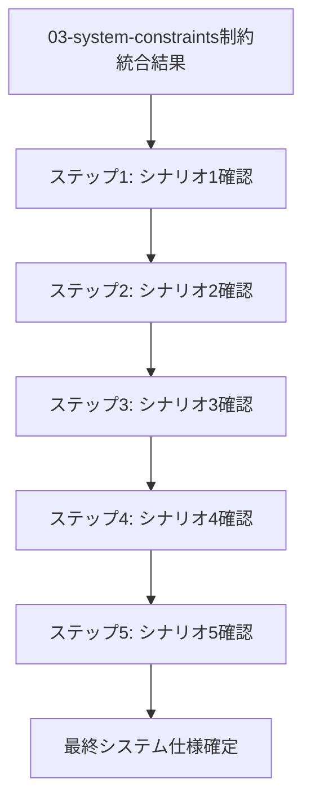

# 04-user-constraints - 技術制約込み仕様

## 目次

1. [概要](#概要)
2. [処理フロー](#処理フロー)
3. [ステップ 1: シナリオ 1 の実現可能性確認](#ステップ-1-シナリオ-1-の実現可能性確認)
4. [ステップ 2: シナリオ 2 の実現可能性確認](#ステップ-2-シナリオ-2-の実現可能性確認)
5. [ステップ 3: シナリオ 3 の実現可能性確認](#ステップ-3-シナリオ-3-の実現可能性確認)
6. [ステップ 4: シナリオ 4 の実現可能性確認](#ステップ-4-シナリオ-4-の実現可能性確認)
7. [ステップ 5: シナリオ 5 の実現可能性確認](#ステップ-5-シナリオ-5-の実現可能性確認)

## 概要

制約適用済みの 4 つのビュー(Physical → Development → Process → Logical)の統合制約により、Scenario View の各シナリオが実装・運用可能であることを確認する。

- **関心事**: ユーザーシナリオの実現可能性
- **時間軸**: 実装・運用開始前の最終仕様確定時点
- **視点**: システム実装者・運用者
- **成果物**: 実装可能な最終システム仕様

各シナリオを起点として、統合制約(Infrastructure、Database、Backend、Frontend)で実現可能かを順次確認していく。

## 処理フロー

## ステップ 1: シナリオ 1 の実現可能性確認

シナリオ 1(文献読み込み・要約作成)が統合制約(Infrastructure、Database、Backend、Frontend)により実現可能であることを確認する段階。

- **[シナリオ 1 の実現可能性確認](01-scenario-01-validate.md)** - 文献読み込み・要約作成ワークフローの実現可能性

## ステップ 2: シナリオ 2 の実現可能性確認

シナリオ 2(概念関係性構築)が統合制約により実現可能であることを確認する段階。

- **[シナリオ 2 の実現可能性確認](02-scenario-02-validate.md)** - 概念関係性構築ワークフローの実現可能性

## ステップ 3: シナリオ 3 の実現可能性確認

シナリオ 3(関係性手動定義)が統合制約により実現可能であることを確認する段階。

- **[シナリオ 3 の実現可能性確認](03-scenario-03-validate.md)** - 関係性手動定義の実現可能性

## ステップ 4: シナリオ 4 の実現可能性確認

シナリオ 4(質問探索・概念発見)が統合制約により実現可能であることを確認する段階。

- **[シナリオ 4 の実現可能性確認](04-scenario-04-validate.md)** - 質問探索・概念発見ワークフローの実現可能性

## ステップ 5: シナリオ 5 の実現可能性確認

シナリオ 5(思考マップ構築)が統合制約により実現可能であることを確認する段階。

- **[シナリオ 5 の実現可能性確認](05-scenario-05-validate.md)** - 思考マップ構築ワークフローの実現可能性
