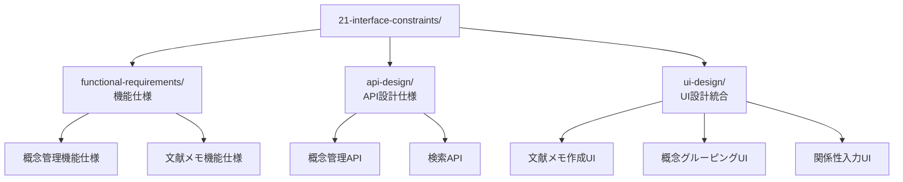

# インターフェース制約 (What系・現実)

## 前提条件とスコープ

このカテゴリは CogitoWeave システムの What/What/How軸における「What系の現実」として、技術制約込みの実現可能な仕様を扱う。ユーザーの理想的な欲求に対して、品質制約で並列定義された4つの制約(Performance Requirements・Quality Attributes・Interface Requirements・Design Constraints)を同時に満たす開発実行方式とフロントエンド実装制約を決定する。

## 構成要素

## インターフェース制約における設計判断

What系の現実として、CogitoWeave のインターフェース制約では機能仕様・API設計・UI設計の3つの軸で現実的な制約を扱っている。

第一の機能仕様として、<!-- TODO: 未実装 [機能要求](functional-requirements/README.md) --> における詳細機能仕様により、ユーザー要求を技術制約込みの実現可能な形に変換している。概念管理・文献メモ作成等の各機能において、受け入れ条件と実装制約を明確化し、理想的なユーザー体験と現実的な技術制約のバランスを取った機能仕様を提供している。

第二のAPI設計として、<!-- TODO: 未実装 [API設計](api-design/README.md) --> における技術仕様により、フロントエンドとバックエンドの適切な分離と統合を実現している。概念管理・検索・関係性入力等の各機能領域について、具体的なエンドポイント設計とレスポンススキーマを定義し、外部仕様で定義されたUI要求を技術的に実現するバックエンド設計を提供している。さらに、<!-- TODO: 未実装 [API仕様](api-specifications/README.md) -->において、UI機能から導出される具体的なAPI要求を統合的に整理している。

第三のUI設計として、<!-- TODO: 未実装 [UI設計](ui-design/README.md) --> における統合判断により、ユーザーの理想的な欲求を技術制約込みの実現可能なUI仕様に変換している。文献メモ作成・概念グルーピング・関係性入力・概念ベース検索・思考マップ可視化の各UIについて、認知負荷軽減と実装制約のバランスを取った統合的なインターフェース体系を提供している。

## 結論

What系の現実として、これらの段階的なインターフェース制約により、CogitoWeave において理想的なユーザー要求を現実的制約の下で実現可能な形に最適化している：

- **機能仕様制約**: 理想的なユーザー体験と技術制約のバランス取り
- **API設計制約**: フロントエンドとバックエンドの適切な分離と統合
- **UI設計制約**: 認知負荷軽減と実装制約のバランスを取った統合的インターフェース
- **実装現実主義**: 理想的設計と実装制約のバランスを取った現実的判断

この現実的なインターフェース制約は、理想的なアーキテクチャ設計と対比されることで、How系の設計判断において実装可能性と美しさを両立した技術基盤を提供する。
