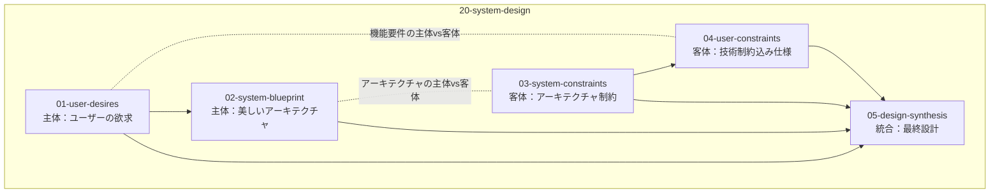

# 20-system-design - What 系における設計判断

## 目次

- [ステップ 1: アーキテクチャビューモデルの選択](#ステップ-1-アーキテクチャビューモデルの選択)
- [ステップ 2: ユーザーの欲求](#ステップ-2-ユーザーの欲求)
  - [理想：ユーザーの欲求](01-user-desires/README.md)
- [ステップ 3: 美しいアーキテクチャ](#ステップ-3-美しいアーキテクチャ)
  - [理想：美しいアーキテクチャ](02-system-blueprint/README.md)
- [ステップ 4: アーキテクチャ制約](#ステップ-4-アーキテクチャ制約)
  - [現実：アーキテクチャ制約](03-system-constraints/README.md)
- [ステップ 5: 技術制約込み仕様](#ステップ-5-技術制約込み仕様)
  - [現実：技術制約込み仕様](04-user-constraints/README.md)

## 概要

What 系では「何を作るのか」という問いに対して、理想と現実の対比で設計判断を行います。

## 処理フロー

## ステップ 1: アーキテクチャビューモデルの選択

### Kruchten 4+1 モデル採用の根拠

システム設計の複雑性に対処するため、Kruchten 4+1 アーキテクチャビューモデルを採用します。このモデルは以下の理由で適切です：

1. **関心の分離**: 4 つの独立したビュー(Logical、Process、Development、Physical)により、異なる利害関係者の関心を分離します
2. **統合検証**: +1 のシナリオビューにより、各ビュー間の整合性をユースケースで検証します
3. **段階的詳細化**: 理想から現実への段階的設計判断に適合します

### 網羅性の限界と対処

**重要な認識**: 4+1 ビューモデルは**完全な網羅性を保証しません**。各ビューはシステム全体の部分像を投影するに過ぎず、以下の限界があります：

- 設計者の知識範囲に依存(未知の要素は写像されない)
- ビュー間の自然な対応関係があっても、写されていない要素・関係は残存しうる
- 形式的には考慮漏れや未発見の要素の存在を排除できません

**実務的な網羅性確保策**:

1. **Scenarios 検証**: ユースケースによるビュー間整合性チェック
2. **トレーサビリティ管理**: 各ビュー要素間の対応表作成
3. **段階的レビュー**: チーム知識の補完とブラインドスポット発見
4. **ADR 記録**: 意図的に除外した要素や未解決事項の明示的管理

この限界を踏まえた上で、4+1 モデルを**実務的に最適な設計判断フレームワーク**として採用します。

## ステップ 2: ユーザーの欲求

+1 のシナリオビューとして、ユーザーの欲求に基づくシステムの機能要件を定義する。Kruchten の 4 つのビューに従ってシステムのアーキテクチャを定義する基礎となる。

- [理想：ユーザーの欲求](01-user-desires/README.md)

## ステップ 3: 美しいアーキテクチャ

ユーザーの欲求を満たすシステムを実現するための理想的なアーキテクチャ設計を行う。Kruchten 4+1 ビューモデルの 4 つのビュー(Logical、Process、Development、Physical)に従って、技術的制約や運用上の制約に縛られない美しいアーキテクチャを定義する。

- [理想：美しいアーキテクチャ](02-system-blueprint/README.md)

## ステップ 4: アーキテクチャ制約

美しいアーキテクチャに対して制約を適用し、実装可能なアーキテクチャに調整する段階。4 つのビューを逆順(Physical → Development → Process → Logical)で制約適用していく。

- [現実：アーキテクチャ制約](03-system-constraints/README.md)

## ステップ 5: 技術制約込み仕様

制約適用済みの 4 つのビュー(Physical → Development → Process → Logical)を Scenario View と統合し、実装・運用可能な最終システム仕様を決定する段階。逆順で統合していく。

- [現実：技術制約込み仕様](04-user-constraints/README.md)
