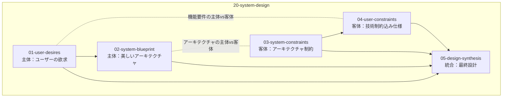

# 20-system-design - What 系における設計判断

## 目次

- [ステップ 1: アーキテクチャビューモデルの選択](#ステップ-1-アーキテクチャビューモデルの選択)
- [ステップ 2: ユーザーの欲求](#ステップ-2-ユーザーの欲求)
  - [理想：ユーザーの欲求](01-user-desires/README.md)
- [ステップ 3: 美しいアーキテクチャ](#ステップ-3-美しいアーキテクチャ)
  - [理想：美しいアーキテクチャ](02-system-blueprint/README.md)
- [ステップ 4: アーキテクチャ制約](#ステップ-4-アーキテクチャ制約)
  - [現実：アーキテクチャ制約](03-system-constraints/README.md)
- [ステップ 5: 技術制約込み仕様](#ステップ-5-技術制約込み仕様)
  - [現実：技術制約込み仕様](04-user-constraints/README.md)

## 概要

What 系では「何を作るのか」という問いに対して、理想と現実の対比で設計判断を行います。

## 処理フロー



## ステップ 1: アーキテクチャビューモデルの選択

### Kruchten 4+1 モデル採用の根拠

システム設計の複雑性に対処するため、Kruchten 4+1 アーキテクチャビューモデルを採用します。このモデルは以下の理由で適切です：

1. **関心の分離**: 4 つの独立したビュー(Logical、Process、Development、Physical)により、異なる利害関係者の関心を分離します
2. **統合検証**: +1 のシナリオビューにより、各ビュー間の整合性をユースケースで検証します
3. **段階的詳細化**: 理想から現実への段階的設計判断に適合します

### 網羅性の限界と対処

**重要な認識**: 4+1 ビューモデルは**完全な網羅性を保証しません**。各ビューはシステム全体の部分像を投影するに過ぎず、以下の限界があります：

- 設計者の知識範囲に依存(未知の要素は写像されない)
- ビュー間の自然な対応関係があっても、写されていない要素・関係は残存しうる
- 形式的には考慮漏れや未発見の要素の存在を排除できません

**実務的な網羅性確保策**:

1. **Scenarios 検証**: ユースケースによるビュー間整合性チェック
2. **トレーサビリティ管理**: 各ビュー要素間の対応表作成
3. **段階的レビュー**: チーム知識の補完とブラインドスポット発見
4. **ADR 記録**: 意図的に除外した要素や未解決事項の明示的管理

この限界を踏まえた上で、4+1 モデルを**実務的に最適な設計判断フレームワーク**として採用します。

## ステップ 2: ユーザーの欲求

Kruchten 4+1 アーキテクチャビューモデルに基づく設計判断を行います。+1 のシナリオビューは、ユーザーの欲求に基づくシステムの機能要件を定義します。そして、Kruchten の 4 つのビューに従ってシステムのアーキテクチャを定義します。

論理 4 のアプローチから、制約に応じた段階的実装のための機能分解を行う。最低限 → 理想の順序で整理。

- [理想：ユーザーの欲求](01-user-desires/README.md)

**概念中心設計**(5 段階):

1. 概念データモデル: 概念エンティティと概念間関係性の基本データ構造定義
2. 概念 CRUD API: 概念の作成・読取・更新・削除の基本 API
3. 関係性 CRUD API: 概念間関係の作成・読取・更新・削除 API
4. 検索 API: 概念・関係性の検索・フィルタリング機能
5. 操作 UI: 上記 API を使用した概念管理インターフェース

**LLM 協働**(2 段階):

1. 基本文章生成: LLM による叩き台テキスト生成(人間による編集前提)
2. 精度向上: プロンプト調整・文脈理解向上による生成品質改善

**段階的知識深化**(2 段階):

1. 基本成熟プロセス: LLM 生成メモ → 永続メモの基本的な知識成長サポート
2. 文献メモサポート: LLM 生成メモ → 文献メモ → 永続メモの完全な成熟プロセス

**視覚的・空間的アプローチ**(4 段階):

1. テキスト表示: 関係性をテキストベースで表現する最小限の視覚化
2. リスト表示: 階層リストでの関係性表現
3. 2D 配置表示: 平面での概念配置とリンク表示
4. 3D 空間表示: 理想的な立体空間での関係性表現

## ステップ 3: 美しいアーキテクチャ

ユーザーの欲求を満たすシステムを実現するための理想的なアーキテクチャ設計を行う。Kruchten 4+1 ビューモデルの 4 つのビュー(Logical、Process、Development、Physical)に従って、制約に縛られない美しいアーキテクチャを定義する。

この段階では技術的制約や運用上の制約は考慮せず、純粋に機能要件を満たす最適なアーキテクチャ構造を追求する。各ビューの詳細は以下の通り。

- [理想：美しいアーキテクチャ](02-system-blueprint/README.md)

### Logical View

<!-- REFERENCE_BEGIN: logical-view -->

Logical View では以下の成果物を段階的に作成する:

1. **主要抽象化設計** - システムの根本概念を定義し、ドメインの本質的な概念を明確化する
2. **機能境界と責務** - Bounded Context を定義し、論理レベルでの境界設定を行う
3. **機能仕様** - 機能要件を詳細化し、具体的な機能定義を行う
4. **画面構成設計** - ユーザーインターフェースの構成を設計する
5. **画面仕様** - 機能仕様と画面構成を統合した画面仕様を定義する
6. **視覚デザイン** - ユーザーインターフェースの視覚的設計を行う
7. **UI 技術方針** - UI 実装の技術的方針を決定する(SPA vs MPA 等)
8. **UI コンポーネント責務** - UI コンポーネントの責務と構造を定義する
9. **データモデル** - DOA に基づきデータ構造を確立する
10. **データベース方針** - データベース技術の方針を決定する(RDBMS vs NoSQL 等)
11. **ドメインモデル** - ビジネスロジックとドメイン設計を行う
12. **バッチ仕様** - バッチ処理要件を分析し仕様化する
13. **バックエンドアーキテクチャスタイル** - 機能境界・非機能要件・ドメイン複雑度・バッチ特性・チーム構造から総合判断する(レイヤード・マイクロサービス・モジュラーモノリス等)
14. **フロントエンドレンダリングスタイル** - UI 複雑度・画面構成・デプロイ独立性・チーム境界から総合判断する(CSR・SSR・SSG・マイクロフロントエンド等)
15. **API 技術方針** - 両アーキテクチャスタイルから API 実装の技術的方針を決定する(REST vs GraphQL vs gRPC、BFF 必要性等)
16. **API 契約** - システムに必要な API 群の論理的な契約を定義する

技術方針レベルの判断として、UI 技術方針、両アーキテクチャスタイル、API 技術方針、データベース方針を機能要件・非機能要件・チーム構造から導出する。具体的な製品選択は後続の Development View で行う。

<!-- REFERENCE_END: logical-view -->

### Process View

<!-- REFERENCE_BEGIN: process-view -->

Process View では以下の成果物を段階的に作成する:

#### サービス間レベル

1. **サービス境界設計** - 機能境界をサービス実行境界に変換する
2. **サービス間協調** - サービス間の協調パターンを設計する
3. **データ整合性設計** - 分散環境での整合性戦略を設計する
4. **分散通信設計** - サービス間通信の具体的設計を行う
5. **耐障害性設計** - 障害対応と復旧戦略を設計する
6. **スケーリング設計** - 負荷分散と拡張性を設計する
7. **トレーサビリティ設計** - 分散トレーシングと監視を設計する
8. **システムテスト戦略** - 分散システム全体のテスト戦略を策定する

#### サービス内レベル

1. **リクエスト処理設計** - サービス内のリクエスト処理フローを設計する
2. **バッチ処理設計** - バッチ処理の実行設計を行う
3. **トランザクション設計** - データ整合性とトランザクション境界を設計する
4. **セキュリティ設計** - サービス内のセキュリティ機構を設計する
5. **パフォーマンス設計** - 性能要件を満たす処理設計を行う
6. **監視設計** - サービス内の監視とメトリクス設計を行う
7. **サービス内テスト戦略** - 統合テストとユニットテストの戦略を策定する

<!-- REFERENCE_END: process-view -->

### Development View

<!-- REFERENCE_BEGIN: development-view -->

Development View では以下の成果物を段階的に作成する:

### Frontend Development Structure

1. **フロントエンド技術選択** - UI 技術方針を具体的な製品選択に変換する

### Backend Development Structure

1. **DB 技術選択** - データベース方針を具体的な製品選択に変換する
2. **バックエンド技術選択** - バックエンド技術の具体的な製品選択を行う
3. **Git サービス選定** - バージョン管理システムを選定する

Logical View で決定された技術方針を具体的な製品選択に変換し、開発チームが効率的に作業できる技術基盤を確立する。

<!-- REFERENCE_END: development-view -->

### Physical View

<!-- REFERENCE_BEGIN: physical-view -->

Physical View では以下の成果物を段階的に作成する:

### インフラ技術選択

1. **ホスティング方式選択** - セルフホスト/マネージドサービス/分散構成等の運用方式を選択する
2. **コンテナ技術選択** - コンテナランタイムとオーケストレーション技術を選択する
3. **CI/CD 技術選択** - 継続的インテグレーション・デプロイメント技術を選択する
4. **インフラ管理技術選択** - インフラストラクチャ管理・自動化技術を選択する
5. **監視・ログ技術選択** - システム監視・ログ管理技術を選択する
6. **ネットワーク技術選択** - 負荷分散・CDN・セキュリティ技術を選択する
7. **ログ収集・転送技術選択** - アプリケーションログを監視基盤に送信する技術を選択する
8. **APM 技術選択** - アプリケーション性能監視機能の提供技術を選択する
9. **トレーシング技術選択** - 分散トレーシング機能の提供技術を選択する
10. **バックアップ方法技術選択** - データ保護のためのバックアップ実行技術を選択する
11. **バックアップ先技術選択** - バックアップデータの保存先技術を選択する
12. **シークレット管理技術選択** - 認証情報・API キー等の安全な管理技術を選択する
13. **SSL 証明書管理技術選択** - HTTPS 通信のための証明書管理技術を選択する

Process View での設計要件と Development View での技術選択を受けて、物理的な運用基盤に必要な具体的技術を選定する。非機能要件(可用性・信頼性・性能・拡張性)を満たすクラウドネイティブなインフラ設計を行う。

<!-- REFERENCE_END: physical-view -->

## ステップ 4: アーキテクチャ制約

美しいアーキテクチャに対して Why 系制約と What 系制約を統合適用し、実装可能なアーキテクチャに調整する段階。制約の源泉を明確にして、理想アーキテクチャを現実的な設計に変換する。

**制約統合プロセス**:

1. **Why 系制約の継承**
   - 法規制・コンプライアンス要件(GDPR、SOX 法など)
   - 企業セキュリティポリシー(認証認可基準、データ保護方針)
   - 既存システムとの互換性制約(API 仕様、データフォーマット)
   - 組織的技術標準(承認済み技術スタック、開発規約)
2. **What 系制約の生成** (プロジェクト固有)
   - プロジェクトリソース制約(予算、期間、人員)
   - 性能要件(レスポンス時間、処理能力、同時接続数)
   - 運用制約の具体化(監視方法、デプロイ手順、バックアップ戦略)
   - 技術実装制約(選定技術の詳細仕様、インフラ構成)
3. **制約統合と調整**
   - Why 系と What 系制約の矛盾検出と解消
   - トレードオフの明示的な記録
   - 理想と現実のギャップの定量化

**矛盾解消の具体例**:

```text
Why系の制約として、会社がRubyを標準にしている（保守性・運用のノウハウを重視）
What系の要求として、Pythonが最適である（機械学習ライブラリの豊富さ）
↓
トレードオフを評価する:
- Rubyを採用すると、運用は安定するが、MLの機能に制約が生じる
- Pythonを採用すると、MLの機能は最適だが、既存のノウハウが活用できない
↓
決定として、Pythonを採用し、理由を記録し、将来の技術的な課題として明記する
```

**重要**: Why 系の制約を無視するのではなく、**なぜその制約を上回る価値があるか**を明確に記録し、将来的な対応策を併記する。

この段階で制約の源泉を明確にし、設計判断の根拠を追跡可能にする。

- [現実：アーキテクチャ制約](03-system-constraints/README.md)

## ステップ 5: 技術制約込み仕様

制約統合結果を踏まえ、実装・運用可能な最終システム仕様を決定する段階。ステップ 2〜4 の成果を統合し、段階的デリバリ可能な具体的仕様に変換する。

**最終仕様決定プロセス**:

1. **機能要件の最終調整**
   - ステップ 2 のユーザー欲求 + ステップ 4 の制約統合 → 実装可能機能の確定
   - MoSCoW 法による優先度付け(Must/Should/Could/Won't)
   - 段階的実装計画(MVP → フル機能への展開ロードマップ)
2. **技術仕様の確定**
   - ステップ 3 の理想アーキテクチャ + ステップ 4 の制約適用 → 最終技術選定
   - 言語・フレームワーク・インフラ構成の確定
   - データベース設計と API 仕様の詳細化
3. **品質・運用仕様の具体化**
   - 非機能要件の数値基準確定(レスポンス時間、処理能力、可用性)
   - テスト戦略とリリース戦略の策定
   - 監視・運用手順の具体化
4. **実装可能性の最終検証**
   - リソース制約(予算・期間・人員)との整合性確認
   - 技術的リスクの特定と軽減策
   - 段階的デリバリの実現可能性評価

**統合検証例**:

```text
ステップ2要求: 高度なML機能 + 直感的UI
ステップ3理想: Python + React SPA
ステップ4制約: 会社Ruby標準 + セキュリティ要件
↓
最終仕様: Python採用(ML要件優先) + Ruby運用チーム育成計画併記
```

この段階で、理想的なユーザー体験と技術的実現性を両立した最終設計が完成する。

- [現実：技術制約込み仕様](04-user-constraints/README.md)
