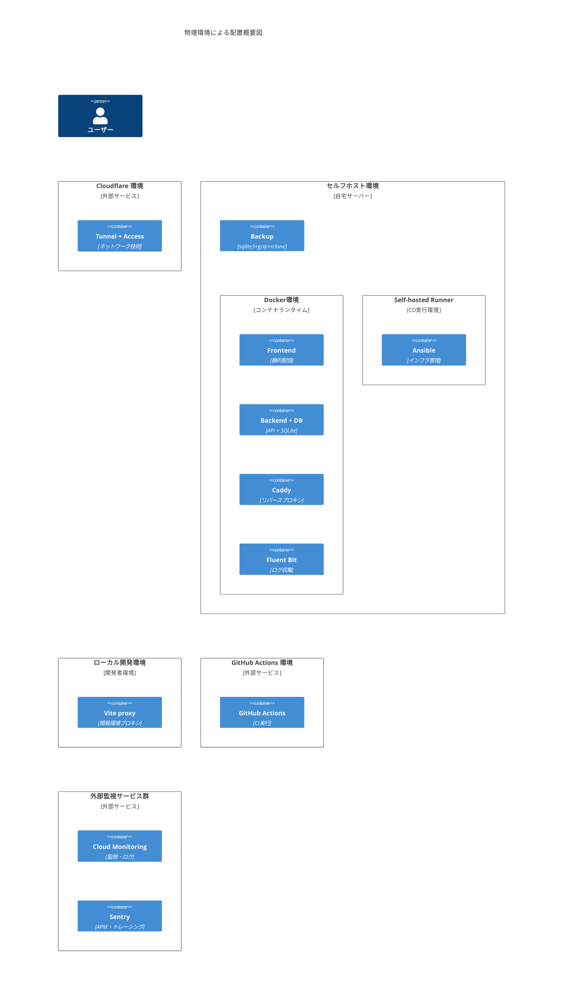
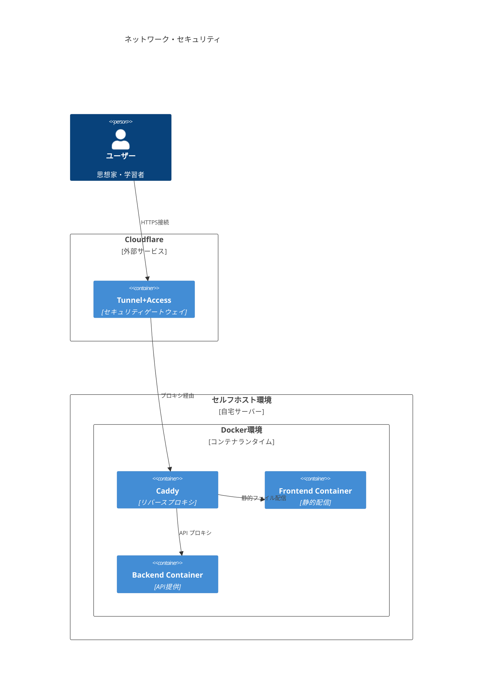
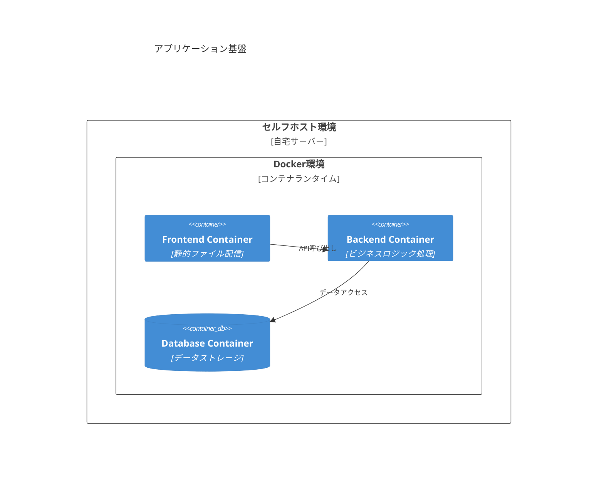
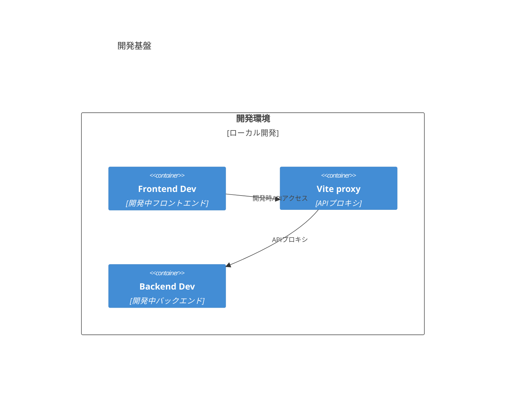
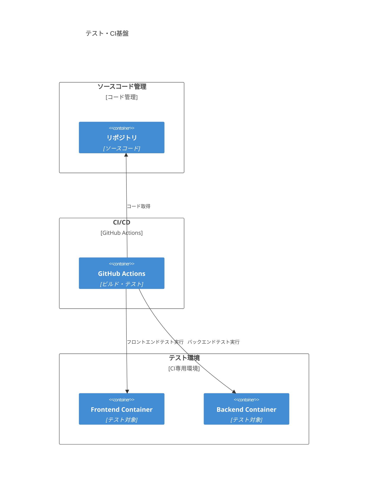
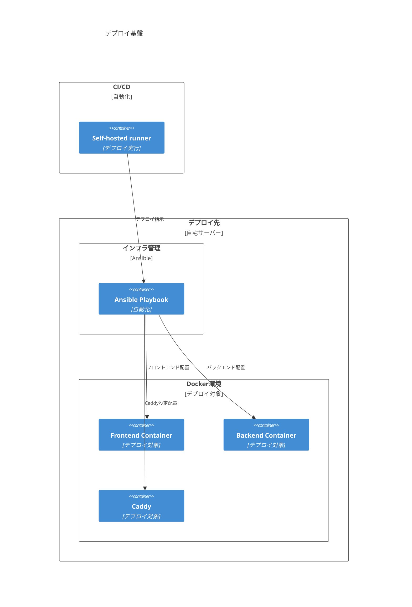
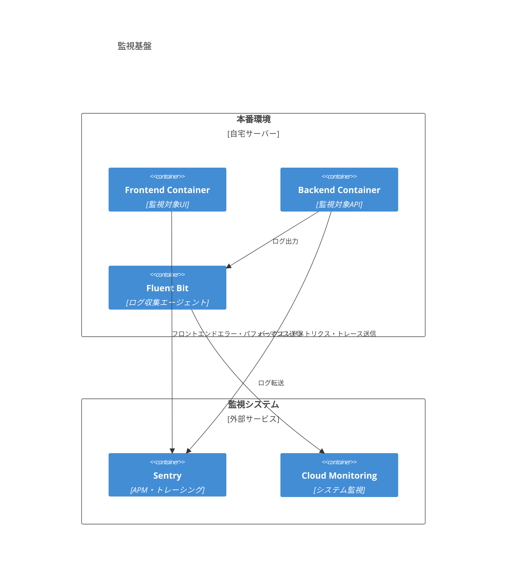
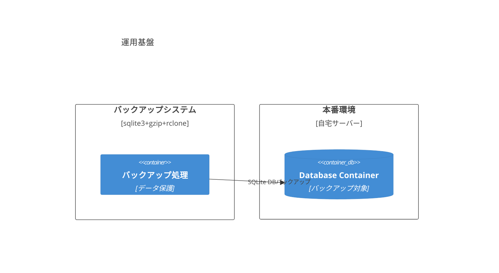

<!-- markdownlint-disable MD024 -->

# C4 Model

## Physical 制約検出における技術配置

### 全体概要図

<!-- REFERENCE_BEGIN: physical-environment-overview-diagram -->

<!-- REFERENCE_END: physical-environment-overview-diagram -->

### 分割された専門特化図

#### 1. ネットワーク・セキュリティ

<!-- REFERENCE_BEGIN: physical-network-infrastructure-diagram -->

<!-- REFERENCE_END: physical-network-infrastructure-diagram -->

#### 2. アプリケーション基盤

<!-- REFERENCE_BEGIN: physical-application-infrastructure-diagram -->

<!-- REFERENCE_END: physical-application-infrastructure-diagram -->

#### 3. 開発基盤

<!-- REFERENCE_BEGIN: physical-development-infrastructure-diagram -->

<!-- REFERENCE_END: physical-development-infrastructure-diagram -->

#### 4. テスト・CI 基盤

<!-- REFERENCE_BEGIN: physical-testing-ci-infrastructure-diagram -->

<!-- REFERENCE_END: physical-testing-ci-infrastructure-diagram -->

#### 5. デプロイ基盤

<!-- REFERENCE_BEGIN: physical-deployment-infrastructure-diagram -->

<!-- REFERENCE_END: physical-deployment-infrastructure-diagram -->

#### 6. 監視基盤

<!-- REFERENCE_BEGIN: physical-monitoring-infrastructure-diagram -->

<!-- REFERENCE_END: physical-monitoring-infrastructure-diagram -->

#### 7. 運用基盤

<!-- REFERENCE_BEGIN: physical-operations-infrastructure-diagram -->

<!-- REFERENCE_END: physical-operations-infrastructure-diagram -->
