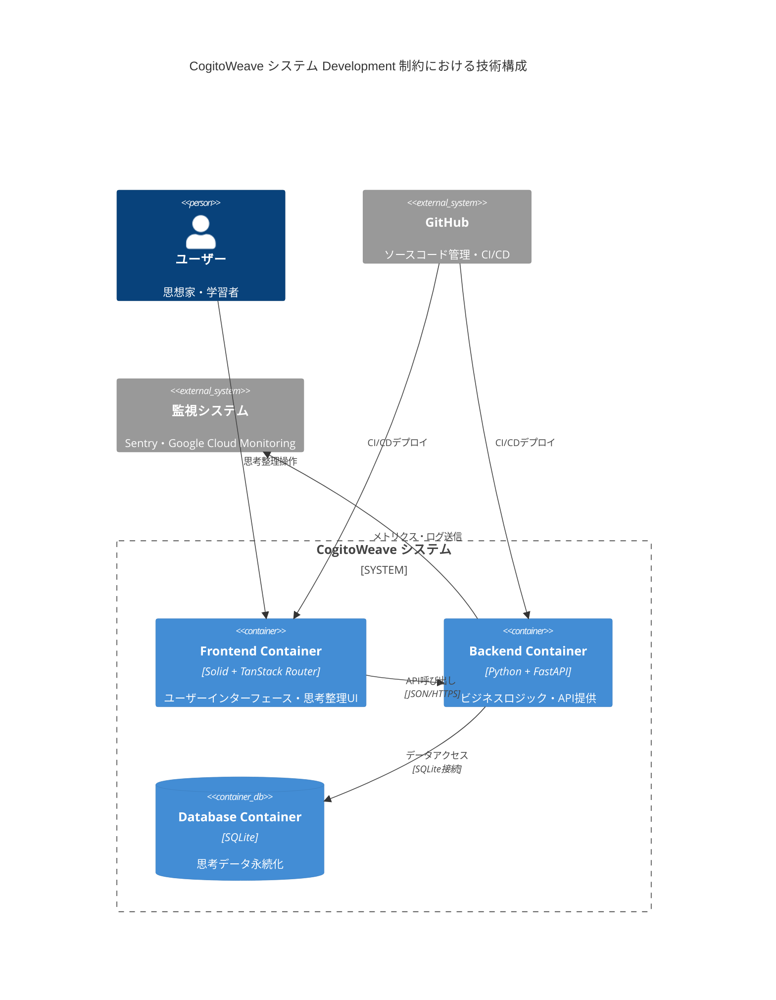

<!-- markdownlint-disable MD024 -->

# C4 Model

## 簡略化リスト

<!-- REFERENCE_BEGIN: development-constraint-simplified-list -->

- Frontend(Container)
  - フレームワーク：Solid + TanStack Router
  - CSS 手法：Tailwind CSS + CSS Modules ハイブリッド構成
  - UI コンポーネント：Tailwind CSS ベースカスタム実装
  - グラフ可視化：D3
- Backend(Container)
  - 言語・フレームワーク：Python + FastAPI
  - アプリケーションサーバー：uvicorn
  - ORM・マイグレーション：SQLAlchemy + Alembic
  - API ドキュメント生成：FastAPI 内蔵 Swagger UI・ReDoc
  - バリデーション：FastAPI 標準 Pydantic
  - HTTP クライアント：httpx
  - 設定管理：環境変数方式
  - ログ・モニタリング：loguru
- DB(Container)
  - データベース：SQLite
- Vite proxy(Container)
  - ビルドツール：Vite
- GitHub Actions(Container)
  - Git サービス：GitHub
  - フロントエンドテスト：Vitest + Testing Library + Playwright
  - バックエンドテスト
    - テストフレームワーク：pytest
    - API テスト：FastAPI TestClient
    - 非同期テスト：pytest-asyncio
    - モック機能：pytest-mock
    - HTTP モック：httpx-mock
    - 時間モック：time-machine
    - カバレッジ：pytest-cov
    - 並列実行：pytest-xdist
- Fluent Bit(Container)
  - ログ収集：Fluent Bit
- Cloud Monitoring(Container)
  - 監視・ログ：Google Cloud Monitoring
- Sentry(Container)
  - APM・トレーシング：Sentry

<!-- REFERENCE_END: development-constraint-simplified-list -->

## Container 図

<!-- REFERENCE_BEGIN: development-container-diagram -->

<!-- REFERENCE_END: development-container-diagram -->
