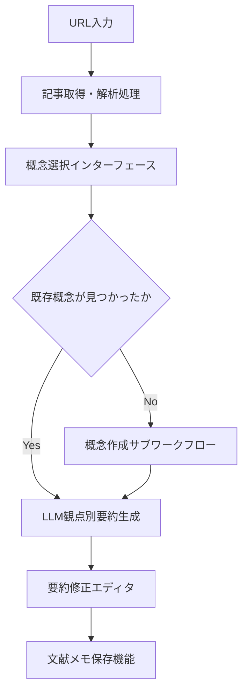
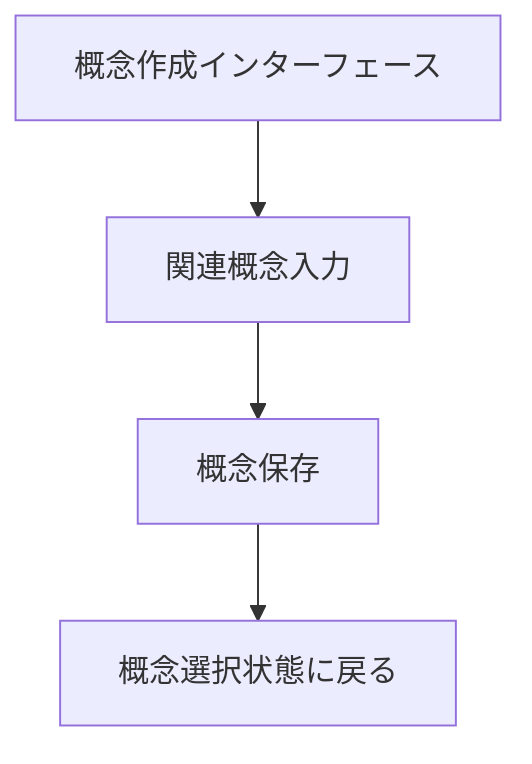
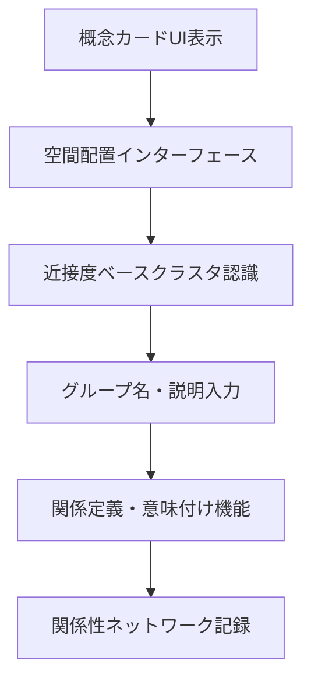
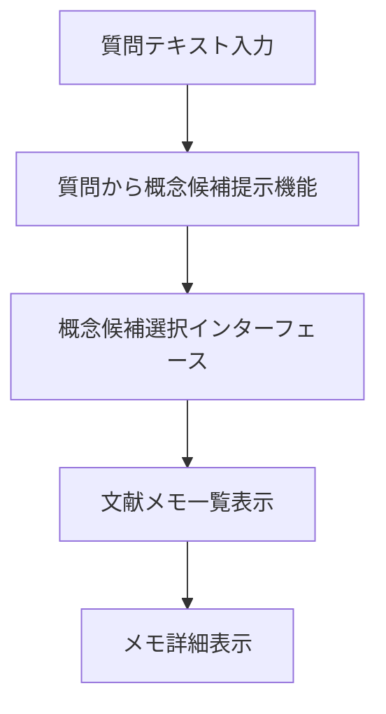

# What 系設計基盤 - 全結論まとめ

## ユーザの欲求

### シナリオ 1 の UI 要素とシステム処理フロー

#### シナリオ 1 UI 要素

<!-- REFERENCE_BEGIN: scenario-01-ui-elements-list -->

1. **URL 入力フィールド** - 外部記事の URL 入力
2. **記事取得・解析処理** - URL 指定による外部記事の取得と内容解析
3. **概念検索・選択インターフェース** - 読む観点となる概念の検索・選択
4. **概念新規作成インターフェース** - 新しい概念の作成
5. **LLM による観点別要約生成機能** - 選択した概念の観点で記事内容を要約
6. **要約修正エディタ** - LLM が作成した要約を個人の理解に合わせて修正
7. **文献メモ保存機能** - 修正した内容を個人の知識体系に保存
8. **複数概念適用機能** - 同一記事を別の概念の観点でも読み直し

<!-- REFERENCE_END: scenario-01-ui-elements-list -->

#### シナリオ 1 システム処理フロー

##### 文献読み込み・要約作成ワークフロー

<!-- REFERENCE_BEGIN: literature-reading-workflow -->

- **目的**: 外部文献を概念に紐付けて知識を蓄積する
- **トリガ**: ユーザーが URL 入力フィールドに URL を入力
- **終了条件**: 文献メモが概念に関連付けられて保存される
- **境界越え**: 外部記事取得 API、LLM 要約生成 API

<!-- REFERENCE_END: literature-reading-workflow -->

##### 概念作成サブワークフロー

<!-- REFERENCE_BEGIN: concept-creation-subworkflow -->

- **目的**: 新しい概念をシステムに追加する
- **トリガ**: 概念選択時に既存概念が見つからない場合
- **終了条件**: 新規概念が作成され選択可能になる
- **境界越え**: なし (内部処理)

<!-- REFERENCE_END: concept-creation-subworkflow -->

### シナリオ 2 の UI 要素とシステム処理フロー

<!-- REFERENCE_BEGIN: scenario-02-ui-elements -->

### シナリオ 2 UI 要素

1. **概念カード UI** - 概念を視覚的に操作可能なカード形式で表示
2. **ドラッグ&ドロップ空間配置機能** - 直感的な位置決めインターフェース
3. **近接度ベースクラスタ認識・境界表示機能** - 近くに置かれた概念のクラスタ認識と視覚的境界表示
4. **グループ名・説明入力機能** - 形成されたグループへの名前や説明の後付け入力

### シナリオ 2 システム処理フロー

#### 概念関係性構築ワークフロー

- **目的**: 概念間の関係を発見・定義して知識ネットワークを構築する
- **トリガ**: ユーザーが空間配置インターフェースで概念を操作
- **終了条件**: 概念関連が定義されてネットワークに記録される
- **境界越え**: クラスタ認識アルゴリズム

<!-- REFERENCE_END: scenario-02-ui-elements -->

### シナリオ 3 の UI 要素

<!-- REFERENCE_BEGIN: scenario-03-ui-elements -->

1. **起点概念選択機能** - 探索の出発点となる概念の選択機能
2. **関連概念入力支援機能** - オートコンプリート等による効率的な関連概念入力
3. **関係定義・意味付け機能** - 個人的な関係語彙による直感的な関係表現と意味付け
4. **関係性ネットワーク記録機能** - 発見した関係性の記録・保存による蓄積的知識構築

<!-- REFERENCE_END: scenario-03-ui-elements -->

### シナリオ 4 の UI 要素とシステム処理フロー

<!-- REFERENCE_BEGIN: scenario-04-ui-elements -->

### シナリオ 4 UI 要素

1. **質問テキスト入力フィールド** - 質問内容を受け取るインターフェース
2. **質問から概念候補提示機能** - 質問内容から関連しそうな概念候補を提示
3. **概念候補選択インターフェース** - 提示された概念候補から関連する概念を選択
4. **文献メモ一覧表示機能** - 選択した概念に紐付いた文献メモを表示
5. **メモ詳細表示機能** - 各メモの詳細内容を参照して過去の体験や知識を思い出す機能

### シナリオ 4 システム処理フロー

#### 質問探索・概念発見ワークフロー

- **目的**: 質問から関連概念を発見してメモを参照する
- **トリガ**: ユーザーが質問テキスト入力フィールドに質問を入力
- **終了条件**: 関連文献メモが表示される
- **境界越え**: LLM 概念候補生成 API

<!-- REFERENCE_END: scenario-04-ui-elements -->

### シナリオ 5 の UI 要素

<!-- REFERENCE_BEGIN: scenario-05-ui-elements -->

1. **中心概念設定機能** - 思考の起点となるメインテーマの設定機能
2. **概念空間配置インターフェース** - 断片的概念を KJ 法的に空間配置する機能
3. **概念間関係性定義機能** - 配置した概念間の関係を直感的に定義する機能
4. **思考マップ構築・表示機能** - 定義した関係性を視覚的な思考マップとして構築・表示
5. **論理フロー構築支援機能** - 思考マップから論理的な文章フローを構築する支援機能

<!-- REFERENCE_END: scenario-05-ui-elements -->

## 美しいアーキテクチャ

### Logical View

#### 1. 主要抽象化設計

<!-- REFERENCE_BEGIN: key-abstractions -->

CogitoWeave システムは**概念ベース知識体系構築システム**として抽象化される。

中核的価値は、個人の思考を「概念」という抽象化を通じて構造化し、外部情報を自分の理解に統合する仕組みの提供にある。

##### 主要抽象化

###### 1. 概念 (Concept)

思考の最小単位として知識体系の中心に位置する抽象化

- 外部情報を個人の理解に変換するフィルター
- 知識統合の基点として機能する
- 他の概念との関係によって意味を形成する

###### 2. 文献メモ (Literature Memo)

概念に紐づく具体的知識内容を表現する抽象化

- 外部文献を個人の観点で解釈した結果
- LLM 協働により効率的に作成され個人の理解で修正される
- 概念の理解を深化させる具体例や体験を蓄積する

###### 3. 関係性 (Relationship)

概念間の関連性を表現し知識ネットワークを形成する抽象化

- 個人的な関係語彙による柔軟な関係定義
- 空間配置による直感的な関係性発見を支援
- 断片的知識を構造化された思考地図に変換する

##### 抽象化の相互作用

- **外部文献** → **概念フィルター** → **文献メモ** (情報の個人化プロセス)
- **概念** ↔ **関係性** ↔ **概念** (知識ネットワーク形成プロセス)
- **空間配置** → **関係性発見** → **思考地図構築** (直感的構造化プロセス)

これらの抽象化により、外部情報の受動的消費から、個人の理解体系への能動的統合への転換が実現される。

<!-- REFERENCE_END: key-abstractions -->

#### 2. 機能境界と責務

<!-- REFERENCE_BEGIN: core-knowledge-boundary -->

- コア知識管理境界は概念管理、文献メモ管理、関係性管理、質問探索を統合して担当する。
  - 各機能の役割を明確に分け、統合的に管理することで保守負荷を軽減するため。

<!-- REFERENCE_END: core-knowledge-boundary -->

<!-- REFERENCE_BEGIN: llm-integration-boundary -->

- LLM 統合境界は LLM API による要約生成、概念候補提示、協働プロセス制御を担当する。
  - 変わりやすい技術を分離してシンプルな設計を維持するため。

<!-- REFERENCE_END: llm-integration-boundary -->

<!-- REFERENCE_BEGIN: content-acquisition-boundary -->

- コンテンツ取得境界は外部記事取得、内容解析、品質チェックを担当する。
  - 独立した処理として分離し機能変更時の影響範囲を限定するため。

<!-- REFERENCE_END: content-acquisition-boundary -->

#### 3. 画面構成設計

<!-- REFERENCE_BEGIN: functional-specifications -->

##### テキスト入力 (5 要素)

- URL 入力フィールド - 外部記事の URL 入力 <!-- REFERENCE_INLINE: url-input-field -->
- 概念作成インターフェース - 新規概念作成と関連概念入力の統合機能 <!-- REFERENCE_INLINE: concept-creation-interface -->
- 質問テキスト入力フィールド - 質問内容を受け取るインターフェース <!-- REFERENCE_INLINE: question-text-field -->
- グループ名・説明入力機能 - 形成されたグループへの名前や説明の後付け入力 <!-- REFERENCE_INLINE: group-naming-function -->
- 関係定義・意味付け機能 - 個人的な関係語彙による直感的な関係表現と意味付け <!-- REFERENCE_INLINE: relationship-definition-function -->

##### 選択操作 (2 要素)

- 概念選択インターフェース - 用途に応じた概念の検索・選択機能 <!-- REFERENCE_INLINE: concept-selection-interface -->
- 概念候補選択インターフェース - 提示された概念候補から関連する概念を選択 <!-- REFERENCE_INLINE: concept-candidates-selection -->

##### 直接操作 (1 要素)

- 空間配置インターフェース - 概念の直感的な配置機能 <!-- REFERENCE_INLINE: spatial-arrangement-interface -->

##### 表示・視覚化 (4 要素)

- 概念カード UI - 概念を視覚的に操作可能なカード形式で表示 <!-- REFERENCE_INLINE: concept-cards-ui -->
- 文献メモ一覧表示機能 - 選択した概念に紐付いたメモ一覧表示 <!-- REFERENCE_INLINE: memo-list-display -->
- メモ詳細表示機能 - 各メモの詳細内容を参照 <!-- REFERENCE_INLINE: memo-detail-display -->
- 近接度ベースクラスタ認識・境界表示機能 - 近くに置かれた概念のクラスタ認識と視覚的境界表示 <!-- REFERENCE_INLINE: cluster-recognition-display -->

##### 自動処理 (1 要素)

- 記事取得・解析処理 - URL 指定による外部記事の取得と内容解析

##### LLM 生成・推論 (2 要素)

- LLM による観点別要約生成機能 - 選択した概念の観点で記事内容を要約
- 質問から概念候補提示機能 - 質問内容から関連しそうな概念候補を提示

##### 編集操作 (1 要素)

- 要約修正エディタ - LLM が作成した要約を個人の理解に合わせて修正 <!-- REFERENCE_INLINE: summary-editor -->

##### データ保存 (2 要素)

- 文献メモ保存機能 - 修正した内容を個人の知識体系に保存 <!-- REFERENCE_INLINE: literature-memo-save -->
- 関係性ネットワーク記録機能 - 発見した関係性の記録・保存 <!-- REFERENCE_INLINE: relationship-network-record -->

##### 機能実行 (1 要素)

- 複数概念適用機能 - 同一記事を別の概念の観点でも読み直し

<!-- REFERENCE_END: functional-specifications -->

#### 4. 画面構成設計

##### メイン画面統合

<!-- REFERENCE_BEGIN: main-screen-integration -->

メイン画面は概念管理、文献メモ管理、関係性管理を 1 画面に統合して提供する。概念・文献メモ・関係性は統合的に利用されるため一体化した画面構成が効率的である。

<!-- REFERENCE_END: main-screen-integration -->

##### メイン画面構成要素

<!-- REFERENCE_BEGIN: main-screen-structure -->

- 概念選択インターフェース - 左サイドバーに配置し概念一覧と検索機能を提供
- 概念カード UI - メイン表示エリアに選択概念の詳細情報を表示
- 文献メモ一覧表示機能 - 概念カード下部に関連メモ一覧をタブ形式で配置
- メモ詳細表示機能 - メモ選択時にモーダルまたは右パネルで詳細表示
- URL 入力フィールド - 新規文献追加用にヘッダー部に配置
- 概念作成インターフェース - 概念追加ボタンからモーダル表示
- 関係定義・意味付け機能 - 概念間関係作成時にモーダル表示
- 要約修正エディタ - 文献メモ編集時に専用エディタを表示

<!-- REFERENCE_END: main-screen-structure -->

##### 質問探索画面統合

<!-- REFERENCE_BEGIN: question-search-screen-integration -->

質問探索画面は質問から概念発見とメモ参照を独立画面で提供する。質問探索は他の機能と利用パターンが異なるため独立画面が適切である。

<!-- REFERENCE_END: question-search-screen-integration -->

##### 質問探索画面構成要素

<!-- REFERENCE_BEGIN: question-search-screen-structure -->

- 質問テキスト入力フィールド - 画面上部にメイン入力エリアとして配置
- 質問から概念候補提示機能 - 質問入力後に候補一覧を表示
- 概念候補選択インターフェース - 候補選択のためのリスト形式 UI
- 文献メモ一覧表示機能 - 選択概念に関連するメモ一覧表示
- メモ詳細表示機能 - メモ詳細の参照表示

<!-- REFERENCE_END: question-search-screen-structure -->

##### 空間配置画面統合

<!-- REFERENCE_BEGIN: spatial-arrangement-screen-integration -->

空間配置画面は概念の空間配置と関係性構築を専用画面で提供する。複雑な直接操作が必要なためフルスクリーン専用画面が適切である。

<!-- REFERENCE_END: spatial-arrangement-screen-integration -->

##### 空間配置画面構成要素

<!-- REFERENCE_BEGIN: spatial-arrangement-screen-structure -->

- 空間配置インターフェース - 全画面を使用した概念配置キャンバス
- 概念カード UI - 配置可能な概念カードの表示
- 近接度ベースクラスタ認識・境界表示機能 - 自動クラスタ認識と視覚的境界表示
- グループ名・説明入力機能 - クラスタ形成時の命名インターフェース
- 関係性ネットワーク記録機能 - 定義した関係性の保存処理

<!-- REFERENCE_END: spatial-arrangement-screen-structure -->

##### 画面遷移設計

<!-- REFERENCE_BEGIN: screen-transition-design -->

シンプルなタブ切り替えによる 3 画面間の移動を提供する。操作の複雑度を抑制し直感的なナビゲーションを実現する。

<!-- REFERENCE_END: screen-transition-design -->

#### 5. 画面仕様

LOCAL_CONCLUSION のみなので省略

#### 6. 視覚デザイン

##### 情報階層の視覚表現方針

<!-- REFERENCE_BEGIN: concept-visual-priority -->

概念を最上位の視覚階層に配置し、関連する文献メモと関係性情報を段階的に表示する。概念が知識体系の中心であり、他の情報はすべて概念を起点として意味を持つため。

<!-- REFERENCE_END: concept-visual-priority -->

<!-- REFERENCE_BEGIN: information-type-visual-differentiation -->

概念・文献メモ・関係性をそれぞれ異なる視覚的特徴で識別可能にする。統合画面で複数の情報タイプを効率的に操作するため視覚的区別が不可欠であるため。

<!-- REFERENCE_END: information-type-visual-differentiation -->

<!-- REFERENCE_BEGIN: importance-visual-weighting -->

アクティブな概念・選択状態・関連度の高い情報を視覚的に強調する。認知リソースを重要な情報に集中させ、思考効率を向上させるため。

<!-- REFERENCE_END: importance-visual-weighting -->

##### 認知負荷軽減のための視覚戦略

<!-- REFERENCE_BEGIN: visual-grouping-strategy -->

関連する機能・情報を視覚的にグループ化し、認知的分割を支援する。複雑な知識体系操作において認知的負荷を分散し、理解しやすさを向上させるため。

<!-- REFERENCE_END: visual-grouping-strategy -->

<!-- REFERENCE_BEGIN: progressive-disclosure -->

必要な情報のみを段階的に表示し、情報過多を防止する。思考支援システムとして、不要な情報による認知的干渉を最小化するため。

<!-- REFERENCE_END: progressive-disclosure -->

<!-- REFERENCE_BEGIN: visual-consistency -->

同じ機能・状態は常に同じ視覚表現を使用し、学習負荷を軽減する。継続利用での効率性を重視し、予測可能な視覚体験を提供するため。

<!-- REFERENCE_END: visual-consistency -->

##### デバイス別視覚適応方針

<!-- REFERENCE_BEGIN: mac-visual-density-optimization -->

Mac 環境では大画面を活用した高情報密度レイアウトと複雑な視覚階層を提供する。情報整理作業に必要な多数の要素を効率的に配置し、並行作業を支援するため。

<!-- REFERENCE_END: mac-visual-density-optimization -->

<!-- REFERENCE_BEGIN: ipad-visual-balance -->

iPad 環境では Mac と iPhone の中間的な情報密度と操作性を提供する。タッチ操作と画面サイズのバランスを取り、柔軟な利用シーンに対応するため。

<!-- REFERENCE_END: ipad-visual-balance -->

<!-- REFERENCE_BEGIN: iphone-visual-simplification -->

iPhone 環境では単一タスクに集中したシンプルな視覚構成と大きなタッチターゲットを提供する。情報参照用途に特化し、モバイル環境での使いやすさを優先するため。

<!-- REFERENCE_END: iphone-visual-simplification -->

##### インタラクション状態の視覚フィードバック方針

<!-- REFERENCE_BEGIN: operability-visual-indication -->

ドラッグ可能・クリック可能・選択可能な要素を視覚的に識別可能にする。マウス操作中心の設計において、操作対象を瞬時に認識できることが効率性に直結するため。

<!-- REFERENCE_END: operability-visual-indication -->

<!-- REFERENCE_BEGIN: operation-progress-display -->

ドラッグ中・選択中・処理中等の状態を明確な視覚変化で表現する。複雑な直接操作における操作者の認知負荷を軽減し、操作ミスを防止するため。

<!-- REFERENCE_END: operation-progress-display -->

<!-- REFERENCE_BEGIN: operation-result-feedback -->

操作完了・エラー・成功状態を即座に視覚的に伝達する。継続的な操作フローにおいて、次の行動を迅速に判断できるようにするため。

<!-- REFERENCE_END: operation-result-feedback -->

#### 7. UI 技術方針

<!-- REFERENCE_BEGIN: ui-tech-approach -->

CogitoWeave の UI 技術方針として、Web 技術による柔軟な実装アプローチを採用する。プラットフォーム制約によりネイティブアプリ開発は除外され、マルチデバイス対応とユーザーインタラクション特性を考慮した選択肢から最適解を選択する。

##### 除外される技術選択肢

- **ネイティブアプリ**: プラットフォーム制約により除外済み
- **SSG(Static Site Generation)**: 編集機能中心に矛盾し、マルチデバイス共有に適さない
- **ローカルオンリー**: マルチデバイス前提制約に違反

##### 許容される技術選択肢

- **レンダリング方式**: CSR、SSR、またはハイブリッドアプローチのいずれも可能である
  - プライベート用途により SEO 要件がないため、CSR の制約がない
  - 初回ロード速度重視により SSR の利点もある
- **アプリケーション構造**: SPA、MPA、または SPA ベース+ページ分割のハイブリッドアプローチのいずれも可能である
  - 作業完結型の操作パターンにより MPA に適合する
  - 効率性重視の継続利用により SPA の利点もある
- **コンポーネント方針**: 軽量コンポーネント指向を基本とし、必要に応じてページ指向も選択可能である
  - UI 要素の再利用性と一貫性確保が必要
  - デザインシステムレベルまでは不要

##### 技術方針決定の基準

具体的な技術選択は、Development View において以下の基準で決定する:

- 保守性と理解しやすさの優先
- 一人での管理可能な複雑度
- Mac 環境での情報整理機能と iPhone 環境での情報参照機能の最適化

<!-- REFERENCE_END: ui-tech-approach -->

#### 8. UI コンポーネント責務

<!-- REFERENCE_BEGIN: component-granularity-design -->

CogitoWeave の UI コンポーネント責務として、階層的な粒度設計による軽量なコンポーネント指向アーキテクチャを採用する。

- **最小粒度**: ボタン・入力フィールド・ラベル等の基本 UI 要素レベル
  - 単一責務の原則により、一つの操作または表示に特化する。
- **統合粒度**: カード・パネル・モーダル等の機能単位レベル
  - 複数の基本要素を組み合わせた意味のある機能を提供する。
- **階層アプローチ**: 統合コンポーネント内で基本コンポーネントを組み合わせる
  - 外部からは統合コンポーネントとして使用し、内部実装では基本コンポーネントで構成する。

<!-- REFERENCE_END: component-granularity-design -->

<!-- REFERENCE_BEGIN: state-management-responsibilities -->

状態管理は 3 層に分離して責務を明確化する。

- **コンポーネント内部状態**: 表示状態・入力値・開閉状態等の局所的な制御
  - コンポーネント固有の UI 状態管理に限定する
- **ページレベル状態**: 選択中概念・検索フィルタ・編集中データ等の複数コンポーネント間共有
  - 状態管理ライブラリを使用してページ内グローバル状態を管理する
- **アプリケーション全体状態**: ユーザー設定・表示設定・大きなコンポーネント間同期データ
  - 永続化データはブラウザの localStorage を使用する
  - ページ境界を越えた大きなコンポーネント間の同期はクライアント側状態管理で対応する

<!-- REFERENCE_END: state-management-responsibilities -->

<!-- REFERENCE_BEGIN: data-flow-design -->

コンテナコンポーネントパターンと単方向データフローによるデータ設計を採用する。

- **コンテナコンポーネントパターン**: データ取得・API 呼び出し責務を上位コンポーネントに集約
  - プレゼンテーショナルコンポーネントは props によるデータ受け取りに特化する
- **単方向データフロー**: props による下方向データ流れと callback による上方向イベント伝播
  - データの流れを予測可能にし、デバッグとテストを容易にする
- **イベント駆動通信**: 子コンポーネントから親コンポーネントへは callback props によるイベント通知
  - 疎結合を保ちながら必要な情報のみを伝達する

<!-- REFERENCE_END: data-flow-design -->

<!-- REFERENCE_BEGIN: device-adaptation-approach -->

デバイス別対応はコンポーネント共通化とレスポンシブ設計による適応的 UI で実現する。

- **コンポーネント共通化**: 同一コンポーネントをデバイス別に CSS で最適化
  - Mac 環境と iPhone 環境で共通のコンポーネントロジックを使用する
- **レスポンシブ設計**: デバイス別の表示密度と操作方法に応じた適応的 UI
  - 情報整理機能と情報参照機能の違いを CSS レベルで調整する

<!-- REFERENCE_END: device-adaptation-approach -->

#### 9. データモデル

##### 1. 概念エンティティ (Concept)

<!-- REFERENCE_BEGIN: concept-entity -->

- 思考の最小単位として知識体系の中心に位置する
- 基本属性: ID、名前、説明、作成日時、更新日時
- 他の概念との関係性によって意味を形成する
- 外部情報を個人の理解に変換する観点として機能する

<!-- REFERENCE_END: concept-entity -->

##### 2. 文献メモエンティティ (LiteratureMemo)

<!-- REFERENCE_BEGIN: literature-memo-entity -->

- ツェッテルカステン方式による概念ベースの知識蓄積
- 基本属性: ID、タイトル、内容、元 URL、作成日時、更新日時
- 特定の概念の観点で外部文献を要約・解釈したもの
- LLM 協働により効率的に作成され、個人の理解で修正される

<!-- REFERENCE_END: literature-memo-entity -->

##### 3. 関係性エンティティ (Relationship)

<!-- REFERENCE_BEGIN: relationship-entity -->

- 概念間の無向グラフ構造による知識ネットワーク形成
- 基本属性: ID、関係名、説明、作成日時
- 個人的な関係語彙による柔軟な関係定義
- 空間配置による直感的な関係性発見を支援

<!-- REFERENCE_END: relationship-entity -->

##### 4. 文献エンティティ (Literature)

<!-- REFERENCE_BEGIN: literature-entity -->

- 外部文献の書誌情報管理
- 基本属性: ID、URL、タイトル、取得日時
- 複数の概念観点から文献メモが生成される元情報

<!-- REFERENCE_END: literature-entity -->

#### 10. データベース方針

<!-- REFERENCE_BEGIN: database-approach -->

CogitoWeave では RDBMS を採用する。リレーショナル構造によるデータ整合性管理、成熟技術による保守性確保、データ規模への十分な対応能力が主な選択理由である。具体的な製品選択は Development View で決定する。

<!-- REFERENCE_END: database-approach -->

#### 11. ドメインモデル

<!-- REFERENCE_BEGIN: domain-model -->

CogitoWeave のドメインモデルは薄いドメイン層アプローチを採用する。4 つのエンティティ（概念、文献メモ、関係性、文献）に対して基本的な CRUD 操作と最小限のビジネス制約のみを実装し、複雑なドメインロジックはアプリケーション層に委ねる。データベース制約による整合性管理を活用し、外部 API 処理は分離する。

<!-- REFERENCE_END: domain-model -->

#### 12. バッチ仕様

<!-- REFERENCE_BEGIN: batch-specification -->

CogitoWeave のバッチ仕様は日次データバックアップのみを実装する。全データの完全バックアップを日次実行し、システム障害時の迅速復旧を支援する。自動分析・推奨機能、データクリーンアップ、統計処理等は設計方針により除外する。

<!-- REFERENCE_END: batch-specification -->

#### 13. バックエンドアーキテクチャスタイル

<!-- REFERENCE_BEGIN: backend-architecture-style -->

CogitoWeave のバックエンドアーキテクチャスタイルとして**レイヤードアーキテクチャ**を採用する。階層的な責務分離と機能境界に基づく水平分割により、一人開発における保守性と理解しやすさを確保する。

<!-- REFERENCE_END: backend-architecture-style -->

#### 14. フロントエンドレンダリングスタイル

<!-- REFERENCE_BEGIN: frontend-rendering-style -->

CogitoWeave のフロントエンドレンダリングスタイルとして**CSR(Client-Side Rendering)**を採用する。3 画面間の状態共有効率と軽量なコンポーネント指向の特性を活かし、一人での開発における保守性と理解しやすさを確保する。

<!-- REFERENCE_END: frontend-rendering-style -->

#### 15. API 技術方針

<!-- REFERENCE_BEGIN: api-tech-approach -->

API 技術方針として REST API を採用する。

<!-- REFERENCE_END: api-tech-approach -->

#### 16. API 契約

<!-- REFERENCE_BEGIN: api-contract -->

CogitoWeave の API 契約は以下の 9 つの論理的 API 群で構成される:

##### エンティティ操作 API

1. **概念 API**: 作成・読み取り・更新 (削除は優先度低)
2. **文献メモ API**: 作成・読み取り・更新・概念別一覧取得
3. **関係性 API**: 作成・読み取り・更新 (概念間の重複関係許可)
4. **文献 API**: 作成・読み取り (URL・タイトル・引用が必須)

##### 検索・発見 API

1. **概念検索 API**: 名前・説明での部分一致検索
2. **質問から概念候補提示 API**: 既存個人概念体系からの検索・発見支援

##### 協働・処理 API

1. **LLM 要約生成 API**: 記事内容と概念 ID から観点別要約を生成
2. **記事取得 API**: URL からタイトル・内容を取得
3. **バックアップ API**: Webhook 化による自動実行支援

これらの API により、概念中心の知識体系構築と効率的な知識活用が実現される。

<!-- REFERENCE_END: api-contract -->

### Process View

#### 1. サービス境界設計

<!-- REFERENCE_BEGIN: service-boundaries-decision -->

技術的観点からの最適解は**3 サービス完全分離**となる：

- **コア知識管理サービス**: 安定した CRUD 処理を独立プロセスで実行し、長期安定リリースサイクルで運用
- **LLM 統合サービス**: 外部 API 依存を独立プロセスで分離し、技術進歩に応じた中期リリースサイクルで運用
- **コンテンツ取得サービス**: Web スクレイピングを独立プロセスで分離し、サイト変更に応じた短期リリースサイクルで運用

この構成により実行時の責務分離とリリースサイクルの最適化を両立し、各サービスの独立性を確保できる。

<!-- REFERENCE_END: service-boundaries-decision -->

#### 2. サービス間協調

<!-- REFERENCE_BEGIN: service-coordination-pattern -->

CogitoWeave システムのサービス間協調では以下を採用する。

フロントエンドから各サービスを直接呼び出す。フロントエンドからコンテンツ取得サービスと LLM 統合サービスへの依存のみ存在し、サービス間の相互依存は発生しない。

サービス間通信はタイムアウトつき同期通信で行う。開発制約のシンプルで理解しやすい構造を満たし、一人で管理可能な複雑度に制限できる。

<!-- REFERENCE_END: service-coordination-pattern -->

#### 3. データ整合性設計

<!-- REFERENCE_BEGIN: data-consistency-strategy -->

CogitoWeave システムでは以下のデータ整合性戦略を採用する：

**単一データストア責務による強い整合性**を確立する。コア知識管理サービスのみがデータ永続化を担当し、ACID 特性を持つ単一データストア内でトランザクション制御を行う。これにより分散システムでありながら強い整合性を実現する。

**ステートレスサービス分離**により整合性スコープを限定する。LLM 統合サービスとコンテンツ取得サービスは外部データ取得のみを担当し、データを永続化しない。サービス間でのデータ整合性問題は発生せず、分散トランザクション制御は不要である。

**一方向データフロー**でシンプルな制御を実現する。「外部取得 → フロントエンド統合 → コア保存」の流れに限定し、複雑な整合性制御を回避する。開発制約のシンプルで理解しやすい構造を満たす。

<!-- REFERENCE_END: data-consistency-strategy -->

#### 4. 分散通信設計

<!-- REFERENCE_BEGIN: distributed-communication-design -->

CogitoWeave システムでは以下の分散通信設計を採用する：

**HTTP API による直接通信**を確立する。フロントエンドから 3 サービスへの直接 HTTP/HTTPS 通信により、シンプルで理解しやすい通信アーキテクチャを実現する。JSON データフォーマットと GET/POST による CQS ベースの API 設計で、保守しやすい通信を行う。

**サービス特性ごとのタイムアウト設定**により適切な応答制御を行う。各サービスの処理特性に応じた段階的設定で、適切な応答時間管理を実現する。

**HTTP ステータスコードによるエラーハンドリング**によりシンプルな障害対応を実現する。統一的エラー分類と、サービス特性ごとのリトライ戦略により、外部依存による障害を適切に処理する。

**最小限セキュリティ設計**で個人用途に適した設計を行う。HTTPS 通信と CORS 設定による基本的なセキュリティを確保し、認証認可機能は除外する。作成者本人のみのアクセス制御はデプロイメント環境で対応する。

<!-- REFERENCE_END: distributed-communication-design -->

#### 5. 耐障害性設計

<!-- REFERENCE_BEGIN: fault-tolerance-strategy -->

CogitoWeave システムでは以下の耐障害性戦略を採用する：

**データ保護最優先戦略**により個人資産の完全保護を実現する。定期バックアップとバックアップ検証により、概念・文献メモ・関係性データの消失を絶対に防止する。シンプルな復元手順により、障害時の迅速なデータ復旧を支援する。

**部分機能継続設計**により外部依存障害への耐性を確保する。コア知識管理機能を中心とした基本機能の継続動作により、外部 API 障害時でも知識体系の閲覧・編集・保存が可能な状態を維持する。

**手動復旧基本方針**により一人運用に適した障害対応を実現する。自動復旧機構の複雑さを回避し、明確な手動復旧手順と充実したエラー情報により、個人での障害対応を支援する。24/7 可用性よりもシンプルな保守性を優先する。

**明確なエラー伝達**により迅速な障害対応を支援する。障害種別・影響範囲・対応手順を分かりやすく表示し、開発者自身の技術的判断を支援する情報提供を行う。適切な対応行動を促すことで、障害からの早期回復を実現する。

<!-- REFERENCE_END: fault-tolerance-strategy -->

#### 6. スケーリング設計

<!-- REFERENCE_BEGIN: scaling-strategy -->

CogitoWeave システムでは以下のスケーリング戦略を採用する：

**単一サーバー構成**により個人用システムに適したシンプルな拡張性を実現する。水平スケーリングの複雑さを回避し、必要に応じた垂直スケーリング(サーバースペック向上)により性能向上を図る。

**数万件規模への対応**により個人の知識管理に十分な規模を確保する。概念・文献メモ・関係性データを含めて数万件規模まで対応し、現代の一般的なサーバーで十分な性能を実現する。

**シンプル運用優先**により一人での管理可能性を確保する。複雑なスケーリング機構や最適化は実装せず、理解しやすく保守しやすい構成を維持する。性能劣化時はサーバースペック向上による解決を基本とする。

<!-- REFERENCE_END: scaling-strategy -->

#### 7. トレーサビリティ設計

<!-- REFERENCE_BEGIN: traceability-strategy -->

CogitoWeave システムでは以下のトレーサビリティ戦略を採用する：

**エラートラッキングとシステム監視の役割分離**により個人用途に適した観測可能性を実現する。エラー情報の詳細追跡とシステム全体の稼働監視を分離し、コスト効率と機能要件のバランスを達成する。既存インフラとの統合を優先し、追加導入コストを最小化する。

**フロントエンド起点の一括トレーシング**によりユーザー操作から全サービスまでの流れを可視化する。CSR アーキテクチャを活用したクライアントサイド監視と、3 つのバックエンドサービスとの統合により、システム全体の動作を統合的に把握する。

**必要最小限の監視項目**により管理負荷を軽減する。障害検知・エラー把握・パフォーマンス監視に絞り込み、複雑なメトリクスや分析機能は除外する。一人運用の制約下で実現可能な監視レベルを維持し、シンプルな保守性を確保する。

<!-- REFERENCE_END: traceability-strategy -->

#### 8. システムテスト戦略

<!-- REFERENCE_BEGIN: system-test-strategy -->

CogitoWeave のシステムテスト戦略として、**CI 統合疎通テスト**を採用する。

- フロントエンドから 3 サービスへの基本疎通確認のみを CI 環境で実行する
- 外部 API 依存部分はバックエンドサービス内でモック実装によりダミーデータを返却して検証する
- バックエンドサービスは実際に起動してフロントエンドからの HTTP 通信を受け付けるため、フロントエンド側でのモック機能は不要となる
- 正常系とセキュリティテストをカバーし、エラーハンドリングや複雑な E2E シナリオは単体テストレベルで対応済みとして除外する

CI 失敗時は PR マージ停止、修正または revert による迅速復旧を基本とし、専用テスト環境は構築せず、一人で管理可能なシンプルな品質保証体制を実現する。

<!-- REFERENCE_END: system-test-strategy -->

#### 9. リクエスト処理設計

<!-- REFERENCE_BEGIN: request-processing-design -->

CogitoWeave のリクエスト処理設計として、**同期処理ベース・トランザクション分離型**アプローチを採用する。

基本的に同期処理でシンプルな処理フローを実現し、複雑な業務処理は 1 トランザクション内で完結させる。エラーハンドリングは開発者対応の緊急度に応じたログレベル（ERROR=即座対応、WARN=計画的改善、INFO=動作確認、DEBUG=開発詳細）を採用し、ユーザーには理解しやすいエラーメッセージのみを提供する。

トランザクション制御はデータベース操作のみを対象とし、外部 API 呼び出しは分離する。リクエストデータのバリデーションは型チェック、範囲チェック、形式チェックを含む定型的な検証を実施し、ビジネスロジックに依存する検証は別レイヤーで処理する。全 API に 10 秒の統一タイムアウトを設定し、外部 API エラー時はフロントエンド側リトライで対応する。N+1 問題対策とクエリ最適化により性能要件を満たす。

<!-- REFERENCE_END: request-processing-design -->

#### 10. バッチ処理設計

<!-- REFERENCE_BEGIN: batch-processing-design -->

CogitoWeave のバッチ処理設計として、**深夜単発バックアップ**方式を採用する。

日次データバックアップを深夜時間帯に単一バッチとして実行し、全データの完全バックアップを取得する。既存のバックアップ通知仕組みと連携し、失敗時のメール通知により迅速な障害対応を支援する。

複雑なスケジューラーや並列処理は実装せず、シンプルなスケジューリング機構による確実な実行を基本とする。データ整合性はバックアップ実行時点での一貫性を確保し、実行中のユーザーアクセスは停止しない前提で設計する。一人で管理可能なシンプルな構成により、長期安定運用を実現する。

<!-- REFERENCE_END: batch-processing-design -->

#### 11. トランザクション設計

<!-- REFERENCE_BEGIN: transaction-design -->

CogitoWeave のトランザクション設計として、**READ_COMMITTED・順序制御型**アプローチを採用する。

1 つの API リクエスト内で関連するデータ更新を 1 つのトランザクションで完結させ、部分失敗時は全てロールバックする原子性を確保する。外部 API 呼び出しはトランザクション外で処理し、データベース操作のみをトランザクション境界とする。

分離レベルは READ_COMMITTED を採用し、ギャップロック・ネクストキーロックによるデッドロック危険性を回避する。テーブルアクセス順序を統一してデッドロック発生を予防し、万一発生した場合は例外処理でエラーレスポンスを提供する。データベース制約による整合性管理を活用し、シンプルで理解しやすいトランザクション制御を実現する。

<!-- REFERENCE_END: transaction-design -->

#### 12. セキュリティ設計

<!-- REFERENCE_BEGIN: security-design -->

CogitoWeave のセキュリティ設計として、**個人環境最適化・多層防御型**アプローチを採用する。

認証・認可は個人環境前提により実装せず、シンプルな構成を維持する。セキュリティヘッダー設定（CSP、X-Frame-Options、X-Content-Type-Options、X-XSS-Protection）により基本的なブラウザレベル防御を確立し、HSTS 設定は開発・テスト環境への支障を避けるため除外する。

多層防御として、リクエストレイヤーでの入力バリデーション、データアクセスレイヤーでの SQL インジェクション対策、レスポンスレイヤーでの XSS 対策を実装する。Rate Limiting は個人用途により不要とし、セキュリティログも別レイヤー処理として除外する。LLM API 利用規約遵守により、法的要件を満たしたセキュリティ体制を実現する。

<!-- REFERENCE_END: security-design -->

#### 13. パフォーマンス設計

<!-- REFERENCE_BEGIN: performance-design -->

CogitoWeave のパフォーマンス設計として、**応答時間制約重視・シンプル最適化型**アプローチを採用する。

概念ページの読み込み 2 秒、検索結果の表示 1 秒、LLM API の呼び出し 10 秒、データベースの応答ミリ秒オーダーという制約を満たすため、N+1 問題の対策とクエリの最適化を実装する。複雑なキャッシュ層や分散処理は除外し、必要に応じたデータベースインデックスの設定による最小限の最適化を行う。

単一サーバー構成で数万件規模のデータに対応することにより、個人用途に十分な性能を確保する。性能が劣化した場合はサーバースペックの向上による垂直スケーリングで対応し、複雑な最適化機構は保守性制約により実装しない。シンプルで理解しやすい構成により、長期にわたる安定運用を実現する。

<!-- REFERENCE_END: performance-design -->

#### 14. 監視設計

<!-- REFERENCE_BEGIN: monitoring-design -->

CogitoWeave システムでは以下の監視設計を採用する：

**サービス特性別監視戦略**により各サービスに最適化された監視を実現する。コア知識管理サービスはデータ整合性と応答時間を重視し、LLM 統合サービスは外部 API 依存性を監視し、コンテンツ取得サービスは取得成功率と構造変更を追跡する。各サービスの責務に応じた監視により、効率的な障害特定と対応を支援する。

**階層的監視項目設計**により管理負荷と監視効果のバランスを達成する。必須監視項目で基本動作を保証し、性能監視項目で応答時間制約を管理し、運用監視項目で長期的な運用判断を支援する。重要度に応じた監視レベルにより、一人運用での効率的な監視を実現する。

**個人用途最適化アラート**により過剰通知を回避し、重要問題への集中を支援する。緊急度分類による適切な通知と、アラート抑制による根本原因の明確化により、一人での迅速な障害対応を可能にする。シンプルな保守性を維持しながら、システムの安定運用を確保する。

<!-- REFERENCE_END: monitoring-design -->

#### 15. サービス内テスト戦略

<!-- REFERENCE_BEGIN: intra-service-test-strategy -->

CogitoWeave システムでは以下のサービス内テスト戦略を採用する：

**サービス特性別テスト設計**により各サービスに最適化されたテスト体制を構築する。コア知識管理サービスはデータベース操作とトランザクション境界を重点的に検証し、LLM 統合サービスは外部 API の契約テストと異常ケース対応を強化し、コンテンツ取得サービスは構造変更への適応性を継続的に検証する。各サービスの責務に応じたテスト戦略により、効率的な品質保証を実現する。

**軽量テスト環境戦略**により個人開発に適した継続的テストを実現する。SQLite インメモリ環境による高速実行と、外部依存の完全モック化による安定性確保により、一人運用での継続的インテグレーションを支援する。本番環境との完全一致よりも実行速度と管理負荷の軽減を優先し、確実なテスト実行を保証する。

**契約テストによる外部依存管理**により変更への適応性を確保する。外部 API 仕様の明文化と契約レベルでの自動検証により、仕様変更の早期検知と適応的修正を支援する。異常ケーステストの体系化により外部依存障害への耐性を確保し、監視設計と連携した包括的な品質保証体制を構築する。

**シンプル CI 統合**により継続的品質保証を実現する。プッシュ時全テスト実行による品質ゲートと、失敗時の迅速復旧により、個人開発での効率的な品質管理を支援する。理解しやすく保守負荷の軽い CI 構成により、長期的な開発生産性を確保する。

<!-- REFERENCE_END: intra-service-test-strategy -->

### Development View

#### 1. フロントエンド 技術選択

##### 1. 状態管理方針決定

<!-- REFERENCE_BEGIN: state-management-policy -->

CogitoWeave の状態管理方針として以下を採用する。

- 画面間状態共有は実装しない。
  - 各画面は独立したワークフローを持つため、状態共有の必要性がない。
- 各画面で独立した状態管理を行う。
  - 一人開発制約により、理解しやすさと保守性を優先する。
- 編集中データは一時的にローカルストレージに保存する。
  - ユーザーの誤操作によるデータ消失を防止する。

<!-- REFERENCE_END: state-management-policy -->

##### 2. パフォーマンス最適化方針決定

<!-- REFERENCE_BEGIN: performance-optimization-policy -->

CogitoWeave のパフォーマンス最適化方針として以下を採用する。

- 概念ページ読み込み 2 秒以内を最優先とする。
  - 最も頻繁な日常操作の快適性確保を最重要視する。
- 初回ロードの遅さは許容し、ページ遷移の高速性を重視する。
  - CSR 特性を活かした継続利用の効率性を優先する。
- 複雑なパフォーマンス最適化は実装しない。
  - 一人開発制約により、理解しやすさと保守性を優先する。
- バンドルサイズよりも開発効率を重視する。
  - 必要な機能を提供するライブラリは適切に採用する。

<!-- REFERENCE_END: performance-optimization-policy -->

##### 3. アプリケーション構造評価

<!-- REFERENCE_BEGIN: app-structure-evaluation -->

CogitoWeave のアプリケーション構造として以下を採用する。

- 基本構造は MPA とする。
  - 画面間状態共有が不要で、各画面の独立性を重視するため。
- メイン画面内の概念間移動のみ SPA 的実装を適用する。
  - 概念ページ読み込み最優先要件を満たすため。
- 3 画面間の移動は別ページ遷移とする。
  - 各画面の軽量性と独立性を確保するため。
- ハイブリッドアプローチにより必要な部分のみ最適化する。
  - 一人開発制約下での理解しやすさと保守性を維持するため。

<!-- REFERENCE_END: app-structure-evaluation -->

##### 4. フレームワーク調査

<!-- REFERENCE_BEGIN: framework-research -->

State of JS 2024 のデータに基づくフレームワーク候補の調査結果は以下の通りである。

###### フレームワーク最優先候補

- **Preact**: 軽量な React 代替として満足度 80%、期待値ギャップ 55%（最高）を記録し、React エコシステムを活用できる。
- **Vue**: バランスの取れたフレームワークとして満足度 87%（大幅上昇）、使用率 51%（適度）を示し、学習曲線も緩やかである。
- **Svelte**: 高満足度 88% を誇り、コンパイル時最適化による軽量性を提供するが、関心度は減少傾向にある。

###### フレームワーク次点候補

- **Solid**: 最高満足度 90%、期待値ギャップ 35% を記録する革新的なフレームワークだが、使用率 9%で情報が限定的である。
- **React 18**: 使用率 82%で情報は豊富であり、React 19 の CSR における Suspense 遅延バグを回避できる安定版として選択可能である。

###### フレームワーク要注意候補

- **React 19**: React の最新版だが CSR における Suspense の[強制 300ms 遅延バグ](https://github.com/facebook/react/issues/31819)が発生し、概念ページの読み込み要件に深刻な影響を与える。

ハイブリッドアプローチ、一人開発の制約、パフォーマンスの要件を総合すると、Preact、Vue、Svelte が最有力の候補として浮上し、Solid と React 18 が次点の候補、React 19 が要注意の候補となる。

<!-- REFERENCE_END: framework-research -->

##### 5. メタフレームワーク調査

<!-- REFERENCE_BEGIN: metaframework-research -->

State of JS 2024 のデータに基づくメタフレームワーク候補の調査結果は以下の通りである。

###### メタフレームワーク最優先候補

- **Astro**: 最高満足度 94%、関心度 67%（最高）を記録し、軽量で柔軟なハイブリッドアプローチに対応する。
- **SvelteKit**: 高満足度 90%、期待値ギャップ 35% を示し、Svelte の軽量性を活かしたメタフレームワークである。

###### メタフレームワーク次点候補

- **Nuxt**: Vue の生態系において満足度 81%、期待値ギャップ 42%（大幅改善）を達成し、安定したハイブリッド対応を提供する。

###### メタフレームワーク除外候補

- **Next.js**: 満足度が 89%（2022 年）→ 76%（2023 年）→ 68%（2024 年）と 3 年連続で急激に下落しており、開発者からの信頼を完全に失っている。App Router の導入による既存 API の大幅破壊、Vercel エコシステムへの強制的な依存、複雑性の爆発的増大により、シンプルさを重視する一人開発には最悪の選択肢となった。フレームワーク自体の肥大化によりパフォーマンス要件も満たせず、技術的に他の選択肢が明らかに優位である。

ハイブリッドアプローチ、CSR の前提、一人開発の制約、パフォーマンスの要件を総合すると、Astro と SvelteKit が最有力の候補として浮上し、Nuxt が次点の候補として選定される。

###### State of JS 2024 調査対象外の例外候補

- **React Router 7**: Remix との統合により従来のルーティングライブラリがメタフレームワーク機能を獲得した選択肢だが、State of JS 2024 の調査対象に含まれていない理由は不明である。CSR 前提とハイブリッドアプローチには適合する可能性がある。
- **TanStack Router**: 型安全性に重点を置いた純粋なクライアントサイドルーティングライブラリとして、メタフレームワークを使わない軽量な選択肢を提供する。Vite 等との組み合わせで CSR 前提の要件に完全適合する可能性がある。

<!-- REFERENCE_END: metaframework-research -->

##### 6. ビルドツール調査

<!-- REFERENCE_BEGIN: build-tools-research -->

State of JS 2024 のデータに基づくビルドツール候補の調査結果は以下の通りである。

###### ビルドツール最優先候補

- **Vite**: 使用率 78%、満足度 98% でシェアと満足度を両立し、開発サーバーの高速性と設定の簡素性が一人開発に最適である。
- **esbuild**: 満足度 91% で圧倒的なビルド速度を誇り、概念ページの読み込み要件に直接的に貢献する。

###### ビルドツール次点候補

- **Parcel**: ゼロコンフィグで一人開発向きであり、満足度 68%（上昇傾向）と期待値ギャップ 40%（大幅改善）により再評価が必要である。
- **Rolldown**: Rollup の次世代版として Vite との統合を前提とし、革新的技術により要件適合性が高いが新興ツールである。

###### ビルドツール除外候補

- **webpack**: 使用率 86% で最高シェアを持つが、満足度 35% と開発者支持を失っており、複雑な設定と遅いビルド速度により除外対象である。
- **Rspack**: 満足度 89% で webpack 互換でありながら高速化を実現するが、webpack の複雑な設定をそのまま継承するため一人開発制約に不適合である。

ハイブリッドアプローチ、一人開発の制約、パフォーマンスの要件を総合すると、Vite と esbuild が最有力の候補として浮上し、Parcel と Rolldown が次点の候補、webpack と Rspack が除外すべき候補となる。

<!-- REFERENCE_END: build-tools-research -->

##### 7. CSS 手法調査

<!-- REFERENCE_BEGIN: css-approach-research-conclusion -->

State of CSS 2025 のデータ分析と CogitoWeave の技術制約を総合した結果、以下の優先順位で CSS 手法の候補を選定する。

###### 第一候補: Tailwind CSS 単体

- State of CSS 2025 の最高シェア（51%）による安定性と情報の豊富性を提供する。
- ユーティリティファーストなアプローチによる軽量なコンポーネント指向への完全な適合を実現する。
- ゼロランタイムによる CSR のパフォーマンス要件を満足する。
- フレームワークに非依存により、どのフレームワーク選択でも対応可能である。
- 一人での開発における習得の容易さと保守の簡潔さが許容範囲である。

###### 条件付き候補: Tailwind CSS と shadcn/ui の組み合わせ

- React フレームワーク選択時の高品質なコンポーネント補完を提供する。
- コピー&ペーストによる必要な部分のみの導入が可能である。
- Radix UI ベースの高品質なコンポーネントを活用できる。
- **前提条件**: React フレームワークの選択が必要である。
- **リスク**: Radix UI のメンテナンス停滞があるが、コピー&ペースト方式により影響は限定的である。

###### フレームワーク非依存候補: CSS Modules と Sass/SCSS の組み合わせ

- CSS Modules（28%）と Sass/SCSS（61%）による高シェアの組み合わせである。
- ゼロランタイムによる軽量性とスコープの分離を両立する。
- 従来の手法による情報の豊富性と習得の容易さを実現する。
- どのフレームワーク選択でも対応可能である。

###### 除外候補

- Bootstrap: 重量級でバンドルサイズの制約に不適合である。
- Styled Components: ランタイムコストが CSR のパフォーマンス要件に抵触する。
- Ant Design: 企業向けの複雑性が一人での開発制約に不適合である。

Tailwind CSS 単体がフレームワーク選択の自由度と技術制約への適合性を両立する最適解として選定される。React 選択時は shadcn/ui との組み合わせがさらに高品質な選択肢となる。

<!-- REFERENCE_END: css-approach-research-conclusion -->

##### 8. フロントエンドテストツール調査

<!-- REFERENCE_BEGIN: testing-tools-research -->

State of JS 2024 の調査結果に基づくテストツール候補の調査結果は以下の通りである。

###### テストツール最優先候補

- **単体テストフレームワーク**
  - **Vitest**: 満足度 98% で最高水準を示し、ESM 対応と高速実行により現代的な開発環境に最適化されている。
- **コンポーネントテストツール**
  - **Testing Library**: 満足度 91% でコンポーネントテストの安定した品質を提供し、シンプルなテスト記述により保守性重視の要件に適合する。
- **E2E テストツール**
  - **Playwright**: 満足度 94% で E2E テストの技術革新を牽引し、関心度 77% と将来性も高い。

###### テストツール次点候補

- **単体テストフレームワーク**
  - **Node Test Runner**: 満足度 87%、関心度 76% と高評価であり、依存関係を最小化する軽量な選択肢として注目される。
- **コンポーネントテストツール**
  - **Storybook**: 使用率 52% でコンポーネントテストツールの主流であり、関心度 63% と継続的な注目を集めている。
- **E2E テストツール**
  - **Puppeteer**: 満足度 74% で安定した品質を提供し、使用率 36% で実績がある。

###### テストツール除外候補

- **単体テストフレームワーク**
  - **Jest**: 使用率 72% で最高シェアを持つが、満足度 73% と技術革新性で劣り、ESM 対応の不完全性により現代的な開発環境での制約がある。
- **E2E テストツール**
  - **Cypress**: 使用率 45% で E2E テストツールの実績を持つが、満足度 64% と技術革新性で新世代ツールに劣る。

従来の主流ツールから新世代ツールへの世代交代が明確であり、Vitest、Testing Library、Playwright が最有力の候補として浮上し、Node Test Runner、Storybook、Puppeteer が次点の候補、Jest と Cypress が除外すべき候補となる。

<!-- REFERENCE_END: testing-tools-research -->

##### 9. 基盤技術選択

<!-- REFERENCE_BEGIN: foundation-tech-selection -->

選定技術スタック:

- フレームワーク: Solid + TanStack Router
- ビルドツール: Vite
- CSS 手法: Tailwind CSS + CSS Modules ハイブリッド構成
- テスト: Vitest + Testing Library + Playwright
- UI コンポーネント: Tailwind CSS ベースのカスタム実装

個人最適化による柔軟性と技術選択基準を総合した結果、シンプルで直接的な操作体系を提供する技術スタックを採用する。

<!-- REFERENCE_END: foundation-tech-selection -->

##### 10. グラフ可視化選

<!-- REFERENCE_BEGIN: graph-visualization-selection -->

グラフ可視化ライブラリとして D3 を採用する。

<!-- REFERENCE_END: graph-visualization-selection -->

#### 2. DB 技術選択

<!-- REFERENCE_BEGIN: sqlite-selection -->

CogitoWeave システムでは **SQLite** を選択する。

<!-- REFERENCE_END: sqlite-selection -->

#### 3. バックエンド 技術選択

##### 1. 技術制約評価

<!-- REFERENCE_BEGIN: technical-constraints-evaluation -->

全ての主要言語・フレームワーク組み合わせが技術制約条件を満たすため、技術制約による足切りは実質的に発生しない。Ubuntu 環境での動作確保という制約条件の明確化により、既存リソースとの整合性は保証される。

<!-- REFERENCE_END: technical-constraints-evaluation -->

##### 2. 非機能要件評価

<!-- REFERENCE_BEGIN: non-functional-requirements-evaluation -->

全ての主要言語・フレームワーク組み合わせが非機能要件を満たすため、非機能要件による足切りは実質的に発生しない。メモリ使用量の最適化は好ましいが、絶対的な制約ではない。

<!-- REFERENCE_END: non-functional-requirements-evaluation -->

##### 3. 言語 × フレームワーク選択

<!-- REFERENCE_BEGIN: language-framework-selection -->

Python + FastAPI を採用する。既存スキル活用、技術選択基準「大差ないときは慣れた技術を選ぶ」への適合、疎結合設計による密結合リスク回避により、最適な選択である。

<!-- REFERENCE_END: language-framework-selection -->

##### 4. ORM/ODM・マイグレーション選択

<!-- REFERENCE_BEGIN: orm-selection -->

ORM/ODM ツールとして SQLAlchemy + Alembic を採用する。

<!-- REFERENCE_END: orm-selection -->

##### 5. API ドキュメント生成選択

<!-- REFERENCE_BEGIN: api-doc-selection -->

FastAPI 内蔵の Swagger UI・ReDoc 機能を使用し、外部 API 仕様書生成ツールは導入しない。

<!-- REFERENCE_END: api-doc-selection -->

##### 6. バリデーション技術選択

<!-- REFERENCE_BEGIN: validation-tech-selection -->

バリデーション技術として FastAPI 標準 Pydantic を採用する。

<!-- REFERENCE_END: validation-tech-selection -->

##### 7. HTTP クライアント選択

<!-- REFERENCE_BEGIN: http-client-tech-selection -->

HTTP クライアントライブラリとして httpx を採用する。

<!-- REFERENCE_END: http-client-tech-selection -->

##### 8. 設定管理技術選択

<!-- REFERENCE_BEGIN: config-management-tech-selection -->

設定管理技術として環境変数 + .env ファイル方式を採用する。

<!-- REFERENCE_END: config-management-tech-selection -->

##### 9. バックエンドテストツール選択

<!-- REFERENCE_BEGIN: backend-testing-tech-selection -->

バックエンドテストツールとして以下を採用する：

- pytest
- FastAPI TestClient
- pytest-asyncio
- pytest-mock
- httpx-mock
- time-machine
- pytest-cov
- pytest-xdist

<!-- REFERENCE_END: backend-testing-tech-selection -->

##### 10. ログ・モニタリング選択

<!-- REFERENCE_BEGIN: logging-tech-selection -->

ログライブラリとして loguru を採用する。

<!-- REFERENCE_END: logging-tech-selection -->

#### 4. Git サービス選定

<!-- REFERENCE_BEGIN: git-service-selection -->

Git サービスとして GitHub を採用する。

<!-- REFERENCE_END: git-service-selection -->

### Physical View

#### 1. ホスティング方式選択

<!-- REFERENCE_BEGIN: hosting-method-selection -->

CogitoWeave システムのホスティング方式として、セルフホスト + Cloudflare サービスの組み合わせを採用する。

<!-- REFERENCE_END: hosting-method-selection -->

#### 2. コンテナ技術選択

<!-- REFERENCE_BEGIN: container-tech-selection -->

CogitoWeave システムのコンテナ技術として、Docker + Docker Compose を採用する。

<!-- REFERENCE_END: container-tech-selection -->

#### 3. CI/CD 技術選択

<!-- REFERENCE_BEGIN: cicd-tech-selection -->

CogitoWeave システムの CI/CD 技術として、GitHub Actions を採用する。

<!-- REFERENCE_END: cicd-tech-selection -->

#### 4. インフラ管理技術選択

<!-- REFERENCE_BEGIN: infra-management-selection -->

CogitoWeave システムのインフラ管理技術として、Ansible を採用する。

<!-- REFERENCE_END: infra-management-selection -->

#### 5. 監視・ログ技術選択

<!-- REFERENCE_BEGIN: monitoring-tech-selection -->

CogitoWeave システムの監視・ログ技術として、Google Cloud Monitoring を採用する。

<!-- REFERENCE_END: monitoring-tech-selection -->

#### 6. ネットワーク技術選択

<!-- REFERENCE_BEGIN: network-tech-selection -->

CogitoWeave システムのネットワーク技術として、Cloudflare Tunnel + Cloudflare Access を採用する。

<!-- REFERENCE_END: network-tech-selection -->

#### 7. ログ収集・転送技術選択

<!-- REFERENCE_BEGIN: log-collection-selection -->

CogitoWeave システムのログ収集・転送技術として、Fluent Bit を採用する。

<!-- REFERENCE_END: log-collection-selection -->

#### 8. APM 技術選択

<!-- REFERENCE_BEGIN: apm-selection -->

CogitoWeave システムの APM 技術として、Sentry を採用する。

<!-- REFERENCE_END: apm-selection -->

#### 9. トレーシング技術選択

<!-- REFERENCE_BEGIN: tracing-selection -->

CogitoWeave システムのトレーシング技術として、Sentry Performance を採用する。

<!-- REFERENCE_END: tracing-selection -->

#### 10. バックアップ方法技術選択

<!-- REFERENCE_BEGIN: backup-method-tech-selection -->

CogitoWeave システムのバックアップ方法技術として以下を採用する。

### バックアップ実行方式

- SQLite 専用の sqlite3 .backup コマンドによるホットバックアップを採用する
- cron による深夜の日次自動実行を実装する
- 実行結果の通知機能により障害の早期検知を支援する

### ストレージとアップロード

- gzip 圧縮によるファイルサイズ削減を実装する
- rclone による S3 互換ストレージへのアップロードを採用する
- 日付ベースのファイル名による明確な世代識別を実装する

### 世代管理と復旧

- 自動世代管理により適切なストレージ効率を実現する
- 手動復旧手順書の整備により当日復旧目標を達成する
- バックアップ検証機能により保存されたデータの整合性を確保する

この構成により、個人用途に適したシンプルで確実なデータ保護基盤を実現し、一人運用での長期安定性を確保する。

<!-- REFERENCE_END: backup-method-tech-selection -->
