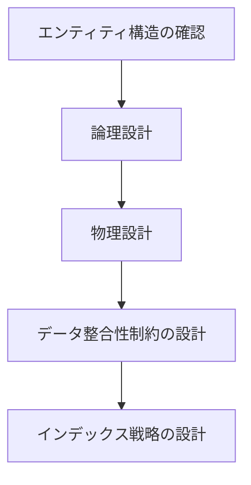

# スキーマ設計

## 目次

1. [概要](#概要)
2. [処理フロー](#処理フロー)
3. [ステップ 1: エンティティ構造の確認](#ステップ-1-エンティティ構造の確認)
4. [ステップ 2: 論理設計](#ステップ-2-論理設計)
5. [ステップ 3: 物理設計](#ステップ-3-物理設計)
6. [ステップ 4: データ整合性制約の設計](#ステップ-4-データ整合性制約の設計)
7. [ステップ 5: インデックス戦略の設計](#ステップ-5-インデックス戦略の設計)
8. [結論](#結論)

## 概要

SQLite を使用した CogitoWeave システムのデータベーススキーマを段階的に設計する。

- **関心事**: エンティティ定義から SQL テーブルスキーマへの変換
- **時間軸**: 実装フェーズの設計段階
- **視点**: データベース設計者
- **成果物**: CREATE TABLE 文とインデックス定義

エンティティ定義とデータベース選択を前提として、ID 設計、制約設計、インデックス設計を順次決定することで、実装可能なスキーマを導出する。

## 処理フロー



## ステップ 1: エンティティ構造の確認

前提となるエンティティ定義を確認し、必要なテーブル数とテーブル名を決定する。

<!-- PREMISE_BEGIN: concept-entity -->

概念エンティティ(Concept):

- 思考の最小単位として知識体系の中心に位置する
- 基本属性: ID、名前、説明、作成日時、更新日時
- 他の概念との関係性によって意味を形成する
- 外部情報を個人の理解に変換する観点として機能する

<!-- PREMISE_END: concept-entity -->

<!-- PREMISE_BEGIN: literature-memo-entity -->

文献メモエンティティ(LiteratureMemo):

- ツェッテルカステン方式による概念ベースの知識蓄積
- 基本属性: ID、タイトル、内容、作成日時、更新日時
- 特定の概念の観点で外部文献を要約・解釈したもの
- LLM 協働により効率的に作成され、個人の理解で修正される

<!-- PREMISE_END: literature-memo-entity -->

<!-- PREMISE_BEGIN: relationship-entity -->

関係性エンティティ(Relationship):

- 概念間の無向グラフ構造による知識ネットワーク形成
- 基本属性: ID、関係名、説明、作成日時
- 個人的な関係語彙による柔軟な関係定義
- 空間配置による直感的な関係性発見を支援

<!-- PREMISE_END: relationship-entity -->

<!-- PREMISE_BEGIN: literature-entity -->

文献エンティティ(Literature):

- 外部文献の書誌情報管理
- 基本属性: ID、URL、タイトル、取得日時
- 複数の概念観点から文献メモが生成される元情報

<!-- PREMISE_END: literature-entity -->

### 5. データベース選択

<!-- PREMISE_BEGIN: sqlite-selection -->

CogitoWeave システムでは **SQLite** を選択する。

<!-- PREMISE_END: sqlite-selection -->

### テーブル数とテーブル名の決定

4 つのエンティティから 4 つのテーブルを作成する。

テーブル名・カラム名は snake_case を使用し、他の RDBMS への移植性を考慮した一般的な規則に従う。テーブル名は単数形を使用する。

- 概念エンティティ(Concept) → concept テーブル
- 文献エンティティ(Literature) → literature テーブル
- 文献メモエンティティ(LiteratureMemo) → literature_memo テーブル
- 関係性エンティティ(Relationship) → relationship テーブル

## ステップ 2: 論理設計

### 論理設計の概要

各テーブルの属性とカラムをマッピングし、論理的な型を決定する。NULL 許容が必要なカラムがあるか検討する。

### 論理設計の手順

論理設計は 2 段階で行う。第 1 段階として、ステップ 1 で確認した各エンティティの基本属性をそのまま集約する。集約は前のステップから情報をそのまま持ってくる操作であり、内容は一切変更せず、単純な情報収集のみを行う。第 2 段階として、集約した基本属性をテーブルのカラムにマッピングする。各属性に対して適切なカラム名と論理的な型を割り当てる。

**記法ルール:**

- すべてのカラムは必須(NOT NULL)がデフォルト
- 文字列カラムは空文字列不可がデフォルト
- 例外のみ明記: (空文字列許容)、(NULL 許容)

**NULL 許容の原則:**

- すべての属性は必須(NOT NULL)が基本である
- NULL 許容は例外的にのみ使用する
- 特に文字列では「値がない」状態を空文字列で表現可能なため、NULL 許容はほぼ不要である

### 各テーブルのマッピング

**concept テーブル:**

ステップ 1 で確認した概念エンティティの定義には、基本属性として「ID、名前、説明、作成日時、更新日時」が記載されている。これをカラムにマッピングする。

- ID → id カラム(ID)
- 名前 → name カラム(文字列)
- 説明 → description カラム(文字列、空文字列許容)
- 作成日時 → created_at カラム(日時)
- 更新日時 → updated_at カラム(日時)

**literature テーブル:**

ステップ 1 で確認した文献エンティティの定義には、基本属性として「ID、URL、タイトル、取得日時」が記載されている。これをカラムにマッピングする。

- ID → id カラム(ID)
- URL → url カラム(文字列)
- タイトル → title カラム(文字列)
- 取得日時 → fetched_at カラム(日時)

**literature_memo テーブル:**

ステップ 1 で確認した文献メモエンティティの定義には、基本属性として「ID、タイトル、内容、元 URL、作成日時、更新日時」が記載されている。これをカラムにマッピングする。

- ID → id カラム(ID)
- タイトル → title カラム(文字列)
- 内容 → content カラム(文字列)
- 作成日時 → created_at カラム(日時)
- 更新日時 → updated_at カラム(日時)
- 概念への参照 → concept_id カラム(外部キー ID)
- 文献への参照 → literature_id カラム(外部キー ID)

**relationship テーブル:**

ステップ 1 で確認した関係性エンティティの定義には、基本属性として「ID、関係名、説明、作成日時」と参照属性として「概念 A への参照、概念 B への参照」が記載されている。これをカラムにマッピングする。

- ID → id カラム(ID)
- 関係名 → relationship_name カラム(文字列)
- 説明 → description カラム(文字列、空文字列許容)
- 作成日時 → created_at カラム(日時)
- 概念 A への参照 → concept_a_id カラム(外部キー ID)
- 概念 B への参照 → concept_b_id カラム(外部キー ID)

### NULL 許容の確認

設計したすべてのカラムを確認する。NULL 許容が必要なカラムがあるか検討する。

- すべてのカラムで空文字列と NULL を業務的に区別する必要がない
- 「値がない」状態は空文字列で表現可能である

結論として、すべてのカラムで NULL 許容は不要である。

## ステップ 3: 物理設計

論理設計で決定したカラムに対して、SQLite の物理的なデータ型、サイズ、デフォルト値を決定する。

### カラム一覧の集約

ステップ 2 で定義したすべてのカラムを論理的な型ごとに集約する。

**ID カラム:**

- id(全テーブル)
- concept_id(literature_memo、外部キー)
- literature_id(literature_memo、外部キー)
- concept_a_id(relationship、外部キー)
- concept_b_id(relationship、外部キー)

**文字列カラム:**

- name(concept)
- description(concept、空文字列許容)
- url(literature)
- title(literature, literature_memo)
- content(literature_memo)
- relationship_name(relationship)
- description(relationship、空文字列許容)

**日時カラム:**

- created_at(concept, literature_memo, relationship)
- updated_at(concept, literature_memo)
- fetched_at(literature)

### データ型の決定

各型分類に対して適切な SQLite のデータ型を割り当てる。

SQLite は動的型付けであり、型名は型親和性(Type Affinity)のヒントとして機能する。実際のストレージは値に応じて自動調整される。

**ID カラム:**

個人用途のシステムでは分散環境対応は不要であり、整数の自動採番により実装の簡潔性とインデックス効率を両立できる。

すべての ID カラムに INTEGER PRIMARY KEY AUTOINCREMENT を使用する。

**文字列カラム:**

可変長が必要な短文は VARCHAR 型、長文は TEXT 型を使用する。実用的な利用シナリオに基づき、各フィールドに適切な最大長を設定する。

カラムごとの型とサイズ:

- name(concept): VARCHAR(100)
- description(concept): VARCHAR(1000)
- url(literature): VARCHAR(2048)
- title(literature, literature_memo): VARCHAR(500)
- content(literature_memo): TEXT
- relationship_name(relationship): VARCHAR(100)
- description(relationship): VARCHAR(500)

なお、CHAR 型は使用しない。CHAR 型は固定長の文字列型として、かつてはストレージ効率やアクセス速度の観点で有利とされた。しかし現代のデータベースでは、可変長型の最適化が進み、固定長による性能上の利点はほぼ失われている。一方で、CHAR 型は指定された長さに満たない文字列を格納する際に末尾へ自動的にスペースが追加されるため、文字列比較や長さチェックで予期しない動作を引き起こし、バグの原因となる。歴史的な利点が失われた現在、CHAR 型を採用する理由はない。

**日時カラム:**

日時の手動設定は誤りが発生しやすいため、データベースによる自動記録で正確性を確保する。次の日時カラムに TIMESTAMP NOT NULL DEFAULT CURRENT_TIMESTAMP を使用する。

- created_at(concept, literature_memo, relationship)
- updated_at(concept, literature_memo)
- fetched_at(literature)

## ステップ 4: データ整合性制約の設計

物理設計で確定したカラムに対して、データ整合性を保証する制約を設計する。UNIQUE 制約、削除方針、無向グラフ正規化を順次決定する。

### UNIQUE 制約の設計

重複を許容すべきでないカラムに UNIQUE 制約を設定する。

- 概念名(concept.name)に UNIQUE 制約を設定し、重複概念の登録を防止する
- 文献 URL(literature.url)は同一 URL の複数登録を許可するため UNIQUE 制約を設定しない
- その他のカラムは重複が許容されるため UNIQUE 制約を設定しない

### 削除方針

データ削除の実現方法には、物理削除、論理削除(削除フラグ)、ステータス管理、履歴テーブルなどの選択肢がある。論理削除、ステータス管理、履歴テーブルは実装とクエリの複雑性が増すため、物理削除を採用する。

外部キー制約の削除動作には ON DELETE RESTRICT と ON DELETE CASCADE がある。ON DELETE CASCADE は意図しないデータ連鎖削除を引き起こすため、安全性を優先してすべての外部キーに ON DELETE RESTRICT を設定する。これにより関連データが存在する場合は削除を防止し、明示的な削除順序を強制することでデータ整合性を保証する。

物理削除では削除データが失われるため、誤削除時の復旧手段としてデータバックアップを実施する。

### 無向グラフ正規化

関係性テーブルは無向グラフを表現する。無向グラフでは(概念 A, 概念 B)と(概念 B, 概念 A)は同一の概念ペアである。概念ペアの順序を正規化しないと、検索時に(A, B)と(B, A)の両方の形式を考慮する必要が生じてクエリが複雑になる。

この問題を解決するため、CHECK 制約 `concept_a_id < concept_b_id` をデータベースレベルで設定する。アプリケーション層では挿入前に概念 ID を `min(id1, id2), max(id1, id2)` として正規化する。データベース制約により正規化されていないデータの登録は拒否される。この正規化により、検索時は正規化された形式のみを検索すればよく、クエリが単純になる。

同一概念ペアに同一関係名が重複登録されることを防ぐため、UNIQUE 制約 `(concept_a_id, concept_b_id, relationship_name)` を設定する。これにより、(概念 A, 概念 B)に「関連する」と「発展させる」など異なる関係名で複数の関係性を登録できるが、同じ関係名の重複登録は拒否される。

## ステップ 5: インデックス戦略の設計

データ整合性制約で確定した制約に対して、検索性能を確保するためのインデックス戦略を設計する。

概念検索 API は概念名と説明文での部分一致検索を提供する。部分一致検索では全件スキャンが発生するため、検索性能を確保するために concept テーブルの name カラムと description カラムにインデックスを作成する。

外部キー制約を設定したカラムには、データベースが自動的にインデックスを作成する。literature_memo テーブルの concept_id と literature_id、relationship テーブルの concept_a_id と concept_b_id は外部キー制約により自動的にインデックスが作成されるため、関連データの効率的な取得が実現される。

## 結論

<!-- GLOBAL_CONCLUSION_BEGIN: concept-table-schema -->

```sql
-- ============================================
-- Concept (概念) テーブル
-- ============================================
CREATE TABLE concept (
    id INTEGER PRIMARY KEY AUTOINCREMENT,
    name VARCHAR(100) NOT NULL UNIQUE,
    description VARCHAR(1000) NOT NULL,
    created_at TIMESTAMP NOT NULL DEFAULT CURRENT_TIMESTAMP,
    updated_at TIMESTAMP NOT NULL DEFAULT CURRENT_TIMESTAMP
);

CREATE INDEX idx_concept_name ON concept(name);
CREATE INDEX idx_concept_description ON concept(description);
```

<!-- GLOBAL_CONCLUSION_END: concept-table-schema -->

<!-- GLOBAL_CONCLUSION_BEGIN: literature-table-schema -->

```sql
-- ============================================
-- Literature (文献) テーブル
-- ============================================
CREATE TABLE literature (
    id INTEGER PRIMARY KEY AUTOINCREMENT,
    url VARCHAR(2048) NOT NULL,
    title VARCHAR(500) NOT NULL,
    fetched_at TIMESTAMP NOT NULL DEFAULT CURRENT_TIMESTAMP
);

CREATE INDEX idx_literature_url ON literature(url);
```

<!-- GLOBAL_CONCLUSION_END: literature-table-schema -->

<!-- GLOBAL_CONCLUSION_BEGIN: literature-memo-table-schema -->

```sql
-- ============================================
-- LiteratureMemo (文献メモ) テーブル
-- ============================================
CREATE TABLE literature_memo (
    id INTEGER PRIMARY KEY AUTOINCREMENT,
    concept_id INTEGER NOT NULL,
    literature_id INTEGER NOT NULL,
    title VARCHAR(500) NOT NULL,
    content TEXT NOT NULL,
    created_at TIMESTAMP NOT NULL DEFAULT CURRENT_TIMESTAMP,
    updated_at TIMESTAMP NOT NULL DEFAULT CURRENT_TIMESTAMP,
    FOREIGN KEY (concept_id) REFERENCES concept(id) ON DELETE RESTRICT,
    FOREIGN KEY (literature_id) REFERENCES literature(id) ON DELETE RESTRICT
);

CREATE INDEX idx_literature_memo_concept_id ON literature_memo(concept_id);
CREATE INDEX idx_literature_memo_literature_id ON literature_memo(literature_id);
```

<!-- GLOBAL_CONCLUSION_END: literature-memo-table-schema -->

<!-- GLOBAL_CONCLUSION_BEGIN: relationship-table-schema -->

```sql
-- ============================================
-- Relationship (関係性) テーブル
-- ============================================
CREATE TABLE relationship (
    id INTEGER PRIMARY KEY AUTOINCREMENT,
    concept_a_id INTEGER NOT NULL,
    concept_b_id INTEGER NOT NULL,
    relationship_name VARCHAR(100) NOT NULL,
    description VARCHAR(500) NOT NULL,
    created_at TIMESTAMP NOT NULL DEFAULT CURRENT_TIMESTAMP,
    FOREIGN KEY (concept_a_id) REFERENCES concept(id) ON DELETE RESTRICT,
    FOREIGN KEY (concept_b_id) REFERENCES concept(id) ON DELETE RESTRICT,
    CHECK (concept_a_id < concept_b_id),
    UNIQUE (concept_a_id, concept_b_id, relationship_name)
);

CREATE INDEX idx_relationship_concept_a_id ON relationship(concept_a_id);
CREATE INDEX idx_relationship_concept_b_id ON relationship(concept_b_id);
```

<!-- GLOBAL_CONCLUSION_END: relationship-table-schema -->
