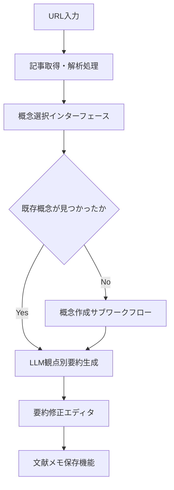
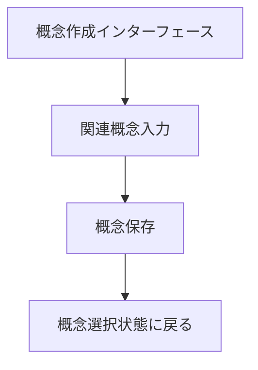
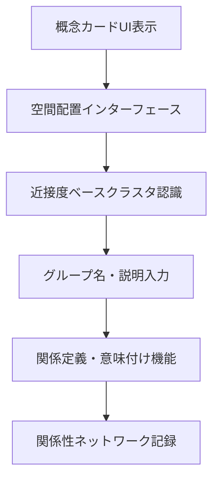
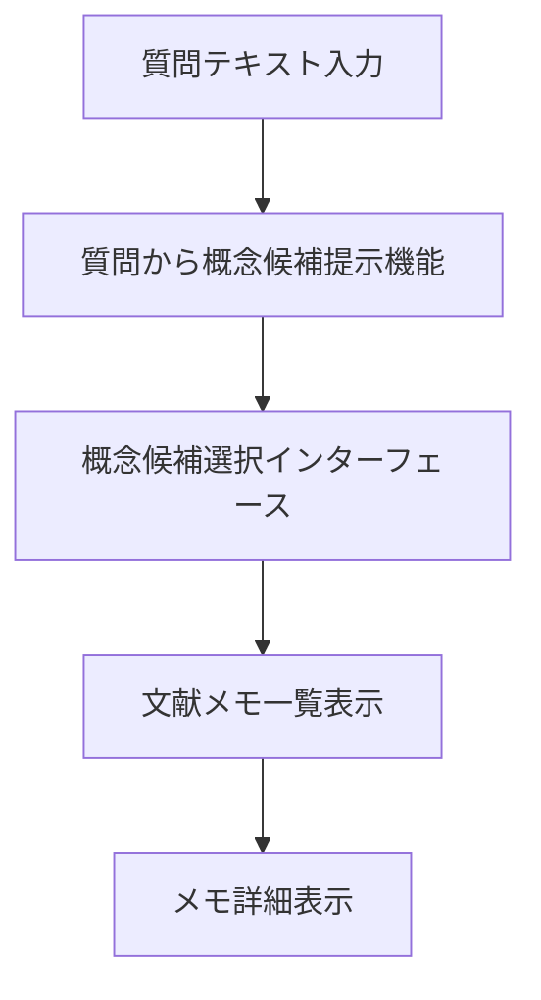

# UI 要素

## 目次

TBD

## 概要

TBD

## 処理フロー

TBD

## 直交分割

### 前提となる UI 要素

#### シナリオ 1 UI 要素

<!-- REFERENCE_BEGIN: scenario-01-ui-elements-list -->

1. **URL 入力フィールド** - 外部記事の URL 入力
2. **記事取得・解析処理** - URL 指定による外部記事の取得と内容解析
3. **概念検索・選択インターフェース** - 読む観点となる概念の検索・選択
4. **概念新規作成インターフェース** - 新しい概念の作成
5. **LLM による観点別要約生成機能** - 選択した概念の観点で記事内容を要約
6. **要約修正エディタ** - LLM が作成した要約を個人の理解に合わせて修正
7. **文献メモ保存機能** - 修正した内容を個人の知識体系に保存
8. **複数概念適用機能** - 同一記事を別の概念の観点でも読み直し

<!-- REFERENCE_END: scenario-01-ui-elements-list -->

#### シナリオ 1 システム処理フロー

##### 文献読み込み・要約作成ワークフロー

<!-- REFERENCE_BEGIN: literature-reading-workflow -->

- **目的**: 外部文献を概念に紐付けて知識を蓄積する
- **トリガ**: ユーザーが URL 入力フィールドに URL を入力
- **終了条件**: 文献メモが概念に関連付けられて保存される
- **境界越え**: 外部記事取得 API、LLM 要約生成 API

<!-- REFERENCE_END: literature-reading-workflow -->

##### 概念作成サブワークフロー

<!-- REFERENCE_BEGIN: concept-creation-subworkflow -->

- **目的**: 新しい概念をシステムに追加する
- **トリガ**: 概念選択時に既存概念が見つからない場合
- **終了条件**: 新規概念が作成され選択可能になる
- **境界越え**: なし (内部処理)

<!-- REFERENCE_END: concept-creation-subworkflow -->

### シナリオ 2 の UI 要素とシステム処理フロー

### シナリオ 2 UI 要素

<!-- REFERENCE_BEGIN: scenario-02-ui-elements -->

1. **概念カード UI** - 概念を視覚的に操作可能なカード形式で表示
2. **ドラッグ&ドロップ空間配置機能** - 直感的な位置決めインターフェース
3. **近接度ベースクラスタ認識・境界表示機能** - 近くに置かれた概念のクラスタ認識と視覚的境界表示
4. **グループ名・説明入力機能** - 形成されたグループへの名前や説明の後付け入力

<!-- REFERENCE_END: scenario-02-ui-elements-list -->

### シナリオ 2 システム処理フロー

#### 概念関係性構築ワークフロー

<!-- REFERENCE_BEGIN: concept-relationship-building-workflow -->

- **目的**: 概念間の関係を発見・定義して知識ネットワークを構築する
- **トリガ**: ユーザーが空間配置インターフェースで概念を操作
- **終了条件**: 概念関連が定義されてネットワークに記録される
- **境界越え**: クラスタ認識アルゴリズム

<!-- REFERENCE_END: concept-relationship-building-workflow -->

### シナリオ 3 の UI 要素

<!-- REFERENCE_BEGIN: scenario-03-ui-elements -->

1. **起点概念選択機能** - 探索の出発点となる概念の選択機能
2. **関連概念入力支援機能** - オートコンプリート等による効率的な関連概念入力
3. **関係定義・意味付け機能** - 個人的な関係語彙による直感的な関係表現と意味付け
4. **関係性ネットワーク記録機能** - 発見した関係性の記録・保存による蓄積的知識構築

<!-- REFERENCE_END: scenario-03-ui-elements -->

### シナリオ 4 の UI 要素とシステム処理フロー

#### シナリオ 4 UI 要素

<!-- REFERENCE_BEGIN: scenario-04-ui-elements-list -->

1. **質問テキスト入力フィールド** - 質問内容を受け取るインターフェース
2. **質問から概念候補提示機能** - 質問内容から関連しそうな概念候補を提示
3. **概念候補選択インターフェース** - 提示された概念候補から関連する概念を選択
4. **文献メモ一覧表示機能** - 選択した概念に紐付いた文献メモを表示
5. **メモ詳細表示機能** - 各メモの詳細内容を参照して過去の体験や知識を思い出す機能

<!-- REFERENCE_END: scenario-04-ui-elements-list -->

#### シナリオ 4 システム処理フロー

##### 質問探索・概念発見ワークフロー

<!-- REFERENCE_BEGIN: question-exploration-workflow -->

- **目的**: 質問から関連概念を発見してメモを参照する
- **トリガ**: ユーザーが質問テキスト入力フィールドに質問を入力
- **終了条件**: 関連文献メモが表示される
- **境界越え**: LLM 概念候補生成 API

<!-- REFERENCE_END: question-exploration-workflow -->

### シナリオ 5 の UI 要素

<!-- REFERENCE_BEGIN: scenario-05-ui-elements -->

1. **中心概念設定機能** - 思考の起点となるメインテーマの設定機能
2. **概念空間配置インターフェース** - 断片的概念を KJ 法的に空間配置する機能
3. **概念間関係性定義機能** - 配置した概念間の関係を直感的に定義する機能
4. **思考マップ構築・表示機能** - 定義した関係性を視覚的な思考マップとして構築・表示
5. **論理フロー構築支援機能** - 思考マップから論理的な文章フローを構築する支援機能

<!-- REFERENCE_END: scenario-05-ui-elements -->

### シナリオ項目を含まない理由

各 UI 要素ファイルには**シナリオ項目を記載していない**。これは以下の設計判断に基づく：

1. **責務の分離**: シナリオとの対応関係は上位の`docs/20-system-design/01-user-desires/README.md`で管理済み
2. **汎用性の確保**: 各 UI 要素は複数シナリオで使用されるため、特定シナリオに依存しない汎用的な責務定義が適切
3. **情報の重複排除**: 同一情報を複数箇所で管理することによる整合性リスクを回避
4. **論理ビューの本質**: 「どのシナリオで使うか」より「何をする UI 要素か」が論理設計の核心

### UI 要素のフィルタリング

上記 19 個の UI 要素から、UI 設計対象となる 15 個の要素を抽出する。

#### 対象外とする 4 つの要素

- 自動処理: UI を伴わないため対象外
  - 記事取得・解析処理 - URL 指定による外部記事の取得と内容解析
- LLM 生成・推論: UI を伴わないため対象外
  - LLM による観点別要約生成機能 - 選択した概念の観点で記事内容を要約
  - 質問から概念候補提示機能 - 質問内容から関連しそうな概念候補を提示
- 機能実行: 複数の機能があるため対象外
  - 複数概念適用機能 - 同一記事を別の概念の観点でも読み直し

## 並列関係ファイル

各 UI 要素の実装仕様を個別ファイルで管理する。

### テキスト入力ファイル (5 ファイル)

- [URL 入力フィールド](input-01-url-field.md) - 外部記事の URL 入力 <!-- REFERENCE_INLINE: url-input-field -->
- [概念作成インターフェース](input-02-concept-creation.md) - 新規概念作成と関連概念入力の統合機能 <!-- REFERENCE_INLINE: concept-creation-interface -->
- [質問テキスト入力フィールド](input-03-question-field.md) - 質問内容を受け取るインターフェース <!-- REFERENCE_INLINE: question-text-field -->
- [グループ名・説明入力機能](input-04-group-naming.md) - 形成されたグループへの名前や説明の後付け入力 <!-- REFERENCE_INLINE: group-naming-function -->
- [関係定義・意味付け機能](input-05-relationship-definition.md) - 個人的な関係語彙による直感的な関係表現と意味付け <!-- REFERENCE_INLINE: relationship-definition-function -->

### 選択操作ファイル (2 ファイル)

- [概念選択インターフェース](select-01-concept-interface.md) - 用途に応じた概念の検索・選択機能 <!-- REFERENCE_INLINE: concept-selection-interface -->
- [概念候補選択インターフェース](select-02-concept-candidates.md) - 提示された概念候補から関連する概念を選択 <!-- REFERENCE_INLINE: concept-candidates-selection -->

### 直接操作ファイル (1 ファイル)

- [空間配置インターフェース](direct-01-spatial-arrangement.md) - 概念の直感的な配置機能 <!-- REFERENCE_INLINE: spatial-arrangement-interface -->

### 表示・視覚化ファイル (4 ファイル)

- [概念カード UI](display-01-concept-cards.md) - 概念を視覚的に操作可能なカード形式で表示 <!-- REFERENCE_INLINE: concept-cards-ui -->
- [文献メモ一覧表示機能](display-02-memo-list.md) - 選択した概念に紐付いたメモ一覧表示 <!-- REFERENCE_INLINE: memo-list-display -->
- [メモ詳細表示機能](display-03-memo-detail.md) - 各メモの詳細内容を参照 <!-- REFERENCE_INLINE: memo-detail-display -->
- [近接度ベースクラスタ認識・境界表示機能](display-04-cluster-recognition.md) - 近くに置かれた概念のクラスタ認識と視覚的境界表示 <!-- REFERENCE_INLINE: cluster-recognition-display -->

### 編集操作ファイル (1 ファイル)

- [要約修正エディタ](edit-01-summary-editor.md) - LLM が作成した要約を個人の理解に合わせて修正 <!-- REFERENCE_INLINE: summary-editor -->

### データ保存ファイル (2 ファイル)

- [文献メモ保存機能](save-01-literature-memo.md) - 修正した内容を個人の知識体系に保存 <!-- REFERENCE_INLINE: literature-memo-save -->
- [関係性ネットワーク記録機能](save-02-relationship-network.md) - 発見した関係性の記録・保存 <!-- REFERENCE_INLINE: relationship-network-record -->
