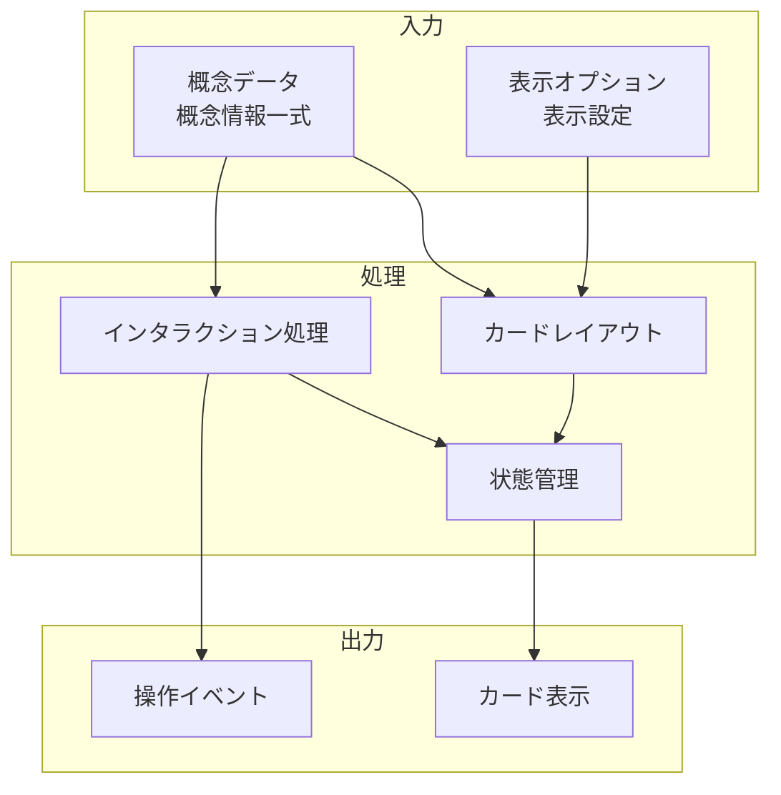

# 概念カード UI

## 責務

<!-- PREMISE_BEGIN: concept-cards-ui -->
概念カード UI - 概念を視覚的に操作可能なカード形式で表示
<!-- PREMISE_END: concept-cards-ui -->

## 責務から仕様への詳細化

抽象的な責務定義を具体的な実装仕様に変換します。

**変換**: 抽象的な責務 → 具体的な実装仕様
**入力**: 「何をするか」の責務定義
**出力**: 「どうやるか」のデータフローと処理詳細

<!-- LOCAL_CONCLUSION_BEGIN: concept-cards-implementation -->

## データフロー

## 入力

### 概念データ

- 表示対象となる概念の完全な情報を受け取る
  - カード上で概念の内容を適切に表現するため

### 表示オプション

- カードの表示方法や詳細レベルの設定を受け取る
  - 利用場面に応じた最適な情報提示を実現するため

## 処理

### カードレイアウト

- 概念情報をカード形式で整理し表示レイアウトを構築する
  - 視覚的に理解しやすい形で概念を提示するため
- 情報の優先度に応じた表示領域を配分する
  - 重要な情報を効果的に強調表示するため

### インタラクション処理

- ホバー時の詳細表示とクリック操作を処理する
  - 段階的な情報開示とスムーズな操作を実現するため
- マウス・タッチ操作への適切な反応を提供する
  - デバイスに応じた自然な操作感を提供するため

### 状態管理

- カードの選択状態・アクティブ状態を管理する
  - ユーザーの操作状況を視覚的にフィードバックするため
- 複数カード間の状態連携を制御する
  - 一貫した操作体験を保証するため

## 出力

### カード表示

- 整理された概念情報のカード形式表示を出力する
  - ユーザーが概念を視覚的に理解できるようにするため

### 操作イベント

- ユーザーのカード操作情報を出力する
  - 後続処理で概念選択や詳細表示を実行できるようにするため

## 備考

ホバー時の詳細表示とクリック操作に対応

<!-- LOCAL_CONCLUSION_END: concept-cards-implementation -->
