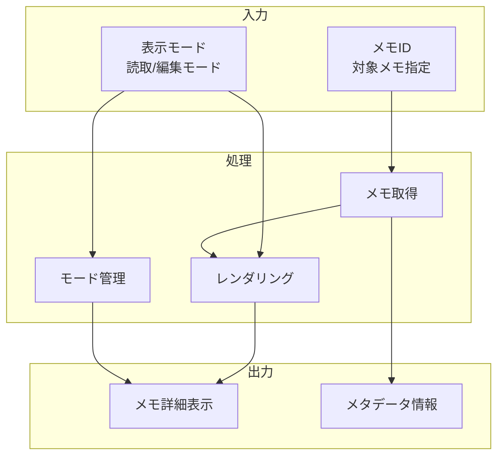

# メモ詳細表示機能

## 責務

<!-- PREMISE_BEGIN: memo-detail-display -->
メモ詳細表示機能 - 各メモの詳細内容を参照
<!-- PREMISE_END: memo-detail-display -->

## 責務から仕様への詳細化

抽象的な責務定義を具体的な実装仕様に変換します。

**変換**: 抽象的な責務 → 具体的な実装仕様
**入力**: 「何をするか」の責務定義
**出力**: 「どうやるか」のデータフローと処理詳細

<!-- LOCAL_CONCLUSION_BEGIN: memo-detail-implementation -->

## データフロー

## 入力

### メモ ID

- 表示対象となる文献メモの一意識別子を受け取る
  - 特定のメモを正確に特定して詳細表示できるようにするため

### 表示モード

- 読取専用モードか編集可能モードかの指定を受け取る
  - 利用目的に応じた最適なインターフェースを提供するため

## 処理

### メモ取得

- 指定されたメモ ID に対応する詳細情報を取得する
  - メモの全内容と関連情報を収集するため
- 関連概念や参考情報を併せて取得する
  - メモの文脈と背景を理解できるようにするため

### レンダリング

- 表示モードに応じたメモ内容のレンダリングを実行する
  - 読取モードでは整形された表示、編集モードでは編集可能な形式で提供するため
- Markdown のパースやコードハイライトを実行する
  - 技術文書やコードサンプルを読みやすく表示するため

### モード管理

- 読取モードと編集モード間の切り替えを管理する
  - シームレスなモード変更でユーザー体験を向上させるため
- 編集時の変更状態追跡を行う
  - 未保存変更の紛失を防ぐため

## 出力

### メモ詳細表示

- モードに応じて適切にレンダリングされたメモ内容を出力する
  - ユーザーがメモを効果的に閲覧・編集できるようにするため

### メタデータ情報

- メモの作成日、更新日、関連概念などの付帯情報を出力する
  - メモの文脈や履歴を把握できるようにするため

## 備考

編集モードとの切り替え機能が必要

<!-- LOCAL_CONCLUSION_END: memo-detail-implementation -->
