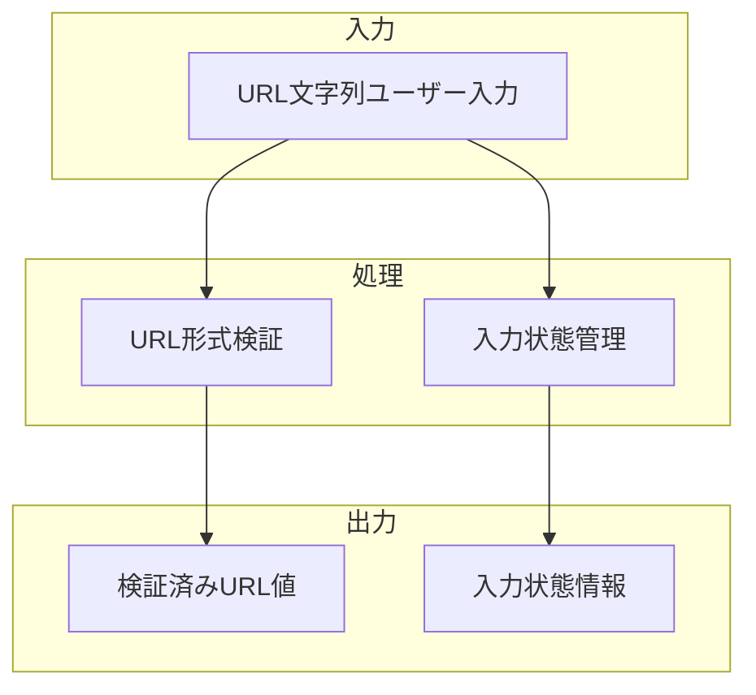

# URL入力フィールド

## 責務

<!-- PREMISE_BEGIN: url-input-field -->
URL 入力フィールド - 外部記事の URL 入力
<!-- PREMISE_END: url-input-field -->

## 責務から仕様への詳細化

抽象的な責務定義を具体的な実装仕様に変換します。

**変換**: 抽象的な責務 → 具体的な実装仕様
**入力**: 「何をするか」の責務定義
**出力**: 「どうやるか」のデータフローと処理詳細

<!-- LOCAL_CONCLUSION_BEGIN: url-input-field-implementation -->

## データフロー

## 入力

### URL文字列

- ユーザーが入力するURL文字列を受け取る
  - 外部記事を取得するための基本情報として必要なため

## 処理

### URL形式検証

- 入力されたURL文字列の形式妥当性を検証する
  - 無効なURLによる後続処理のエラーを防ぐため
- http/https スキームの確認を実行する
  - セキュリティ制約に適合するURLのみを受け入れるため

### 入力状態管理

- 空/入力中/検証済み/エラーの状態を管理する
  - ユーザーに適切なフィードバックを提供するため
- リアルタイム検証状態の更新を行う
  - 入力完了前にエラーを早期発見するため

## 出力

### 検証済みURL値

- 形式検証を通過したURL文字列を出力する
  - 後続の記事取得処理で安全に使用できるようにするため

### 入力状態情報

- 現在の入力状態と検証結果を出力する
  - UIでの状態表示とユーザーガイダンスを可能にするため

## 備考

URL形式のバリデーション機能が必要

<!-- LOCAL_CONCLUSION_END: url-input-field-implementation -->
