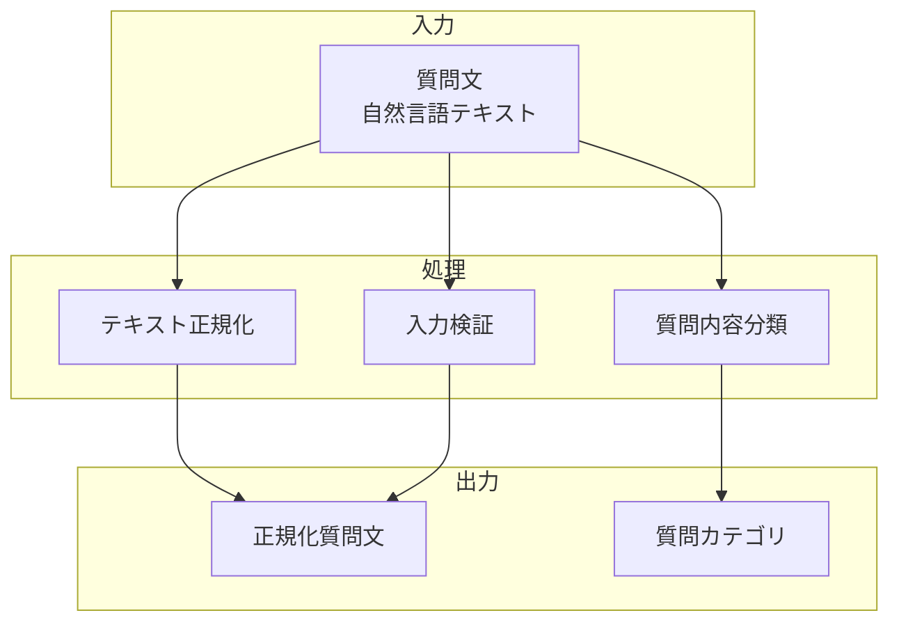

# 質問テキスト入力フィールド

## 責務

<!-- PREMISE_BEGIN: question-text-field -->
質問テキスト入力フィールド - 質問内容を受け取るインターフェース
<!-- PREMISE_END: question-text-field -->

## 責務から仕様への詳細化

抽象的な責務定義を具体的な実装仕様に変換します。

**変換**: 抽象的な責務 → 具体的な実装仕様
**入力**: 「何をするか」の責務定義
**出力**: 「どうやるか」のデータフローと処理詳細

<!-- LOCAL_CONCLUSION_BEGIN: question-text-implementation -->

## データフロー

## 入力

### 質問文

- ユーザーが入力する質問の自然言語テキストを受け取る
  - 概念に関する疑問や検索意図を明確にするため

## 処理

### 質問内容分類

- 質問の種類を自動的に判定する
  - 適切な概念候補を提示するための前処理として必要なため
- 検索型・比較型・説明型の分類を実行する
  - 質問タイプに応じた最適な回答戦略を選択するため

### テキスト正規化

- 複数行テキストの統合と整形を行う
  - システムでの処理効率と検索精度を向上させるため
- 不要な改行や空白の除去を実行する
  - テキスト解析の精度を高めるため

### 入力検証

- 質問文の妥当性を確認する
  - 空文字列や無意味な入力を早期に検出するため
- 文字数制限とフォーマットをチェックする
  - システムの処理限界内での動作を保証するため

## 出力

### 正規化質問文

- 処理済みの質問テキストを出力する
  - 後続の概念検索処理で利用できるようにするため

### 質問カテゴリ

- 自動分類された質問の種別を出力する
  - 適切な概念候補提示戦略を選択できるようにするため

## 備考

複数行テキスト入力に対応が必要

<!-- LOCAL_CONCLUSION_END: question-text-implementation -->
