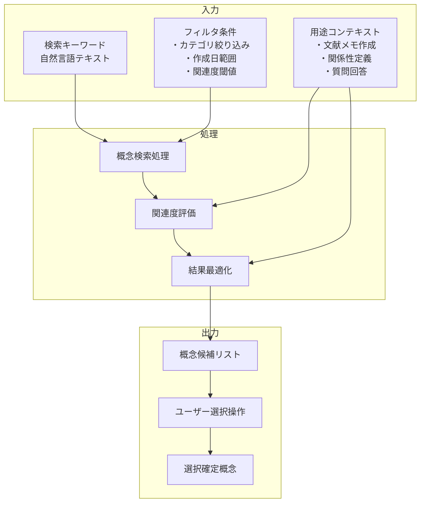

# 概念選択インターフェース

## 責務

<!-- PREMISE_BEGIN: concept-selection-interface -->
概念選択インターフェース - 用途に応じた概念の検索・選択機能
<!-- PREMISE_END: concept-selection-interface -->

## 責務から仕様への詳細化

抽象的な責務定義を具体的な実装仕様に変換します。

**変換**: 抽象的な責務 → 具体的な実装仕様
**入力**: 「何をするか」の責務定義
**出力**: 「どうやるか」のデータフローと処理詳細

<!-- LOCAL_CONCLUSION_BEGIN: concept-selection-implementation -->

## データフロー

## 入力

### 検索キーワード

- 自然言語テキストで概念検索のクエリを受け取る
  - ユーザーが直感的に概念を探せるようにするため

### フィルタ条件

- カテゴリ・作成日・関連度閾値によるフィルタ条件を受け取る
  - 大量の概念から効率的に候補を絞り込むため
- ユーザーが設定可能な絞り込み基準を提供する
  - 検索結果の精度とパフォーマンスを両立するため

### 用途コンテキスト

- 文献メモ作成・関係性定義・質問回答の 3 つの用途を区別して受け取る
  - 同じ概念でも用途によって最適な選択候補が異なるため
- 用途ごとに異なる検索戦略を適用する
  - 文献メモ作成では最近使用概念、関係性定義では関連度重視にするため

## 処理

### 概念検索・フィルタリング

- 個人の概念データベースから検索キーワードに関連する概念を抽出する
  - ユーザーの個人的な概念体系から関連概念を発見するため
- フィルタ条件を適用して候補を絞り込む
  - 検索結果の精度を高め、選択作業を効率化するため

### 関連度評価

- 用途コンテキストに応じた関連度を計算する
  - 同じ概念でも使用場面によって重要度が変わるため
- 文献メモ作成時は最近使用概念を優遇し、関係性定義時は関連概念数重視で評価する
  - 用途ごとの最適な概念選択を支援するため

### 結果最適化

- 関連度に基づく順序付けを実行する
  - ユーザーが求める概念を上位に表示するため
- 用途別の表示最適化と適切な件数での結果提示を行う
  - 選択作業の認知負荷を軽減するため

## 出力

### 概念候補リスト

- 概念タイトル・関連度指標・概念プレビューを含む候補リストを提示する
  - ユーザーが概念の内容を事前に把握して適切な選択ができるようにするため
- ユーザーによる概念選択インターフェースを提供する
  - 直感的な選択操作を可能にするため
- 検索条件変更時の結果更新機能を実装する
  - リアルタイムでの概念探索を支援するため

### 選択確定概念

- システム内一意識別子と基本情報を出力する
  - 後続処理で概念を正確に特定できるようにするため
- 関連概念リストと紐付き文献メモ情報を含める
  - 選択した概念の周辺情報も活用できるようにするため
- カテゴリ・タグ・利用統計の分類情報を提供する
  - 概念の特性と使用状況を把握できるようにするため

## 備考

検索結果の関連度ランキング機能が必要

<!-- LOCAL_CONCLUSION_END: concept-selection-implementation -->
