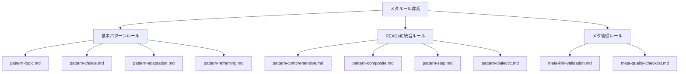

# メタルール - ドキュメント品質管理

CogitoWeave ドキュメント体系の品質を保証するためのメタルール群。構造化4軸設計フレームワークに基づく構造化アプローチと、1ファイル1判断原則による継続的品質改善を実現する。

## 前提条件とスコープ

ドキュメント品質管理は以下の領域を対象とする：

- ドキュメント構造の一貫性管理
- 内容品質の自動バリデーション  
- リンク整合性の継続的検証
- 設計判断の論理的一貫性評価

これらのルールは、手動レビューの負担を軽減し、高品質なドキュメント体系の維持を自動化する。

## 構成要素

## 関連リンク

### 個別タイプ

- [論理パターンルール](pattern-logic.md)
- [発想パターンルール](pattern-reframing.md)

### 統合型・並列型・段階型タイプ

- [網羅分割ルール](pattern-comprehensive.md)
- [分割合成ルール](pattern-composite.md)
- [直交分割ルール](pattern-parallel.md)
- [段階的詳細化ルール](pattern-elaboration.md)
- [解空間制限ルール](pattern-step.md)

### メタ管理ルール

- [リンクバリデーションルール](meta-link-validation.md)
- [設計品質チェックリスト](meta-quality-checklist.md)

## 結論

メタルール体系により、CogitoWeave ドキュメントの品質管理を自動化し、継続的な改善サイクルを確立する。手動レビューの負担軽減と、一貫した高品質ドキュメントの維持を両立させる包括的アプローチを提供する。
