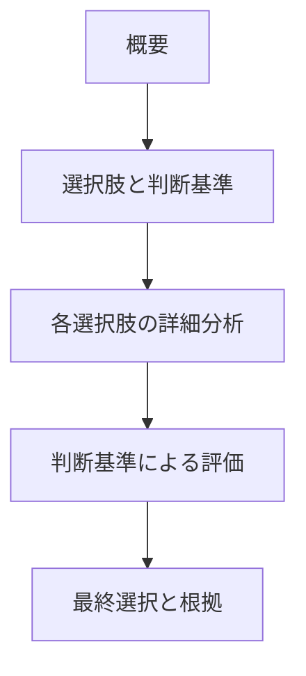

# pattern-choice パターン - 選択肢比較構造ガイド

## 定義と特徴

pattern-choice は、**複数の選択肢を体系的に比較して最適解を導出する**パターンです。各選択肢の特徴を公平に評価し、明確な判断基準に基づいて最終選択を行うことが特徴です。

## いつ使うのか

- 複数の技術選択肢から 1 つを選ぶ場合
- 設計アプローチの比較検討が必要な場合
- トレードオフが存在する選択判断
- 後から選択根拠を説明する必要がある重要な判断

## 他パターンとの違い

- **pattern-choice**: 複数選択肢の体系的比較
- **pattern-logic**: 判断に至る論理的推論

## 構造定義



### 各セクションの役割

1. **概要** - 前提条件と選択の背景・目的の明確化
2. **選択肢と判断基準** - 選択肢の列挙と評価軸の明確化
3. **各選択肢の詳細分析** - 各選択肢の特徴・利点・欠点
4. **判断基準による評価** - 基準ごとの客観的比較
5. **最終選択と根拠** - 選択結果と論理的根拠

## 圏論的解釈

選択肢集合 S = {s₁, s₂, ..., sₙ} から基準集合 C = {c₁, c₂, ..., cₘ} による評価関数 f: S × C → ℝ を通じて、最適元 s\* = argmax_s Σ w_i · f(s, c_i) を決定する。ここで w_i は各基準の重みであり、**客観的比較可能性**が理論的基盤となる。

## マーカー仕様

pattern-choice では以下のマーカーを使用します：

### PREMISE マーカー（必須）

他設計書からの前提条件を[認知負荷を下げる文章ルール](../00-documents/writing-rules.md)に従い一字一句正確にコピーする情報継承システムの中核マーカー。

### GLOBAL_CONCLUSION マーカー（必須）

他の設計書が参照する選択結果と根拠を囲むマーカー。選択した解とその論理的根拠を含む。

## テンプレート構造

```markdown
---
doc_type: "pattern-choice"
category: "[カテゴリ名]"
---

# [選択対象名]

## 概要

[この選択の位置づけと全体的な背景を説明する文章]

### 前提

<!-- PREMISE_BEGIN: example1 -->

[他設計書からの前提条件を一字一句正確にコピー]

<!-- PREMISE_END: example1 -->

<!-- PREMISE_BEGIN: example2 -->

[他設計書からの前提条件を一字一句正確にコピー]

<!-- PREMISE_END: example2 -->

## 選択肢と判断基準

[具体的な選択プロセスを説明する導入文章]

### 判断基準

- [基準 1] (優先度高)
- [基準 2]
- [基準 3]

### 選択肢

- [選択肢 1]: [簡潔な特徴説明]
- [選択肢 2]: [簡潔な特徴説明]
- [選択肢 3]: [簡潔な特徴説明]

## 各選択肢の詳細分析

[各選択肢の分析に入る前の全体的な説明文章]

### [選択肢 1]

[基本的な仕組み・アプローチの説明文章]

- 利点
  - [利点 1]
  - [利点 2]
- 欠点
  - [欠点 1]
  - [欠点 2]

### [選択肢 2]

[基本的な仕組み・アプローチの説明文章]

- 利点
  - [利点 1]
  - [利点 2]
- 欠点
  - [欠点 1]
  - [欠点 2]

## 判断基準による評価

### [基準 1] の比較

[どの選択肢が優秀か、その理由]

### [基準 2] の比較

[どの選択肢が優秀か、その理由]

## 最終選択と根拠

### 選択結果

<!-- GLOBAL_CONCLUSION_BEGIN: example3 -->

[選択対象]として[選んだ選択肢]を採用する。

<!-- GLOBAL_CONCLUSION_END: example3 -->

### 選択根拠

[なぜその選択肢が最適かの論理的説明]
```

## 品質チェックリスト

### 必須要素

- [ ] PREMISE マーカーが設置されている
- [ ] 判断基準が明確に定義されている
- [ ] 各選択肢の特徴・利点・欠点が記述されている
- [ ] 基準ごとの客観的比較が行われている
- [ ] GLOBAL_CONCLUSION マーカーが設置されている
- [ ] 最終選択の論理的根拠が示されている

### 構造チェック

- [ ] doc_type が "pattern-choice" になっている
- [ ] 選択肢 → 分析 → 評価 → 選択の順序になっている

### 内容チェック

- [ ] 全選択肢で同じ項目を同じ深度で分析している
- [ ] 判断基準に基づく客観的な選択根拠がある
- [ ] トレードオフが明確化されている
