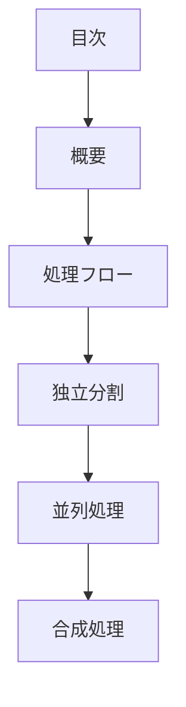

# pattern-composite パターン - 合成統合型独立分割ガイド

## 定義と特徴

pattern-composite は、**独立分割した要素から結論を抽出し、重複排除・分類・統合を行う**パターンです。独立した要素を並列処理後、合成処理により統合された最終結果を生成します。

## いつ使うのか

- 複数のUI要素を統合して最終的なUI仕様を導出する場合
- 複数の技術選択肢から最適解を合成する場合  
- 独立した分析結果を統合して総合判断を行う場合

## 他パターンとの違い

- **pattern-composite**: 独立要素から結論を抽出・統合(合成処理あり)
- **pattern-parallel**: 独立要素をそのまま並列保持(合成処理なし)

## 構造定義



### 各セクションの役割

1. **独立分割** - なぜ独立なのかの根拠
2. **並列処理** - 各要素の結論を抽出  
3. **合成処理** - 重複排除・分類・統合をステップ実行

### 合成処理の3ステップ

1. **分類** - UI要素を操作種別等で分類
2. **重複排除** - 同じ機能を持つ要素の統合
3. **フィルタリング** - 結論集継承用の最終整理

## 圏論的解釈

独立分割された対象の直積 `A ≅ ∏ᵢ Aᵢ` から、合成により統合対象 `B` への射 `∏ᵢ Aᵢ → B` として表現される。この射は重複排除・分類・統合の合成関数。

## テンプレート構造

```markdown
---
doc_type: "pattern-composite"
category: "[カテゴリ名]"
---

# [設計判断対象名]

## 独立分割

[なぜ独立なのかの根拠]

## 並列処理

[各要素の結論抽出]：

- [要素1](01-element1.md) - [要素の結論]
- [要素2](02-element2.md) - [要素の結論]
- [要素3](03-element3.md) - [要素の結論]

## 合成処理

### ステップ1: 分類
[結論の分類基準と分類結果]

### ステップ2: 重複排除
[重複する結論の統合処理]

### ステップ3: 最終結果
[統合された最終判断]
```

## 品質チェックリスト

### 必須要素

- [ ] 独立分割の根拠が明確に記述されている
- [ ] 各要素の結論が並列処理で抽出されている
- [ ] 合成処理で3ステップが実行されている
- [ ] 最終結果が統合された判断になっている

### 構造チェック

- [ ] doc_type が "pattern-composite" になっている
- [ ] 独立分割 → 並列処理 → 合成処理の順序になっている

### 内容チェック

- [ ] 各要素が真に独立している
- [ ] 合成処理で重複排除・分類・統合が実行されている
- [ ] 統合された最終判断が明確になっている
