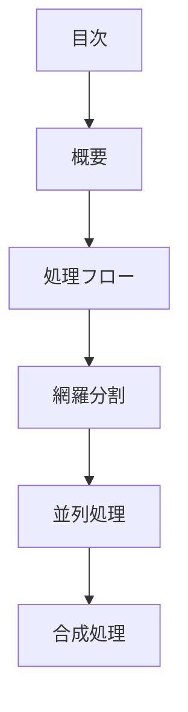

# pattern-comprehensive パターン - 網羅分割型統合ガイド

## 定義と特徴

pattern-comprehensive は、**網羅分割による要素の並列処理と合成統合を行う**パターンです。MECEを重視した分割で漏れのない要素抽出を行い、各要素の結論を統合して包括的な最終判断を導出します。

## いつ使うのか

- ISO/IEC標準等の外部基準に基づく網羅的分析が必要な場合
- 品質特性や制約要件を漏れなく整理する場合
- MECEによる体系的な分割が求められる場合

## 他パターンとの違い

- **pattern-comprehensive**: 網羅分割(MECEによる漏れなし分割)
- **pattern-composite**: 独立分割(独立性重視の分割)

## 構造定義



### 各セクションの役割

1. **網羅分割** - なぜこの分割方法なのか、網羅性の根拠を明記
2. **並列処理** - 各要素の結論を抽出
3. **合成処理** - 重複排除・分類・統合をステップ実行

### 網羅分割の根拠

網羅性を担保するため以下を明記：

- 採用した外部標準・フレームワーク(ISO/IEC 25010等)
- MECEを満たす分割理由
- なぜその範囲で切り取ったのか

## 圏論的解釈

対象 `A` を互いに素な部分の余積 `A ≅ ⩿ᵢ Aᵢ` として網羅分割。統合は余極限(colimit)として表現される。

## テンプレート構造

```markdown
---
doc_type: "pattern-comprehensive"
category: "[カテゴリ名]"
---

# [設計判断対象名]

## 網羅分割

ISO/IEC 25010システム品質モデルを採用。8つの品質特性は相互に排他的で網羅的なため、システム制約を漏れなく分析できる。

## 並列処理

[網羅的要素の結論抽出]：

- [機能適合性](functional-suitability.md) - 機能提供度の制約
- [性能効率性](performance.md) - パフォーマンス制約
- [互換性](compatibility.md) - システム間情報交換制約

## 合成処理

### ステップ1: 分類
[結論の分類基準と分類結果]

### ステップ2: 重複排除
[重複する結論の統合処理]

### ステップ3: 最終結果
[包括的な最終判断]
```

## 品質チェックリスト

### 必須要素

- [ ] 網羅分割の根拠が明確に記述されている
- [ ] MECEによる漏れなし分割が実現されている
- [ ] 各要素の結論が並列処理で抽出されている
- [ ] 合成処理で3ステップが実行されている
- [ ] 包括的な最終判断が導出されている

### 構造チェック

- [ ] doc_type が "pattern-comprehensive" になっている
- [ ] 網羅分割 → 並列処理 → 合成処理の順序になっている

### 内容チェック

- [ ] 要素が真にMECEで網羅的に分割されている
- [ ] 外部標準の根拠が的確に記述されている
- [ ] 包括的な最終判断が網羅性を保持している
