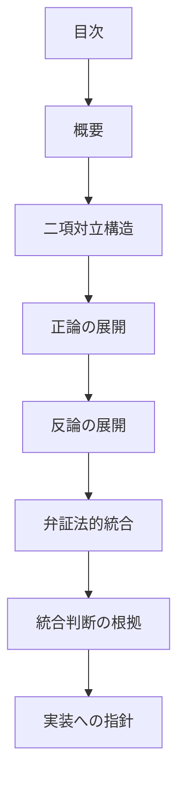

# pattern-dialectic パターン - 弁証法的統合型設計判断ガイド

## 定義と特徴

pattern-dialectic は、**対立する二つの視点や立場を弁証法的に統合して、より高次の解決策を導出する**パターンです。正反対の要素を建設的に組み合わせることで、単純な妥協ではない創造的な統合解を見つけることが特徴です。

## いつ使うのか

- セキュリティと利便性の両立が必要な設計
- パフォーマンスとメンテナビリティのトレードオフ解決
- 革新性と安定性の統合アプローチ
- 開発速度と品質保証の同時実現
- オープン性とプライバシー保護の調和

## 他パターンとの違い

- **pattern-dialectic**: 対立する要素の弁証法的統合(創造的統合処理あり)
- **pattern-composite**: 独立要素から結論を抽出・統合(論理的統合処理あり)

## 構造定義



### 各セクションの役割

1. **二項対立構造** - 解決すべき対立の本質を定義
2. **正論の展開** - 第一の立場の論理と強み・課題を分析
3. **反論の展開** - 第二の立場の論理と強み・課題を分析
4. **弁証法的統合** - 対立の本質分析と創造的統合解の導出
5. **統合判断の根拠** - なぜその統合が有効なのかの説明
6. **実装への指針** - 具体的な実装アプローチ

## 圏論的解釈

対立する要素 A と B から、より高次の統合要素 C への写像 f: A × B → C を構成する。この写像は単なる直積射影ではなく、新たな構造を創造する**コリミット**として機能する。

## テンプレート構造

```markdown
---
doc_type: "pattern-dialectic"
category: "[カテゴリ名]"
---

# [統合設計対象名]

## 二項対立構造

### 正(Thesis)：[第一の立場]

**[立場の要約]**

### 反(Antithesis)：[第二の立場]

**[立場の要約]**

## 正論の展開

### [第一立場]の設計判断

- [具体的判断 1]
- [具体的判断 2]

**この判断の強み**
- [強み 1]
- [強み 2]

**この判断の課題**
- [課題 1]
- [課題 2]

## 反論の展開

### [第二立場]の設計判断

- [具体的判断 1]
- [具体的判断 2]

**この判断の強み**
- [強み 1]
- [強み 2]

**この判断の課題**
- [課題 1]
- [課題 2]

## 弁証法的統合

### 対立の本質分析

[対立の根本原因の分析]

### 合成解(Synthesis)

**[統合解の名称]**

### 統合設計原則

1. **[原則 1]** - [詳細]
2. **[原則 2]** - [詳細]

## 統合判断の根拠

[なぜこの統合が有効なのかの説明]

## 実装への指針

1. [指針 1]
2. [指針 2]
```

## 品質チェックリスト

### 必須要素

- [ ] 明確な二項対立が定義されている
- [ ] 正論・反論が論理的に展開されている
- [ ] 弁証法的統合プロセスが記録されている
- [ ] 統合解が対立を超越している
- [ ] 実装への具体的指針が示されている

### 構造チェック

- [ ] doc_type が "pattern-dialectic" になっている
- [ ] 対立 → 正論 → 反論 → 統合 → 指針の順序になっている

### 内容チェック

- [ ] 対立が本質的である
- [ ] 統合解が創造的である
- [ ] 実装可能性が考慮されている
