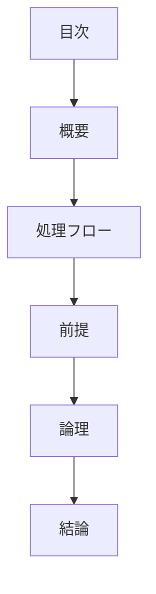

# pattern-logic パターン - 論理的思考構造ガイド

## 定義と特徴

pattern-logic は、**1 つの設計判断を前提 → 論理 → 結論の 3 段階で体系的に整理する**ファイル構造パターンです。Kent Beck 氏の self-similarity を適用し、全設計書で統一した論理構造を使用することが特徴です。

## いつ使うのか

- 個別の設計判断ファイル(1 ファイル 1 判断原則に従う)
- 論理的推論が重要な設計判断
- 後から妥当性を検証したい設計判断
- 他の設計者に判断根拠を説明する必要がある場合

**重要**: 複数の設計判断をまとめる場合は `readme-*` パターンを使用してください。

## 他パターンとの違い

- **pattern-logic**: 論理的推論により設計判断を導出
- **pattern-choice**: 複数選択肢から最適解を選択
- **pattern-reframing**: アイデア発想と発見プロセス

## 構造定義



### 各セクションの役割

1. **前提** - 判断の前提と境界を明確化
2. **論理** - 段階的な論理展開(必ず文章で記述)
3. **結論** - 1 つの明確な判断結果

### 前提セクションの要件

前提セクションには以下を含める必要があります：

- **PREMISE マーカー（必須）**: 他設計書からの前提条件を[認知負荷を下げる文章ルール](../00-documents/writing-rules.md)に従い一字一句正確にコピーする
- **確立された事実**: 人間の認知特性、技術的制約など
- **判断基準**: この判断で重視する原則や指標
- **スコープ境界**: 何を扱い、何を扱わないかの明確化

PREMISE マーカーは情報継承システムの中核であり、必ず設置する必要がある。

### 論理セクションの要件

論理展開は**必ず文章で記述**し、以下の構造を推奨：

- **第一に**: 問題・課題の本質を説明
- **第二に**: 従来アプローチの分析または制約条件の確認
- **第三に**: 提案アプローチの利点または解決策の論証
- **必要に応じて第四に、第五に**: より複雑な論理の場合

**重要**: 箇条書きは認知負荷が高いため避け、段階的な文章で論理を展開してください。

### 結論セクションの要件

結論は**判断結果と論理的根拠を分離して記述**：

- **判断結果**: GLOBAL_CONCLUSION マーカーで囲んだ明確な判断結果のみ
  - 選択肢がある場合は「A よりも B を選択する」
  - 方針決定の場合は「○○ アプローチを採用する」
  - 複数の判断結果がある場合は、それぞれを別の GLOBAL_CONCLUSION マーカーで囲む
- **論理的根拠**: マーカー外で、なぜその判断に至ったかの理由説明

GLOBAL_CONCLUSION マーカーは設計書間の情報継承を可能にするため必須である。マーカー内容は純粋な判断結果のみとし、根拠説明は別に記述することで、他の設計書での参照時の認知負荷を軽減する。

## 圏論的解釈

前提条件を始域 `P`、論理展開を射 `f: P → L`、結論を終域 `C` とする合成 `P → L → C` として表現される。論理的推論の妥当性は射の合成の結合性により保証される。

## テンプレート構造

```markdown
---
doc_type: "pattern-logic"
category: "[カテゴリ名]"
---

# [設計判断対象名]

<!-- PREMISE_BEGIN: example1 -->

[他設計書からの前提条件を一字一句正確にコピー]

<!-- PREMISE_END: example1 -->

<!-- PREMISE_BEGIN: example2 -->

[他設計書からの前提条件を一字一句正確にコピー]

<!-- PREMISE_END: example2 -->

## 前提

### 他設計書との接続点

[前提とする他の設計判断]

### 確立された事実

[人間の認知特性、技術的制約など]

### 判断基準

[この判断で重視する原則や指標]

### スコープ境界

[何を扱い、何を扱わないかの明確化]

## 論理

第一に、[問題・課題の本質を説明]

第二に、[従来アプローチの分析または制約条件の確認]

第三に、[提案アプローチの利点または解決策の論証]

## 結論

### 判断結果

<!-- GLOBAL_CONCLUSION_BEGIN: example3 -->

[1 つの明確な判断結果]

<!-- GLOBAL_CONCLUSION_END: example3 -->

<!-- GLOBAL_CONCLUSION_BEGIN: example4 -->

[必要に応じて追加の判断結果]

<!-- GLOBAL_CONCLUSION_END: example4 -->

### 論理的根拠

[なぜその判断に至ったかの理由説明]
```

## 品質チェックリスト

### 必須要素

- [ ] PREMISE マーカーが設置されている
- [ ] 前提が明確に記述されている
- [ ] 論理が文章で段階的に展開されている
- [ ] GLOBAL_CONCLUSION マーカーが設置されている
- [ ] 結論が明確な判断結果になっている
- [ ] 1 ファイル 1 判断原則が守られている

### 構造チェック

- [ ] doc_type が "pattern-logic" になっている
- [ ] 前提 → 論理 → 結論の順序になっている

### 内容チェック

- [ ] 論理的推論の妥当性が確保されている
- [ ] 箇条書きでなく文章で論理が展開されている
- [ ] 結論が前提と論理から自然に導出されている
