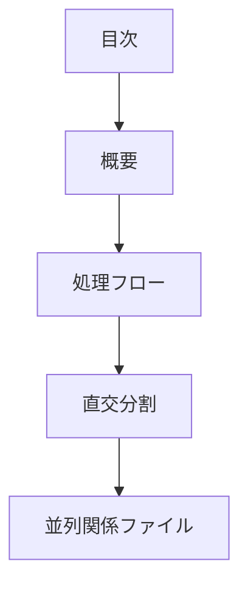

# pattern-parallel パターン - 並列保持型独立分割ガイド

## 定義と特徴

pattern-parallel は、**独立分割した要素をそのまま並列で保持・管理する**パターンです。各要素の独立性と完整性を重視し、合成処理は行いません。

## いつ使うのか

- 組織能力の異なる分野を独立して管理する場合
- システム品質特性を個別に評価・管理する場合
- 独立した設計領域をそれぞれ完結させる場合

## 他パターンとの違い

- **pattern-parallel**: 独立要素をそのまま並列保持(合成処理なし)
- **pattern-composite**: 独立要素から結論を抽出・統合(合成処理あり)

## 構造定義



### 各セクションの役割

1. **直交分割** - なぜ直交なのかの根拠
2. **並列関係ファイル** - 直交要素への個別リンクと各要素の概要

## 圏論的解釈

直交する性質の直積 `A ≅ ∏ᵢ Aᵢ` を保持。各軸は独立して存在し続け、合成による構造変換は行わない。

## テンプレート構造

```markdown
---
doc_type: "pattern-parallel"
category: "[カテゴリ名]"
---

# [設計判断対象名]

## 直交分割

[なぜ直交なのかの根拠]

## 並列関係ファイル

[設計判断を構成する直交要素]：

- [要素1](01-element1.md) - [要素の説明]
- [要素2](02-element2.md) - [要素の説明] 
- [要素3](03-element3.md) - [要素の説明]

これらは[特定の文脈]における直交軸であり、他の状況では異なる軸が適切となる。
```

## 品質チェックリスト

### 必須要素

- [ ] 直交分割の根拠が明確に記述されている
- [ ] 各要素が独立して完結している
- [ ] 要素間に依存関係がないことが確認されている
- [ ] 並列関係ファイルで各要素が適切にリンクされている

### 構造チェック

- [ ] doc_type が "pattern-parallel" になっている
- [ ] 直交分割 → 並列関係ファイルの順序になっている

### 内容チェック

- [ ] 各要素が真に直交している
- [ ] 合成処理を行わず並列保持している
- [ ] 要素の独立性と完整性が保たれている
