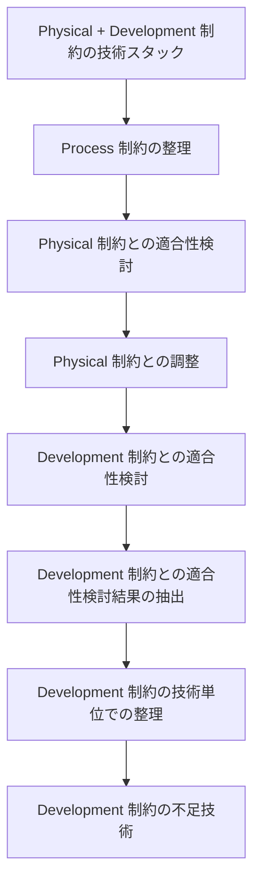

# pattern-process-technology-mapping パターン - Process 制約技術適用構造ガイド

## 定義と特徴

pattern-process-technology-mapping は、**Process 制約を Development 制約の技術スタックに適用する際の適合性検討と調整を体系的に整理する**ファイル構造パターンです。Process 制約と Physical・Development 制約との矛盾を発見し、技術的実現可能性を検証するプロセスを標準化することが特徴です。

## いつ使うのか

- Process 制約を Development 制約の技術に適用する際の検討
- Process 制約と Physical 制約の矛盾調整が必要な場合
- 技術的実現可能性の検証が必要な設計判断
- Process 制約の技術要素を整理・分析する必要がある場合

**重要**: このパターンは Process 制約の技術適用に特化しており、他の制約間の適合性検討には別のパターンを使用してください。

## 他パターンとの違い

- **pattern-process-technology-mapping**: Process 制約の技術適用と適合性検討
- **pattern-logic**: 論理的推論による設計判断
- **pattern-choice**: 複数選択肢からの最適解選択

## 構造定義



### 各セクションの役割

1. **Physical + Development 制約の技術スタック** - 前提となる技術構成の確認
2. **Process 制約の整理** - 適用対象となる Process 制約の内容整理
3. **Physical 制約との適合性検討** - Physical 制約との矛盾発見
4. **Physical 制約との調整** - 発見した矛盾の解決
5. **Development 制約との適合性検討** - Development 制約との技術適合性検討
6. **Development 制約との適合性検討結果の抽出** - 検討結果の抜き出し整理
7. **Development 制約の技術単位での整理** - 技術視点での並び替え
8. **Development 制約の不足技術** - 技術不足要素の特定

## テンプレート構造

```markdown
---
doc_type: "pattern-process-technology-mapping"
status: "draft"
depends:
  contracts:
    - "[Process制約の依存契約名]"
  produces:
    - "[生成される制約名]"
---

# [Process 制約名] - [適用対象名]

## Physical + Development 制約の技術スタック

各コンテナの技術スタックは以下のとおりである。この技術構成に Process 制約を適合させる必要がある。

<!-- PREMISE_BEGIN: example-development-constraints -->

[Physical + Development 制約の統合技術スタック一覧を一字一句正確にコピー]

<!-- PREMISE_END: example-development-constraints -->

## Process 制約の整理

Physical 制約・Development 制約との適合性を検討する前に、対象となる Process 制約の内容を整理する。

### [Process 制約要素 1 の名前]

<!-- PREMISE_BEGIN: example-process-element-1 -->

[Process 制約要素 1 の内容を一字一句正確にコピー]

<!-- PREMISE_END: example-process-element-1 -->

### [Process 制約要素 2 の名前]

<!-- PREMISE_BEGIN: example-process-element-2 -->

[Process 制約要素 2 の内容を一字一句正確にコピー]

<!-- PREMISE_END: example-process-element-2 -->

### [Process 制約要素 3 の名前]

<!-- PREMISE_BEGIN: example-process-element-3 -->

[Process 制約要素 3 の内容を一字一句正確にコピー]

<!-- PREMISE_END: example-process-element-3 -->

## Physical 制約との適合性検討

Physical・Development 制約では[Physical 制約の内容]が確定している。

Process 制約「[具体的な Process 制約名]」は「[Process 制約の前提]」を前提としているが、Physical 制約では[Physical 制約の内容]となるため矛盾が発生する。

- **[Process 制約要素名]**: [Process 制約の詳細内容]

## Physical 制約との調整

この制約を Physical 制約に適合させるため、次のように変更した。

<!-- GLOBAL_CONCLUSION_BEGIN: example-constraint-adjustment -->

- **[調整後の Process 制約要素名]**: [調整後の Process 制約の詳細内容]

<!-- GLOBAL_CONCLUSION_END: example-constraint-adjustment -->

## Development 制約との適合性検討

**完全引用のルール**: Process 制約内容は要約せず、元の文書から完全に引用する。これにより誤解や解釈の相違を防ぎ、正確な制約内容に基づいた技術適用の検討を行う。

**PREMISE マーカー不変ルール**: PREMISE マーカー内の内容は一切変更してはならない。Physical 制約との矛盾が発見された場合でも、PREMISE マーカー内は元の内容のまま保持し、調整結果は「Physical 制約との調整」セクションの GLOBAL_CONCLUSION マーカー内に記述する。

Process 制約の各要素について、Development 制約との適合性を検討し、技術要素への対応を確認する。

### [Process 制約要素 1]の検討

**Process 制約内容**: [Process 制約要素 1 の完全引用]

**Development 制約との適合性**:

[技術的実現可能性の詳細検討]

**使用技術および設定**:

- [技術 1]: [用途・役割]
- [技術 2]: [用途・役割]
- **[技術不足]**: [不足している技術の説明]

### [Process 制約要素 2]の検討

**Process 制約内容**: [Process 制約要素 2 の完全引用]

**Development 制約との適合性**:

[技術的実現可能性の詳細検討]

**使用技術および設定**:

- [技術 1]: [用途・役割]
- [技術 2]: [用途・役割]
- **[技術不足]**: [不足している技術の説明]

## Development 制約との適合性検討結果の抽出

各要素の技術適合性結果を整理する。各項目の「使用技術および設定」の結論部分のみを抜き出し、実現可能な技術と技術不足の項目を明確化する。

- [Process 制約要素 1]の検討
  - [技術 1]: [用途・役割]
  - [技術 2]: [用途・役割]
  - **[技術不足]**: [不足している技術の説明]
- [Process 制約要素 2]の検討
  - [技術 1]: [用途・役割]
  - [技術 2]: [用途・役割]
  - **[技術不足]**: [不足している技術の説明]

## Development 制約の技術単位での整理

先ほどのリストを「Process View の結論 → 技術」順から「技術 → Process View の結論」順に並び替える。

<!-- GLOBAL_CONCLUSION_BEGIN: example-technology-organization -->

- [技術 1]
  - [用途・役割 1]
  - [用途・役割 2]
- [技術 2]
  - [用途・役割 1]
  - [用途・役割 2]

<!-- GLOBAL_CONCLUSION_END: example-technology-organization -->

## Development 制約の不足技術

現在の技術スタックでは実現できない要素について、不足している技術とその例を整理する。

<!-- GLOBAL_CONCLUSION_BEGIN: example-missing-technologies -->

現在の技術スタックでは以下の技術要素が不足している。

- [不足技術カテゴリ 1]: [具体的な技術例]
- [不足技術カテゴリ 2]: [具体的な技術例]

<!-- GLOBAL_CONCLUSION_END: example-missing-technologies -->
```

## 品質チェックリスト

### 必須要素

- [ ] PREMISE マーカーで Development 制約の技術スタックが設置されている
- [ ] PREMISE マーカーで Process 制約の各要素が設置されている
- [ ] Physical 制約との適合性検討が記述されている
- [ ] Development 制約との適合性検討が記述されている
- [ ] GLOBAL_CONCLUSION マーカーで技術整理結果が設置されている
- [ ] GLOBAL_CONCLUSION マーカーで不足技術が設置されている

### 構造チェック

- [ ] doc_type が "pattern-process-technology-mapping" になっている
- [ ] H2 見出しが 8 つの標準構造になっている
- [ ] Physical 制約の検討 → 調整の順序になっている
- [ ] Development 制約の検討 → 抽出 → 整理 → 不足技術の順序になっている

### 内容チェック

- [ ] Process 制約の完全引用ルールが守られている
- [ ] 技術的実現可能性の検討が具体的に記述されている
- [ ] 不足技術が明確に特定されている
- [ ] 技術視点での整理が適切に行われている
