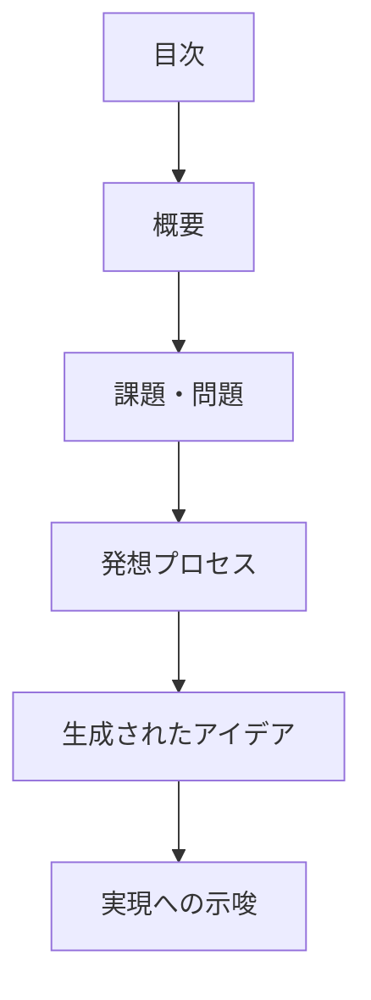

# pattern-reframing パターン - アイデア発想型設計判断ガイド

## 定義と特徴

pattern-reframing は、**発想・着想により新しい価値を生成する**設計判断パターンです。問題からアイデアを生成したり、経験から知見を抽出したりと、創造的思考により新たな価値を創出することが特徴です。

## いつ使うのか

- 新規プロダクトのコンセプト設計
- 既存システムの根本的な改善案検討
- 技術的な課題に対する革新的アプローチの模索
- ユーザー体験向上のための創造的なアイデア出し
- 時系列的な経験や体験から学習知見を生成する場合

## 他パターンとの違い

- **pattern-reframing**: 単一課題からの創造的発想(発散的思考)
- **pattern-dialectic**: 対立する要素の弁証法的統合(収束的思考)

## 構造定義



### 各セクションの役割

1. **課題・問題** - 解決したい課題や問題の定義
2. **発想プロセス** - 自由な発想やインスピレーション収集
3. **生成されたアイデア** - 発想から生まれたコンセプトや機能
4. **実現への示唆** - アイデアから得られた実装の方向性

## 圏論的解釈

問題空間 P からアイデア空間 I への創造的写像 g: P → I を構成する。この写像は既存の**フレーム**(枠組み)を超越し、新たな視点や文脈での**リフレーミング**を実現する非線形変換であり、創造性の本質を数学的に表現する。

## テンプレート構造

```markdown
---
doc_type: "pattern-reframing"
category: "[カテゴリ名]"
---

# [設計対象名]

## 課題・問題

[解決したい課題や問題の説明]

## 発想プロセス

### 自由発想フェーズ

**[テーマ 1]**
- [アイデア 1]
- [アイデア 2]

**[テーマ 2]**
- [アイデア 1]
- [アイデア 2]

### インスピレーション収集

**[インスピレーション源]**
- [得られたヒント 1]
- [得られたヒント 2]

## 生成されたアイデア

### [メインコンセプト名]

[コンセプトの説明]

### [具体的アイデア群]

[アイデアの詳細]

## 実現への示唆

[アイデアから得られた実装の方向性]
```

## 品質チェックリスト

### 必須要素

- [ ] 課題・問題が明確に定義されている
- [ ] 自由な発想プロセスが記録されている
- [ ] 創造的で革新的な要素が含まれている
- [ ] 生成されたアイデアが課題解決に結びついている
- [ ] 実現への示唆が整理されている

### 構造チェック

- [ ] doc_type が "pattern-reframing" になっている
- [ ] 課題 → 発想 → アイデア → 示唆の順序になっている

### 内容チェック

- [ ] 既存の枠にとらわれない発想が含まれている
- [ ] 実現可能性よりも創造性を重視している
- [ ] 多様なインスピレーション源から着想を得ている
